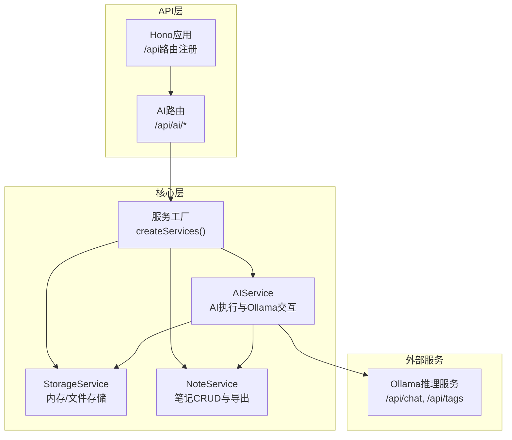
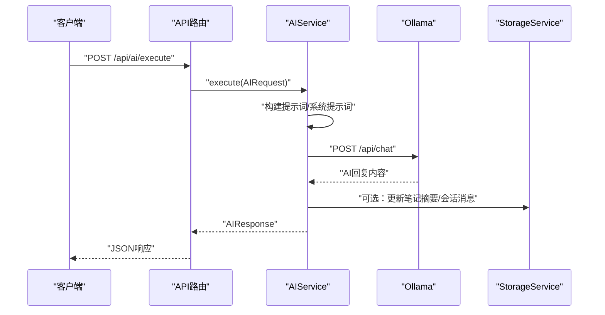
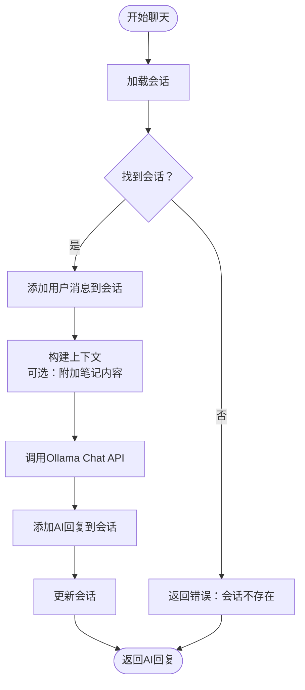
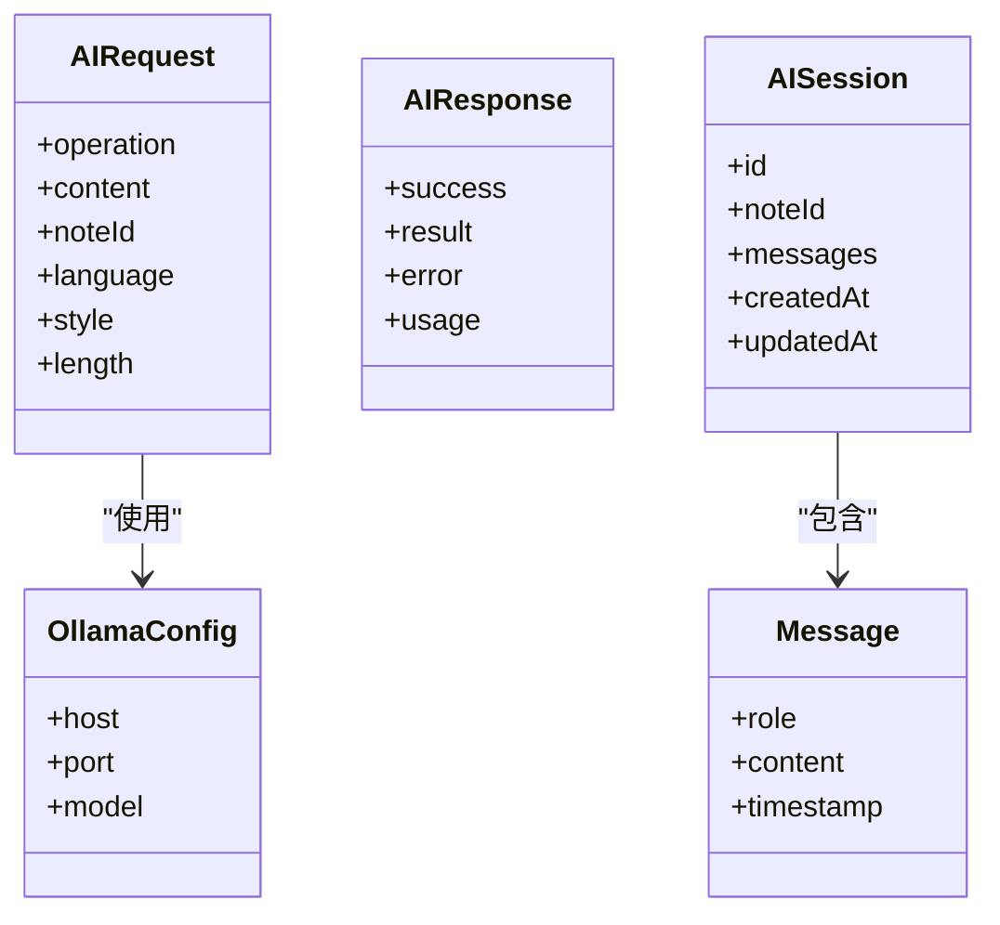
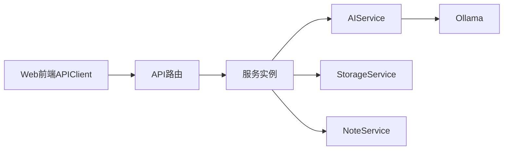

# AI服务API

<cite>
**本文引用的文件**
- [packages/api/src/routes/ai.ts](file://packages/api/src/routes/ai.ts)
- [packages/core/src/ai.ts](file://packages/core/src/ai.ts)
- [packages/core/src/types.ts](file://packages/core/src/types.ts)
- [packages/core/src/storage.ts](file://packages/core/src/storage.ts)
- [packages/core/src/note.ts](file://packages/core/src/note.ts)
- [packages/api/src/index.ts](file://packages/api/src/index.ts)
- [packages/web/src/api/client.ts](file://packages/web/src/api/client.ts)
</cite>

## 目录
1. [简介](#简介)
2. [项目结构](#项目结构)
3. [核心组件](#核心组件)
4. [架构总览](#架构总览)
5. [详细组件分析](#详细组件分析)
6. [依赖关系分析](#依赖关系分析)
7. [性能考量](#性能考量)
8. [故障排查指南](#故障排查指南)
9. [结论](#结论)
10. [附录](#附录)

## 简介
本文件为番茄笔记本（Tomato Notebook）项目中的AI服务API提供全面的RESTful API文档。该服务围绕笔记管理与AI能力集成，提供以下AI相关端点：
- GET /api/ai/health：健康检查与模型列表查询
- POST /api/ai/summarize/:id：对指定笔记进行自动总结（支持短/中/长三种长度）
- POST /api/ai/polish/:id：对指定笔记进行文本润色（支持正式/随意两种风格）
- POST /api/ai/translate/:id：对指定笔记进行翻译（需提供目标语言）
- GET /api/ai/suggest：基于上下文或笔记内容提供学习建议
- POST /api/ai/execute：通用AI执行接口（支持summarize/polish/translate/suggest/chat）
- POST /api/ai/chat/session：创建AI聊天会话
- POST /api/ai/chat/:sessionId：向指定会话发送消息并获取回复

同时，文档详细说明了每个端点的请求参数、响应格式、提示词模板设计、AI模型配置、会话管理机制、消息历史与上下文保持策略，并提供多种使用示例与性能、超时与错误恢复建议。

## 项目结构
该项目采用多包工作区（monorepo）组织，AI服务API位于 packages/api 中，核心逻辑与类型定义位于 packages/core，Web前端调用封装在 packages/web。API层通过Hono框架提供REST接口，核心层通过AIService对接Ollama推理引擎，并通过StorageService与NoteService管理数据持久化与会话存储。

**图表来源**
- [packages/api/src/index.ts:1-64](file://packages/api/src/index.ts#L1-L64)
- [packages/api/src/routes/ai.ts:1-149](file://packages/api/src/routes/ai.ts#L1-L149)
- [packages/core/src/ai.ts:1-298](file://packages/core/src/ai.ts#L1-L298)
- [packages/core/src/storage.ts:1-326](file://packages/core/src/storage.ts#L1-L326)
- [packages/core/src/note.ts:1-159](file://packages/core/src/note.ts#L1-L159)

**章节来源**
- [packages/api/src/index.ts:1-64](file://packages/api/src/index.ts#L1-L64)
- [packages/api/src/routes/ai.ts:1-149](file://packages/api/src/routes/ai.ts#L1-L149)

## 核心组件
- AIService：负责AI操作执行、提示词构建、系统提示词注入、与Ollama交互、以及针对SUMMARIZE操作的笔记摘要更新。
- StorageService：提供笔记与会话的内存/文件存储能力；在MiniMemory可用时同步至远程存储。
- NoteService：提供笔记的CRUD、搜索、导出、收藏、标签管理等能力。
- 类型系统：统一定义AI操作类型、请求/响应结构、消息与会话结构、Ollama配置等。

**章节来源**
- [packages/core/src/ai.ts:42-298](file://packages/core/src/ai.ts#L42-L298)
- [packages/core/src/storage.ts:109-326](file://packages/core/src/storage.ts#L109-L326)
- [packages/core/src/note.ts:7-159](file://packages/core/src/note.ts#L7-L159)
- [packages/core/src/types.ts:42-163](file://packages/core/src/types.ts#L42-L163)

## 架构总览
AI服务整体流程如下：
- API路由接收请求，解析参数并调用服务层。
- 服务层根据操作类型构造提示词与系统提示词，必要时拼接上下文（如笔记内容）。
- 通过Ollama Chat API发起请求，获取AI回复。
- 对于SUMMARIZE操作，将结果写回笔记摘要；对于CHAT操作，维护会话消息历史。
- 返回统一的API响应结构。

**图表来源**
- [packages/api/src/routes/ai.ts:81-119](file://packages/api/src/routes/ai.ts#L81-L119)
- [packages/core/src/ai.ts:102-152](file://packages/core/src/ai.ts#L102-L152)
- [packages/core/src/ai.ts:77-99](file://packages/core/src/ai.ts#L77-L99)

## 详细组件分析

### 端点定义与行为

#### GET /api/ai/health
- 功能：检查AI服务与Ollama连接状态，并返回可用模型列表。
- 请求参数：无
- 响应字段：success、data.status（connected/disconnected）、data.models（字符串数组）
- 错误处理：网络异常或Ollama不可达时返回断开状态

**章节来源**
- [packages/api/src/routes/ai.ts:8-19](file://packages/api/src/routes/ai.ts#L8-L19)
- [packages/core/src/ai.ts:56-74](file://packages/core/src/ai.ts#L56-L74)

#### POST /api/ai/summarize/:id
- 功能：对指定笔记进行总结，支持短/中/长三种长度。
- 路径参数：id（笔记ID）
- 查询参数：length（short/medium/long，默认medium）
- 成功响应：data.summary（总结结果）
- 失败响应：错误信息
- 特殊行为：当请求携带noteId且操作为SUMMARIZE时，会将结果写入笔记摘要字段

**章节来源**
- [packages/api/src/routes/ai.ts:22-33](file://packages/api/src/routes/ai.ts#L22-L33)
- [packages/core/src/ai.ts:168-180](file://packages/core/src/ai.ts#L168-L180)
- [packages/core/src/ai.ts:138-140](file://packages/core/src/ai.ts#L138-L140)

#### POST /api/ai/polish/:id
- 功能：对指定笔记进行润色，支持正式/随意两种风格。
- 路径参数：id（笔记ID）
- 查询参数：style（formal/casual，默认formal）
- 成功响应：data.polished（润色后文本）
- 失败响应：错误信息

**章节来源**
- [packages/api/src/routes/ai.ts:36-47](file://packages/api/src/routes/ai.ts#L36-L47)
- [packages/core/src/ai.ts:183-195](file://packages/core/src/ai.ts#L183-L195)

#### POST /api/ai/translate/:id
- 功能：对指定笔记进行翻译，需提供目标语言。
- 路径参数：id（笔记ID）
- 查询参数：language（必填，目标语言）
- 成功响应：data.translation（翻译结果）
- 失败响应：错误信息（缺少语言参数时返回400）

**章节来源**
- [packages/api/src/routes/ai.ts:50-65](file://packages/api/src/routes/ai.ts#L50-L65)
- [packages/core/src/ai.ts:198-210](file://packages/core/src/ai.ts#L198-L210)

#### GET /api/ai/suggest
- 功能：提供学习建议。可结合noteId或context参数。
- 查询参数：noteId（可选）、context（可选）
- 行为：若提供noteId则优先使用对应笔记内容；否则使用最近笔记拼接作为上下文；若两者均未提供，则使用最近5条笔记的内容片段
- 成功响应：data.suggestions（建议内容）
- 失败响应：错误信息

**章节来源**
- [packages/api/src/routes/ai.ts:68-79](file://packages/api/src/routes/ai.ts#L68-L79)
- [packages/core/src/ai.ts:213-233](file://packages/core/src/ai.ts#L213-L233)

#### POST /api/ai/execute
- 功能：通用AI执行接口，支持summarize、polish、translate、suggest、chat五种操作。
- 请求体字段：operation（字符串，枚举值）、content（字符串）、noteId（可选）、language（可选）、style（可选，formal/casual）、length（可选，short/medium/long）
- 成功响应：data.result（操作结果）
- 失败响应：错误信息（无效operation时返回400）

**章节来源**
- [packages/api/src/routes/ai.ts:82-119](file://packages/api/src/routes/ai.ts#L82-L119)
- [packages/core/src/ai.ts:102-152](file://packages/core/src/ai.ts#L102-L152)

#### POST /api/ai/chat/session
- 功能：创建AI聊天会话，返回会话ID。
- 请求体：noteId（可选，绑定到特定笔记）
- 成功响应：data（会话对象，包含id、messages、时间戳等）

**章节来源**
- [packages/api/src/routes/ai.ts:122-128](file://packages/api/src/routes/ai.ts#L122-L128)
- [packages/core/src/ai.ts:236-246](file://packages/core/src/ai.ts#L236-L246)

#### POST /api/ai/chat/:sessionId
- 功能：向指定会话发送消息并获取AI回复。
- 路径参数：sessionId（会话ID）
- 请求体：message（字符串，用户消息）
- 成功响应：data.reply（AI回复）
- 失败响应：错误信息（message缺失时返回400）

**章节来源**
- [packages/api/src/routes/ai.ts:131-146](file://packages/api/src/routes/ai.ts#L131-L146)
- [packages/core/src/ai.ts:249-291](file://packages/core/src/ai.ts#L249-L291)

### 提示词模板与系统提示词
- 提示词模板（PROMPTS）：
  - SUMMARIZE：根据length选择不同长度约束的模板
  - POLISH：根据style选择正式/随意风格
  - TRANSLATE：根据language动态替换目标语言
  - SUGGEST：基于笔记内容提供学习建议
  - CHAT：直接使用用户输入作为提示
- 系统提示词（System Prompt）：
  - SUMMARIZE：专业的知识总结助手
  - POLISH：文字编辑专家
  - TRANSLATE：专业翻译
  - SUGGEST：学习顾问
  - CHAT：AI学习助手，要求中文回答

这些模板确保AI在不同任务中具备明确的角色定位与输出约束。

**章节来源**
- [packages/core/src/ai.ts:15-28](file://packages/core/src/ai.ts#L15-L28)
- [packages/core/src/ai.ts:155-165](file://packages/core/src/ai.ts#L155-L165)

### AI模型配置
- 配置项：
  - host：Ollama主机地址
  - port：Ollama端口
  - model：推理模型名称
- 默认值来源于环境变量，未设置时采用本地默认值
- 可通过环境变量覆盖：OLLAMA_HOST、OLLAMA_PORT、OLLAMA_MODEL

**章节来源**
- [packages/api/src/index.ts:7-14](file://packages/api/src/index.ts#L7-L14)
- [packages/core/src/types.ts:137-141](file://packages/core/src/types.ts#L137-L141)

### 会话管理与消息历史
- 会话创建：生成唯一会话ID，初始化空消息列表
- 消息历史：每次发送消息时，先添加用户消息，再调用AI得到回复并添加AI消息
- 上下文保持：若会话绑定了笔记ID，则在构建提示时附加当前笔记的标题与内容
- 会话持久化：当前实现为内存存储（Map），可在StorageService中扩展为持久化

**图表来源**
- [packages/core/src/ai.ts:236-291](file://packages/core/src/ai.ts#L236-L291)

**章节来源**
- [packages/core/src/ai.ts:236-291](file://packages/core/src/ai.ts#L236-L291)
- [packages/core/src/storage.ts:260-281](file://packages/core/src/storage.ts#L260-L281)

### 数据模型与类型
- AI操作类型：SUMMARIZE、POLISH、TRANSLATE、SUGGEST、CHAT
- 请求结构：AIRequest（operation/content/noteId/language/style/length）
- 响应结构：AIResponse（success/result/error/usage可选）
- 消息与会话：Message（role/content/timestamp）、AISession（id/noteId/messages/时间戳）
- 其他：Note、OllamaConfig、APIResponse等

**图表来源**
- [packages/core/src/types.ts:68-87](file://packages/core/src/types.ts#L68-L87)
- [packages/core/src/types.ts:42-56](file://packages/core/src/types.ts#L42-L56)
- [packages/core/src/types.ts:137-141](file://packages/core/src/types.ts#L137-L141)

**章节来源**
- [packages/core/src/types.ts:42-163](file://packages/core/src/types.ts#L42-L163)

### 使用示例

- 文本润色（正式风格）
  - 请求：POST /api/ai/polish/:id?style=formal
  - 说明：将笔记内容以正式、专业的语气进行润色
  - 响应：data.polished

- 文本润色（随意风格）
  - 请求：POST /api/ai/polish/:id?style=casual
  - 说明：将笔记内容以轻松、口语化的语气进行润色
  - 响应：data.polished

- 自动总结（短/中/长）
  - 请求：POST /api/ai/summarize/:id?length=short|medium|long
  - 说明：根据长度参数生成不同详略程度的总结
  - 响应：data.summary

- 翻译（指定语言）
  - 请求：POST /api/ai/translate/:id?language=英语
  - 说明：将笔记内容翻译为目标语言
  - 响应：data.translation

- 学习建议（结合上下文）
  - 请求：GET /api/ai/suggest?noteId=... 或 GET /api/ai/suggest?context=...
  - 说明：基于笔记内容或自定义上下文生成学习建议
  - 响应：data.suggestions

- 通用执行接口
  - 请求：POST /api/ai/execute
  - 示例体：{"operation":"summarize","content":"...","length":"medium"}
  - 响应：data.result

- 聊天对话（会话式）
  - 步骤1：POST /api/ai/chat/session（可选携带noteId）
  - 步骤2：POST /api/ai/chat/:sessionId（携带message）
  - 响应：data.reply

**章节来源**
- [packages/api/src/routes/ai.ts:22-146](file://packages/api/src/routes/ai.ts#L22-L146)
- [packages/web/src/api/client.ts:94-125](file://packages/web/src/api/client.ts#L94-L125)

## 依赖关系分析
- API路由依赖服务工厂创建的服务实例（由createServices提供），服务实例内部组合AIService、StorageService、NoteService。
- AIService依赖Ollama Chat API与StorageService/NoteService。
- Web前端通过APIClient封装调用各端点。

**图表来源**
- [packages/api/src/index.ts:4-18](file://packages/api/src/index.ts#L4-L18)
- [packages/core/src/ai.ts:42-53](file://packages/core/src/ai.ts#L42-L53)
- [packages/web/src/api/client.ts:28-138](file://packages/web/src/api/client.ts#L28-L138)

**章节来源**
- [packages/api/src/index.ts:1-64](file://packages/api/src/index.ts#L1-L64)
- [packages/core/src/ai.ts:1-298](file://packages/core/src/ai.ts#L1-L298)

## 性能考量
- Ollama调用：采用非流式（stream=false）同步调用，简单可靠但可能阻塞；如需提升吞吐，可考虑改为流式并实现分块响应。
- 提示词构建：模板替换为字符串拼接，复杂度低；避免在高频路径上重复构建相同模板。
- 会话存储：当前为内存Map，适合单实例部署；生产环境建议持久化到数据库或Redis，配合分布式锁与缓存预热。
- 模型选择：合理选择模型大小与量化配置，平衡速度与质量；可通过环境变量切换模型。
- 并发与超时：建议在API层增加超时控制与并发限制，防止Ollama过载；对长文本建议分段处理或截断。
- 缓存策略：对常见查询（如最近笔记上下文）可引入短期缓存，减少重复计算。

[本节为通用性能建议，不直接分析具体文件]

## 故障排查指南
- 健康检查失败
  - 现象：/api/ai/health返回disconnected或models为空
  - 排查：确认Ollama服务运行、网络连通、端口与主机配置正确
  - 参考
    - [packages/api/src/routes/ai.ts:8-19](file://packages/api/src/routes/ai.ts#L8-L19)
    - [packages/core/src/ai.ts:56-74](file://packages/core/src/ai.ts#L56-L74)

- 翻译端点缺少语言参数
  - 现象：返回400错误，提示需要language
  - 处理：在查询参数中提供language
  - 参考
    - [packages/api/src/routes/ai.ts:54-56](file://packages/api/src/routes/ai.ts#L54-L56)

- 会话不存在
  - 现象：发送聊天消息时报错“Session not found”
  - 处理：先创建会话，再使用有效sessionId发送消息
  - 参考
    - [packages/core/src/ai.ts:250-253](file://packages/core/src/ai.ts#L250-L253)

- Ollama调用失败
  - 现象：抛出“Ollama API error”异常
  - 处理：检查模型是否存在、请求负载是否过大、网络是否稳定
  - 参考
    - [packages/core/src/ai.ts:94](file://packages/core/src/ai.ts#L94)

- 笔记不存在
  - 现象：summarize/polish/translate返回“Note not found”
  - 处理：确认noteId有效且存在
  - 参考
    - [packages/core/src/ai.ts:170](file://packages/core/src/ai.ts#L170)
    - [packages/core/src/ai.ts:186](file://packages/core/src/ai.ts#L186)
    - [packages/core/src/ai.ts:201](file://packages/core/src/ai.ts#L201)

**章节来源**
- [packages/api/src/routes/ai.ts:8-19](file://packages/api/src/routes/ai.ts#L8-L19)
- [packages/api/src/routes/ai.ts:54-56](file://packages/api/src/routes/ai.ts#L54-L56)
- [packages/core/src/ai.ts:94](file://packages/core/src/ai.ts#L94)
- [packages/core/src/ai.ts:170](file://packages/core/src/ai.ts#L170)
- [packages/core/src/ai.ts:186](file://packages/core/src/ai.ts#L186)
- [packages/core/src/ai.ts:201](file://packages/core/src/ai.ts#L201)
- [packages/core/src/ai.ts:250-253](file://packages/core/src/ai.ts#L250-L253)

## 结论
本AI服务API围绕笔记管理提供了完善的AI能力集成，涵盖总结、润色、翻译、建议与对话等场景。通过清晰的端点设计、统一的响应结构与可扩展的会话机制，既满足快速开发需求，也为后续性能优化与功能扩展预留空间。建议在生产环境中完善会话持久化、超时与并发控制、以及模型与资源的监控与治理。

[本节为总结性内容，不直接分析具体文件]

## 附录

### 端点一览表
- GET /api/ai/health：健康检查与模型列表
- POST /api/ai/summarize/:id?length=short|medium|long：总结
- POST /api/ai/polish/:id?style=formal|casual：润色
- POST /api/ai/translate/:id?language=...：翻译
- GET /api/ai/suggest?noteId=...&context=...：学习建议
- POST /api/ai/execute：通用AI执行
- POST /api/ai/chat/session：创建会话
- POST /api/ai/chat/:sessionId：发送消息并获取回复

**章节来源**
- [packages/api/src/routes/ai.ts:1-149](file://packages/api/src/routes/ai.ts#L1-L149)