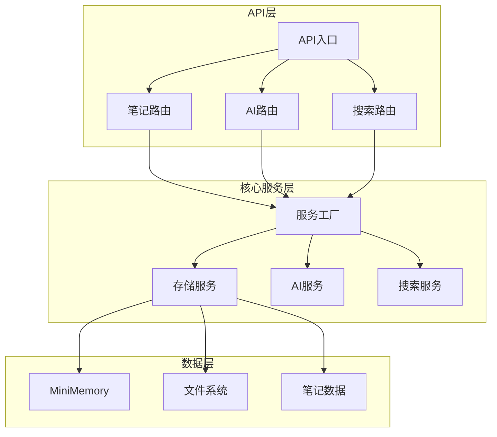
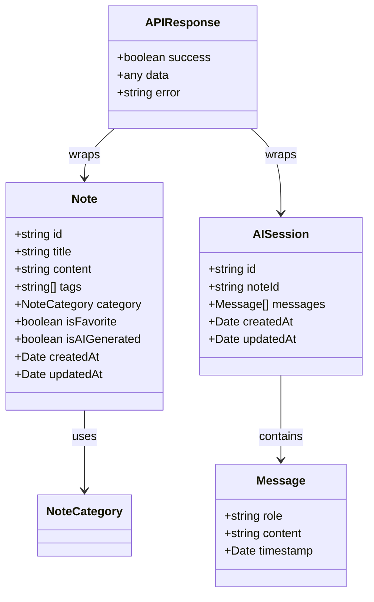
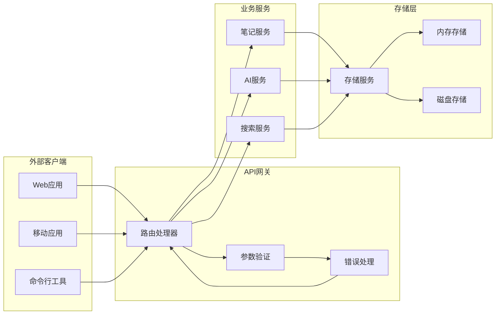
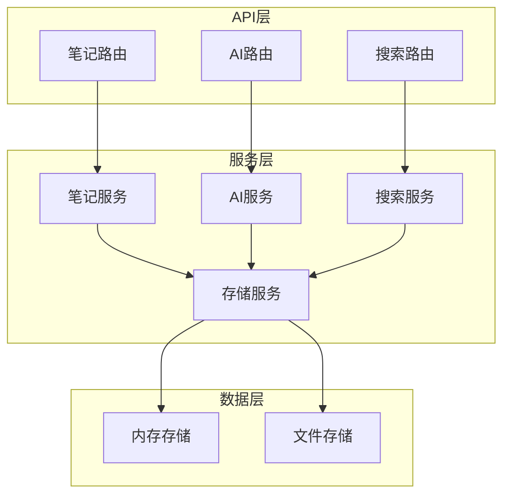

# API接口文档

<cite>
**本文档引用的文件**
- [packages/api/src/index.ts](file://packages/api/src/index.ts)
- [packages/api/src/routes/notes.ts](file://packages/api/src/routes/notes.ts)
- [packages/api/src/routes/ai.ts](file://packages/api/src/routes/ai.ts)
- [packages/api/src/routes/search.ts](file://packages/api/src/routes/search.ts)
- [packages/core/src/types.ts](file://packages/core/src/types.ts)
- [packages/core/src/ai.ts](file://packages/core/src/ai.ts)
- [packages/core/src/search.ts](file://packages/core/src/search.ts)
- [packages/core/src/storage.ts](file://packages/core/src/storage.ts)
</cite>

## 目录
1. [简介](#简介)
2. [项目结构](#项目结构)
3. [核心组件](#核心组件)
4. [架构概览](#架构概览)
5. [详细组件分析](#详细组件分析)
6. [依赖关系分析](#依赖关系分析)
7. [性能考虑](#性能考虑)
8. [故障排除指南](#故障排除指南)
9. [结论](#结论)
10. [附录](#附录)

## 简介

番茄笔记API是一个基于Hono框架构建的RESTful API服务，提供了完整的笔记管理和AI增强功能。该系统支持笔记的CRUD操作、AI文本处理服务（润色、总结、翻译、聊天对话）、全文搜索功能以及统计分析。

主要特性包括：
- 笔记管理：完整的CRUD操作和标签管理
- AI服务：多种文本处理能力
- 搜索功能：全文搜索和智能过滤
- 统计分析：学习进度追踪和数据统计
- 多层存储：内存数据库和文件系统双重存储

## 项目结构



**图表来源**
- [packages/api/src/index.ts:1-64](file://packages/api/src/index.ts#L1-L64)
- [packages/api/src/routes/notes.ts:1-161](file://packages/api/src/routes/notes.ts#L1-L161)
- [packages/api/src/routes/ai.ts:1-149](file://packages/api/src/routes/ai.ts#L1-L149)
- [packages/api/src/routes/search.ts:1-92](file://packages/api/src/routes/search.ts#L1-L92)

**章节来源**
- [packages/api/src/index.ts:1-64](file://packages/api/src/index.ts#L1-L64)
- [packages/api/src/routes/notes.ts:1-161](file://packages/api/src/routes/notes.ts#L1-L161)
- [packages/api/src/routes/ai.ts:1-149](file://packages/api/src/routes/ai.ts#L1-L149)
- [packages/api/src/routes/search.ts:1-92](file://packages/api/src/routes/search.ts#L1-L92)

## 核心组件

### 数据模型

系统使用统一的数据模型来确保API的一致性和可扩展性：



**图表来源**
- [packages/core/src/types.ts:10-56](file://packages/core/src/types.ts#L10-L56)
- [packages/core/src/types.ts:157-163](file://packages/core/src/types.ts#L157-L163)

### 服务架构



**图表来源**
- [packages/core/src/storage.ts:108-317](file://packages/core/src/storage.ts#L108-L317)
- [packages/core/src/ai.ts:42-292](file://packages/core/src/ai.ts#L42-L292)
- [packages/core/src/search.ts:4-92](file://packages/core/src/search.ts#L4-L92)

**章节来源**
- [packages/core/src/types.ts:1-163](file://packages/core/src/types.ts#L1-L163)
- [packages/core/src/storage.ts:108-317](file://packages/core/src/storage.ts#L108-L317)
- [packages/core/src/ai.ts:42-292](file://packages/core/src/ai.ts#L42-L292)
- [packages/core/src/search.ts:4-92](file://packages/core/src/search.ts#L4-L92)

## 架构概览

### API版本控制

系统采用语义化版本控制，当前版本为0.1.0。API通过URL路径进行版本管理，所有端点均位于`/api/`前缀下。

### 认证与授权

系统目前支持CORS跨域访问配置，允许来自开发环境的特定域名访问。完整的认证机制可通过扩展CORS配置实现。

### 错误处理策略

系统采用统一的响应格式，所有API响应都包含`success`、`data`和`error`字段，确保客户端能够一致地处理各种响应情况。

**章节来源**
- [packages/api/src/index.ts:20-25](file://packages/api/src/index.ts#L20-L25)
- [packages/core/src/types.ts:157-163](file://packages/core/src/types.ts#L157-L163)

## 详细组件分析

### 笔记管理API

#### 健康检查端点

**端点**: `GET /api/health`
**功能**: 检查API服务健康状态
**响应**: 包含状态和时间戳的JSON对象

**章节来源**
- [packages/api/src/index.ts:27-30](file://packages/api/src/index.ts#L27-L30)

#### 笔记列表查询

**端点**: `GET /api/notes`
**功能**: 获取笔记列表，支持分页和过滤
**查询参数**:
- `filter`: 过滤类型 (all, ai-generated, recent, favorites)
- `limit`: 返回数量限制 (默认20)
- `offset`: 偏移量 (默认0)

**响应数据结构**:
```json
{
  "success": true,
  "data": [Note],
  "meta": {
    "total": number,
    "limit": number,
    "offset": number
  }
}
```

**章节来源**
- [packages/api/src/routes/notes.ts:7-25](file://packages/api/src/routes/notes.ts#L7-L25)

#### 创建笔记

**端点**: `POST /api/notes`
**功能**: 创建新笔记
**请求体**: CreateNoteInput
**验证规则**:
- 必须包含title字段
- 支持content、tags、category字段

**响应**: 成功时返回创建的笔记对象

**章节来源**
- [packages/api/src/routes/notes.ts:27-44](file://packages/api/src/routes/notes.ts#L27-L44)

#### 获取单个笔记

**端点**: `GET /api/notes/:id`
**功能**: 根据ID获取特定笔记
**路径参数**:
- `id`: 笔记唯一标识符

**响应**: 成功时返回笔记详情，不存在时返回404错误

**章节来源**
- [packages/api/src/routes/notes.ts:46-56](file://packages/api/src/routes/notes.ts#L46-L56)

#### 更新笔记

**端点**: `PUT /api/notes/:id`
**功能**: 更新现有笔记
**路径参数**:
- `id`: 笔记唯一标识符
**请求体**: UpdateNoteInput

**响应**: 返回更新后的笔记对象

**章节来源**
- [packages/api/src/routes/notes.ts:58-70](file://packages/api/src/routes/notes.ts#L58-L70)

#### 删除笔记

**端点**: `DELETE /api/notes/:id`
**功能**: 删除指定笔记
**路径参数**:
- `id`: 笔记唯一标识符

**响应**: 成功删除返回成功状态

**章节来源**
- [packages/api/src/routes/notes.ts:72-82](file://packages/api/src/routes/notes.ts#L72-L82)

#### 切换收藏状态

**端点**: `POST /api/notes/:id/favorite`
**功能**: 切换笔记的收藏状态
**路径参数**:
- `id`: 笔记唯一标识符

**响应**: 返回更新后的笔记对象

**章节来源**
- [packages/api/src/routes/notes.ts:84-94](file://packages/api/src/routes/notes.ts#L84-L94)

#### 添加标签

**端点**: `POST /api/notes/:id/tags`
**功能**: 为笔记添加标签
**路径参数**:
- `id`: 笔记唯一标识符
**请求体**: `{ tags: string[] }`

**响应**: 返回包含新标签的笔记对象

**章节来源**
- [packages/api/src/routes/notes.ts:96-108](file://packages/api/src/routes/notes.ts#L96-L108)

#### 移除标签

**端点**: `DELETE /api/notes/:id/tags`
**功能**: 从笔记移除标签
**路径参数**:
- `id`: 笔记唯一标识符
**请求体**: `{ tags: string[] }`

**响应**: 返回移除标签后的笔记对象

**章节来源**
- [packages/api/src/routes/notes.ts:110-122](file://packages/api/src/routes/notes.ts#L110-L122)

#### 导出笔记

**端点**: `GET /api/notes/:id/export`
**功能**: 导出笔记内容
**路径参数**:
- `id`: 笔记唯一标识符
**查询参数**:
- `format`: 导出格式 (json或markdown，默认json)

**响应**: 返回文件下载流

**章节来源**
- [packages/api/src/routes/notes.ts:124-152](file://packages/api/src/routes/notes.ts#L124-L152)

#### 统计信息查询

**端点**: `GET /api/notes/stats/summary`
**功能**: 获取系统统计信息

**响应数据结构**:
```json
{
  "success": true,
  "data": {
    "totalNotes": number,
    "favoriteNotes": number,
    "aiGeneratedNotes": number,
    "totalTags": number,
    "recentNotes": [Note],
    "progress": [LearningProgress]
  }
}
```

**章节来源**
- [packages/api/src/routes/notes.ts:154-158](file://packages/api/src/routes/notes.ts#L154-L158)

### AI服务API

#### AI服务健康检查

**端点**: `GET /api/ai/health`
**功能**: 检查AI服务连接状态和可用模型

**响应数据结构**:
```json
{
  "success": true,
  "data": {
    "status": "connected" | "disconnected",
    "models": string[]
  }
}
```

**章节来源**
- [packages/api/src/routes/ai.ts:7-19](file://packages/api/src/routes/ai.ts#L7-L19)

#### 笔记总结

**端点**: `POST /api/ai/summarize/:id`
**功能**: 生成笔记摘要
**路径参数**:
- `id`: 笔记唯一标识符
**查询参数**:
- `length`: 摘要长度 (short, medium, long，默认medium)

**响应**: 返回生成的摘要文本

**章节来源**
- [packages/api/src/routes/ai.ts:21-33](file://packages/api/src/routes/ai.ts#L21-L33)

#### 文本润色

**端点**: `POST /api/ai/polish/:id`
**功能**: 润色笔记内容
**路径参数**:
- `id`: 笔记唯一标识符
**查询参数**:
- `style`: 润色风格 (formal, casual，默认formal)

**响应**: 返回润色后的文本

**章节来源**
- [packages/api/src/routes/ai.ts:35-47](file://packages/api/src/routes/ai.ts#L35-L47)

#### 文本翻译

**端点**: `POST /api/ai/translate/:id`
**功能**: 翻译笔记内容
**路径参数**:
- `id`: 笔记唯一标识符
**查询参数**:
- `language`: 目标语言

**响应**: 返回翻译结果

**章节来源**
- [packages/api/src/routes/ai.ts:49-65](file://packages/api/src/routes/ai.ts#L49-L65)

#### 学习建议

**端点**: `GET /api/ai/suggest`
**功能**: 基于笔记内容提供学习建议
**查询参数**:
- `noteId`: 笔记ID（可选）
- `context`: 上下文内容（可选）

**响应**: 返回建议列表

**章节来源**
- [packages/api/src/routes/ai.ts:67-79](file://packages/api/src/routes/ai.ts#L67-L79)

#### 通用AI操作

**端点**: `POST /api/ai/execute`
**功能**: 执行通用AI操作
**请求体**:
```json
{
  "operation": "summarize" | "polish" | "translate" | "suggest" | "chat",
  "content": string,
  "noteId"?: string,
  "language"?: string,
  "style"?: "formal" | "casual",
  "length"?: "short" | "medium" | "long"
}
```

**响应**: 返回操作结果

**章节来源**
- [packages/api/src/routes/ai.ts:81-119](file://packages/api/src/routes/ai.ts#L81-L119)

#### 聊天会话管理

**端点**: `POST /api/ai/chat/session`
**功能**: 创建新的聊天会话
**请求体**:
```json
{
  "noteId"?: string
}
```

**响应**: 返回会话信息

**章节来源**
- [packages/api/src/routes/ai.ts:121-128](file://packages/api/src/routes/ai.ts#L121-L128)

#### 发送聊天消息

**端点**: `POST /api/ai/chat/:sessionId`
**功能**: 在指定会话中发送消息
**路径参数**:
- `sessionId`: 会话ID
**请求体**:
```json
{
  "message": string
}
```

**响应**: 返回AI回复

**章节来源**
- [packages/api/src/routes/ai.ts:130-146](file://packages/api/src/routes/ai.ts#L130-L146)

### 搜索API

#### 全文搜索

**端点**: `GET /api/search`
**功能**: 执行全文搜索
**查询参数**:
- `q`: 搜索关键词（必需）
- `tags`: 标签过滤器（逗号分隔）
- `category`: 分类过滤器
- `favorite`: 收藏过滤器
- `ai-generated`: AI生成过滤器
- `startDate`: 开始日期
- `endDate`: 结束日期
- `limit`: 结果数量限制（默认20）
- `offset`: 偏移量（默认0）

**响应数据结构**:
```json
{
  "success": true,
  "data": [Note],
  "meta": {
    "total": number,
    "hasMore": boolean
  }
}
```

**章节来源**
- [packages/api/src/routes/search.ts:8-57](file://packages/api/src/routes/search.ts#L8-L57)

#### 快速搜索

**端点**: `GET /api/search/quick`
**功能**: 快速标题匹配搜索
**查询参数**:
- `q`: 搜索关键词（必需）

**响应**: 返回匹配的笔记列表

**章节来源**
- [packages/api/src/routes/search.ts:59-73](file://packages/api/src/routes/search.ts#L59-L73)

#### 搜索建议

**端点**: `GET /api/search/suggestions`
**功能**: 获取搜索建议
**查询参数**:
- `q`: 搜索关键词（必需）

**响应**: 返回标签建议列表

**章节来源**
- [packages/api/src/routes/search.ts:75-89](file://packages/api/src/routes/search.ts#L75-L89)

## 依赖关系分析

### 组件耦合度

系统采用松耦合设计，各模块通过明确的接口进行通信：



**图表来源**
- [packages/api/src/index.ts:4-18](file://packages/api/src/index.ts#L4-L18)
- [packages/core/src/storage.ts:108-317](file://packages/core/src/storage.ts#L108-L317)

### 数据流分析

```mermaid
sequenceDiagram
participant Client as 客户端
participant API as API网关
participant Service as 业务服务
participant Storage as 存储层
Client->>API : HTTP请求
API->>Service : 参数验证和路由
Service->>Storage : 数据读写操作
Storage-->>Service : 返回数据
Service-->>API : 处理结果
API-->>Client : JSON响应
Note : 统一的错误处理和响应格式
```

**图表来源**
- [packages/api/src/routes/notes.ts:28-44](file://packages/api/src/routes/notes.ts#L28-L44)
- [packages/core/src/types.ts:157-163](file://packages/core/src/types.ts#L157-L163)

**章节来源**
- [packages/api/src/index.ts:43-51](file://packages/api/src/index.ts#L43-L51)
- [packages/core/src/storage.ts:108-317](file://packages/core/src/storage.ts#L108-L317)

## 性能考虑

### 缓存策略

系统支持两种存储后端：
- **内存存储**: 使用MiniMemory提供高性能缓存
- **文件存储**: 使用本地文件系统确保数据持久性

### 并发处理

- 使用Hono框架的异步处理能力
- AI操作通过独立的服务实例处理
- 存储操作采用异步I/O模式

### 优化建议

1. **批量操作**: 对于大量数据操作，建议使用批量API端点
2. **分页查询**: 合理使用limit和offset参数避免大数据量传输
3. **缓存利用**: 对频繁访问的数据建立适当的缓存策略
4. **连接池**: AI服务连接建议复用以减少初始化开销

## 故障排除指南

### 常见错误类型

| 错误代码 | 描述 | 可能原因 | 解决方案 |
|---------|------|----------|----------|
| 400 | 请求参数错误 | 缺少必需参数或参数格式不正确 | 检查API文档中的参数要求 |
| 404 | 资源未找到 | ID不存在或资源被删除 | 验证资源ID的有效性 |
| 500 | 服务器内部错误 | 服务异常或依赖服务不可用 | 检查服务日志和依赖项状态 |

### 错误响应格式

所有API错误响应遵循统一格式：
```json
{
  "success": false,
  "error": "错误描述信息"
}
```

### 调试建议

1. **启用详细日志**: 检查服务器启动日志确认服务正常运行
2. **验证依赖**: 确认AI服务和存储服务的连接状态
3. **测试端点**: 使用curl或Postman测试关键API端点
4. **监控指标**: 关注系统的CPU、内存和网络使用情况

**章节来源**
- [packages/api/src/routes/notes.ts:32-43](file://packages/api/src/routes/notes.ts#L32-L43)
- [packages/api/src/routes/ai.ts:54-62](file://packages/api/src/routes/ai.ts#L54-L62)
- [packages/api/src/routes/search.ts:12-14](file://packages/api/src/routes/search.ts#L12-L14)

## 结论

番茄笔记API提供了一个完整、可扩展的笔记管理解决方案，具有以下优势：

1. **模块化设计**: 清晰的分层架构便于维护和扩展
2. **统一接口**: 标准化的响应格式简化了客户端集成
3. **灵活的存储**: 支持多种存储后端满足不同需求
4. **丰富的功能**: 完整的笔记管理和AI增强功能

建议在生产环境中：
- 实施完整的认证和授权机制
- 配置适当的速率限制和防护措施
- 建立监控和日志系统
- 制定备份和灾难恢复计划

## 附录

### 环境变量配置

| 变量名 | 默认值 | 描述 |
|--------|--------|------|
| PORT | 3000 | 服务器监听端口 |
| HOST | 0.0.0.0 | 服务器绑定地址 |
| OLLAMA_HOST | localhost | AI服务主机地址 |
| OLLAMA_PORT | 11434 | AI服务端口号 |
| OLLAMA_MODEL | llama3 | 默认AI模型名称 |

### API使用示例

#### 获取笔记列表
```bash
curl -X GET "http://localhost:3000/api/notes?limit=10&offset=0"
```

#### 创建新笔记
```bash
curl -X POST "http://localhost:3000/api/notes" \
  -H "Content-Type: application/json" \
  -d '{"title":"示例笔记","content":"笔记内容","tags":["tag1","tag2"]}'
```

#### AI文本润色
```bash
curl -X POST "http://localhost:3000/api/ai/polish/NOTE_ID?style=professional" \
  -H "Content-Type: application/json" \
  -d '{"content":"需要润色的内容"}'
```