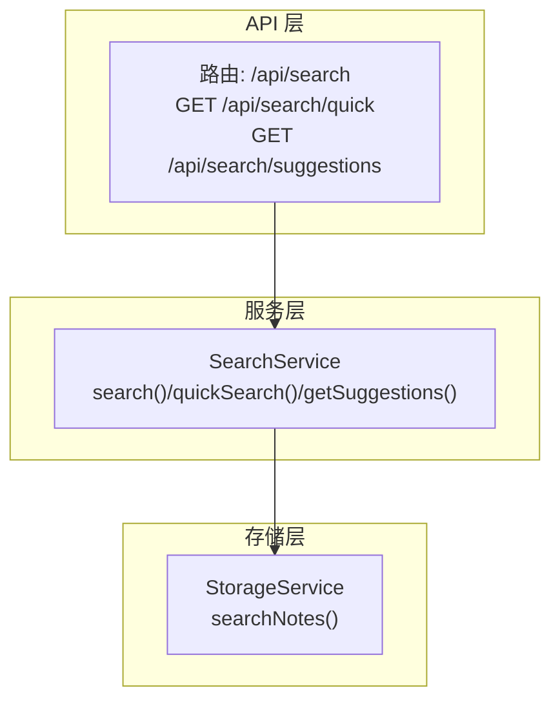
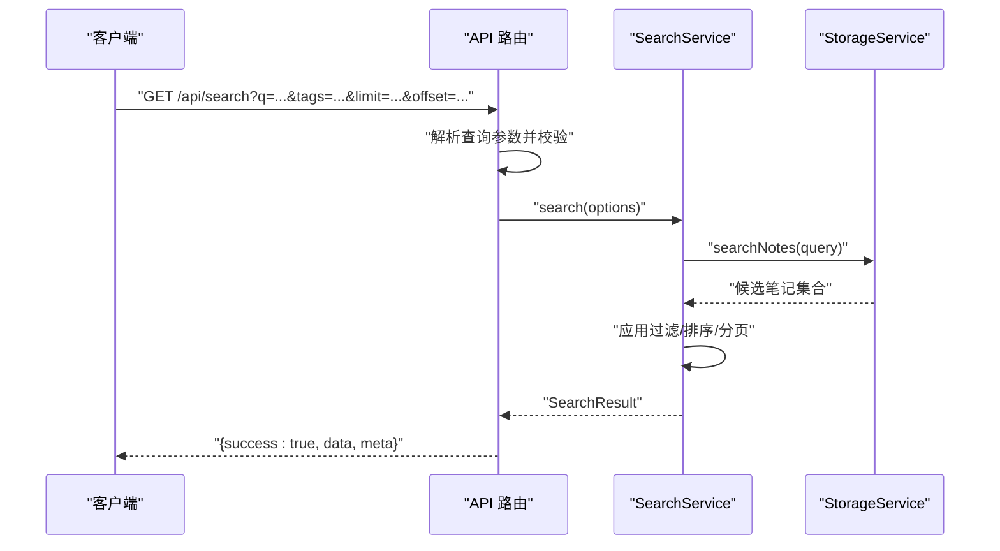
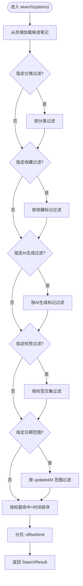
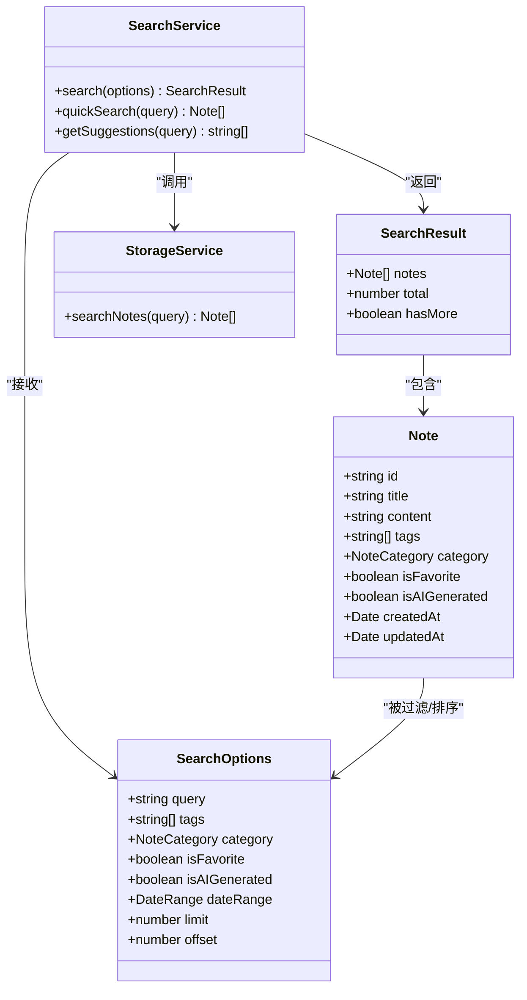

# 搜索API

<cite>
**本文引用的文件**
- [packages/api/src/routes/search.ts](file://packages/api/src/routes/search.ts)
- [packages/api/src/index.ts](file://packages/api/src/index.ts)
- [packages/core/src/search.ts](file://packages/core/src/search.ts)
- [packages/core/src/storage.ts](file://packages/core/src/storage.ts)
- [packages/core/src/types.ts](file://packages/core/src/types.ts)
- [packages/cli/src/commands/search.ts](file://packages/cli/src/commands/search.ts)
</cite>

## 目录
1. [简介](#简介)
2. [项目结构](#项目结构)
3. [核心组件](#核心组件)
4. [架构总览](#架构总览)
5. [详细组件分析](#详细组件分析)
6. [依赖关系分析](#依赖关系分析)
7. [性能考虑](#性能考虑)
8. [故障排除指南](#故障排除指南)
9. [结论](#结论)
10. [附录](#附录)

## 简介
本文件为“搜索API”的详细RESTful API文档，聚焦于全文搜索端点 GET /api/search 的设计与实现。内容涵盖查询参数、搜索范围、匹配策略、结果排序、高级搜索能力（标签过滤、分类筛选、日期范围查询、多条件组合）、结果数据结构、以及性能优化策略与最佳实践。

## 项目结构
搜索API位于后端服务的路由层，通过 Hono 路由暴露，并委托给核心搜索服务完成实际逻辑；核心搜索服务再调用存储服务进行数据检索与过滤。

图表来源
- [packages/api/src/routes/search.ts:1-91](file://packages/api/src/routes/search.ts#L1-L91)
- [packages/core/src/search.ts:1-93](file://packages/core/src/search.ts#L1-L93)
- [packages/core/src/storage.ts:249-257](file://packages/core/src/storage.ts#L249-L257)

章节来源
- [packages/api/src/index.ts:44-51](file://packages/api/src/index.ts#L44-L51)
- [packages/api/src/routes/search.ts:1-91](file://packages/api/src/routes/search.ts#L1-L91)
- [packages/core/src/search.ts:1-93](file://packages/core/src/search.ts#L1-L93)
- [packages/core/src/storage.ts:249-257](file://packages/core/src/storage.ts#L249-L257)

## 核心组件
- 路由层：负责解析查询参数、校验必填项、组装 SearchOptions 并调用服务层；返回统一的 API 包装响应。
- 服务层：实现搜索业务逻辑，包括过滤、排序、分页与结果聚合。
- 存储层：提供基础数据检索（全文匹配），并支持 MiniMemory 或文件系统两种后端。

章节来源
- [packages/api/src/routes/search.ts:9-57](file://packages/api/src/routes/search.ts#L9-L57)
- [packages/core/src/search.ts:13-64](file://packages/core/src/search.ts#L13-L64)
- [packages/core/src/storage.ts:249-257](file://packages/core/src/storage.ts#L249-L257)

## 架构总览
下图展示从客户端到存储层的完整调用链路与职责分工。

图表来源
- [packages/api/src/routes/search.ts:9-57](file://packages/api/src/routes/search.ts#L9-L57)
- [packages/core/src/search.ts:13-64](file://packages/core/src/search.ts#L13-L64)
- [packages/core/src/storage.ts:249-257](file://packages/core/src/storage.ts#L249-L257)

## 详细组件分析

### 全文搜索端点：GET /api/search
- 方法与路径
  - 方法：GET
  - 路径：/api/search
- 请求参数
  - q: 查询关键词（必填）
  - tags: 标签过滤（可选，逗号分隔）
  - category: 分类过滤（可选，枚举值：work、study、creative、personal、ai-generated）
  - favorite: 收藏过滤（可选，布尔字符串 "true"）
  - ai-generated: AI生成过滤（可选，布尔字符串 "true"）
  - startDate / endDate: 日期范围（可选，同时提供时生效）
  - limit: 结果数量限制（可选，默认20）
  - offset: 偏移量（可选，默认0）
- 响应结构
  - success: 布尔，表示请求是否成功
  - data: 笔记数组（Note[]）
  - meta: 总数与是否有更多结果
- 错误处理
  - 当 q 缺失时返回 400 与错误信息

章节来源
- [packages/api/src/routes/search.ts:9-57](file://packages/api/src/routes/search.ts#L9-L57)
- [packages/core/src/types.ts:107-127](file://packages/core/src/types.ts#L107-L127)

### 快速搜索端点：GET /api/search/quick
- 方法与路径
  - 方法：GET
  - 路径：/api/search/quick
- 请求参数
  - q: 查询关键词（必填）
- 响应结构
  - 成功时返回匹配的笔记数组（最多10条）

章节来源
- [packages/api/src/routes/search.ts:60-73](file://packages/api/src/routes/search.ts#L60-L73)
- [packages/core/src/search.ts:67-74](file://packages/core/src/search.ts#L67-L74)

### 搜索建议端点：GET /api/search/suggestions
- 方法与路径
  - 方法：GET
  - 路径：/api/search/suggestions
- 请求参数
  - q: 查询关键词（可选）
- 响应结构
  - 成功时返回基于标签的建议数组（最多5个）

章节来源
- [packages/api/src/routes/search.ts:76-89](file://packages/api/src/routes/search.ts#L76-L89)
- [packages/core/src/search.ts:77-86](file://packages/core/src/search.ts#L77-L86)

### 数据模型与类型定义
- Note（笔记）
  - 字段：id、title、content、summary、tags、category、isFavorite、isAIGenerated、createdAt、updatedAt
- SearchOptions（搜索选项）
  - 字段：query、tags、category、isFavorite、isAIGenerated、dateRange、limit、offset
- SearchResult（搜索结果）
  - 字段：notes、total、hasMore
- NoteCategory（分类枚举）
  - 取值：work、study、creative、personal、ai-generated

章节来源
- [packages/core/src/types.ts:11-22](file://packages/core/src/types.ts#L11-L22)
- [packages/core/src/types.ts:107-127](file://packages/core/src/types.ts#L107-L127)
- [packages/core/src/types.ts:1-8](file://packages/core/src/types.ts#L1-L8)

### 匹配策略与排序规则
- 匹配策略
  - 全文匹配：标题、内容、标签中任一包含关键词即命中
- 排序规则
  - 优先级：标题包含关键词的笔记排在前面
  - 次优先级：按 updatedAt 时间倒序
- 分页
  - 使用 limit 与 offset 控制分页

章节来源
- [packages/core/src/storage.ts:249-257](file://packages/core/src/storage.ts#L249-L257)
- [packages/core/src/search.ts:44-52](file://packages/core/src/search.ts#L44-L52)

### 高级搜索能力
- 标签过滤：tags 参数传入多个标签，满足任一即可
- 分类筛选：category 限定笔记分类
- 收藏筛选：favorite=true 仅返回收藏笔记
- AI生成筛选：ai-generated=true 仅返回AI生成笔记
- 日期范围：startDate 与 endDate 同时提供时生效，按 updatedAt 过滤
- 多条件组合：上述条件可任意组合使用

章节来源
- [packages/api/src/routes/search.ts:16-45](file://packages/api/src/routes/search.ts#L16-L45)
- [packages/core/src/search.ts:16-38](file://packages/core/src/search.ts#L16-L38)

### 结果数据结构详解
- data.notes
  - 返回的笔记对象数组，字段见 Note 类型
- meta
  - total：满足条件的总记录数
  - hasMore：是否存在更多未返回的结果
- 响应包装
  - 所有响应均包含 success 字段，便于前端统一处理

章节来源
- [packages/api/src/routes/search.ts:49-56](file://packages/api/src/routes/search.ts#L49-L56)
- [packages/core/src/search.ts:59-63](file://packages/core/src/search.ts#L59-L63)

### 搜索流程与算法

图表来源
- [packages/core/src/search.ts:13-64](file://packages/core/src/search.ts#L13-L64)

## 依赖关系分析
- 路由依赖服务层：/api/search 路由依赖 SearchService.search
- 服务层依赖存储层：SearchService.search 依赖 StorageService.searchNotes
- 类型定义贯穿三层：SearchOptions、SearchResult、Note 作为跨层契约

图表来源
- [packages/core/src/types.ts:107-127](file://packages/core/src/types.ts#L107-L127)
- [packages/core/src/types.ts:11-22](file://packages/core/src/types.ts#L11-L22)
- [packages/core/src/search.ts:13-64](file://packages/core/src/search.ts#L13-L64)
- [packages/core/src/storage.ts:249-257](file://packages/core/src/storage.ts#L249-L257)

章节来源
- [packages/core/src/types.ts:107-127](file://packages/core/src/types.ts#L107-L127)
- [packages/core/src/search.ts:13-64](file://packages/core/src/search.ts#L13-L64)
- [packages/core/src/storage.ts:249-257](file://packages/core/src/storage.ts#L249-L257)

## 性能考虑
- 索引机制
  - 当前实现为内存中的线性扫描匹配（标题/内容/标签包含判断），适合中小规模数据。
  - 若需大规模数据高性能检索，建议引入专用搜索引擎（如 Elasticsearch、Meilisearch）或数据库全文索引。
- 缓存策略
  - 对热门关键词的搜索结果可增加短期缓存（如 Redis），减少重复计算。
  - 建议对高频过滤组合（如 favorite=true+category=work）建立预聚合视图。
- 查询优化
  - 限制默认 limit，避免一次性返回过多数据。
  - 优先使用精确过滤（category、isFavorite、isAIGenerated）缩小候选集。
  - 对 tags 过滤建议先做去重与长度控制，避免超长参数。
- 存储后端
  - 若使用 MiniMemory，注意网络延迟与连接稳定性；若不可用则回退至文件系统。
  - 文件系统模式下，建议定期压缩与增量更新，避免大文件频繁写入。

## 故障排除指南
- 常见错误
  - 缺少查询参数 q：返回 400 与错误信息
  - 日期范围不完整：仅提供 startDate 或 endDate 将被忽略
  - 非法分类值：会被忽略，不会报错
- 调试建议
  - 使用 CLI 命令验证 API 行为：search、quick、suggest
  - 逐步添加过滤条件定位问题
  - 检查存储初始化与数据目录权限

章节来源
- [packages/api/src/routes/search.ts:12-14](file://packages/api/src/routes/search.ts#L12-L14)
- [packages/cli/src/commands/search.ts:36-71](file://packages/cli/src/commands/search.ts#L36-L71)

## 结论
当前搜索API提供了简洁而实用的全文检索能力，支持多维度过滤与排序，并具备良好的扩展性。对于生产环境，建议结合缓存与搜索引擎进一步提升性能与用户体验。

## 附录

### 实际搜索示例
- 基础全文搜索
  - GET /api/search?q=技术
- 标签过滤
  - GET /api/search?q=开发&tags=node,react
- 分类筛选
  - GET /api/search?q=学习&category=study
- 收藏与AI生成筛选
  - GET /api/search?q=笔记&favorite=true&ai-generated=true
- 日期范围
  - GET /api/search?q=项目&startDate=2024-01-01&endDate=2024-12-31
- 分页
  - GET /api/search?q=笔记&limit=20&offset=0

章节来源
- [packages/api/src/routes/search.ts:16-45](file://packages/api/src/routes/search.ts#L16-L45)

### 最佳实践
- 合理设置 limit 与 offset，避免超大数据集一次性传输
- 优先使用精确过滤条件缩小候选集
- 对高频查询结果进行缓存
- 在前端实现搜索建议与自动补全，降低无效请求
- 对关键词进行预处理（如去除多余空白、小写化）以提升命中率