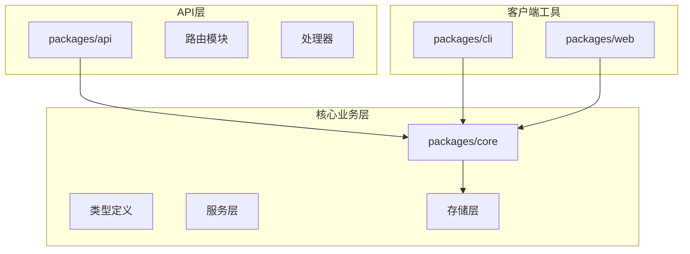
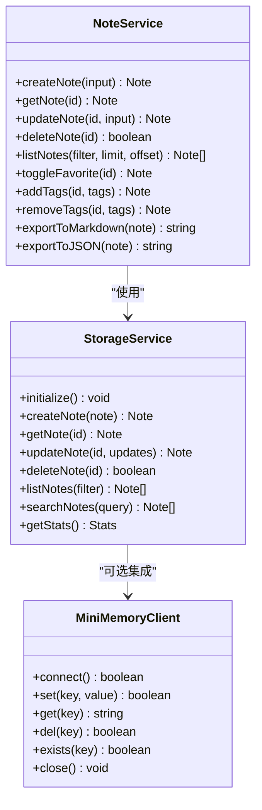
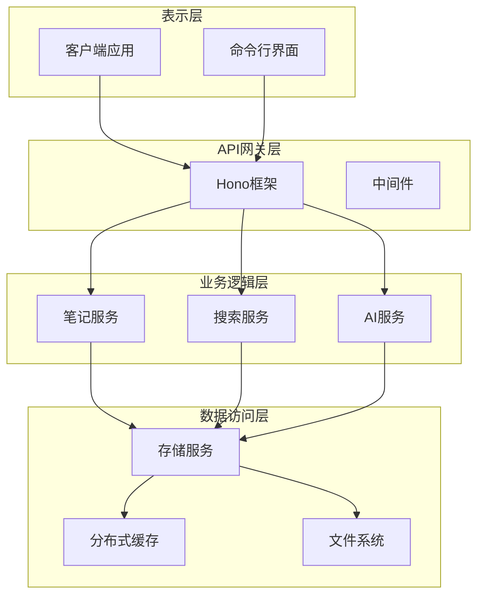
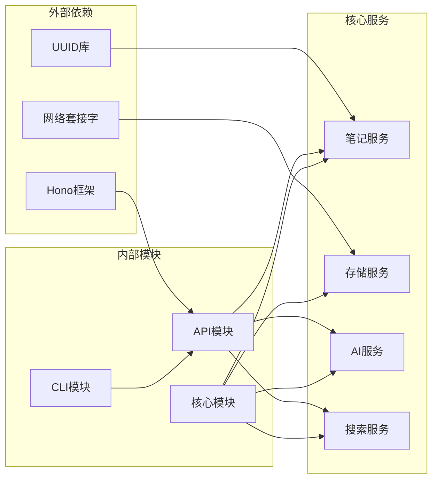

# 笔记管理API

<cite>
**本文档引用的文件**
- [packages/api/src/index.ts](file://packages/api/src/index.ts)
- [packages/api/src/routes/notes.ts](file://packages/api/src/routes/notes.ts)
- [packages/api/src/routes/search.ts](file://packages/api/src/routes/search.ts)
- [packages/api/src/routes/ai.ts](file://packages/api/src/routes/ai.ts)
- [packages/core/src/types.ts](file://packages/core/src/types.ts)
- [packages/core/src/note.ts](file://packages/core/src/note.ts)
- [packages/core/src/storage.ts](file://packages/core/src/storage.ts)
- [packages/cli/src/commands/notes.ts](file://packages/cli/src/commands/notes.ts)
</cite>

## 目录
1. [简介](#简介)
2. [项目结构](#项目结构)
3. [核心组件](#核心组件)
4. [架构概览](#架构概览)
5. [详细组件分析](#详细组件分析)
6. [依赖关系分析](#依赖关系分析)
7. [性能考虑](#性能考虑)
8. [故障排除指南](#故障排除指南)
9. [结论](#结论)

## 简介

Tomato Notebook 是一个基于 Hono 框架构建的现代化笔记管理系统，提供了完整的 RESTful API 接口用于笔记的增删改查操作。该系统采用模块化设计，支持本地文件存储和可选的 MiniMemory 分布式缓存存储，具备 AI 辅助功能和强大的搜索能力。

## 项目结构

项目采用多包架构，主要包含以下核心模块：



**图表来源**
- [packages/api/src/index.ts:1-64](file://packages/api/src/index.ts#L1-L64)
- [packages/core/src/index.ts:1-50](file://packages/core/src/index.ts#L1-L50)

**章节来源**
- [packages/api/src/index.ts:1-64](file://packages/api/src/index.ts#L1-L64)
- [packages/core/src/index.ts:1-50](file://packages/core/src/index.ts#L1-L50)

## 核心组件

### 数据模型定义

系统的核心数据模型围绕 `Note` 实体构建，包含以下关键字段：

| 字段名 | 类型 | 必填 | 描述 | 默认值 |
|--------|------|------|------|--------|
| id | string | 是 | 笔记唯一标识符 | 自动生成 |
| title | string | 是 | 笔记标题 | - |
| content | string | 否 | 笔记内容 | 空字符串 |
| summary | string | 否 | 笔记摘要 | undefined |
| tags | string[] | 否 | 标签数组 | [] |
| category | NoteCategory | 否 | 笔记分类 | study |
| isFavorite | boolean | 否 | 是否收藏 | false |
| isAIGenerated | boolean | 否 | 是否AI生成 | false |
| createdAt | Date | 是 | 创建时间 | 当前时间 |
| updatedAt | Date | 是 | 更新时间 | 当前时间 |

**章节来源**
- [packages/core/src/types.ts:10-22](file://packages/core/src/types.ts#L10-L22)
- [packages/core/src/types.ts:154-155](file://packages/core/src/types.ts#L154-L155)

### 服务架构



**图表来源**
- [packages/core/src/note.ts:7-159](file://packages/core/src/note.ts#L7-L159)
- [packages/core/src/storage.ts:109-326](file://packages/core/src/storage.ts#L109-L326)

**章节来源**
- [packages/core/src/note.ts:7-159](file://packages/core/src/note.ts#L7-L159)
- [packages/core/src/storage.ts:109-326](file://packages/core/src/storage.ts#L109-L326)

## 架构概览

系统采用分层架构设计，各层职责清晰分离：



**图表来源**
- [packages/api/src/index.ts:1-64](file://packages/api/src/index.ts#L1-L64)
- [packages/core/src/index.ts:18-49](file://packages/core/src/index.ts#L18-L49)

## 详细组件分析

### 笔记管理API端点

#### GET /api/notes

**功能描述**: 获取笔记列表，支持分页、过滤和排序

**请求参数**:
- 查询参数:
  - `filter`: 过滤条件 (all, recent, favorites, ai-generated)
  - `limit`: 返回数量限制 (默认: 20)
  - `offset`: 偏移量 (默认: 0)

**响应格式**:
```json
{
  "success": true,
  "data": [
    {
      "id": "string",
      "title": "string",
      "content": "string",
      "tags": ["string"],
      "category": "work|study|creative|personal|ai-generated",
      "isFavorite": true,
      "isAIGenerated": false,
      "createdAt": "2024-01-01T00:00:00Z",
      "updatedAt": "2024-01-01T00:00:00Z"
    }
  ],
  "meta": {
    "total": 100,
    "limit": 20,
    "offset": 0
  }
}
```

**状态码**:
- 200: 成功
- 500: 服务器内部错误

**章节来源**
- [packages/api/src/routes/notes.ts:7-25](file://packages/api/src/routes/notes.ts#L7-L25)
- [packages/core/src/note.ts:47-76](file://packages/core/src/note.ts#L47-L76)

#### POST /api/notes

**功能描述**: 创建新笔记

**请求体格式**:
```json
{
  "title": "string",
  "content": "string",
  "tags": ["string"],
  "category": "work|study|creative|personal|ai-generated"
}
```

**响应格式**:
```json
{
  "success": true,
  "data": {
    "id": "string",
    "title": "string",
    "content": "string",
    "tags": ["string"],
    "category": "work|study|creative|personal|ai-generated",
    "isFavorite": false,
    "isAIGenerated": false,
    "createdAt": "2024-01-01T00:00:00Z",
    "updatedAt": "2024-01-01T00:00:00Z"
  }
}
```

**状态码**:
- 201: 创建成功
- 400: 标题必填
- 500: 服务器内部错误

**章节来源**
- [packages/api/src/routes/notes.ts:27-44](file://packages/api/src/routes/notes.ts#L27-L44)
- [packages/core/src/note.ts:14-30](file://packages/core/src/note.ts#L14-L30)

#### GET /api/notes/:id

**功能描述**: 获取单个笔记详情

**路径参数**:
- `id`: 笔记唯一标识符

**响应格式**:
```json
{
  "success": true,
  "data": {
    "id": "string",
    "title": "string",
    "content": "string",
    "summary": "string",
    "tags": ["string"],
    "category": "work|study|creative|personal|ai-generated",
    "isFavorite": true,
    "isAIGenerated": false,
    "createdAt": "2024-01-01T00:00:00Z",
    "updatedAt": "2024-01-01T00:00:00Z"
  }
}
```

**状态码**:
- 200: 成功
- 404: 笔记不存在

**章节来源**
- [packages/api/src/routes/notes.ts:46-56](file://packages/api/src/routes/notes.ts#L46-L56)
- [packages/core/src/note.ts:32-35](file://packages/core/src/note.ts#L32-L35)

#### PUT /api/notes/:id

**功能描述**: 更新现有笔记

**路径参数**:
- `id`: 笔记唯一标识符

**请求体格式**:
```json
{
  "title": "string",
  "content": "string",
  "tags": ["string"],
  "category": "work|study|creative|personal|ai-generated",
  "isFavorite": true,
  "summary": "string"
}
```

**响应格式**:
```json
{
  "success": true,
  "data": {
    "id": "string",
    "title": "string",
    "content": "string",
    "summary": "string",
    "tags": ["string"],
    "category": "work|study|creative|personal|ai-generated",
    "isFavorite": true,
    "isAIGenerated": false,
    "createdAt": "2024-01-01T00:00:00Z",
    "updatedAt": "2024-01-01T00:00:00Z"
  }
}
```

**状态码**:
- 200: 更新成功
- 404: 笔记不存在

**章节来源**
- [packages/api/src/routes/notes.ts:58-70](file://packages/api/src/routes/notes.ts#L58-L70)
- [packages/core/src/note.ts:37-40](file://packages/core/src/note.ts#L37-L40)

#### DELETE /api/notes/:id

**功能描述**: 删除笔记

**路径参数**:
- `id`: 笔记唯一标识符

**响应格式**:
```json
{
  "success": true
}
```

**状态码**:
- 200: 删除成功
- 404: 笔记不存在

**章节来源**
- [packages/api/src/routes/notes.ts:72-82](file://packages/api/src/routes/notes.ts#L72-L82)
- [packages/core/src/note.ts:42-45](file://packages/core/src/note.ts#L42-L45)

### 高级功能端点

#### 收藏管理

**POST /api/notes/:id/favorite**
- 切换笔记收藏状态
- 响应格式与 GET /api/notes/:id 相同

**POST /api/notes/:id/tags**
- 为笔记添加标签
- 请求体: `{ "tags": ["tag1", "tag2"] }`

**DELETE /api/notes/:id/tags**
- 为笔记移除标签
- 请求体: `{ "tags": ["tag1", "tag2"] }`

#### 导出功能

**GET /api/notes/:id/export**
- 导出笔记内容
- 查询参数: `format` (json 或 markdown，默认: json)
- 响应: 文件下载流

#### 统计信息

**GET /api/notes/stats/summary**
- 获取笔记统计信息
- 响应: `{ totalNotes, favoriteNotes, aiGeneratedNotes, totalTags }`

**章节来源**
- [packages/api/src/routes/notes.ts:84-158](file://packages/api/src/routes/notes.ts#L84-L158)

### 搜索功能

**GET /api/search/**
- 全文搜索笔记
- 查询参数:
  - `q`: 搜索关键词 (必填)
  - `tags`: 标签过滤 (逗号分隔)
  - `category`: 分类过滤
  - `favorite`: 收藏过滤
  - `ai-generated`: AI生成过滤
  - `startDate`: 开始日期
  - `endDate`: 结束日期
  - `limit`: 限制数量
  - `offset`: 偏移量

**响应格式**:
```json
{
  "success": true,
  "data": [/* 笔记数组 */],
  "meta": {
    "total": 100,
    "hasMore": false
  }
}
```

**章节来源**
- [packages/api/src/routes/search.ts:8-57](file://packages/api/src/routes/search.ts#L8-L57)
- [packages/core/src/types.ts:107-127](file://packages/core/src/types.ts#L107-L127)

## 依赖关系分析

系统采用松耦合的设计模式，各组件间通过清晰的接口进行交互：



**图表来源**
- [packages/api/src/index.ts:1-64](file://packages/api/src/index.ts#L1-L64)
- [packages/core/src/index.ts:18-49](file://packages/core/src/index.ts#L18-L49)

**章节来源**
- [packages/api/src/index.ts:1-64](file://packages/api/src/index.ts#L1-L64)
- [packages/core/src/index.ts:18-49](file://packages/core/src/index.ts#L18-L49)

## 性能考虑

### 存储策略

系统实现了双层存储架构以优化性能：

1. **内存缓存**: 使用 Map 数据结构缓存笔记数据，提供 O(1) 的读取性能
2. **持久化存储**: 自动同步到本地文件系统，确保数据持久性
3. **可选分布式缓存**: 支持 MiniMemory 分布式缓存，适用于多实例部署场景

### 查询优化

- **索引策略**: 基于内存的 Map 结构提供快速查找
- **分页机制**: 支持 limit 和 offset 参数，避免一次性加载大量数据
- **过滤优化**: 在内存中进行过滤操作，适合中小规模数据集

### 并发处理

- **异步操作**: 所有数据库操作均为异步，避免阻塞主线程
- **连接池**: MiniMemory 客户端支持连接复用
- **错误隔离**: 每个操作都有独立的错误处理机制

## 故障排除指南

### 常见错误及解决方案

| 错误类型 | 状态码 | 可能原因 | 解决方案 |
|----------|--------|----------|----------|
| 认证失败 | 401 | 缺少或无效的认证头 | 检查请求头中的认证信息 |
| 权限不足 | 403 | 用户权限不够 | 确认用户具有相应操作权限 |
| 资源不存在 | 404 | ID不存在或已被删除 | 验证资源ID的有效性 |
| 参数错误 | 400 | 请求参数格式不正确 | 检查请求体格式和必需字段 |
| 服务器错误 | 500 | 服务器内部异常 | 查看服务器日志获取详细信息 |

### 调试技巧

1. **启用详细日志**: 在开发环境中设置更详细的日志级别
2. **使用Postman测试**: 通过API测试工具验证接口行为
3. **监控指标**: 关注系统的CPU、内存和磁盘使用情况
4. **错误追踪**: 使用浏览器开发者工具查看网络请求和响应

**章节来源**
- [packages/api/src/routes/notes.ts:28-43](file://packages/api/src/routes/notes.ts#L28-L43)
- [packages/api/src/routes/notes.ts:51-53](file://packages/api/src/routes/notes.ts#L51-L53)
- [packages/api/src/routes/notes.ts:65-67](file://packages/api/src/routes/notes.ts#L65-L67)
- [packages/api/src/routes/notes.ts:77-79](file://packages/api/src/routes/notes.ts#L77-L79)

## 结论

Tomato Notebook 提供了一个功能完整、架构清晰的笔记管理解决方案。其RESTful API设计遵循了现代Web标准，支持丰富的功能特性，包括：

- **完整的CRUD操作**: 支持笔记的创建、读取、更新和删除
- **灵活的查询能力**: 支持分页、过滤和排序
- **扩展的业务功能**: 包含收藏管理、标签系统、AI辅助功能
- **高性能架构**: 采用内存缓存和可选分布式缓存提升性能
- **良好的错误处理**: 提供完善的错误处理和状态码体系

该系统适合个人使用和小型团队协作，为用户提供高效、可靠的笔记管理体验。