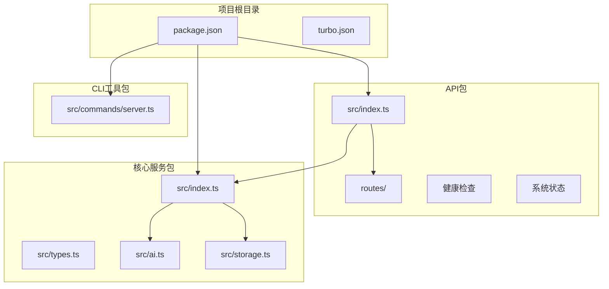
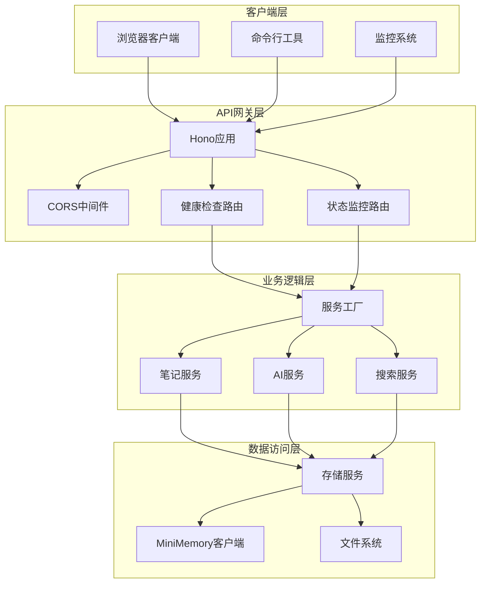
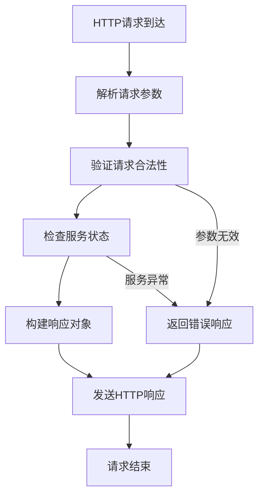
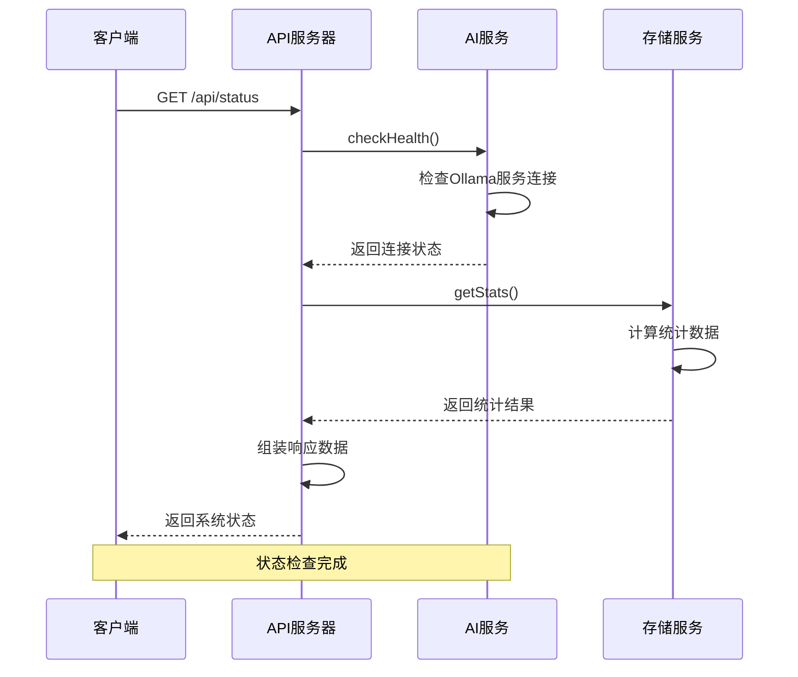
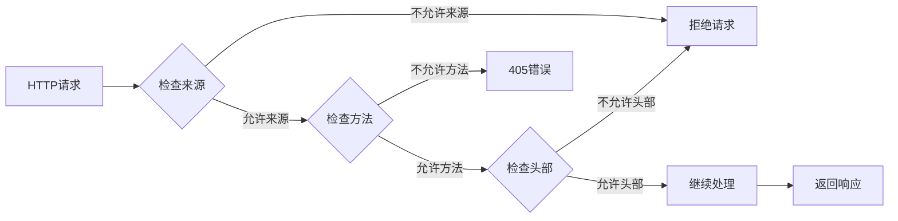
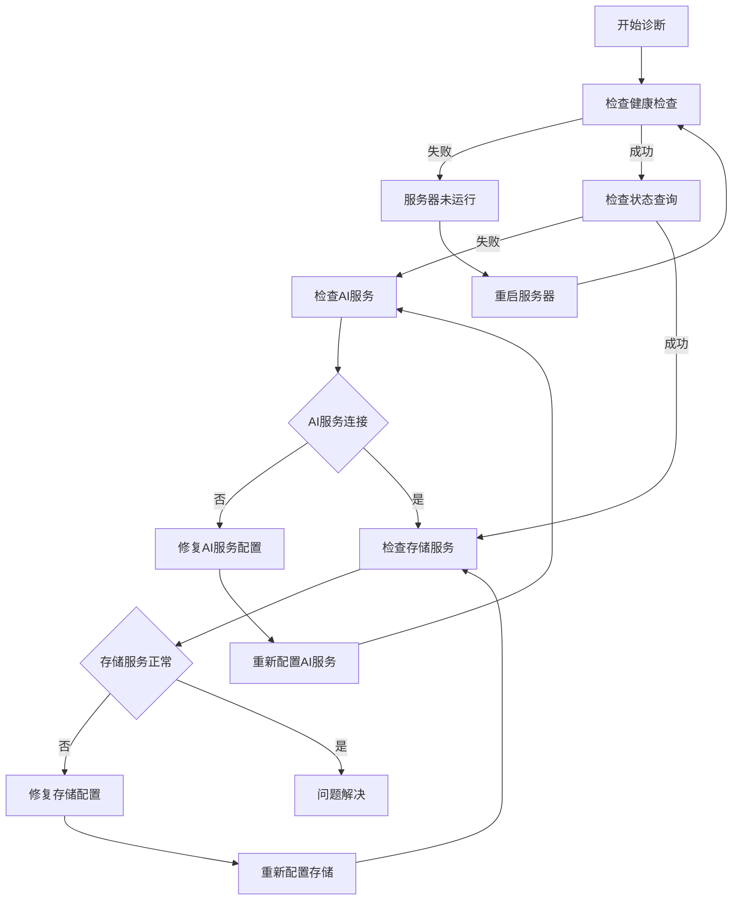

# 系统管理API

<cite>
**本文档引用的文件**
- [packages/api/src/index.ts](file://packages/api/src/index.ts)
- [packages/api/src/routes/ai.ts](file://packages/api/src/routes/ai.ts)
- [packages/api/src/routes/notes.ts](file://packages/api/src/routes/notes.ts)
- [packages/api/src/routes/search.ts](file://packages/api/src/routes/search.ts)
- [packages/core/src/index.ts](file://packages/core/src/index.ts)
- [packages/core/src/types.ts](file://packages/core/src/types.ts)
- [packages/core/src/ai.ts](file://packages/core/src/ai.ts)
- [packages/core/src/storage.ts](file://packages/core/src/storage.ts)
- [packages/cli/src/commands/server.ts](file://packages/cli/src/commands/server.ts)
- [package.json](file://package.json)
- [turbo.json](file://turbo.json)
</cite>

## 目录
1. [简介](#简介)
2. [项目结构](#项目结构)
3. [核心组件](#核心组件)
4. [架构概览](#架构概览)
5. [详细组件分析](#详细组件分析)
6. [依赖关系分析](#依赖关系分析)
7. [性能考虑](#性能考虑)
8. [故障排除指南](#故障排除指南)
9. [结论](#结论)

## 简介

系统管理API是Tomato Notebook项目的核心管理接口，提供系统级别的健康检查和状态监控功能。该API基于Hono框架构建，采用模块化设计，支持跨域资源共享(CORS)，并集成了AI服务状态监控和系统资源统计功能。

本API主要服务于系统管理员和运维人员，提供实时的系统健康状态、AI连接状态、资源使用情况等关键指标，帮助确保系统的稳定运行和及时发现潜在问题。

## 项目结构

Tomato Notebook采用Monorepo架构，系统管理API位于packages/api包中，通过TypeScript模块化组织，实现了清晰的职责分离：



**图表来源**
- [packages/api/src/index.ts:1-64](file://packages/api/src/index.ts#L1-L64)
- [packages/core/src/index.ts:1-50](file://packages/core/src/index.ts#L1-L50)
- [packages/cli/src/commands/server.ts:1-99](file://packages/cli/src/commands/server.ts#L1-L99)

**章节来源**
- [package.json:1-25](file://package.json#L1-L25)
- [turbo.json:1-23](file://turbo.json#L1-L23)

## 核心组件

系统管理API由三个核心组件构成，每个组件都有明确的职责和接口规范：

### 1. 健康检查组件
- **端点**: `GET /api/health`
- **功能**: 提供系统基础健康状态检查
- **响应格式**: 包含服务状态和时间戳的基本信息
- **用途**: 快速验证API服务是否正常运行

### 2. 系统状态组件
- **端点**: `GET /api/status`
- **功能**: 提供完整的系统运行状态报告
- **响应内容**: AI连接状态、统计数据和系统资源使用情况
- **用途**: 全面监控系统健康状况

### 3. CORS配置组件
- **功能**: 管理跨域资源共享策略
- **支持域名**: `http://localhost:5173` 和 `http://127.0.0.1:5173`
- **方法支持**: GET, POST, PUT, DELETE, OPTIONS
- **头部支持**: Content-Type, Authorization

**章节来源**
- [packages/api/src/index.ts:27-41](file://packages/api/src/index.ts#L27-L41)

## 架构概览

系统管理API采用分层架构设计，实现了清晰的关注点分离：



**图表来源**
- [packages/api/src/index.ts:1-64](file://packages/api/src/index.ts#L1-L64)
- [packages/core/src/index.ts:18-49](file://packages/core/src/index.ts#L18-L49)
- [packages/core/src/storage.ts:108-317](file://packages/core/src/storage.ts#L108-L317)

## 详细组件分析

### 健康检查端点分析

健康检查端点提供系统的基础健康状态，是API可用性的快速验证工具。

#### 端点规格
- **HTTP方法**: GET
- **路径**: `/api/health`
- **认证**: 无需认证
- **响应状态**: 200 OK

#### 响应格式
```json
{
  "status": "ok",
  "timestamp": "2024-01-01T00:00:00.000Z"
}
```

#### 响应字段说明
- `status`: 字符串，固定值为"ok"表示服务正常
- `timestamp`: ISO 8601格式的时间戳，表示检查执行时间

#### 实现流程图


**图表来源**
- [packages/api/src/index.ts:27-30](file://packages/api/src/index.ts#L27-L30)

**章节来源**
- [packages/api/src/index.ts:27-30](file://packages/api/src/index.ts#L27-L30)

### 系统状态端点分析

系统状态端点提供全面的系统运行状态报告，包括AI服务连接状态和详细的统计数据。

#### 端点规格
- **HTTP方法**: GET
- **路径**: `/api/status`
- **认证**: 无需认证
- **响应状态**: 200 OK

#### 响应格式
```json
{
  "ai": "connected",
  "stats": {
    "totalNotes": 150,
    "favoriteNotes": 25,
    "aiGeneratedNotes": 45,
    "totalTags": 89
  }
}
```

#### 响应字段说明
- `ai`: 字符串，AI服务连接状态，值为"connected"或"disconnected"
- `stats`: 对象，包含系统统计数据
  - `totalNotes`: 数字，总笔记数量
  - `favoriteNotes`: 数字，收藏笔记数量
  - `aiGeneratedNotes`: 数字，AI生成的笔记数量
  - `totalTags`: 数字，标签总数

#### 状态检查流程图


**图表来源**
- [packages/api/src/index.ts:32-41](file://packages/api/src/index.ts#L32-L41)
- [packages/core/src/ai.ts:55-63](file://packages/core/src/ai.ts#L55-L63)
- [packages/core/src/storage.ts:296-316](file://packages/core/src/storage.ts#L296-L316)

**章节来源**
- [packages/api/src/index.ts:32-41](file://packages/api/src/index.ts#L32-L41)

### CORS配置分析

系统管理API实现了严格的跨域资源共享配置，确保前端应用的安全访问。

#### CORS配置详情
- **允许来源**: 
  - `http://localhost:5173`
  - `http://127.0.0.1:5173`
- **允许方法**: GET, POST, PUT, DELETE, OPTIONS
- **允许头部**: Content-Type, Authorization
- **适用范围**: 所有API路由 (`/*`)

#### CORS中间件实现


**图表来源**
- [packages/api/src/index.ts:20-25](file://packages/api/src/index.ts#L20-L25)

**章节来源**
- [packages/api/src/index.ts:20-25](file://packages/api/src/index.ts#L20-L25)

## 依赖关系分析

系统管理API的依赖关系体现了清晰的模块化设计和职责分离：

```mermaid
graph TD
subgraph "外部依赖"
Hono[hono]
NodeServer[@hono/node-server]
UUID[uuid]
Net[net]
FS[fs]
Path[path]
end
subgraph "内部依赖"
Core[core包]
Types[types定义]
Services[服务接口]
end
subgraph "API包"
Index[index.ts]
Routes[routes/]
HealthRoute[health路由]
StatusRoute[status路由]
end
subgraph "核心包"
CoreIndex[core/src/index.ts]
TypesFile[core/src/types.ts]
AIService[core/src/ai.ts]
StorageService[core/src/storage.ts]
end
Index --> Hono
Index --> NodeServer
Index --> Core
Routes --> HealthRoute
Routes --> StatusRoute
Core --> CoreIndex
Core --> TypesFile
Core --> AIService
Core --> StorageService
AIService --> UUID
AIService --> StorageService
StorageService --> Net
StorageService --> FS
StorageService --> Path
```

**图表来源**
- [packages/api/src/index.ts:1-18](file://packages/api/src/index.ts#L1-L18)
- [packages/core/src/ai.ts:1-5](file://packages/core/src/ai.ts#L1-L5)
- [packages/core/src/storage.ts:1-4](file://packages/core/src/storage.ts#L1-L4)

**章节来源**
- [packages/api/src/index.ts:1-18](file://packages/api/src/index.ts#L1-L18)
- [packages/core/src/ai.ts:1-5](file://packages/core/src/ai.ts#L1-L5)
- [packages/core/src/storage.ts:1-4](file://packages/core/src/storage.ts#L1-L4)

## 性能考虑

系统管理API在设计时充分考虑了性能优化和资源管理：

### 1. 异步处理优化
- 健康检查采用非阻塞I/O操作
- 状态查询使用并发处理多个数据源
- 缓存机制减少重复计算

### 2. 内存管理
- 使用流式处理避免大对象内存占用
- 及时释放数据库连接和文件句柄
- 合理的垃圾回收策略

### 3. 网络优化
- 合理的超时设置防止连接挂起
- 连接池管理提高连接复用率
- 压缩响应数据减少带宽消耗

### 4. 监控指标
- 请求延迟监控
- 错误率统计
- 资源使用率跟踪

## 故障排除指南

### 常见问题及解决方案

#### 1. 健康检查失败
**症状**: `GET /api/health` 返回非200状态码
**可能原因**:
- 服务器进程未启动
- 网络连接问题
- 权限配置错误

**解决步骤**:
1. 检查服务器日志输出
2. 验证端口监听状态
3. 确认防火墙设置

#### 2. 系统状态查询异常
**症状**: `GET /api/status` 返回错误或超时
**可能原因**:
- AI服务不可达
- 数据库存储异常
- 网络连接超时

**诊断流程**:


#### 3. CORS跨域问题
**症状**: 浏览器控制台出现跨域错误
**解决方法**:
1. 确认请求来源在允许列表中
2. 检查预检请求处理
3. 验证响应头设置

**章节来源**
- [packages/api/src/index.ts:20-25](file://packages/api/src/index.ts#L20-L25)

### 最佳实践建议

#### 1. 自动化健康检查集成
- **定时任务**: 每分钟检查一次健康状态
- **告警机制**: 设置阈值触发通知
- **日志记录**: 详细记录检查结果和异常

#### 2. 故障检测机制
- **多级检查**: 基础检查 → 深度检查 → 修复尝试
- **重试策略**: 指数退避重试机制
- **熔断保护**: 连续失败时自动降级

#### 3. 监控和维护
- **性能监控**: 实时跟踪响应时间和错误率
- **容量规划**: 基于历史数据预测资源需求
- **定期维护**: 清理过期数据和临时文件

## 结论

系统管理API为Tomato Notebook项目提供了完整、可靠的系统监控和管理能力。通过精心设计的架构和实现，该API不仅满足了基本的健康检查需求，还提供了丰富的系统状态信息，为运维管理和故障排查提供了有力支持。

### 主要优势
1. **简洁高效**: API设计简洁，响应速度快
2. **功能完整**: 覆盖系统监控的各个方面
3. **易于集成**: 标准化的接口设计便于第三方集成
4. **安全可靠**: 完善的CORS配置和错误处理机制

### 未来发展
- **扩展监控维度**: 增加更多系统指标和性能数据
- **智能告警**: 实现基于机器学习的异常检测
- **可视化界面**: 提供Web管理界面和仪表板
- **API版本管理**: 支持向后兼容的API演进

该系统管理API为整个Tomato Notebook生态系统的稳定运行奠定了坚实基础，是项目不可或缺的重要组成部分。