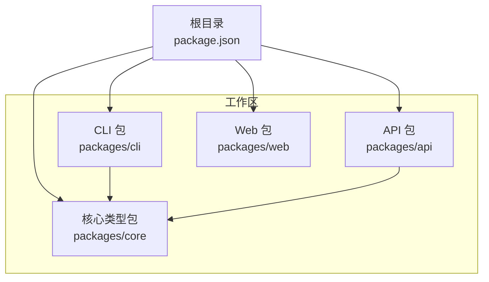
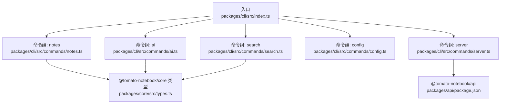
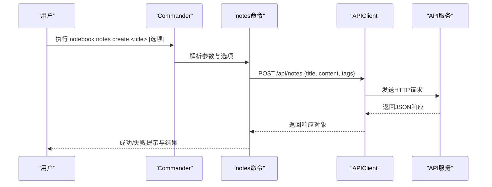
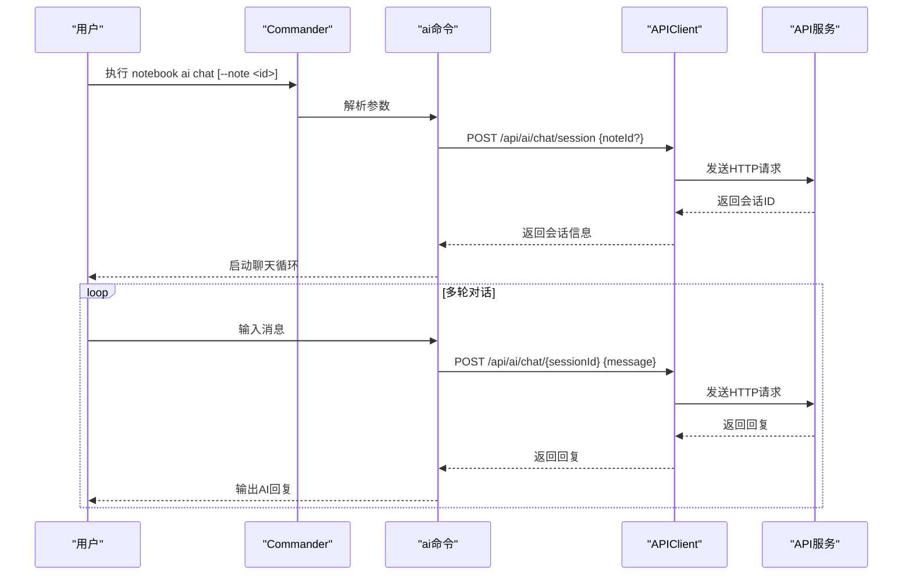
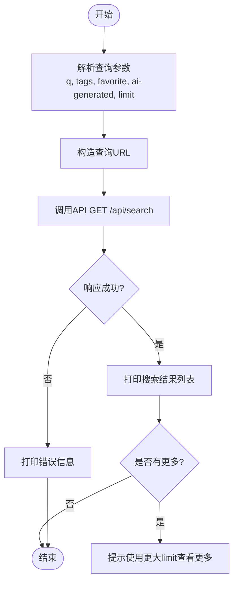
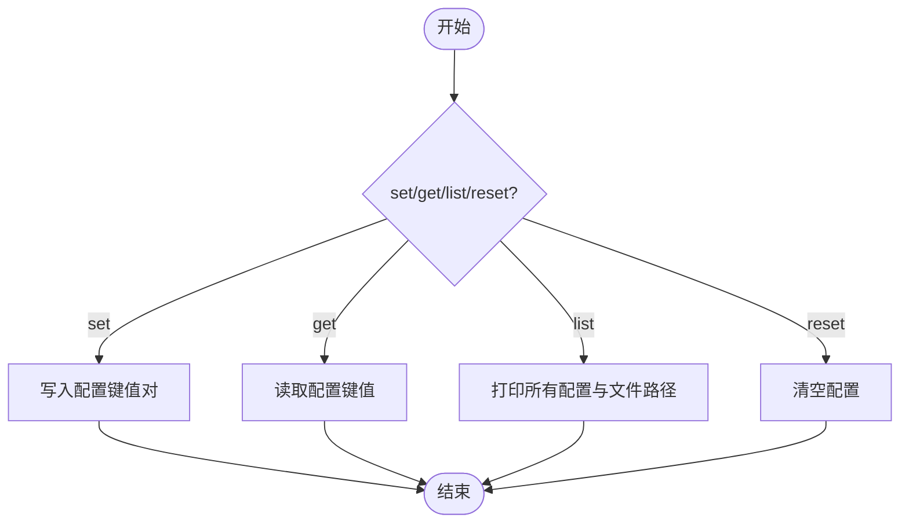
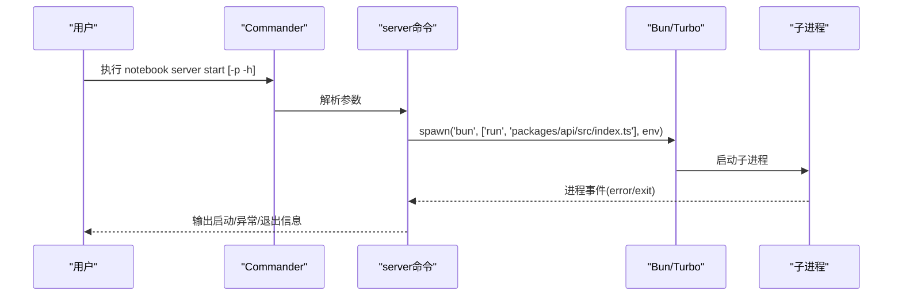
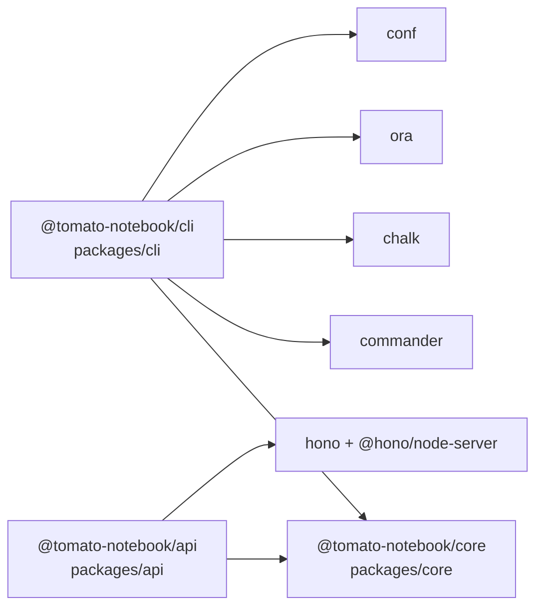

# CLI工具

<cite>
**本文引用的文件**
- [packages/cli/src/index.ts](file://packages/cli/src/index.ts)
- [packages/cli/src/commands/notes.ts](file://packages/cli/src/commands/notes.ts)
- [packages/cli/src/commands/ai.ts](file://packages/cli/src/commands/ai.ts)
- [packages/cli/src/commands/search.ts](file://packages/cli/src/commands/search.ts)
- [packages/cli/src/commands/config.ts](file://packages/cli/src/commands/config.ts)
- [packages/cli/src/commands/server.ts](file://packages/cli/src/commands/server.ts)
- [packages/core/src/types.ts](file://packages/core/src/types.ts)
- [packages/cli/package.json](file://packages/cli/package.json)
- [packages/api/package.json](file://packages/api/package.json)
- [package.json](file://package.json)
</cite>

## 目录
1. [简介](#简介)
2. [项目结构](#项目结构)
3. [核心组件](#核心组件)
4. [架构总览](#架构总览)
5. [详细组件分析](#详细组件分析)
6. [依赖关系分析](#依赖关系分析)
7. [性能考虑](#性能考虑)
8. [故障排查指南](#故障排查指南)
9. [结论](#结论)
10. [附录](#附录)

## 简介
本文件为“番茄笔记”CLI工具的使用与技术文档，面向终端用户、系统管理员与高级开发者。文档涵盖命令行接口设计、各命令功能与参数、输出格式、参数解析与错误处理机制，并提供批量操作与自动化脚本的实践建议。CLI通过统一入口注册多个命令组，包括笔记管理、AI服务、搜索、配置与服务器管理；其内部封装了API客户端，负责与后端API进行HTTP通信。

## 项目结构
该仓库采用多包工作区布局，CLI位于 packages/cli，核心类型定义在 packages/core，API服务在 packages/api。顶层使用Bun作为包管理器与执行环境，通过Turbo进行任务编排。

图表来源
- [package.json:1-25](file://package.json#L1-L25)
- [packages/cli/package.json:1-26](file://packages/cli/package.json#L1-L26)
- [packages/api/package.json:1-22](file://packages/api/package.json#L1-L22)

章节来源
- [package.json:1-25](file://package.json#L1-L25)
- [packages/cli/package.json:1-26](file://packages/cli/package.json#L1-L26)
- [packages/api/package.json:1-22](file://packages/api/package.json#L1-L22)

## 核心组件
- 入口与全局依赖
  - CLI入口负责初始化配置、加载命令模块、创建Command实例并注册子命令。
  - 依赖：commander（命令解析）、chalk（彩色输出）、ora（加载动画）、conf（本地配置存储）。
- API客户端
  - 封装统一的HTTP请求方法（GET/POST/PUT/DELETE），自动注入JSON头与基础URL（来自配置）。
- 命令模块
  - notes：笔记的增删改查、收藏、标签、导出、统计等。
  - ai：AI健康检查、摘要、润色、翻译、学习建议、聊天会话。
  - search：全文搜索、快速搜索、搜索建议。
  - config：设置/读取/列出/重置配置项。
  - server：启动/停止API服务器、开发模式（同时启动API与Web）。

章节来源
- [packages/cli/src/index.ts:1-91](file://packages/cli/src/index.ts#L1-L91)
- [packages/cli/src/commands/notes.ts:1-307](file://packages/cli/src/commands/notes.ts#L1-L307)
- [packages/cli/src/commands/ai.ts:1-217](file://packages/cli/src/commands/ai.ts#L1-L217)
- [packages/cli/src/commands/search.ts:1-119](file://packages/cli/src/commands/search.ts#L1-L119)
- [packages/cli/src/commands/config.ts:1-49](file://packages/cli/src/commands/config.ts#L1-L49)
- [packages/cli/src/commands/server.ts:1-99](file://packages/cli/src/commands/server.ts#L1-L99)

## 架构总览
CLI通过Commander构建命令树，每个命令组在独立文件中注册，最终由入口统一挂载。CLI与API之间通过HTTP交互，API服务由packages/api提供，CLI默认连接本地3000端口。

图表来源
- [packages/cli/src/index.ts:68-90](file://packages/cli/src/index.ts#L68-L90)
- [packages/cli/src/commands/notes.ts:48-307](file://packages/cli/src/commands/notes.ts#L48-L307)
- [packages/cli/src/commands/ai.ts:11-217](file://packages/cli/src/commands/ai.ts#L11-L217)
- [packages/cli/src/commands/search.ts:15-119](file://packages/cli/src/commands/search.ts#L15-L119)
- [packages/cli/src/commands/config.ts:4-49](file://packages/cli/src/commands/config.ts#L4-L49)
- [packages/cli/src/commands/server.ts:7-99](file://packages/cli/src/commands/server.ts#L7-L99)
- [packages/api/package.json:1-22](file://packages/api/package.json#L1-L22)
- [packages/core/src/types.ts:1-163](file://packages/core/src/types.ts#L1-L163)

## 详细组件分析

### 命令行接口与参数解析
- 入口程序
  - 初始化配置（默认API地址为本地3000端口），创建Command实例，注册各命令组，最后解析命令行参数。
- 参数解析机制
  - 使用commander对命令、子命令、选项与位置参数进行解析，支持别名、默认值与类型约束。
  - 所有网络请求均通过API客户端统一封装，自动附加JSON头与基础URL。
- 错误处理
  - 统一使用spinner展示加载状态；网络异常或业务错误时，打印红色错误信息并返回非零退出码。
  - 对于用户输入校验（如必须提供更新字段），直接在命令逻辑中进行判断并提示。

章节来源
- [packages/cli/src/index.ts:1-91](file://packages/cli/src/index.ts#L1-L91)
- [packages/cli/src/commands/notes.ts:58-78](file://packages/cli/src/commands/notes.ts#L58-L78)
- [packages/cli/src/commands/ai.ts:14-43](file://packages/cli/src/commands/ai.ts#L14-L43)
- [packages/cli/src/commands/search.ts:32-71](file://packages/cli/src/commands/search.ts#L32-L71)
- [packages/cli/src/commands/config.ts:11-27](file://packages/cli/src/commands/config.ts#L11-L27)
- [packages/cli/src/commands/server.ts:16-53](file://packages/cli/src/commands/server.ts#L16-L53)

### 笔记管理命令（notes）
- 子命令概览
  - create/new：创建笔记，支持标题、内容、标签（逗号分隔）。
  - list/ls：列出笔记，支持过滤（全部/最近/收藏/AI生成）、限制数量。
  - show：查看笔记详情，支持json/markdown两种输出格式。
  - edit：编辑笔记，支持更新标题或内容。
  - delete/rm：删除笔记，需显式传入强制删除选项以避免误删。
  - favorite/fav：切换收藏状态。
  - tag：为笔记添加标签。
  - export：导出笔记，支持json/markdown格式与文件输出。
  - stats：显示统计信息（总笔记数、收藏数、AI生成数、标签总数）。
- 输出格式与颜色
  - 使用chalk进行彩色输出，增强可读性；Markdown导出用于分享与归档。
- 关键实现要点
  - 列表与搜索均返回带元信息的响应，包含总数与分页控制。
  - 导出支持直接输出到stdout或写入文件，便于自动化集成。

图表来源
- [packages/cli/src/commands/notes.ts:52-78](file://packages/cli/src/commands/notes.ts#L52-L78)
- [packages/cli/src/index.ts:16-59](file://packages/cli/src/index.ts#L16-L59)

章节来源
- [packages/cli/src/commands/notes.ts:48-307](file://packages/cli/src/commands/notes.ts#L48-L307)

### AI服务命令（ai）
- 子命令概览
  - status：检查AI服务健康状态与可用模型。
  - summarize：根据笔记ID生成摘要，支持长度选择。
  - polish：润色文本，支持正式/随意风格。
  - translate：翻译为指定语言。
  - suggest：生成学习建议，可基于笔记或上下文。
  - chat：启动聊天会话，支持与笔记关联，支持多轮对话。
- 实现要点
  - 聊天会话通过创建会话ID并在后续请求中复用，支持持续对话。
  - 所有请求均通过API客户端发送，返回统一的业务响应结构。

图表来源
- [packages/cli/src/commands/ai.ts:151-216](file://packages/cli/src/commands/ai.ts#L151-L216)
- [packages/cli/src/index.ts:16-59](file://packages/cli/src/index.ts#L16-L59)

章节来源
- [packages/cli/src/commands/ai.ts:11-217](file://packages/cli/src/commands/ai.ts#L11-L217)

### 搜索命令（search）
- 子命令概览
  - query/q：全文搜索，支持标签过滤、收藏过滤、AI生成过滤、限制数量。
  - quick：快速搜索（仅标题匹配）。
  - suggest：获取搜索建议（标签）。
- 实现要点
  - 查询参数通过URL拼接，支持多选过滤；返回结果包含总数与是否还有更多标记，便于分页与提示。

图表来源
- [packages/cli/src/commands/search.ts:18-71](file://packages/cli/src/commands/search.ts#L18-L71)

章节来源
- [packages/cli/src/commands/search.ts:15-119](file://packages/cli/src/commands/search.ts#L15-L119)

### 配置管理命令（config）
- 子命令概览
  - set：设置配置项（当前支持apiUrl）。
  - get：获取配置项。
  - list/ls：列出所有配置与配置文件路径。
  - reset：清空所有配置。
- 实现要点
  - 基于conf库持久化配置，键值对存储在用户配置目录中。

图表来源
- [packages/cli/src/commands/config.ts:7-48](file://packages/cli/src/commands/config.ts#L7-L48)

章节来源
- [packages/cli/src/commands/config.ts:4-49](file://packages/cli/src/commands/config.ts#L4-L49)

### 服务器管理命令（server）
- 子命令概览
  - start：启动API服务器，支持指定端口与主机。
  - stop：停止API服务器。
  - dev：开发模式，同时启动API与Web前端（通过Turbo）。
- 实现要点
  - 使用child_process以继承stdio的方式运行外部进程，捕获错误与退出码。
  - 开发模式下监听SIGINT信号优雅退出。

图表来源
- [packages/cli/src/commands/server.ts:10-53](file://packages/cli/src/commands/server.ts#L10-L53)

章节来源
- [packages/cli/src/commands/server.ts:7-99](file://packages/cli/src/commands/server.ts#L7-L99)

## 依赖关系分析
- 内部依赖
  - CLI依赖@tomato-notebook/core提供的类型定义，确保与API契约一致。
  - API包依赖@tomato-notebook/core与Hono框架。
- 外部依赖
  - commander（命令行解析）、chalk（输出美化）、ora（加载动画）、conf（配置持久化）。
- 工作区与构建
  - 根目录使用Turbo进行统一构建、清理、格式化与测试；CLI与API分别维护各自构建脚本。

图表来源
- [packages/cli/package.json:15-21](file://packages/cli/package.json#L15-L21)
- [packages/api/package.json:13-17](file://packages/api/package.json#L13-L17)
- [packages/core/src/types.ts:1-163](file://packages/core/src/types.ts#L1-L163)

章节来源
- [packages/cli/package.json:1-26](file://packages/cli/package.json#L1-L26)
- [packages/api/package.json:1-22](file://packages/api/package.json#L1-L22)

## 性能考虑
- I/O与网络
  - CLI通过单次请求完成业务操作，避免不必要的多次往返；对于大文件导出建议使用文件输出而非stdout，减少内存占用。
- 输出渲染
  - 列表与搜索结果采用简洁的文本格式，必要时可结合--limit控制返回量，提升交互速度。
- 并发与批处理
  - CLI本身为同步命令行工具，适合在脚本中串行组合命令；若需要并发，请在外部脚本中调度多个CLI实例。

## 故障排查指南
- 常见问题
  - 无法连接API：检查API地址配置与服务状态；可通过config命令查看/修改apiUrl；使用server命令启动或重启API服务。
  - 请求失败：观察spinner失败提示与stderr输出，确认网络连通与API端点可用。
  - 权限与路径：导出到文件时确认目标路径存在且具备写权限。
- 排错步骤
  - 使用config list确认配置文件路径与当前apiUrl。
  - 使用server start/stop/dev验证服务生命周期。
  - 使用search quick/suggest进行最小化验证，逐步定位问题范围。
  - 在脚本中加入set -e与日志记录，便于定位失败点。

章节来源
- [packages/cli/src/commands/config.ts:30-48](file://packages/cli/src/commands/config.ts#L30-L48)
- [packages/cli/src/commands/server.ts:16-97](file://packages/cli/src/commands/server.ts#L16-L97)
- [packages/cli/src/commands/search.ts:77-95](file://packages/cli/src/commands/search.ts#L77-L95)

## 结论
本CLI工具围绕“笔记+AI”的核心场景提供了完整的命令集，覆盖从笔记创建、检索、导出到AI能力调用与服务器管理的全链路操作。通过统一的API客户端与清晰的命令分层，CLI既满足日常高效使用，也为自动化与扩展留足空间。建议在生产环境中配合配置管理与日志记录，确保稳定性与可观测性。

## 附录

### 命令速查与示例
- 笔记管理
  - 创建笔记：notebook notes create "<标题>" -c "<内容>" -t "标签1,标签2"
  - 列出笔记：notebook notes list -f all -l 20
  - 查看笔记：notebook notes show <id> -f markdown
  - 编辑笔记：notebook notes edit <id> -t "<新标题>"
  - 删除笔记：notebook notes delete <id> -f
  - 收藏/取消：notebook notes favorite <id>
  - 添加标签：notebook notes tag <id> 标签1 标签2
  - 导出笔记：notebook notes export <id> -f markdown -o ./out.md
  - 统计信息：notebook notes stats
- AI功能
  - 检查状态：notebook ai status
  - 生成摘要：notebook ai summarize <id> -l medium
  - 文本润色：notebook ai polish <id> -s formal
  - 翻译：notebook ai translate <id> zh
  - 学习建议：notebook ai suggest -n <id> 或 notebook ai suggest -c "<上下文>"
  - 启动聊天：notebook ai chat -n <id>
- 搜索
  - 全文搜索：notebook search query "<关键词>" -t "标签" -l 20
  - 快速搜索：notebook search quick "<标题片段>"
  - 搜索建议：notebook search suggest "<关键词>"
- 配置
  - 设置API地址：notebook config set apiUrl http://localhost:3000
  - 查看配置：notebook config get apiUrl
  - 列出配置：notebook config list
  - 重置配置：notebook config reset
- 服务器
  - 启动API：notebook server start -p 3000 -h 0.0.0.0
  - 停止API：notebook server stop
  - 开发模式：notebook server dev -p 3000

### 数据模型与API契约（节选）
- 笔记类型与操作
  - Note、CreateNoteInput、UpdateNoteInput、NoteCategory等类型定义见核心类型包。
- AI请求与响应
  - AIRequest/AIResponse、AIOperation、AISession等类型定义见核心类型包。
- 搜索与统计
  - SearchOptions、SearchResult、Stats等类型定义见核心类型包。

章节来源
- [packages/core/src/types.ts:10-163](file://packages/core/src/types.ts#L10-L163)