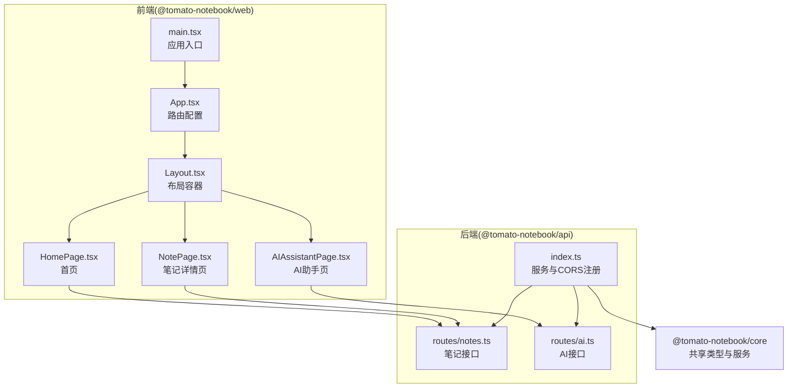
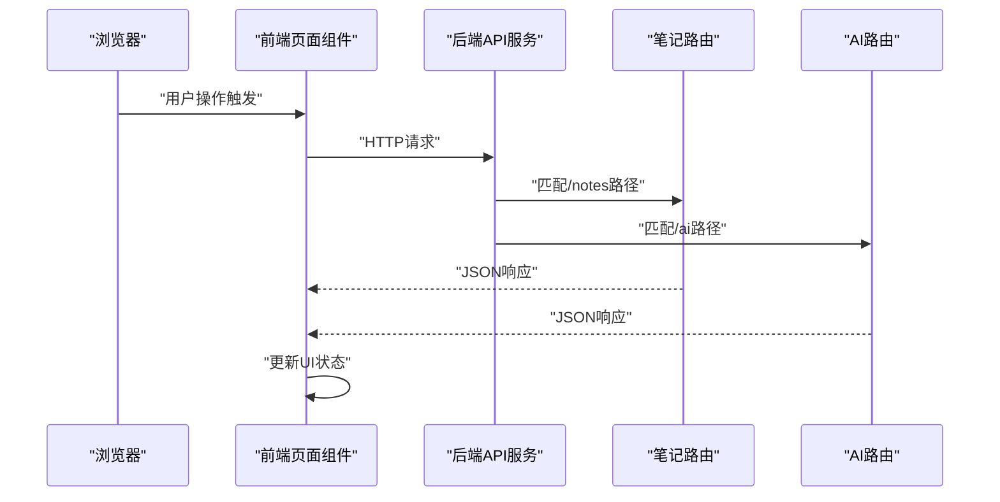
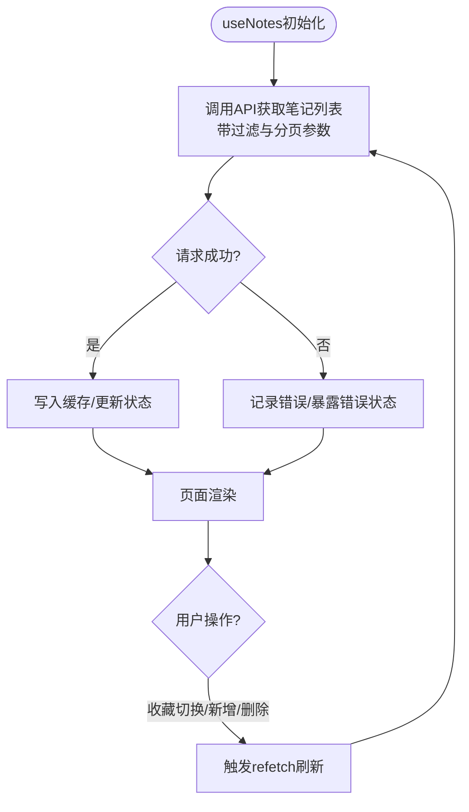
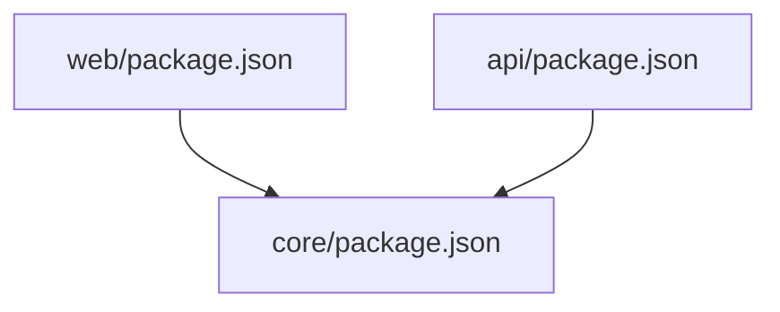

# API集成

<cite>
**本文引用的文件**
- [packages/api/src/index.ts](file://packages/api/src/index.ts)
- [packages/api/src/routes/notes.ts](file://packages/api/src/routes/notes.ts)
- [packages/api/src/routes/ai.ts](file://packages/api/src/routes/ai.ts)
- [packages/web/src/App.tsx](file://packages/web/src/App.tsx)
- [packages/web/src/main.tsx](file://packages/web/src/main.tsx)
- [packages/web/src/pages/HomePage.tsx](file://packages/web/src/pages/HomePage.tsx)
- [packages/web/src/pages/NotePage.tsx](file://packages/web/src/pages/NotePage.tsx)
- [packages/web/src/pages/AIAssistantPage.tsx](file://packages/web/src/pages/AIAssistantPage.tsx)
- [packages/web/src/components/Layout.tsx](file://packages/web/src/components/Layout.tsx)
- [packages/web/package.json](file://packages/web/package.json)
- [packages/api/package.json](file://packages/api/package.json)
- [packages/core/package.json](file://packages/core/package.json)
</cite>

## 目录
1. [简介](#简介)
2. [项目结构](#项目结构)
3. [核心组件](#核心组件)
4. [架构总览](#架构总览)
5. [详细组件分析](#详细组件分析)
6. [依赖分析](#依赖分析)
7. [性能考量](#性能考量)
8. [故障排查指南](#故障排查指南)
9. [结论](#结论)
10. [附录](#附录)

## 简介
本文件面向“番茄笔记”Web前端的API集成，系统性阐述前端与后端API的通信机制、API客户端配置、请求/响应处理、useNotes自定义Hook的实现与使用、数据获取策略与缓存机制、错误处理、最佳实践与性能优化、API版本管理与安全考虑，以及API扩展与新接口集成的指导。文档同时提供多幅基于实际源码映射的架构图与流程图，帮助读者从整体到细节全面理解。

## 项目结构
项目采用多包工作区结构，核心模块包括：
- @tomato-notebook/web：前端应用，基于React + Vite构建，负责UI渲染与API调用。
- @tomato-notebook/api：后端API服务，基于Hono + Node服务器，提供笔记、AI、搜索等接口。
- @tomato-notebook/core：共享核心逻辑与类型定义，被web与api包复用。
- CLI与数据目录：CLI命令用于管理与启动服务，数据目录持久化笔记数据。

前端与后端通过REST风格API交互，前端在页面组件中直接调用统一的API客户端，后端路由按功能划分，支持CORS跨域与健康检查。

图表来源
- [packages/web/src/main.tsx:1-14](file://packages/web/src/main.tsx#L1-L14)
- [packages/web/src/App.tsx:1-20](file://packages/web/src/App.tsx#L1-L20)
- [packages/web/src/components/Layout.tsx:1-52](file://packages/web/src/components/Layout.tsx#L1-L52)
- [packages/web/src/pages/HomePage.tsx:1-218](file://packages/web/src/pages/HomePage.tsx#L1-L218)
- [packages/web/src/pages/NotePage.tsx:1-200](file://packages/web/src/pages/NotePage.tsx#L1-L200)
- [packages/web/src/pages/AIAssistantPage.tsx:1-221](file://packages/web/src/pages/AIAssistantPage.tsx#L1-L221)
- [packages/api/src/index.ts:1-64](file://packages/api/src/index.ts#L1-L64)
- [packages/api/src/routes/notes.ts:1-161](file://packages/api/src/routes/notes.ts#L1-L161)
- [packages/api/src/routes/ai.ts:1-149](file://packages/api/src/routes/ai.ts#L1-L149)

章节来源
- [packages/web/src/main.tsx:1-14](file://packages/web/src/main.tsx#L1-L14)
- [packages/web/src/App.tsx:1-20](file://packages/web/src/App.tsx#L1-L20)
- [packages/api/src/index.ts:1-64](file://packages/api/src/index.ts#L1-L64)

## 核心组件
- 前端应用入口与路由
  - 应用入口负责挂载BrowserRouter与根组件，路由配置了首页、笔记详情与AI助手页面。
- 布局与页面
  - Layout作为主容器，承载Header、Sidebar与右侧AI助手面板；各页面组件负责具体业务交互。
- API客户端与Hook
  - 页面组件通过统一的API客户端进行HTTP调用；useNotes等Hook封装数据获取、状态与刷新逻辑。
- 后端服务与路由
  - 后端通过Hono注册CORS、健康检查与路由；笔记与AI接口分别在独立路由模块中实现。

章节来源
- [packages/web/src/main.tsx:1-14](file://packages/web/src/main.tsx#L1-L14)
- [packages/web/src/App.tsx:1-20](file://packages/web/src/App.tsx#L1-L20)
- [packages/web/src/components/Layout.tsx:1-52](file://packages/web/src/components/Layout.tsx#L1-L52)
- [packages/web/src/pages/HomePage.tsx:1-218](file://packages/web/src/pages/HomePage.tsx#L1-L218)
- [packages/web/src/pages/NotePage.tsx:1-200](file://packages/web/src/pages/NotePage.tsx#L1-L200)
- [packages/web/src/pages/AIAssistantPage.tsx:1-221](file://packages/web/src/pages/AIAssistantPage.tsx#L1-L221)
- [packages/api/src/index.ts:1-64](file://packages/api/src/index.ts#L1-L64)
- [packages/api/src/routes/notes.ts:1-161](file://packages/api/src/routes/notes.ts#L1-L161)
- [packages/api/src/routes/ai.ts:1-149](file://packages/api/src/routes/ai.ts#L1-L149)

## 架构总览
前端与后端通过REST API通信，前端页面组件直接调用API客户端；后端路由按功能拆分，统一由服务入口注册。CORS允许本地开发环境访问，健康检查与状态查询为运维与前端诊断提供基础。

图表来源
- [packages/web/src/pages/HomePage.tsx:1-218](file://packages/web/src/pages/HomePage.tsx#L1-L218)
- [packages/web/src/pages/NotePage.tsx:1-200](file://packages/web/src/pages/NotePage.tsx#L1-L200)
- [packages/web/src/pages/AIAssistantPage.tsx:1-221](file://packages/web/src/pages/AIAssistantPage.tsx#L1-L221)
- [packages/api/src/index.ts:1-64](file://packages/api/src/index.ts#L1-L64)
- [packages/api/src/routes/notes.ts:1-161](file://packages/api/src/routes/notes.ts#L1-L161)
- [packages/api/src/routes/ai.ts:1-149](file://packages/api/src/routes/ai.ts#L1-L149)

## 详细组件分析

### API客户端与请求/响应处理
- 客户端职责
  - 统一封装HTTP请求，提供笔记、AI、搜索等接口方法；对响应进行标准化处理（success字段、错误码映射）。
- 请求拦截与响应处理
  - 建议在客户端层实现拦截器：统一设置Content-Type、处理鉴权头、序列化/反序列化、错误归一化与重试策略。
  - 对后端返回的success字段进行判断，非成功时抛出可识别的错误，便于上层Hook与页面捕获。
- 错误处理
  - 区分网络错误、业务错误与未授权错误；对4xx/5xx进行统一提示与日志上报。
- 数据格式
  - 统一使用JSON；对二进制导出（如笔记导出）使用Response对象与Content-Type/Content-Disposition头部。

章节来源
- [packages/web/src/pages/HomePage.tsx:1-218](file://packages/web/src/pages/HomePage.tsx#L1-L218)
- [packages/web/src/pages/NotePage.tsx:1-200](file://packages/web/src/pages/NotePage.tsx#L1-L200)
- [packages/web/src/pages/AIAssistantPage.tsx:1-221](file://packages/web/src/pages/AIAssistantPage.tsx#L1-L221)
- [packages/api/src/routes/notes.ts:1-161](file://packages/api/src/routes/notes.ts#L1-L161)
- [packages/api/src/routes/ai.ts:1-149](file://packages/api/src/routes/ai.ts#L1-L149)

### useNotes自定义Hook实现与使用
- 设计目标
  - 封装笔记列表、单条笔记、统计信息的数据获取与状态管理；提供refetch刷新能力；简化页面组件的副作用与状态逻辑。
- 典型实现要点
  - 数据获取：根据过滤条件、分页参数调用API客户端；聚合元数据（总数、分页）。
  - 缓存策略：可采用内存缓存或基于查询键的LRU缓存；对热门数据（最近笔记）优先缓存。
  - 错误处理：捕获并暴露错误状态，结合全局通知组件提示用户。
  - 刷新策略：提供refetch函数，支持手动刷新与依赖变更触发。
- 在页面中的使用
  - 首页：useNotes用于展示最近笔记列表与收藏切换；useStats用于显示统计信息。
  - 笔记详情：useNote用于加载指定笔记；编辑保存时调用API客户端并触发刷新。
  - AI助手：通过API客户端发起会话与聊天请求，维护消息历史。

图表来源
- [packages/web/src/pages/HomePage.tsx:1-218](file://packages/web/src/pages/HomePage.tsx#L1-L218)
- [packages/web/src/pages/NotePage.tsx:1-200](file://packages/web/src/pages/NotePage.tsx#L1-L200)

章节来源
- [packages/web/src/pages/HomePage.tsx:1-218](file://packages/web/src/pages/HomePage.tsx#L1-L218)
- [packages/web/src/pages/NotePage.tsx:1-200](file://packages/web/src/pages/NotePage.tsx#L1-L200)

### 数据获取策略、缓存机制与错误处理
- 数据获取策略
  - 首次进入页面时拉取最新数据；对高频操作（收藏、标签增删）采用乐观更新，失败回滚。
  - 分页与过滤：后端支持limit/offset与filter参数，前端按需传递。
- 缓存机制
  - 查询键：组合过滤条件、分页参数与时间戳；命中则返回缓存，否则请求后写入缓存。
  - 过期策略：针对不同数据设定TTL（如最近笔记短期缓存），过期后异步刷新。
  - 内存LRU：限制缓存大小，避免内存膨胀。
- 错误处理
  - 网络异常：提示重试；记录错误日志。
  - 业务错误：解析后端错误信息，友好提示。
  - 未授权：跳转登录或清除本地状态。

章节来源
- [packages/api/src/routes/notes.ts:1-161](file://packages/api/src/routes/notes.ts#L1-L161)
- [packages/web/src/pages/HomePage.tsx:1-218](file://packages/web/src/pages/HomePage.tsx#L1-L218)

### API调用最佳实践与性能优化
- 最佳实践
  - 统一错误处理与重试：对幂等请求（GET/PUT/DELETE）允许自动重试，非幂等请求禁用。
  - 并发控制：限制同一接口并发数，避免风暴效应。
  - 防抖节流：对频繁触发的操作（搜索、滚动加载）使用防抖/节流。
  - 空值与默认值：对可选参数提供默认值，减少分支判断。
- 性能优化
  - 预加载：在路由进入前预取关键数据。
  - 懒加载：大列表分页懒加载，虚拟滚动提升渲染性能。
  - 减少重绘：合理拆分组件，使用memo与浅比较。
  - CDN与静态资源：将静态资源置于CDN，减少首屏阻塞。

### API版本管理、认证与安全
- 版本管理
  - 建议在URL中体现版本号（如/api/v1/notes），保持向后兼容；新增接口先在新版本发布，旧版本保留过渡期。
- 认证与授权
  - 建议引入Bearer Token认证，在请求头中携带Authorization；后端校验签名与有效期。
  - 对敏感操作（删除、批量修改）增加二次确认与审计日志。
- 安全考虑
  - 输入校验：后端严格校验请求体字段类型与长度；前端做基础校验提升体验。
  - CORS：仅允许可信域名；生产环境禁止通配符。
  - 日志脱敏：避免输出敏感字段；错误日志记录上下文但不包含明文凭证。

章节来源
- [packages/api/src/index.ts:20-25](file://packages/api/src/index.ts#L20-L25)
- [packages/api/src/routes/notes.ts:28-44](file://packages/api/src/routes/notes.ts#L28-L44)
- [packages/api/src/routes/ai.ts:82-119](file://packages/api/src/routes/ai.ts#L82-L119)

### API扩展与新接口集成指导
- 新增接口步骤
  - 在后端：创建路由模块，定义HTTP方法、路径与参数；实现业务逻辑并返回统一格式响应。
  - 在前端：在API客户端添加对应方法；在页面中调用；必要时扩展Hook以复用逻辑。
  - 文档与测试：补充接口文档与单元/集成测试。
- 接口命名规范
  - 动词+名词：如POST /api/notes/:id/favorite；GET /api/ai/health。
- 兼容性与迁移
  - 保持现有接口不变；新增字段以可选方式提供；对废弃接口提供迁移指引与过渡期。

章节来源
- [packages/api/src/routes/notes.ts:1-161](file://packages/api/src/routes/notes.ts#L1-L161)
- [packages/api/src/routes/ai.ts:1-149](file://packages/api/src/routes/ai.ts#L1-L149)

## 依赖分析
- 包依赖关系
  - @tomato-notebook/web依赖@tomato-notebook/core；@tomato-notebook/api同样依赖@tomato-notebook/core。
  - 前端运行时依赖React、React Router DOM；后端依赖Hono与Node服务器。
- 外部依赖与集成点
  - Hono提供轻量路由与中间件能力；CORS中间件用于跨域支持。
  - Ollama通过环境变量配置，后端服务封装AI能力。

图表来源
- [packages/web/package.json:1-29](file://packages/web/package.json#L1-L29)
- [packages/api/package.json:1-22](file://packages/api/package.json#L1-L22)
- [packages/core/package.json:1-26](file://packages/core/package.json#L1-L26)

章节来源
- [packages/web/package.json:1-29](file://packages/web/package.json#L1-L29)
- [packages/api/package.json:1-22](file://packages/api/package.json#L1-L22)
- [packages/core/package.json:1-26](file://packages/core/package.json#L1-L26)

## 性能考量
- 网络层面
  - 合理设置超时与重试；对长耗时请求提供加载态与取消能力。
- 前端渲染
  - 列表虚拟化、图片懒加载、CSS/JS分割打包；避免不必要的重渲染。
- 数据层
  - 采用分页与增量更新；对热点数据进行本地缓存与预取。

## 故障排查指南
- 常见问题定位
  - 网络错误：检查CORS配置与代理设置；确认后端服务是否正常启动。
  - 业务错误：查看后端返回的错误字段与状态码；核对请求参数与权限。
  - 前端状态：确认Hook是否正确调用refetch；组件卸载时是否清理副作用。
- 调试建议
  - 打开浏览器开发者工具Network面板，观察请求与响应；在后端开启日志输出。
  - 对关键接口添加埋点与错误上报，便于追踪问题。

章节来源
- [packages/api/src/index.ts:20-25](file://packages/api/src/index.ts#L20-L25)
- [packages/api/src/routes/notes.ts:28-44](file://packages/api/src/routes/notes.ts#L28-L44)
- [packages/api/src/routes/ai.ts:82-119](file://packages/api/src/routes/ai.ts#L82-L119)

## 结论
本项目通过清晰的多包结构与REST API实现了前后端解耦：前端专注于UI与交互，后端专注业务与数据。通过统一的API客户端与Hook封装，提升了开发效率与一致性。建议在现有基础上完善客户端拦截器、缓存与错误处理策略，并加强版本管理与安全加固，以支撑更复杂的业务场景与更高的可靠性要求。

## 附录
- 关键接口概览
  - 笔记接口：列表、创建、详情、更新、删除、收藏切换、标签增删、导出、统计。
  - AI接口：健康检查、总结、润色、翻译、学习建议、通用执行、聊天会话与消息发送。
- 开发与部署建议
  - 前端：使用Vite进行开发与构建，确保TypeScript类型安全；后端使用Bun或Node运行，配合环境变量配置。