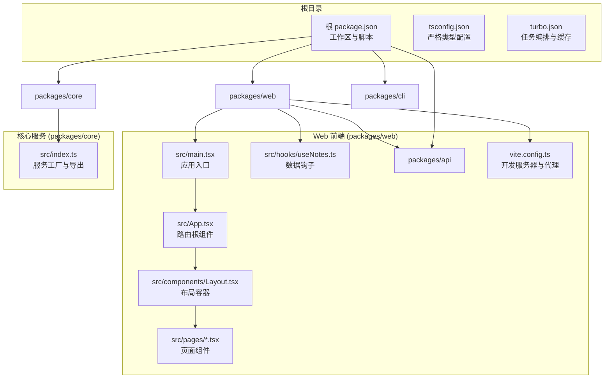
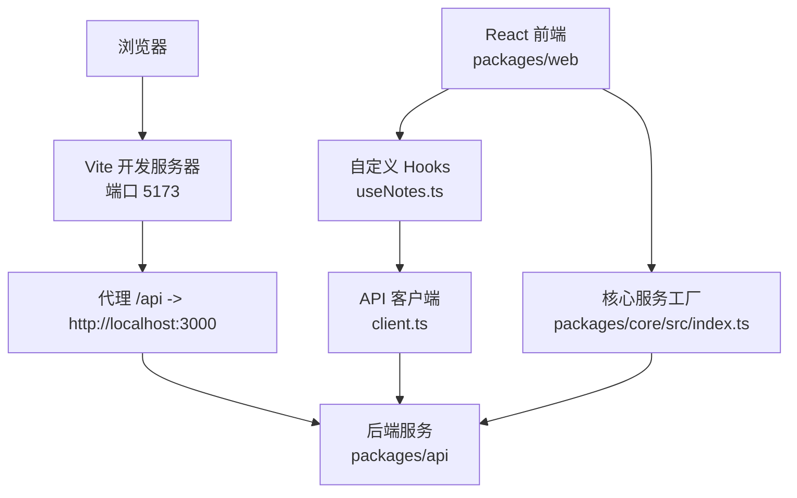
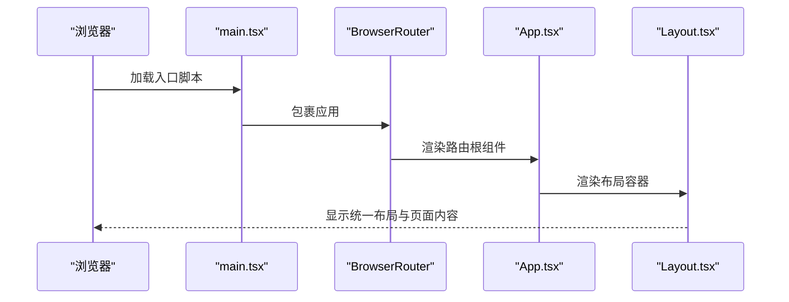
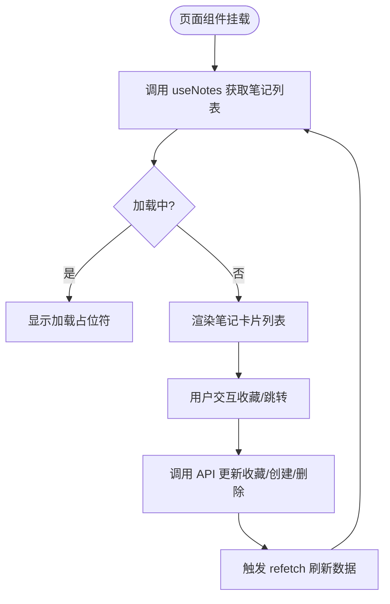
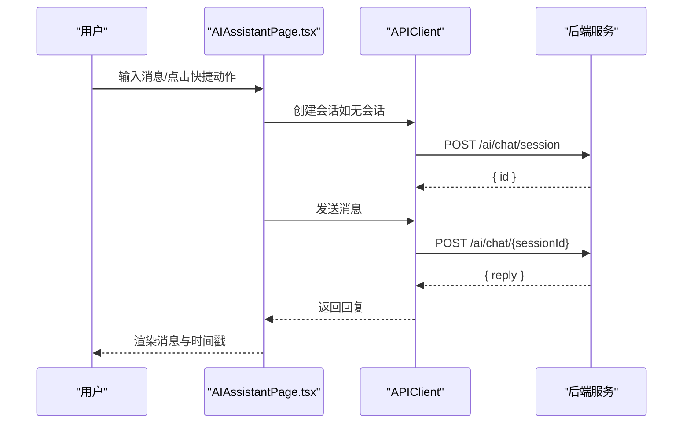
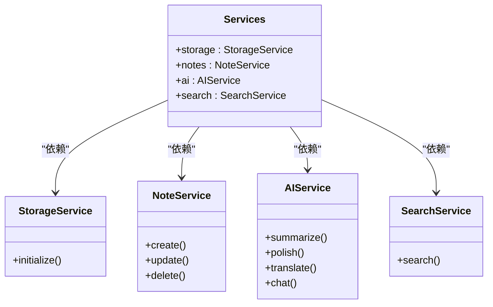
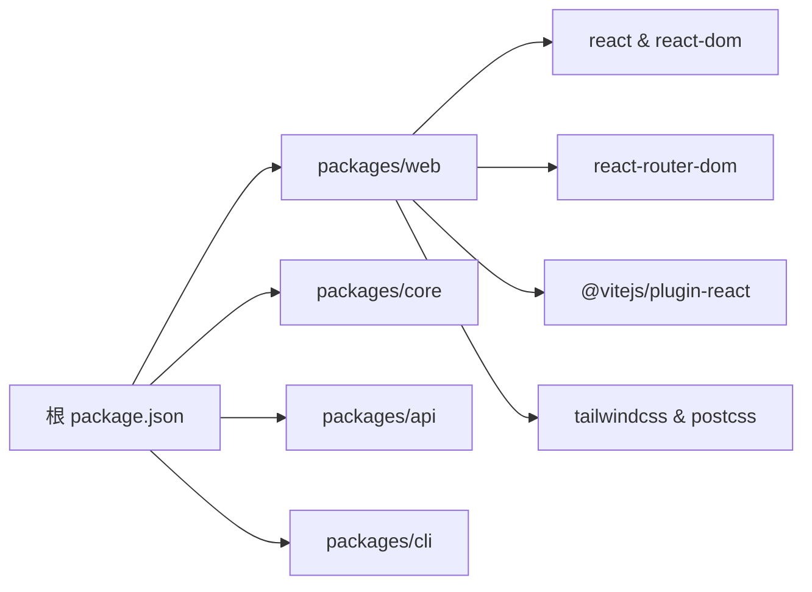

# React应用架构

<cite>
**本文档引用的文件**
- [package.json](file://package.json)
- [tsconfig.json](file://tsconfig.json)
- [turbo.json](file://turbo.json)
- [packages/web/src/main.tsx](file://packages/web/src/main.tsx)
- [packages/web/src/App.tsx](file://packages/web/src/App.tsx)
- [packages/web/vite.config.ts](file://packages/web/vite.config.ts)
- [packages/web/src/components/Layout.tsx](file://packages/web/src/components/Layout.tsx)
- [packages/web/src/hooks/useNotes.ts](file://packages/web/src/hooks/useNotes.ts)
- [packages/web/src/api/client.ts](file://packages/web/src/api/client.ts)
- [packages/web/src/pages/HomePage.tsx](file://packages/web/src/pages/HomePage.tsx)
- [packages/web/src/pages/NotePage.tsx](file://packages/web/src/pages/NotePage.tsx)
- [packages/web/src/pages/AIAssistantPage.tsx](file://packages/web/src/pages/AIAssistantPage.ts)
- [packages/core/src/index.ts](file://packages/core/src/index.ts)
</cite>

## 目录
1. [简介](#简介)
2. [项目结构](#项目结构)
3. [核心组件](#核心组件)
4. [架构总览](#架构总览)
5. [详细组件分析](#详细组件分析)
6. [依赖关系分析](#依赖关系分析)
7. [性能考虑](#性能考虑)
8. [故障排除指南](#故障排除指南)
9. [结论](#结论)

## 简介
本项目是一个基于 React 的番茄笔记应用，采用多包工作区架构（monorepo），通过 Vite 进行开发与构建，使用 TypeScript 提供类型安全，并通过 Turbo 实现跨包的缓存与任务编排。应用前端位于 packages/web，核心业务逻辑与服务封装在 packages/core，API 层与 CLI 工具分别位于 packages/api 与 packages/cli。

该应用围绕“笔记管理 + AI 辅助”的场景展开，提供首页、笔记详情页与 AI 助手聊天页三大页面，配合统一的布局组件与自定义 Hooks 实现数据获取、搜索、收藏与统计等功能。整体架构强调模块化、可扩展性与开发体验。

## 项目结构
项目采用 Turborepo 管理多包工作区，根目录通过脚本统一执行开发、构建、测试与格式化任务；TypeScript 配置确保严格的类型检查与声明文件输出；Vite 作为前端构建工具，提供快速热重载与代理能力。

**图表来源**
- [package.json:1-25](file://package.json#L1-L25)
- [tsconfig.json:1-22](file://tsconfig.json#L1-L22)
- [turbo.json:1-23](file://turbo.json#L1-L23)
- [packages/web/src/main.tsx:1-14](file://packages/web/src/main.tsx#L1-L14)
- [packages/web/src/App.tsx:1-20](file://packages/web/src/App.tsx#L1-L20)
- [packages/web/src/components/Layout.tsx:1-52](file://packages/web/src/components/Layout.tsx#L1-L52)
- [packages/web/vite.config.ts:1-19](file://packages/web/vite.config.ts#L1-L19)
- [packages/core/src/index.ts:1-50](file://packages/core/src/index.ts#L1-L50)

**章节来源**
- [package.json:1-25](file://package.json#L1-L25)
- [tsconfig.json:1-22](file://tsconfig.json#L1-L22)
- [turbo.json:1-23](file://turbo.json#L1-L23)

## 核心组件
- 应用入口与初始化
  - 入口文件负责挂载 React 根节点、启用路由与样式导入，确保应用在浏览器中正确渲染。
  - 路由根组件定义页面级路由与嵌套路由，实现首页、笔记详情与 AI 助手页面的切换。
- 布局与页面
  - 布局组件提供统一的头部、侧边栏、主内容区与底部状态栏，支持右侧 AI 助手面板。
  - 页面组件负责具体业务逻辑：首页展示笔记列表与统计信息、笔记页支持编辑与删除、AI 助手页提供聊天交互。
- 数据层与 Hooks
  - API 客户端封装统一的请求方法与响应结构，便于错误处理与类型约束。
  - 自定义 Hooks 将数据获取、搜索、收藏与统计逻辑抽象为可复用的 Hook，简化页面组件职责。
- 构建与开发配置
  - Vite 配置启用 React 插件、本地开发端口与 API 代理，便于前后端联调。
  - TypeScript 配置启用严格模式、声明文件输出与 Source Map，提升开发与调试体验。

**章节来源**
- [packages/web/src/main.tsx:1-14](file://packages/web/src/main.tsx#L1-L14)
- [packages/web/src/App.tsx:1-20](file://packages/web/src/App.tsx#L1-L20)
- [packages/web/src/components/Layout.tsx:1-52](file://packages/web/src/components/Layout.tsx#L1-L52)
- [packages/web/src/hooks/useNotes.ts:1-125](file://packages/web/src/hooks/useNotes.ts#L1-L125)
- [packages/web/src/api/client.ts:1-138](file://packages/web/src/api/client.ts#L1-L138)
- [packages/web/vite.config.ts:1-19](file://packages/web/vite.config.ts#L1-L19)
- [tsconfig.json:1-22](file://tsconfig.json#L1-L22)

## 架构总览
应用采用分层架构：UI 层（页面与组件）、数据层（Hooks 与 API 客户端）、服务层（核心服务工厂）。前端通过 Vite 开发服务器启动，利用代理将 /api 请求转发至后端服务；TypeScript 提供类型安全保障；Turbo 管理多包构建与缓存。

**图表来源**
- [packages/web/vite.config.ts:6-14](file://packages/web/vite.config.ts#L6-L14)
- [packages/web/src/api/client.ts:1-138](file://packages/web/src/api/client.ts#L1-L138)
- [packages/core/src/index.ts:25-49](file://packages/core/src/index.ts#L25-L49)

## 详细组件分析

### 应用初始化流程
应用从入口文件开始，创建根节点并包裹路由上下文，随后渲染路由根组件。路由根组件定义页面级路由，嵌套布局组件以提供统一的页面骨架。

**图表来源**
- [packages/web/src/main.tsx:7-13](file://packages/web/src/main.tsx#L7-L13)
- [packages/web/src/App.tsx:7-16](file://packages/web/src/App.tsx#L7-L16)
- [packages/web/src/components/Layout.tsx:6-24](file://packages/web/src/components/Layout.tsx#L6-L24)

**章节来源**
- [packages/web/src/main.tsx:1-14](file://packages/web/src/main.tsx#L1-L14)
- [packages/web/src/App.tsx:1-20](file://packages/web/src/App.tsx#L1-L20)
- [packages/web/src/components/Layout.tsx:1-52](file://packages/web/src/components/Layout.tsx#L1-L52)

### 数据流与状态管理
应用未引入集中式状态库，而是通过 React Hooks 与自定义 Hook 管理局部状态与数据获取。API 客户端统一处理网络请求与错误返回，页面组件通过 Hook 与回调函数更新 UI。

**图表来源**
- [packages/web/src/hooks/useNotes.ts:5-27](file://packages/web/src/hooks/useNotes.ts#L5-L27)
- [packages/web/src/pages/HomePage.tsx:6-31](file://packages/web/src/pages/HomePage.tsx#L6-L31)
- [packages/web/src/api/client.ts:48-72](file://packages/web/src/api/client.ts#L48-L72)

**章节来源**
- [packages/web/src/hooks/useNotes.ts:1-125](file://packages/web/src/hooks/useNotes.ts#L1-L125)
- [packages/web/src/pages/HomePage.tsx:1-218](file://packages/web/src/pages/HomePage.tsx#L1-L218)
- [packages/web/src/api/client.ts:1-138](file://packages/web/src/api/client.ts#L1-L138)

### AI 助手聊天流程
AI 助手页面支持快捷动作与用户输入，自动创建会话并在发送消息时调用后端接口获取回复，同时滚动到最新消息。

**图表来源**
- [packages/web/src/pages/AIAssistantPage.tsx:26-74](file://packages/web/src/pages/AIAssistantPage.tsx#L26-L74)
- [packages/web/src/api/client.ts:113-125](file://packages/web/src/api/client.ts#L113-L125)

**章节来源**
- [packages/web/src/pages/AIAssistantPage.tsx:1-221](file://packages/web/src/pages/AIAssistantPage.tsx#L1-L221)
- [packages/web/src/api/client.ts:93-130](file://packages/web/src/api/client.ts#L93-L130)

### 服务工厂与依赖注入
核心服务通过工厂函数集中创建与初始化，支持存储、笔记、AI 与搜索服务的组合，便于在不同运行环境（Web/CLI）中注入配置与依赖。

**图表来源**
- [packages/core/src/index.ts:18-49](file://packages/core/src/index.ts#L18-L49)

**章节来源**
- [packages/core/src/index.ts:1-50](file://packages/core/src/index.ts#L1-L50)

## 依赖关系分析
- 包依赖
  - 根 package.json 定义工作区与脚本，统一执行 dev/build/lint/test/clean/format。
  - 各包独立维护自身依赖与构建配置，通过 Turbo 实现跨包依赖与缓存。
- 前端依赖
  - React 生态（React、React DOM、React Router）构成 UI 基础。
  - Vite 与 @vitejs/plugin-react 提供开发与构建能力。
  - Tailwind CSS 与 PostCSS 用于样式工程化。
- 类型与构建
  - TypeScript 严格模式与声明文件输出，结合 Source Map 提升调试体验。
  - Turbo 任务配置确保构建顺序与缓存命中率。

**图表来源**
- [package.json:5-7](file://package.json#L5-L7)
- [packages/web/vite.config.ts:2](file://packages/web/vite.config.ts#L2)
- [packages/web/src/main.tsx:1-5](file://packages/web/src/main.tsx#L1-L5)

**章节来源**
- [package.json:1-25](file://package.json#L1-L25)
- [turbo.json:1-23](file://turbo.json#L1-L23)

## 性能考虑
- 开发体验
  - Vite 提供快速冷启动与热重载，减少等待时间；代理配置降低跨域与联调成本。
  - TypeScript 严格模式与声明文件输出有助于早期发现类型问题，减少运行时错误。
- 构建优化
  - 通过 Turbo 的任务缓存与增量构建，加速重复构建过程。
  - 在生产构建中可进一步启用代码分割、Tree Shaking 与压缩（建议在 Vite 配置中按需开启）。
- 数据访问
  - Hooks 中对请求结果进行缓存与去抖（如搜索），避免频繁网络请求。
  - 错误处理统一返回结构，便于 UI 快速降级与提示。

[本节为通用性能建议，不直接分析具体文件，故无需列出章节来源]

## 故障排除指南
- 开发服务器无法访问
  - 检查 Vite 配置中的端口是否被占用；确认代理目标地址与端口正确。
- API 请求失败
  - 确认代理已正确转发 /api 请求；检查后端服务是否启动。
  - 查看 API 客户端的统一错误返回结构，定位具体错误信息。
- TypeScript 类型报错
  - 按 tsconfig.json 的严格配置修正类型；确保新增字段或接口有明确类型定义。
- Turbo 缓存问题
  - 执行清理命令后重新构建，确保缓存一致性。

**章节来源**
- [packages/web/vite.config.ts:6-14](file://packages/web/vite.config.ts#L6-L14)
- [packages/web/src/api/client.ts:29-45](file://packages/web/src/api/client.ts#L29-L45)
- [tsconfig.json:7-18](file://tsconfig.json#L7-L18)
- [turbo.json:18-20](file://turbo.json#L18-L20)

## 结论
该 React 应用采用清晰的分层架构与模块化组织，结合 Vite、TypeScript 与 Turbo，实现了良好的开发体验与可维护性。前端通过自定义 Hooks 与 API 客户端解耦数据访问，核心服务通过工厂函数实现依赖注入与可扩展性。后续可在生产构建中引入更多优化策略（如代码分割与资源压缩），并在 UI 层引入集中式状态管理以应对更复杂的交互场景。