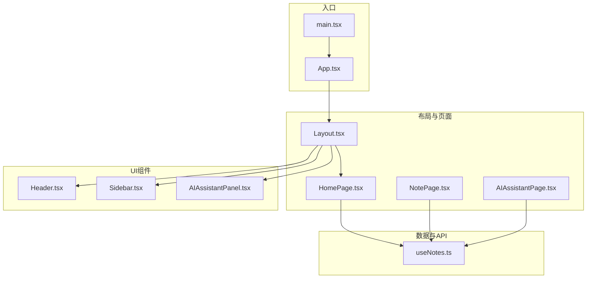
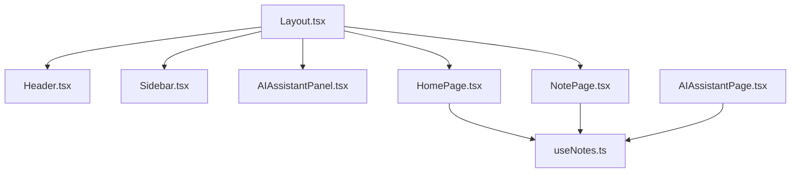
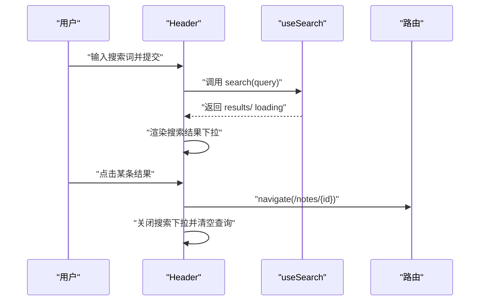
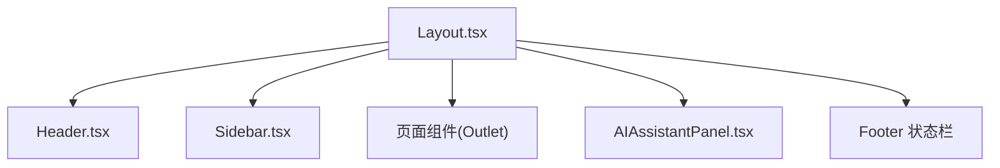
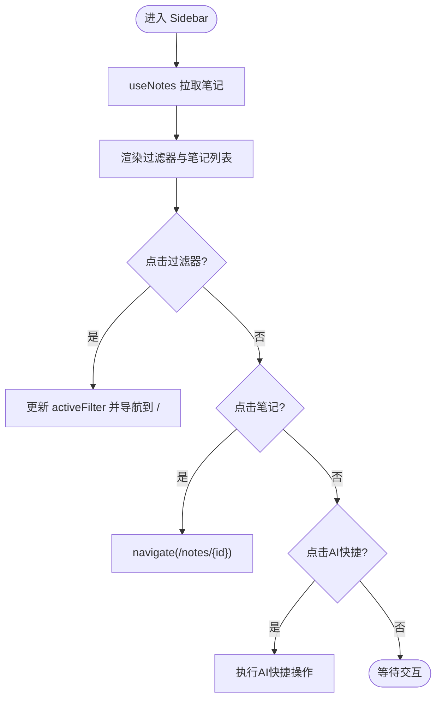
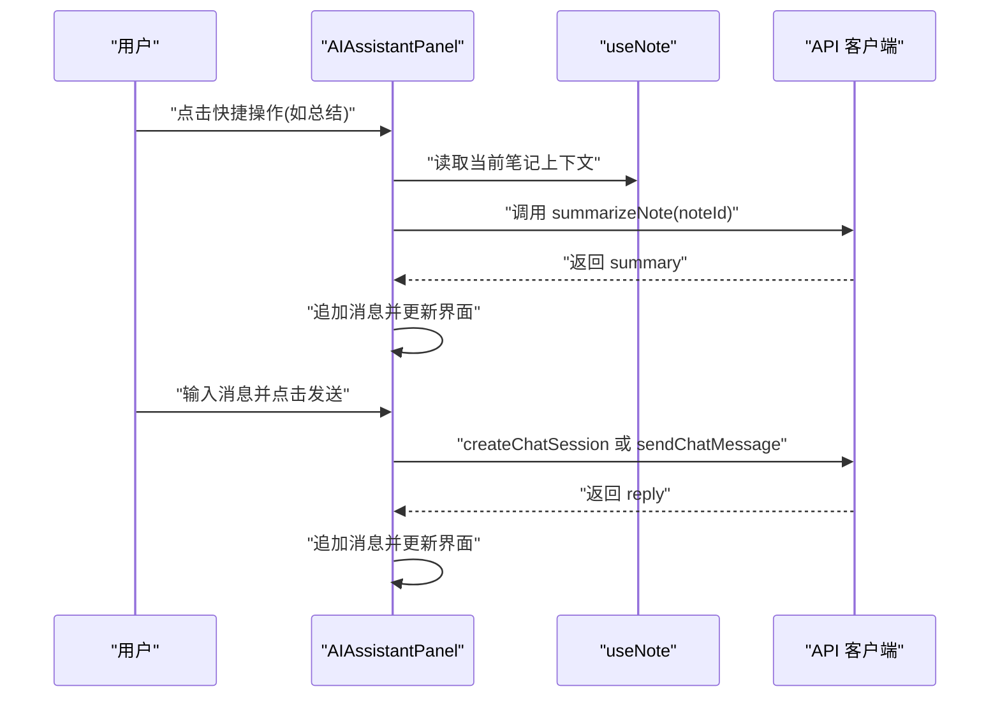
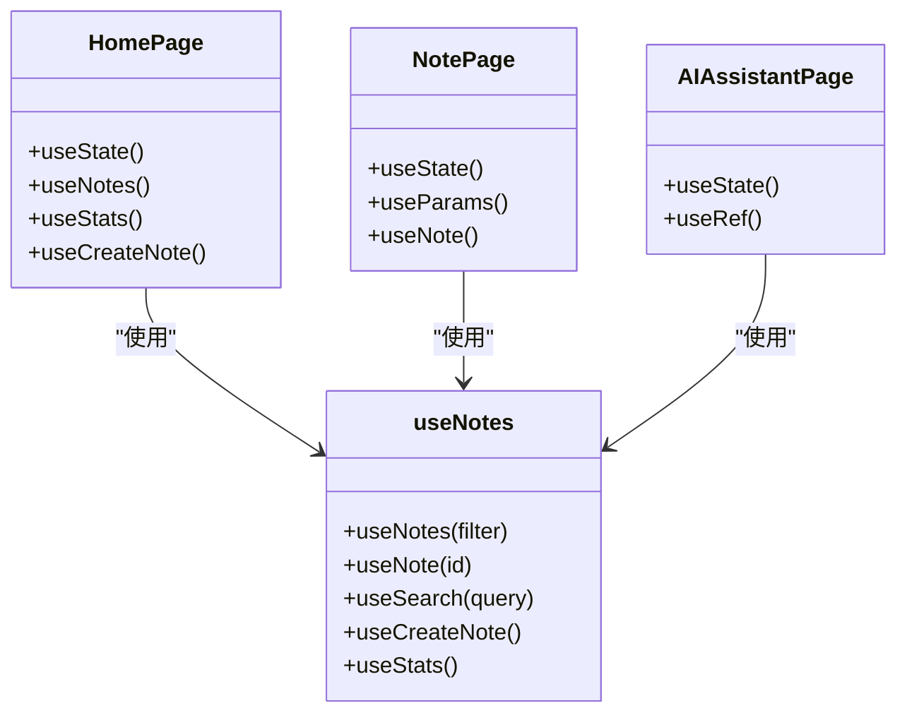
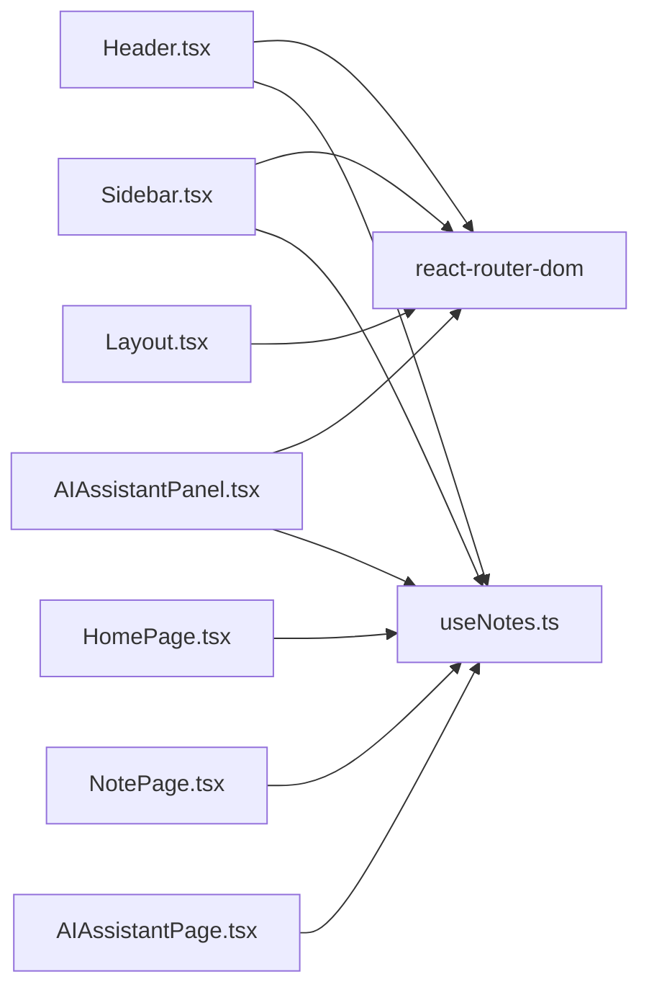

# UI组件系统

<cite>
**本文引用的文件**
- [packages/web/src/components/Header.tsx](file://packages/web/src/components/Header.tsx)
- [packages/web/src/components/Layout.tsx](file://packages/web/src/components/Layout.tsx)
- [packages/web/src/components/Sidebar.tsx](file://packages/web/src/components/Sidebar.tsx)
- [packages/web/src/components/AIAssistantPanel.tsx](file://packages/web/src/components/AIAssistantPanel.tsx)
- [packages/web/src/hooks/useNotes.ts](file://packages/web/src/hooks/useNotes.ts)
- [packages/web/src/pages/HomePage.tsx](file://packages/web/src/pages/HomePage.tsx)
- [packages/web/src/pages/NotePage.tsx](file://packages/web/src/pages/NotePage.tsx)
- [packages/web/src/pages/AIAssistantPage.tsx](file://packages/web/src/pages/AIAssistantPage.tsx)
- [packages/web/src/App.tsx](file://packages/web/src/App.tsx)
- [packages/web/src/main.tsx](file://packages/web/src/main.tsx)
</cite>

## 目录
1. [简介](#简介)
2. [项目结构](#项目结构)
3. [核心组件](#核心组件)
4. [架构总览](#架构总览)
5. [详细组件分析](#详细组件分析)
6. [依赖分析](#依赖分析)
7. [性能考虑](#性能考虑)
8. [故障排查指南](#故障排查指南)
9. [结论](#结论)
10. [附录](#附录)

## 简介
本文件系统性梳理番茄笔记的UI组件体系，聚焦四大核心组件：Header头部组件、Layout布局组件、Sidebar侧边栏组件与AIAssistantPanel智能助手面板。文档从组件职责、props接口、状态管理、事件处理、组件间通信与数据流、样式系统与主题定制、使用示例与最佳实践、扩展与二次开发等方面进行深入解析，并辅以多种Mermaid图示帮助理解。

## 项目结构
前端应用位于 packages/web，采用React + TypeScript + Tailwind CSS技术栈，路由基于react-router-dom。UI组件集中在 src/components，页面组件在 src/pages，全局状态通过自研hooks封装在 src/hooks 中，入口在 src/main.tsx 和 src/App.tsx。

图表来源
- [packages/web/src/main.tsx:1-14](file://packages/web/src/main.tsx#L1-L14)
- [packages/web/src/App.tsx:1-20](file://packages/web/src/App.tsx#L1-L20)
- [packages/web/src/components/Layout.tsx:1-52](file://packages/web/src/components/Layout.tsx#L1-L52)
- [packages/web/src/components/Header.tsx:1-102](file://packages/web/src/components/Header.tsx#L1-L102)
- [packages/web/src/components/Sidebar.tsx:1-156](file://packages/web/src/components/Sidebar.tsx#L1-L156)
- [packages/web/src/components/AIAssistantPanel.tsx:1-187](file://packages/web/src/components/AIAssistantPanel.tsx#L1-L187)
- [packages/web/src/hooks/useNotes.ts:1-125](file://packages/web/src/hooks/useNotes.ts#L1-L125)

章节来源
- [packages/web/src/main.tsx:1-14](file://packages/web/src/main.tsx#L1-L14)
- [packages/web/src/App.tsx:1-20](file://packages/web/src/App.tsx#L1-L20)

## 核心组件
- Header：提供应用Logo、全局搜索、通知与用户头像等入口，内置搜索下拉结果展示与外部点击关闭逻辑。
- Layout：应用主框架，组合Header、Sidebar、主内容区与底部状态栏；负责将页面组件渲染到Outlet中。
- Sidebar：左侧导航与笔记列表，支持过滤器切换、笔记跳转、AI快捷入口等。
- AIAssistantPanel：右侧AI助手面板，支持快捷操作（总结、润色、建议、翻译）与聊天对话，维护消息历史与会话状态。

章节来源
- [packages/web/src/components/Header.tsx:1-102](file://packages/web/src/components/Header.tsx#L1-L102)
- [packages/web/src/components/Layout.tsx:1-52](file://packages/web/src/components/Layout.tsx#L1-L52)
- [packages/web/src/components/Sidebar.tsx:1-156](file://packages/web/src/components/Sidebar.tsx#L1-L156)
- [packages/web/src/components/AIAssistantPanel.tsx:1-187](file://packages/web/src/components/AIAssistantPanel.tsx#L1-L187)

## 架构总览
整体采用“布局容器 + 页面组件 + UI组件 + 数据钩子”的分层架构。Layout作为根容器承载Header与Sidebar，主内容区通过Outlet挂载页面组件；AIAssistantPanel独立于Layout右侧，但与页面组件共享数据钩子与API客户端。

图表来源
- [packages/web/src/components/Layout.tsx:1-52](file://packages/web/src/components/Layout.tsx#L1-L52)
- [packages/web/src/components/Header.tsx:1-102](file://packages/web/src/components/Header.tsx#L1-L102)
- [packages/web/src/components/Sidebar.tsx:1-156](file://packages/web/src/components/Sidebar.tsx#L1-L156)
- [packages/web/src/components/AIAssistantPanel.tsx:1-187](file://packages/web/src/components/AIAssistantPanel.tsx#L1-L187)
- [packages/web/src/pages/HomePage.tsx:1-218](file://packages/web/src/pages/HomePage.tsx#L1-L218)
- [packages/web/src/pages/NotePage.tsx:1-200](file://packages/web/src/pages/NotePage.tsx#L1-L200)
- [packages/web/src/pages/AIAssistantPage.tsx:1-221](file://packages/web/src/pages/AIAssistantPage.tsx#L1-L221)
- [packages/web/src/hooks/useNotes.ts:1-125](file://packages/web/src/hooks/useNotes.ts#L1-L125)

## 详细组件分析

### Header 组件
- 职责
  - 展示Logo与应用名称
  - 提供全局搜索表单，支持输入、提交与结果下拉
  - 结果下拉支持点击跳转至笔记详情
  - 支持外部点击关闭搜索结果
- 状态管理
  - 搜索开关、查询词、搜索结果集、加载状态
  - 通过自定义hook useSearch提供搜索能力
- 事件处理
  - 表单提交触发搜索
  - 结果项点击触发路由跳转并清空搜索态
- Props
  - 无对外props，内部通过路由与hook完成交互
- 样式与主题
  - 使用Tailwind类名控制尺寸、颜色与层级
  - 深色背景与白色文字，强调对比度
- 与其他组件关系
  - 与Layout同级，被Layout直接渲染
  - 与Sidebar、AIAssistantPanel通过路由与状态解耦

图表来源
- [packages/web/src/components/Header.tsx:1-102](file://packages/web/src/components/Header.tsx#L1-L102)
- [packages/web/src/hooks/useNotes.ts:56-80](file://packages/web/src/hooks/useNotes.ts#L56-L80)

章节来源
- [packages/web/src/components/Header.tsx:1-102](file://packages/web/src/components/Header.tsx#L1-L102)
- [packages/web/src/hooks/useNotes.ts:56-80](file://packages/web/src/hooks/useNotes.ts#L56-L80)

### Layout 组件
- 职责
  - 定义全屏布局骨架：顶部Header、中间主体（左侧Sidebar、主内容区、右侧AIAssistantPanel）、底部状态栏
  - 通过Outlet承载页面组件
- Props
  - 无对外props
- 样式与主题
  - Flex布局与高度约束，统一背景色与边框
- 与其他组件关系
  - 直接组合Header、Sidebar、AIAssistantPanel
  - 作为页面路由的父容器

图表来源
- [packages/web/src/components/Layout.tsx:1-52](file://packages/web/src/components/Layout.tsx#L1-L52)

章节来源
- [packages/web/src/components/Layout.tsx:1-52](file://packages/web/src/components/Layout.tsx#L1-L52)

### Sidebar 组件
- 职责
  - 提供导航与过滤：全部/AI生成/最近/收藏
  - 展示笔记列表，支持跳转与收藏切换
  - 提供AI快捷入口（快速总结、智能建议等）
- 状态管理
  - 当前激活过滤器、笔记列表、加载状态
  - 通过useNotes按过滤条件拉取数据
- 事件处理
  - 切换过滤器时更新状态并确保回到首页
  - 点击笔记项跳转详情页
- Props
  - 无对外props
- 样式与主题
  - 固定宽度侧栏，深浅对比色系，hover高亮
- 与其他组件关系
  - 与Layout同级，被Layout包裹
  - 与Header、AIAssistantPanel通过路由与状态解耦

图表来源
- [packages/web/src/components/Sidebar.tsx:1-156](file://packages/web/src/components/Sidebar.tsx#L1-L156)
- [packages/web/src/hooks/useNotes.ts:1-27](file://packages/web/src/hooks/useNotes.ts#L1-L27)

章节来源
- [packages/web/src/components/Sidebar.tsx:1-156](file://packages/web/src/components/Sidebar.tsx#L1-L156)
- [packages/web/src/hooks/useNotes.ts:1-27](file://packages/web/src/hooks/useNotes.ts#L1-L27)

### AIAssistantPanel 组件
- 职责
  - 右侧AI助手面板，绑定当前笔记上下文
  - 支持快捷操作：总结、润色、建议、翻译
  - 支持实时聊天：创建会话、发送消息、显示消息历史
- 状态管理
  - 输入框内容、消息数组、加载状态、会话ID
  - 通过useNote获取当前笔记上下文
- 事件处理
  - 快捷操作触发API请求并追加AI回复
  - 发送按钮与回车键触发消息发送
- Props
  - 无对外props
- 样式与主题
  - 固定宽度侧栏，消息气泡左右对齐，加载态指示
- 与其他组件关系
  - 仅在笔记详情页生效（由路由参数驱动）
  - 与Sidebar、Header通过路由与状态解耦

图表来源
- [packages/web/src/components/AIAssistantPanel.tsx:1-187](file://packages/web/src/components/AIAssistantPanel.tsx#L1-L187)
- [packages/web/src/hooks/useNotes.ts:29-54](file://packages/web/src/hooks/useNotes.ts#L29-L54)

章节来源
- [packages/web/src/components/AIAssistantPanel.tsx:1-187](file://packages/web/src/components/AIAssistantPanel.tsx#L1-L187)
- [packages/web/src/hooks/useNotes.ts:29-54](file://packages/web/src/hooks/useNotes.ts#L29-L54)

### 页面组件与数据钩子
- HomePage
  - 展示统计卡片与最近笔记网格
  - 支持新建笔记弹窗、收藏切换、时间格式化
  - 通过useNotes与useStats获取数据
- NotePage
  - 展示笔记详情，支持编辑/保存/删除/收藏
  - 通过useNote获取当前笔记
- AIAssistantPage
  - 独立的AI聊天页面，支持快捷提示与消息滚动
  - 自行维护会话与消息历史
- useNotes
  - 封装笔记列表、单个笔记、搜索、创建、统计等数据逻辑
  - 提供refetch与loading/error状态

图表来源
- [packages/web/src/pages/HomePage.tsx:1-218](file://packages/web/src/pages/HomePage.tsx#L1-L218)
- [packages/web/src/pages/NotePage.tsx:1-200](file://packages/web/src/pages/NotePage.tsx#L1-L200)
- [packages/web/src/pages/AIAssistantPage.tsx:1-221](file://packages/web/src/pages/AIAssistantPage.tsx#L1-L221)
- [packages/web/src/hooks/useNotes.ts:1-125](file://packages/web/src/hooks/useNotes.ts#L1-L125)

章节来源
- [packages/web/src/pages/HomePage.tsx:1-218](file://packages/web/src/pages/HomePage.tsx#L1-L218)
- [packages/web/src/pages/NotePage.tsx:1-200](file://packages/web/src/pages/NotePage.tsx#L1-L200)
- [packages/web/src/pages/AIAssistantPage.tsx:1-221](file://packages/web/src/pages/AIAssistantPage.tsx#L1-L221)
- [packages/web/src/hooks/useNotes.ts:1-125](file://packages/web/src/hooks/useNotes.ts#L1-L125)

## 依赖分析
- 组件内聚与耦合
  - Header与Sidebar、AIAssistantPanel均不直接依赖彼此，通过路由与状态解耦
  - Layout作为容器，聚合多个UI组件，承担布局职责
- 外部依赖
  - react-router-dom：路由与导航
  - 自定义hooks：useNotes、useSearch、useNote等封装数据访问
- 潜在循环依赖
  - 未发现组件间循环导入；页面组件通过hooks间接依赖API客户端

图表来源
- [packages/web/src/components/Header.tsx:1-102](file://packages/web/src/components/Header.tsx#L1-L102)
- [packages/web/src/components/Sidebar.tsx:1-156](file://packages/web/src/components/Sidebar.tsx#L1-L156)
- [packages/web/src/components/AIAssistantPanel.tsx:1-187](file://packages/web/src/components/AIAssistantPanel.tsx#L1-L187)
- [packages/web/src/components/Layout.tsx:1-52](file://packages/web/src/components/Layout.tsx#L1-L52)
- [packages/web/src/hooks/useNotes.ts:1-125](file://packages/web/src/hooks/useNotes.ts#L1-L125)
- [packages/web/src/pages/HomePage.tsx:1-218](file://packages/web/src/pages/HomePage.tsx#L1-L218)
- [packages/web/src/pages/NotePage.tsx:1-200](file://packages/web/src/pages/NotePage.tsx#L1-L200)
- [packages/web/src/pages/AIAssistantPage.tsx:1-221](file://packages/web/src/pages/AIAssistantPage.tsx#L1-L221)

章节来源
- [packages/web/src/components/Header.tsx:1-102](file://packages/web/src/components/Header.tsx#L1-L102)
- [packages/web/src/components/Sidebar.tsx:1-156](file://packages/web/src/components/Sidebar.tsx#L1-L156)
- [packages/web/src/components/AIAssistantPanel.tsx:1-187](file://packages/web/src/components/AIAssistantPanel.tsx#L1-L187)
- [packages/web/src/components/Layout.tsx:1-52](file://packages/web/src/components/Layout.tsx#L1-L52)
- [packages/web/src/hooks/useNotes.ts:1-125](file://packages/web/src/hooks/useNotes.ts#L1-L125)

## 性能考虑
- 列表渲染优化
  - 使用key稳定列表项，避免重复渲染
  - 加载态采用骨架屏动画，提升感知性能
- 状态最小化
  - 合理拆分组件状态，避免不必要的重渲染
- 请求去抖与节流
  - 搜索建议可引入防抖策略，减少频繁请求
- 图片与长文本
  - 长文本截断与懒加载策略可进一步优化首屏
- 会话复用
  - AI聊天面板已实现会话ID缓存，避免重复创建

## 故障排查指南
- 搜索无结果
  - 检查useSearch返回的results与loading状态是否正确更新
  - 确认API返回结构与错误字段
- 笔记为空或加载异常
  - 检查useNote的id参数与API响应
  - 确认路由参数与页面渲染顺序
- AI助手无响应
  - 检查会话创建与消息发送流程
  - 确认API客户端可用性与网络状态
- 样式异常
  - 检查Tailwind类名拼写与冲突
  - 确认主题色变量与暗色模式适配

章节来源
- [packages/web/src/hooks/useNotes.ts:56-80](file://packages/web/src/hooks/useNotes.ts#L56-L80)
- [packages/web/src/pages/NotePage.tsx:1-200](file://packages/web/src/pages/NotePage.tsx#L1-L200)
- [packages/web/src/components/AIAssistantPanel.tsx:1-187](file://packages/web/src/components/AIAssistantPanel.tsx#L1-L187)

## 结论
该UI组件系统以Layout为核心容器，Header、Sidebar、AIAssistantPanel各司其职，配合自研hooks实现数据访问与状态管理。组件间通过路由与状态解耦，具备良好的可维护性与扩展性。Tailwind CSS提供一致的样式体系，便于主题定制与响应式适配。

## 附录

### 组件使用示例与最佳实践
- 在页面中使用
  - 将页面组件作为Layout的子路由渲染，即可自动获得Header、Sidebar与AIAssistantPanel
- 自定义选项
  - 可通过修改Tailwind类名调整尺寸、颜色与间距
  - 可在Sidebar中新增过滤器或导航项
  - 可在AIAssistantPanel中扩展快捷操作与消息类型
- 最佳实践
  - 保持组件单一职责，避免跨组件状态共享
  - 使用hooks封装数据逻辑，提高复用性
  - 对长列表与复杂交互添加加载态与错误态

### 扩展与二次开发指导
- 新增页面
  - 在App路由中注册新路由，页面组件将自动嵌入Layout
- 新增UI组件
  - 如需加入Header/Sidebar，优先考虑通过路由或状态驱动
  - 如需独立面板，可参考AIAssistantPanel的会话与消息管理模式
- 样式与主题
  - 建议集中管理颜色变量与尺寸变量，避免分散硬编码
  - 为暗色模式提供对应类名映射，保证一致性