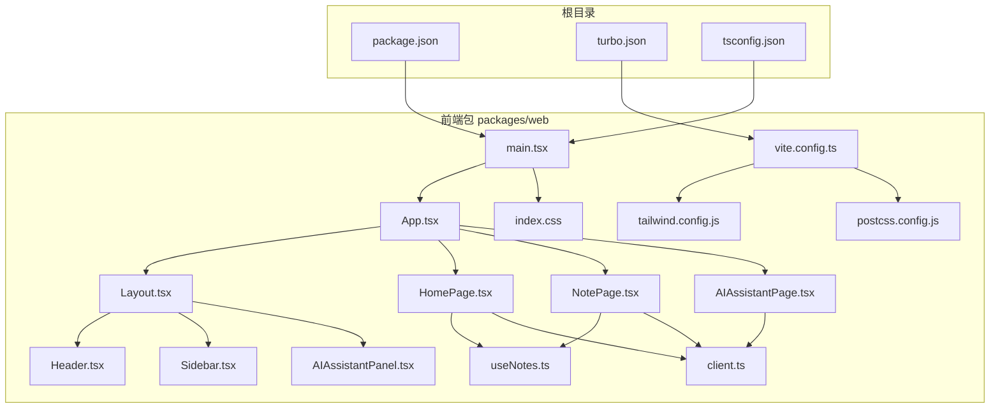
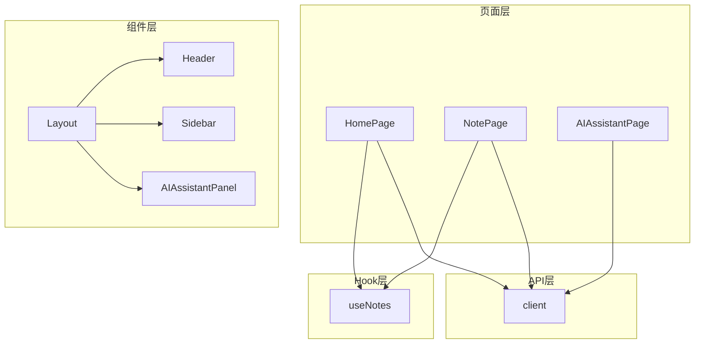
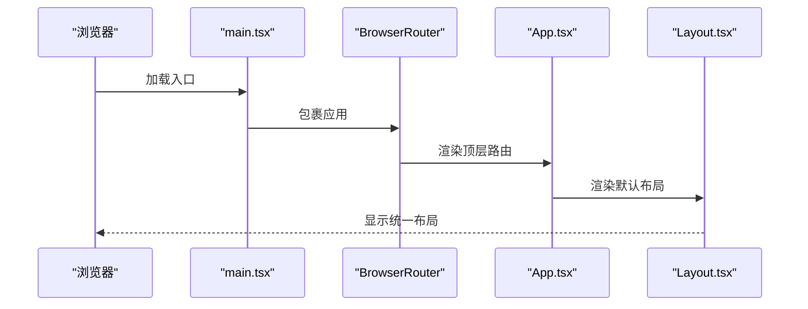
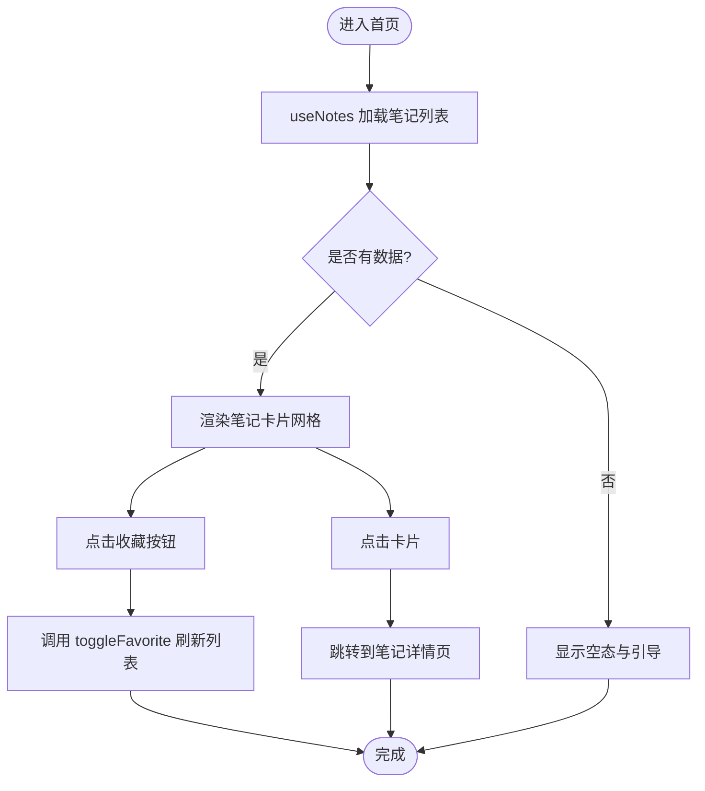
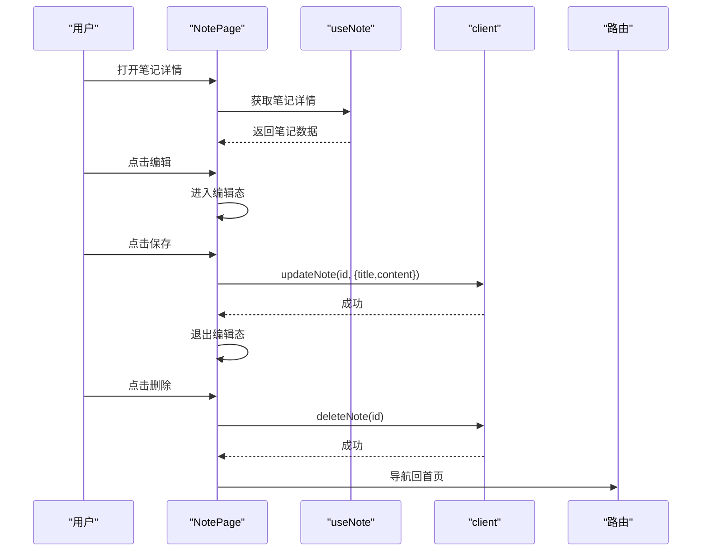
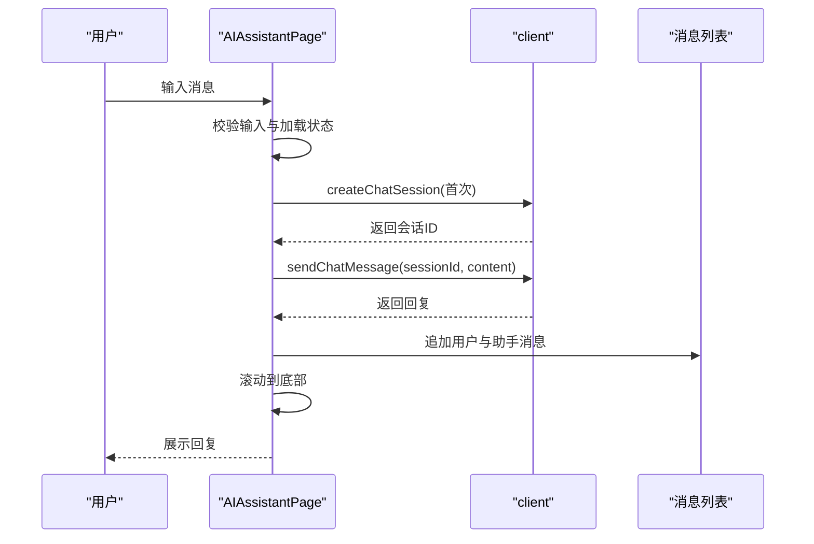
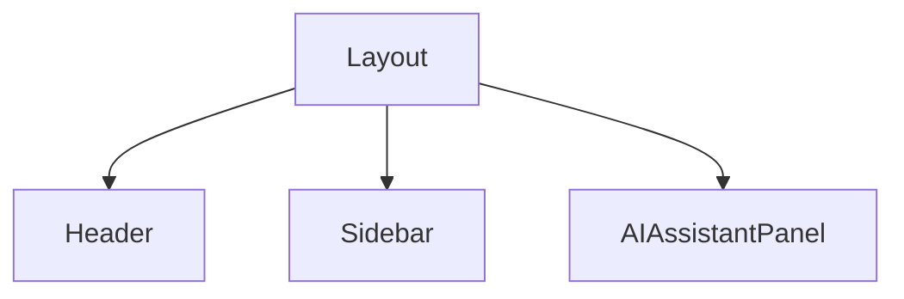
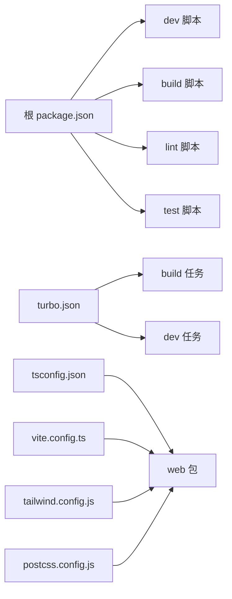

# Web前端应用

<cite>
**本文引用的文件**
- [package.json](file://package.json)
- [turbo.json](file://turbo.json)
- [tsconfig.json](file://tsconfig.json)
- [main.tsx](file://packages/web/src/main.tsx)
- [App.tsx](file://packages/web/src/App.tsx)
- [Layout.tsx](file://packages/web/src/components/Layout.tsx)
- [Header.tsx](file://packages/web/src/components/Header.tsx)
- [Sidebar.tsx](file://packages/web/src/components/Sidebar.tsx)
- [AIAssistantPanel.tsx](file://packages/web/src/components/AIAssistantPanel.tsx)
- [useNotes.ts](file://packages/web/src/hooks/useNotes.ts)
- [client.ts](file://packages/web/src/api/client.ts)
- [HomePage.tsx](file://packages/web/src/pages/HomePage.tsx)
- [NotePage.tsx](file://packages/web/src/pages/NotePage.tsx)
- [AIAssistantPage.tsx](file://packages/web/src/pages/AIAssistantPage.tsx)
- [vite.config.ts](file://packages/web/vite.config.ts)
- [tailwind.config.js](file://packages/web/tailwind.config.js)
- [postcss.config.js](file://packages/web/postcss.config.js)
- [index.css](file://packages/web/src/index.css)
</cite>

## 目录
1. [简介](#简介)
2. [项目结构](#项目结构)
3. [核心组件](#核心组件)
4. [架构总览](#架构总览)
5. [详细组件分析](#详细组件分析)
6. [依赖关系分析](#依赖关系分析)
7. [性能考虑](#性能考虑)
8. [故障排查指南](#故障排查指南)
9. [结论](#结论)
10. [附录](#附录)

## 简介
本项目是一个基于 React 的番茄笔记 Web 前端应用，采用模块化多包工作区结构，结合 Vite 构建工具与 Tailwind CSS 实现现代化 UI 设计。应用围绕“笔记”这一核心实体，提供笔记列表、编辑器、AI 助手对话等页面，并通过自定义 Hook 封装数据获取与状态逻辑，配合 React Router 实现页面级路由。

## 项目结构
项目采用 monorepo 结构，根目录通过脚本统一管理各包的开发、构建、测试与清理任务；前端应用位于 packages/web，包含入口、路由、页面、组件、API 客户端、自定义 Hook 以及样式配置。

图表来源
- [main.tsx:1-14](file://packages/web/src/main.tsx#L1-L14)
- [App.tsx:1-20](file://packages/web/src/App.tsx#L1-L20)
- [Layout.tsx](file://packages/web/src/components/Layout.tsx)
- [Header.tsx](file://packages/web/src/components/Header.tsx)
- [Sidebar.tsx](file://packages/web/src/components/Sidebar.tsx)
- [AIAssistantPanel.tsx](file://packages/web/src/components/AIAssistantPanel.tsx)
- [useNotes.ts](file://packages/web/src/hooks/useNotes.ts)
- [client.ts](file://packages/web/src/api/client.ts)
- [HomePage.tsx:1-218](file://packages/web/src/pages/HomePage.tsx#L1-L218)
- [NotePage.tsx:1-200](file://packages/web/src/pages/NotePage.tsx#L1-L200)
- [AIAssistantPage.tsx:1-221](file://packages/web/src/pages/AIAssistantPage.tsx#L1-L221)
- [vite.config.ts](file://packages/web/vite.config.ts)
- [tailwind.config.js](file://packages/web/tailwind.config.js)
- [postcss.config.js](file://packages/web/postcss.config.js)
- [index.css](file://packages/web/src/index.css)

章节来源
- [package.json:1-25](file://package.json#L1-L25)
- [turbo.json:1-23](file://turbo.json#L1-L23)
- [tsconfig.json:1-22](file://tsconfig.json#L1-L22)
- [main.tsx:1-14](file://packages/web/src/main.tsx#L1-L14)
- [App.tsx:1-20](file://packages/web/src/App.tsx#L1-L20)

## 核心组件
- 应用入口与路由
  - 入口文件在 packages/web/src/main.tsx 中挂载 BrowserRouter 并渲染 App。
  - App.tsx 定义顶层路由：首页、笔记详情页、AI 助手页，均包裹在 Layout 组件内。
- 布局与导航
  - Layout.tsx 提供全局布局骨架，包含 Header.tsx 与 Sidebar.tsx，用于统一头部信息与侧边导航。
  - AIAssistantPanel.tsx 作为布局内的可选面板，用于展示 AI 助手相关 UI。
- 页面组件
  - HomePage.tsx：展示统计、最近笔记列表、创建笔记弹窗、收藏切换等。
  - NotePage.tsx：单篇笔记的读写、删除、收藏切换、AI 摘要展示。
  - AIAssistantPage.tsx：聊天式 AI 助手，支持快捷动作、消息滚动、错误兜底。
- 自定义 Hook
  - useNotes.ts：封装笔记列表、单条笔记、创建、统计等数据获取与刷新逻辑。
- API 客户端
  - client.ts：封装与后端交互的请求方法，如笔记 CRUD、收藏切换、AI 聊天会话等。

章节来源
- [main.tsx:1-14](file://packages/web/src/main.tsx#L1-L14)
- [App.tsx:1-20](file://packages/web/src/App.tsx#L1-L20)
- [Layout.tsx](file://packages/web/src/components/Layout.tsx)
- [Header.tsx](file://packages/web/src/components/Header.tsx)
- [Sidebar.tsx](file://packages/web/src/components/Sidebar.tsx)
- [AIAssistantPanel.tsx](file://packages/web/src/components/AIAssistantPanel.tsx)
- [useNotes.ts](file://packages/web/src/hooks/useNotes.ts)
- [client.ts](file://packages/web/src/api/client.ts)
- [HomePage.tsx:1-218](file://packages/web/src/pages/HomePage.tsx#L1-L218)
- [NotePage.tsx:1-200](file://packages/web/src/pages/NotePage.tsx#L1-L200)
- [AIAssistantPage.tsx:1-221](file://packages/web/src/pages/AIAssistantPage.tsx#L1-L221)

## 架构总览
应用采用“页面-组件-Hook-API”的分层架构：
- 页面层：负责业务场景编排与用户交互。
- 组件层：可复用 UI 组件，如卡片、面板等。
- Hook 层：封装数据获取、缓存与状态同步。
- API 层：统一请求封装，屏蔽具体网络细节。

图表来源
- [HomePage.tsx:1-218](file://packages/web/src/pages/HomePage.tsx#L1-L218)
- [NotePage.tsx:1-200](file://packages/web/src/pages/NotePage.tsx#L1-L200)
- [AIAssistantPage.tsx:1-221](file://packages/web/src/pages/AIAssistantPage.tsx#L1-L221)
- [Layout.tsx](file://packages/web/src/components/Layout.tsx)
- [Header.tsx](file://packages/web/src/components/Header.tsx)
- [Sidebar.tsx](file://packages/web/src/components/Sidebar.tsx)
- [AIAssistantPanel.tsx](file://packages/web/src/components/AIAssistantPanel.tsx)
- [useNotes.ts](file://packages/web/src/hooks/useNotes.ts)
- [client.ts](file://packages/web/src/api/client.ts)

## 详细组件分析

### 路由与入口
- 入口挂载与严格模式
  - 在 main.tsx 中以 BrowserRouter 包裹 App，并启用 React.StrictMode。
- 顶层路由
  - App.tsx 定义根路径 "/" 下的嵌套路由：首页、笔记详情、AI 助手页，均在 Layout 下渲染。

图表来源
- [main.tsx:1-14](file://packages/web/src/main.tsx#L1-L14)
- [App.tsx:1-20](file://packages/web/src/App.tsx#L1-L20)

章节来源
- [main.tsx:1-14](file://packages/web/src/main.tsx#L1-L14)
- [App.tsx:1-20](file://packages/web/src/App.tsx#L1-L20)

### 首页（笔记列表）
- 功能要点
  - 展示笔记统计与功能卡片。
  - 列表懒加载占位与空态提示。
  - 收藏切换、时间格式化、创建笔记弹窗。
  - 点击卡片跳转到对应笔记详情页。
- 数据流
  - 使用 useNotes 获取笔记列表与统计，调用 useCreateNote 创建新笔记，refetch 刷新列表。
  - 通过 api.toggleFavorite 切换收藏状态。

图表来源
- [HomePage.tsx:1-218](file://packages/web/src/pages/HomePage.tsx#L1-L218)
- [useNotes.ts](file://packages/web/src/hooks/useNotes.ts)
- [client.ts](file://packages/web/src/api/client.ts)

章节来源
- [HomePage.tsx:1-218](file://packages/web/src/pages/HomePage.tsx#L1-L218)
- [useNotes.ts](file://packages/web/src/hooks/useNotes.ts)
- [client.ts](file://packages/web/src/api/client.ts)

### 笔记详情页
- 功能要点
  - 读取当前笔记，支持编辑/保存、删除、收藏切换。
  - 展示 AI 摘要与标签。
  - 编辑态与只读态切换。
- 数据流
  - useParams 获取笔记 ID，useNote 获取笔记详情。
  - 更新时调用 api.updateNote，删除时调用 api.deleteNote，收藏切换调用 api.toggleFavorite。

图表来源
- [NotePage.tsx:1-200](file://packages/web/src/pages/NotePage.tsx#L1-L200)
- [useNotes.ts](file://packages/web/src/hooks/useNotes.ts)
- [client.ts](file://packages/web/src/api/client.ts)

章节来源
- [NotePage.tsx:1-200](file://packages/web/src/pages/NotePage.tsx#L1-L200)
- [useNotes.ts](file://packages/web/src/hooks/useNotes.ts)
- [client.ts](file://packages/web/src/api/client.ts)

### AI 助手页
- 功能要点
  - 聊天式交互：发送消息、自动滚动到底部、加载指示。
  - 快捷动作：总结、建议、计划、复习等预设提示词。
  - 错误兜底：异常时返回系统消息。
- 数据流
  - 首次发送时创建会话，后续发送消息到指定会话 ID。
  - 消息按角色区分样式与对齐。

图表来源
- [AIAssistantPage.tsx:1-221](file://packages/web/src/pages/AIAssistantPage.tsx#L1-L221)
- [client.ts](file://packages/web/src/api/client.ts)

章节来源
- [AIAssistantPage.tsx:1-221](file://packages/web/src/pages/AIAssistantPage.tsx#L1-L221)
- [client.ts](file://packages/web/src/api/client.ts)

### 布局与导航
- Layout.tsx 作为全局容器，组合 Header.tsx 与 Sidebar.tsx，确保所有页面共享一致的头部与侧边菜单。
- AIAssistantPanel.tsx 作为可选面板，可在布局中按需展示。

图表来源
- [Layout.tsx](file://packages/web/src/components/Layout.tsx)
- [Header.tsx](file://packages/web/src/components/Header.tsx)
- [Sidebar.tsx](file://packages/web/src/components/Sidebar.tsx)
- [AIAssistantPanel.tsx](file://packages/web/src/components/AIAssistantPanel.tsx)

章节来源
- [Layout.tsx](file://packages/web/src/components/Layout.tsx)
- [Header.tsx](file://packages/web/src/components/Header.tsx)
- [Sidebar.tsx](file://packages/web/src/components/Sidebar.tsx)
- [AIAssistantPanel.tsx](file://packages/web/src/components/AIAssistantPanel.tsx)

### 状态管理策略
- 页面内局部状态
  - 首页与笔记页广泛使用 useState 管理表单、模态框、编辑态、保存状态等。
- 数据获取与缓存
  - useNotes 封装了笔记列表、单条笔记、创建、统计等逻辑，统一处理加载、错误与刷新。
- 全局状态
  - 当前实现未引入集中式状态库（如 Redux/Zustand），而是通过 React Hooks 与组件树传递 props 管理状态，适合中小型应用。

章节来源
- [HomePage.tsx:1-218](file://packages/web/src/pages/HomePage.tsx#L1-L218)
- [NotePage.tsx:1-200](file://packages/web/src/pages/NotePage.tsx#L1-L200)
- [useNotes.ts](file://packages/web/src/hooks/useNotes.ts)

### 用户界面设计与自定义选项
- 设计原则
  - 使用 Tailwind CSS 实现原子化样式，强调一致性与可维护性。
  - 采用语义化类名与主题色（如紫色主色）提升品牌感。
- 响应式设计
  - 通过网格布局与弹性容器适配不同屏幕尺寸。
- 可访问性
  - 使用语义化 HTML 标签与可聚焦元素，提供键盘交互能力。
  - 表单控件具备焦点样式与无障碍属性基础。

章节来源
- [tailwind.config.js](file://packages/web/tailwind.config.js)
- [postcss.config.js](file://packages/web/postcss.config.js)
- [index.css](file://packages/web/src/index.css)
- [HomePage.tsx:1-218](file://packages/web/src/pages/HomePage.tsx#L1-L218)
- [NotePage.tsx:1-200](file://packages/web/src/pages/NotePage.tsx#L1-L200)
- [AIAssistantPage.tsx:1-221](file://packages/web/src/pages/AIAssistantPage.tsx#L1-L221)

### 组件使用示例与集成指导
- 引入与挂载
  - 在 main.tsx 中使用 BrowserRouter 包裹 App，确保路由生效。
- 页面集成
  - 在 App.tsx 中注册页面路由，确保 Layout 包裹页面组件。
- 数据集成
  - 在页面中导入 useNotes 与 api 客户端，按需调用 CRUD 与收藏切换接口。
- 样式集成
  - 在入口 CSS 文件中引入 Tailwind 指令，确保样式生效。

章节来源
- [main.tsx:1-14](file://packages/web/src/main.tsx#L1-L14)
- [App.tsx:1-20](file://packages/web/src/App.tsx#L1-L20)
- [useNotes.ts](file://packages/web/src/hooks/useNotes.ts)
- [client.ts](file://packages/web/src/api/client.ts)
- [index.css](file://packages/web/src/index.css)

## 依赖关系分析
- 工作区与脚本
  - 根 package.json 定义 workspaces 与统一脚本，turbo.json 配置任务依赖与输出缓存。
- 类型与编译
  - tsconfig.json 设置 ESNext 模块解析与严格类型检查，便于在浏览器与 Node 环境中协同开发。
- 构建与样式
  - vite.config.ts 配置构建参数；Tailwind 与 PostCSS 通过独立配置文件启用按需生成与优化。

图表来源
- [package.json:1-25](file://package.json#L1-L25)
- [turbo.json:1-23](file://turbo.json#L1-L23)
- [tsconfig.json:1-22](file://tsconfig.json#L1-L22)
- [vite.config.ts](file://packages/web/vite.config.ts)
- [tailwind.config.js](file://packages/web/tailwind.config.js)
- [postcss.config.js](file://packages/web/postcss.config.js)

章节来源
- [package.json:1-25](file://package.json#L1-L25)
- [turbo.json:1-23](file://turbo.json#L1-L23)
- [tsconfig.json:1-22](file://tsconfig.json#L1-L22)

## 性能考虑
- 路由懒加载
  - 可将页面组件改为动态导入以减少首屏体积。
- 图片与资源
  - 使用现代图片格式与懒加载策略，避免阻塞主线程。
- 样式优化
  - Tailwind 启用 purge 与 tree-shaking，仅保留实际使用的样式。
- 状态更新
  - 合理拆分组件与细粒度状态，避免不必要的重渲染。
- 请求缓存
  - 在 useNotes 中增加缓存与去抖策略，减少重复请求。

## 故障排查指南
- 路由不生效
  - 确认 main.tsx 中已包裹 BrowserRouter，且 App.tsx 路由配置正确。
- 数据未刷新
  - 检查 useNotes 的 refetch 调用时机，确认 API 返回成功后再刷新。
- 样式未生效
  - 确认 Tailwind 指令已引入，PostCSS 与 Tailwind 配置正确。
- 构建失败
  - 查看 turbo.json 的 build 输出配置与依赖顺序，确保上游包先构建。

章节来源
- [main.tsx:1-14](file://packages/web/src/main.tsx#L1-L14)
- [App.tsx:1-20](file://packages/web/src/App.tsx#L1-L20)
- [useNotes.ts](file://packages/web/src/hooks/useNotes.ts)
- [index.css](file://packages/web/src/index.css)
- [turbo.json:1-23](file://turbo.json#L1-L23)

## 结论
该前端应用以清晰的分层架构与模块化组织实现了笔记管理与 AI 辅助的核心功能。通过 React Router、自定义 Hook 与 API 客户端，页面与数据层解耦良好。Tailwind 与 Vite 的组合提供了高效的开发体验与良好的可维护性。建议在后续迭代中引入路由懒加载、状态持久化与更完善的错误边界，以进一步提升性能与稳定性。

## 附录
- 构建与部署流程
  - 开发：执行根目录脚本启动多包开发服务器。
  - 构建：执行根目录脚本进行多包构建，输出至各包 dist 目录。
  - 部署：将 packages/web/dist 静态资源部署至静态服务器或 CDN。
- 扩展与定制建议
  - 引入状态库：在复杂场景下引入 Zustand 或 Redux Toolkit。
  - 主题系统：通过 CSS 变量与 Tailwind 主题扩展实现深浅主题切换。
  - 国际化：集成 i18n 库，按页面与组件维度逐步迁移。
  - 测试：补充页面与 Hook 的单元测试，覆盖关键交互与错误分支。