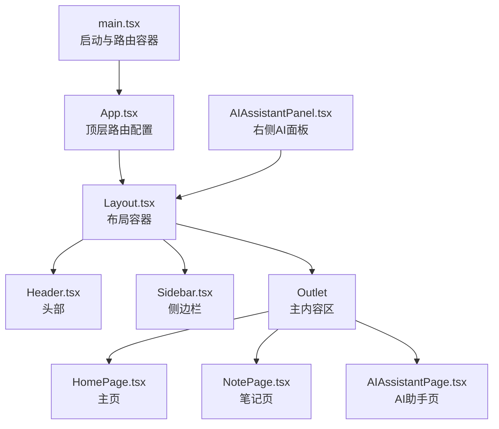
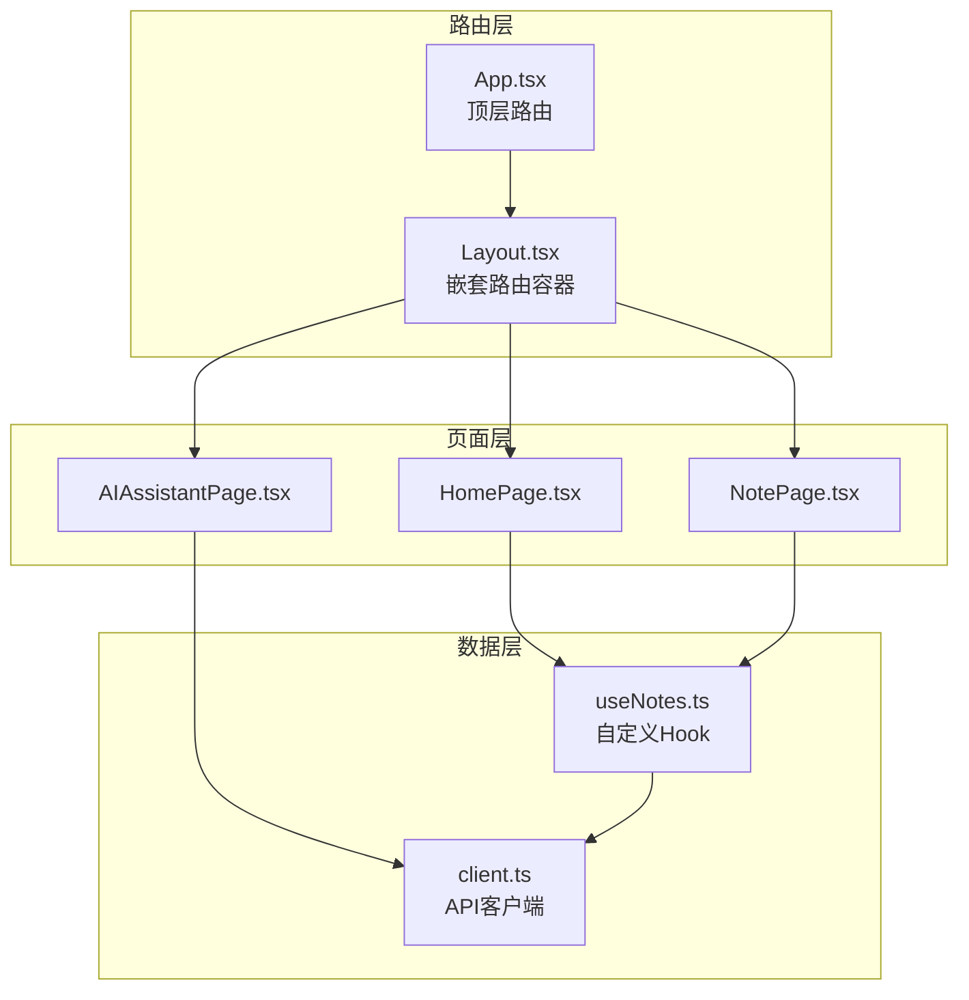
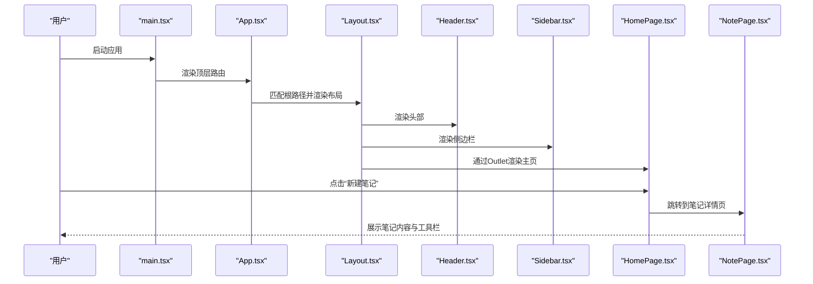
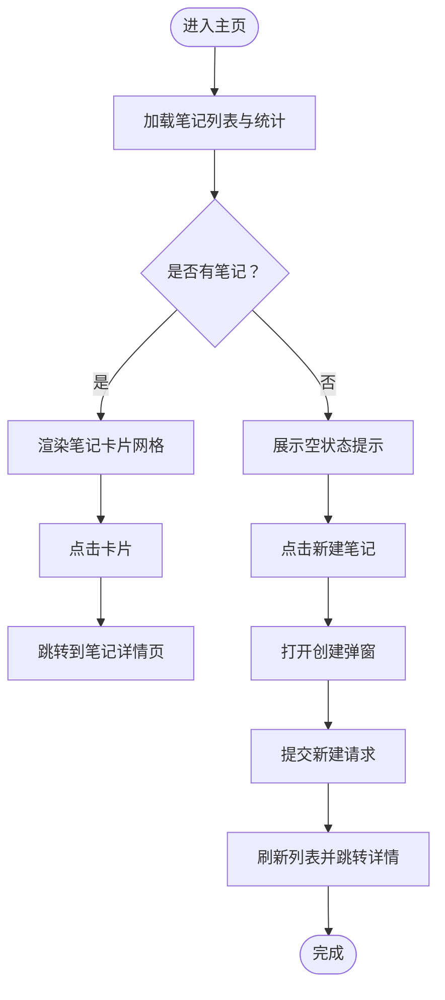
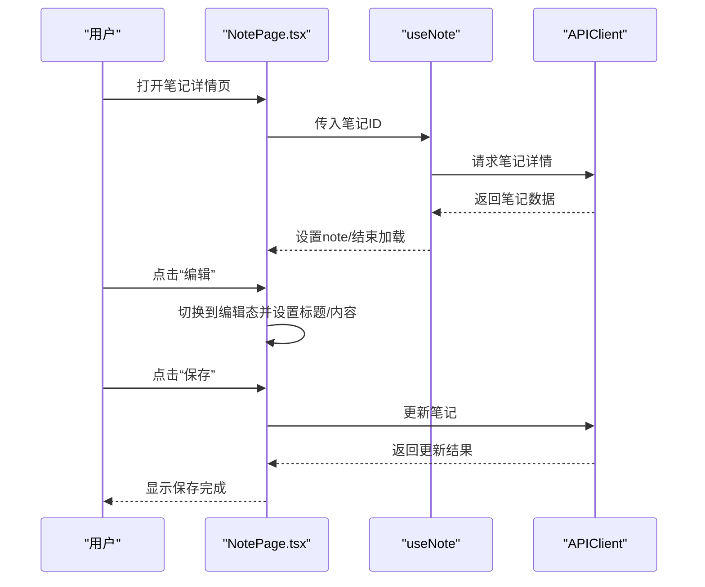
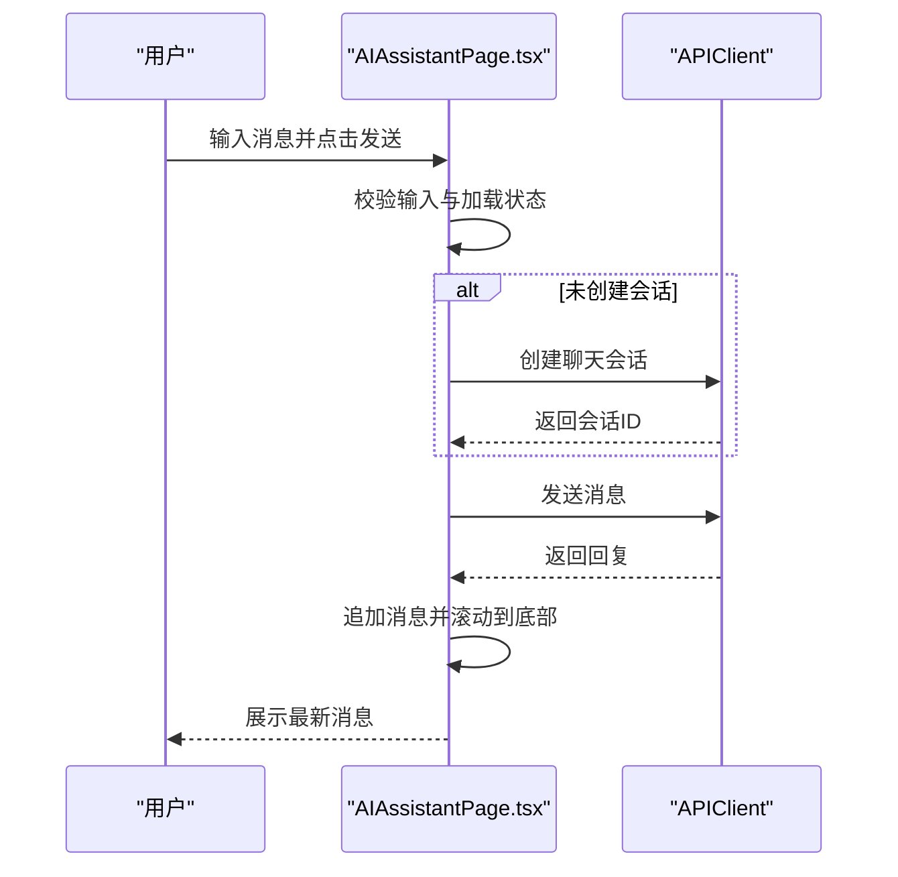
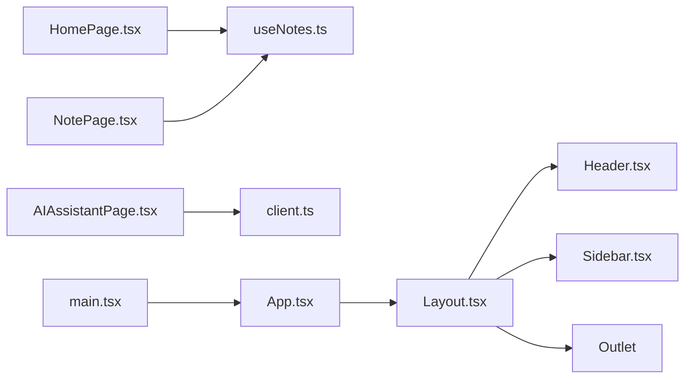

# 页面和路由

<cite>
**本文引用的文件**
- [App.tsx](file://packages/web/src/App.tsx)
- [main.tsx](file://packages/web/src/main.tsx)
- [Layout.tsx](file://packages/web/src/components/Layout.tsx)
- [Header.tsx](file://packages/web/src/components/Header.tsx)
- [Sidebar.tsx](file://packages/web/src/components/Sidebar.tsx)
- [AIAssistantPanel.tsx](file://packages/web/src/components/AIAssistantPanel.tsx)
- [HomePage.tsx](file://packages/web/src/pages/HomePage.tsx)
- [NotePage.tsx](file://packages/web/src/pages/NotePage.tsx)
- [AIAssistantPage.tsx](file://packages/web/src/pages/AIAssistantPage.tsx)
- [useNotes.ts](file://packages/web/src/hooks/useNotes.ts)
- [client.ts](file://packages/web/src/api/client.ts)
</cite>

## 目录
1. [简介](#简介)
2. [项目结构](#项目结构)
3. [核心组件](#核心组件)
4. [架构总览](#架构总览)
5. [详细组件分析](#详细组件分析)
6. [依赖关系分析](#依赖关系分析)
7. [性能考虑](#性能考虑)
8. [故障排查指南](#故障排查指南)
9. [结论](#结论)
10. [附录：页面扩展与新页面开发指引](#附录页面扩展与新页面开发指引)

## 简介
本文件面向“番茄笔记”Web前端的页面与路由系统，系统性梳理主页、笔记页与AI助手页的页面结构、路由配置、组件职责、数据流与状态管理，并给出性能优化与扩展指引。读者无需深入源码即可理解整体设计与实现要点。

## 项目结构
- 路由入口位于应用根组件，采用嵌套路由组织页面与布局。
- 布局组件负责统一的头部、侧边栏与右侧AI助手面板，主内容区通过 Outlet 渲染当前匹配的子路由页面。
- 页面层包含主页、笔记页与AI助手页；页面内通过自定义Hook与API客户端进行数据获取与交互。
- 根目录启动文件配置了浏览器路由环境。

图表来源
- [main.tsx:1-14](file://packages/web/src/main.tsx#L1-L14)
- [App.tsx:1-20](file://packages/web/src/App.tsx#L1-L20)
- [Layout.tsx:1-52](file://packages/web/src/components/Layout.tsx#L1-L52)

章节来源
- [main.tsx:1-14](file://packages/web/src/main.tsx#L1-L14)
- [App.tsx:1-20](file://packages/web/src/App.tsx#L1-L20)
- [Layout.tsx:1-52](file://packages/web/src/components/Layout.tsx#L1-L52)

## 核心组件
- 路由配置与导航
  - 顶层路由以斜杠路径为根，嵌套布局；主页作为索引页，笔记页通过动态参数访问，AI助手页独立路由。
  - 路由容器使用浏览器历史模式，确保URL可分享与刷新稳定。
- 布局与通用UI
  - 布局组件承载头部、侧边栏与右侧AI面板，主内容区通过 Outlet 渲染当前页面。
  - 头部提供全局搜索与通知入口；侧边栏提供过滤、导航与笔记列表；右侧AI面板提供快捷入口。
- 页面职责
  - 主页：展示统计、最近笔记、创建笔记弹窗与收藏切换；负责新建笔记后的跳转与列表刷新。
  - 笔记页：编辑/查看模式切换、保存/删除、收藏切换、返回主页；支持AI摘要展示。
  - AI助手页：聊天会话管理、消息滚动、快捷动作与输入处理；支持会话创建与消息发送。
- 数据与状态
  - 自定义Hook封装API调用，统一处理加载、错误与刷新；API客户端集中管理请求与响应格式。
  - 页面内部状态用于表单、编辑态与加载态控制；跨页面共享通过路由参数与全局状态管理（如需要）。

章节来源
- [App.tsx:1-20](file://packages/web/src/App.tsx#L1-L20)
- [Layout.tsx:1-52](file://packages/web/src/components/Layout.tsx#L1-L52)
- [Header.tsx:1-102](file://packages/web/src/components/Header.tsx#L1-L102)
- [Sidebar.tsx:1-156](file://packages/web/src/components/Sidebar.tsx#L1-L156)
- [HomePage.tsx:1-218](file://packages/web/src/pages/HomePage.tsx#L1-L218)
- [NotePage.tsx:1-200](file://packages/web/src/pages/NotePage.tsx#L1-L200)
- [AIAssistantPage.tsx:1-221](file://packages/web/src/pages/AIAssistantPage.tsx#L1-L221)
- [useNotes.ts:1-125](file://packages/web/src/hooks/useNotes.ts#L1-L125)
- [client.ts:1-138](file://packages/web/src/api/client.ts#L1-L138)

## 架构总览
页面与路由的整体架构围绕“路由分发—布局承载—页面渲染—数据驱动”的模式展开。路由负责URL到页面的映射，布局负责UI骨架与全局交互，页面负责具体业务逻辑与用户交互，Hook与API客户端负责数据获取与状态更新。

图表来源
- [App.tsx:1-20](file://packages/web/src/App.tsx#L1-L20)
- [Layout.tsx:1-52](file://packages/web/src/components/Layout.tsx#L1-L52)
- [HomePage.tsx:1-218](file://packages/web/src/pages/HomePage.tsx#L1-L218)
- [NotePage.tsx:1-200](file://packages/web/src/pages/NotePage.tsx#L1-L200)
- [AIAssistantPage.tsx:1-221](file://packages/web/src/pages/AIAssistantPage.tsx#L1-L221)
- [useNotes.ts:1-125](file://packages/web/src/hooks/useNotes.ts#L1-L125)
- [client.ts:1-138](file://packages/web/src/api/client.ts#L1-L138)

## 详细组件分析

### 路由与导航流程
- 入口初始化：启动文件包裹应用于浏览器路由容器中，保证URL变化触发页面渲染。
- 顶层路由：根路径下嵌套布局，索引页为主页，笔记页通过动态ID参数访问，AI助手页独立路由。
- 布局承载：布局组件渲染头部、侧边栏、主内容区与右侧AI面板，主内容区通过 Outlet 渲染当前匹配页面。
- 页面内导航：各页面通过路由钩子进行页面跳转与参数传递，例如从主页创建笔记后跳转至对应笔记页。

图表来源
- [main.tsx:1-14](file://packages/web/src/main.tsx#L1-L14)
- [App.tsx:1-20](file://packages/web/src/App.tsx#L1-L20)
- [Layout.tsx:1-52](file://packages/web/src/components/Layout.tsx#L1-L52)
- [HomePage.tsx:1-218](file://packages/web/src/pages/HomePage.tsx#L1-L218)
- [NotePage.tsx:1-200](file://packages/web/src/pages/NotePage.tsx#L1-L200)

章节来源
- [main.tsx:1-14](file://packages/web/src/main.tsx#L1-L14)
- [App.tsx:1-20](file://packages/web/src/App.tsx#L1-L20)
- [Layout.tsx:1-52](file://packages/web/src/components/Layout.tsx#L1-L52)
- [HomePage.tsx:1-218](file://packages/web/src/pages/HomePage.tsx#L1-L218)
- [NotePage.tsx:1-200](file://packages/web/src/pages/NotePage.tsx#L1-L200)

### 主页（HomePage）
- 职责与功能
  - 展示统计信息与功能卡片，提供“新建笔记”入口。
  - 列出最近笔记，支持收藏切换与点击进入详情。
  - 提供创建笔记弹窗，提交后刷新列表并跳转至新笔记详情。
- 数据与状态
  - 使用笔记Hook获取列表与统计，使用创建Hook发起新建请求。
  - 内部状态管理弹窗显示、标题与内容输入。
- 生命周期与交互
  - 首次渲染时自动拉取数据；新建成功后调用刷新函数并导航至详情页。

图表来源
- [HomePage.tsx:1-218](file://packages/web/src/pages/HomePage.tsx#L1-L218)
- [useNotes.ts:1-125](file://packages/web/src/hooks/useNotes.ts#L1-L125)

章节来源
- [HomePage.tsx:1-218](file://packages/web/src/pages/HomePage.tsx#L1-L218)
- [useNotes.ts:1-125](file://packages/web/src/hooks/useNotes.ts#L1-L125)

### 笔记页（NotePage）
- 职责与功能
  - 支持查看与编辑模式切换，保存与删除笔记。
  - 收藏切换、返回主页、展示AI摘要与标签。
- 数据与状态
  - 通过路由参数获取笔记ID，使用单条笔记Hook加载详情。
  - 内部状态管理编辑态、标题与内容、保存状态与错误。
- 生命周期与交互
  - 首次挂载根据ID加载详情；保存时调用更新接口；删除时确认后返回主页。

图表来源
- [NotePage.tsx:1-200](file://packages/web/src/pages/NotePage.tsx#L1-L200)
- [useNotes.ts:1-125](file://packages/web/src/hooks/useNotes.ts#L1-L125)
- [client.ts:1-138](file://packages/web/src/api/client.ts#L1-L138)

章节来源
- [NotePage.tsx:1-200](file://packages/web/src/pages/NotePage.tsx#L1-L200)
- [useNotes.ts:1-125](file://packages/web/src/hooks/useNotes.ts#L1-L125)
- [client.ts:1-138](file://packages/web/src/api/client.ts#L1-L138)

### AI助手页（AIAssistantPage）
- 职责与功能
  - 聊天对话界面，支持快捷动作、输入与发送、消息滚动与加载态。
  - 会话管理：首次发送时创建会话，后续复用会话ID。
- 数据与状态
  - 内部状态维护消息列表、输入内容、加载状态与会话ID。
  - 错误兜底：异常时插入一条提示消息。
- 生命周期与交互
  - 首次渲染滚动到底部；每次新增消息自动滚动；支持回车发送。

图表来源
- [AIAssistantPage.tsx:1-221](file://packages/web/src/pages/AIAssistantPage.tsx#L1-L221)
- [client.ts:1-138](file://packages/web/src/api/client.ts#L1-L138)

章节来源
- [AIAssistantPage.tsx:1-221](file://packages/web/src/pages/AIAssistantPage.tsx#L1-L221)
- [client.ts:1-138](file://packages/web/src/api/client.ts#L1-L138)

### 布局与通用组件
- 布局（Layout）
  - 统一的头部、侧边栏、主内容区与底部状态栏；右侧AI面板作为独立区域。
- 头部（Header）
  - 提供全局搜索与结果下拉，点击结果跳转至笔记详情。
- 侧边栏（Sidebar）
  - 提供过滤器（全部、AI生成、最近、收藏）、导航（AI助手）、笔记列表与AI快捷入口。

章节来源
- [Layout.tsx:1-52](file://packages/web/src/components/Layout.tsx#L1-L52)
- [Header.tsx:1-102](file://packages/web/src/components/Header.tsx#L1-L102)
- [Sidebar.tsx:1-156](file://packages/web/src/components/Sidebar.tsx#L1-L156)

## 依赖关系分析
- 组件耦合
  - 页面对Hook与API客户端存在直接依赖；布局组件通过子组件组合形成稳定的UI骨架。
  - 侧边栏与头部均依赖Hook与导航能力，形成松耦合的交互关系。
- 数据流
  - 页面通过Hook发起请求，API客户端统一封装HTTP调用与响应格式。
  - 列表与详情页共享同一数据模型，通过ID建立页面间的数据关联。
- 外部依赖
  - React Router提供路由与导航能力；浏览器历史模式保证URL一致性。

图表来源
- [App.tsx:1-20](file://packages/web/src/App.tsx#L1-L20)
- [main.tsx:1-14](file://packages/web/src/main.tsx#L1-L14)
- [Layout.tsx:1-52](file://packages/web/src/components/Layout.tsx#L1-L52)
- [Header.tsx:1-102](file://packages/web/src/components/Header.tsx#L1-L102)
- [Sidebar.tsx:1-156](file://packages/web/src/components/Sidebar.tsx#L1-L156)
- [HomePage.tsx:1-218](file://packages/web/src/pages/HomePage.tsx#L1-L218)
- [NotePage.tsx:1-200](file://packages/web/src/pages/NotePage.tsx#L1-L200)
- [AIAssistantPage.tsx:1-221](file://packages/web/src/pages/AIAssistantPage.tsx#L1-L221)
- [useNotes.ts:1-125](file://packages/web/src/hooks/useNotes.ts#L1-L125)
- [client.ts:1-138](file://packages/web/src/api/client.ts#L1-L138)

章节来源
- [App.tsx:1-20](file://packages/web/src/App.tsx#L1-L20)
- [main.tsx:1-14](file://packages/web/src/main.tsx#L1-L14)
- [Layout.tsx:1-52](file://packages/web/src/components/Layout.tsx#L1-L52)
- [useNotes.ts:1-125](file://packages/web/src/hooks/useNotes.ts#L1-L125)
- [client.ts:1-138](file://packages/web/src/api/client.ts#L1-L138)

## 性能考虑
- 列表渲染优化
  - 使用虚拟滚动或分页加载（在Hook中增加limit与分页参数）以减少DOM节点数量。
  - 对长列表采用懒加载与占位符动画，提升首屏体验。
- 请求与缓存
  - 在Hook中引入请求去抖与缓存策略，避免重复请求与频繁刷新。
  - 对热门数据（如统计）采用本地缓存与定时刷新结合的方式。
- 图像与资源
  - 对头像、图标等静态资源采用CDN与懒加载策略。
- 交互反馈
  - 加载态与错误态明确提示，避免用户重复操作。
- 路由与渲染
  - 将不随路由变化的UI（如底部状态栏）置于布局中，减少页面级重渲染。

## 故障排查指南
- 笔记列表为空或加载失败
  - 检查Hook中的错误分支与状态设置；确认API端点可用与网络请求成功。
  - 关注加载态与错误态的UI提示，必要时增加重试按钮。
- 笔记详情页空白或报错
  - 确认路由参数ID有效；检查单条笔记Hook的加载逻辑与错误处理。
  - 若笔记不存在，引导用户返回主页。
- AI助手无法发送消息
  - 检查会话创建与消息发送的请求是否成功；关注加载态与错误兜底消息。
  - 确保输入非空且未处于加载状态。
- 搜索无结果或下拉不消失
  - 检查搜索Hook的查询逻辑与结果渲染；确认点击外部区域关闭下拉的行为。

章节来源
- [useNotes.ts:1-125](file://packages/web/src/hooks/useNotes.ts#L1-L125)
- [client.ts:1-138](file://packages/web/src/api/client.ts#L1-L138)
- [Header.tsx:1-102](file://packages/web/src/components/Header.tsx#L1-L102)
- [AIAssistantPage.tsx:1-221](file://packages/web/src/pages/AIAssistantPage.tsx#L1-L221)

## 结论
该页面与路由系统以清晰的分层设计实现了主页、笔记页与AI助手页的功能协同：路由负责URL与页面映射，布局提供一致的UI骨架，页面聚焦业务逻辑，Hook与API客户端承担数据与网络职责。通过合理的状态管理与错误处理，系统具备良好的可维护性与扩展性。

## 附录：页面扩展与新页面开发指引
- 新增页面步骤
  - 在页面目录创建新页面组件，按需引入Hook与API客户端。
  - 在顶层路由中注册新路由，选择是否嵌套布局或独立路由。
  - 如需加入侧边栏导航，可在侧边栏组件中添加入口并处理跳转。
- 数据与状态
  - 优先使用现有Hook封装请求与状态，避免重复实现。
  - 对于复杂状态，拆分为多个局部状态或引入集中式状态管理（如需要）。
- 路由与导航
  - 使用路由钩子进行程序化导航，保持URL语义化与可分享性。
  - 对于需要携带参数的页面，确保参数解析与默认值处理完善。
- 性能与体验
  - 对长列表与大内容采用分页、懒加载与占位符优化。
  - 明确加载态、错误态与空态，提供友好的用户反馈。
- 质量保障
  - 为关键流程编写单元测试与集成测试，覆盖正常与异常场景。
  - 对外暴露的API与Hook应保持稳定的接口契约，便于演进。