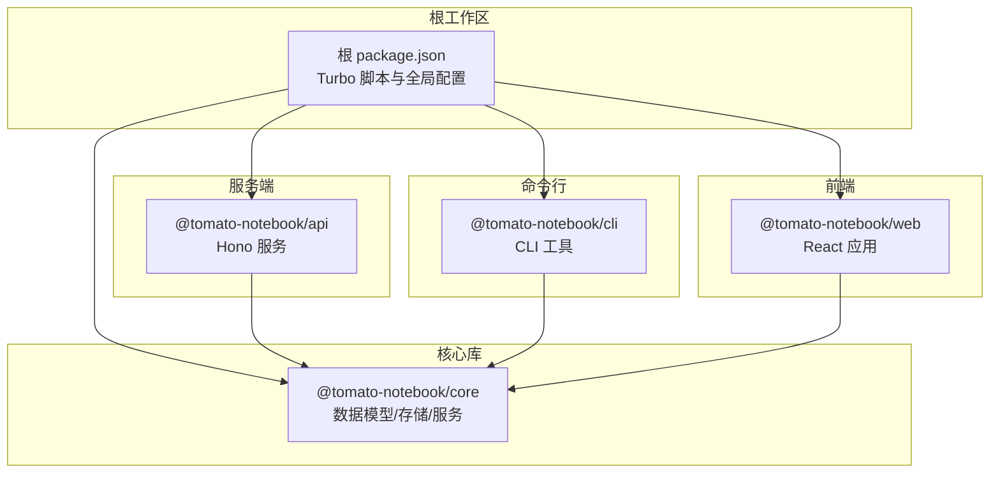
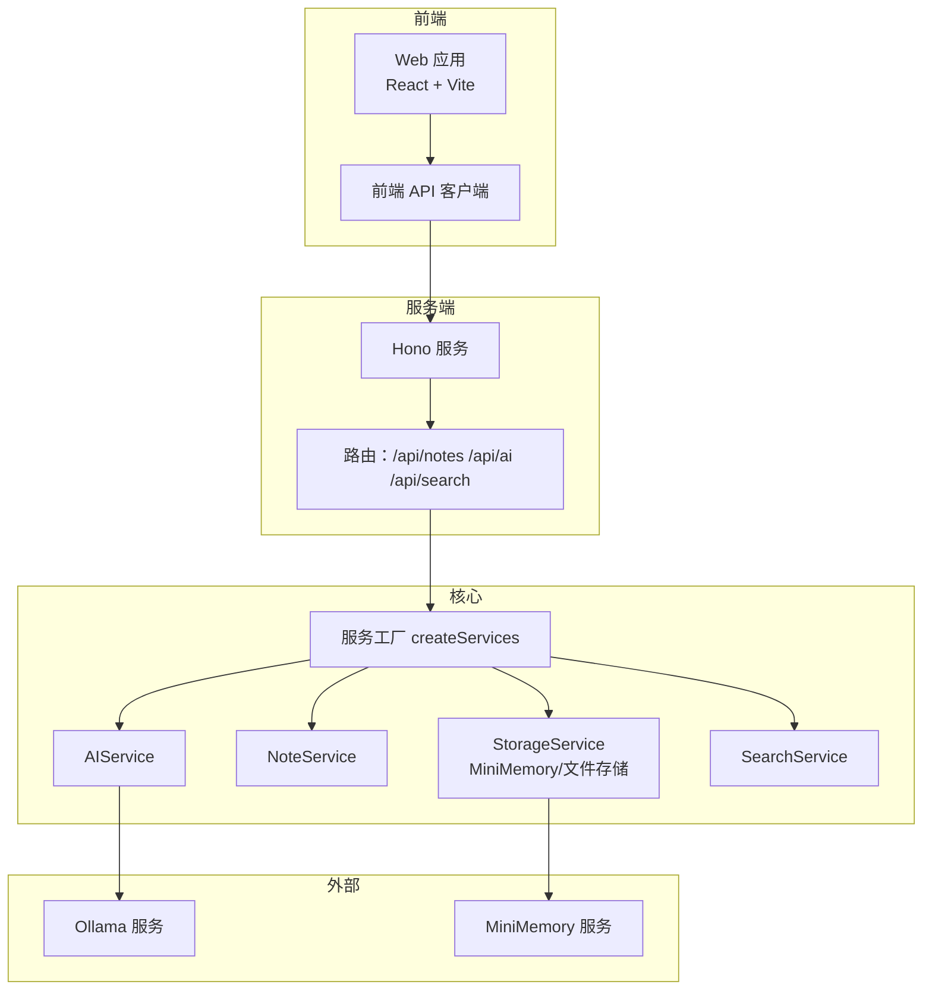
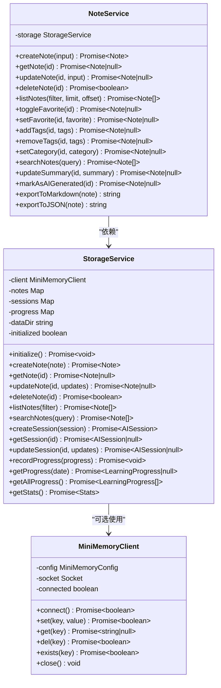
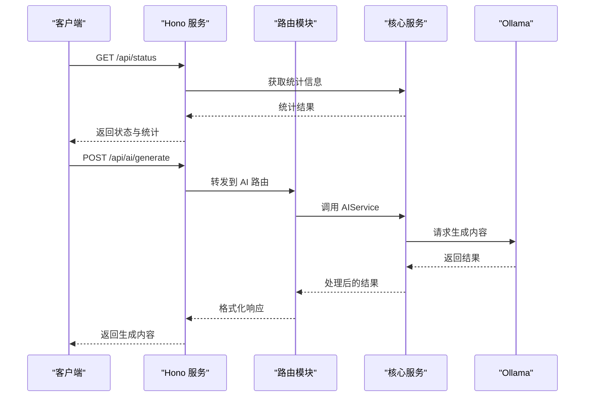
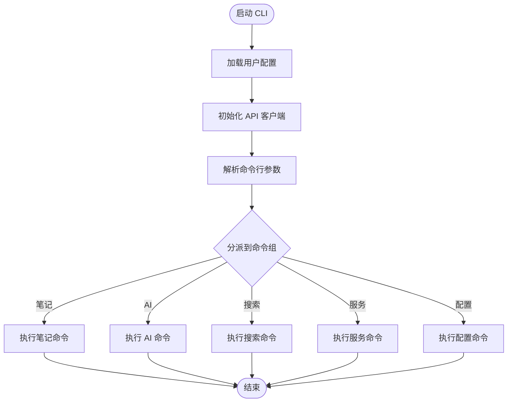
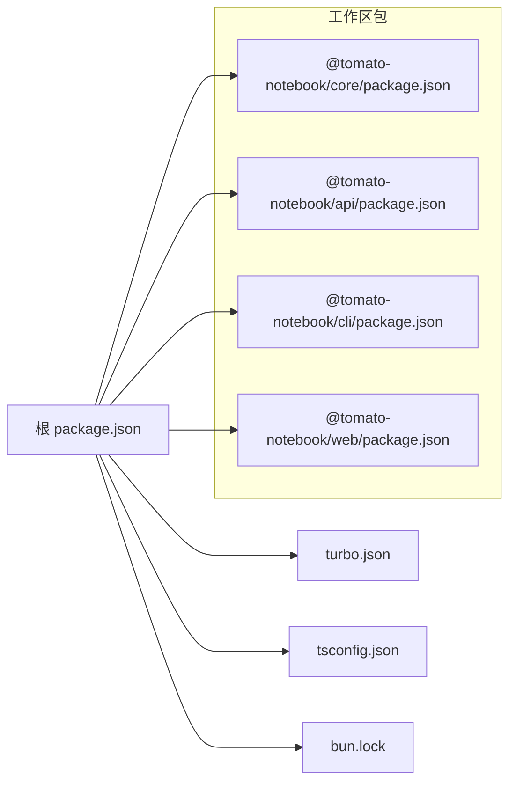

# 开发指南

<cite>
**本文档引用的文件**
- [package.json](file://package.json)
- [turbo.json](file://turbo.json)
- [tsconfig.json](file://tsconfig.json)
- [bun.lock](file://bun.lock)
- [packages/api/package.json](file://packages/api/package.json)
- [packages/api/src/index.ts](file://packages/api/src/index.ts)
- [packages/cli/package.json](file://packages/cli/package.json)
- [packages/cli/src/index.ts](file://packages/cli/src/index.ts)
- [packages/core/package.json](file://packages/core/package.json)
- [packages/core/src/index.ts](file://packages/core/src/index.ts)
- [packages/core/src/note.ts](file://packages/core/src/note.ts)
- [packages/core/src/storage.ts](file://packages/core/src/storage.ts)
- [packages/web/package.json](file://packages/web/package.json)
</cite>

## 目录
1. [简介](#简介)
2. [项目结构](#项目结构)
3. [核心组件](#核心组件)
4. [架构总览](#架构总览)
5. [详细组件分析](#详细组件分析)
6. [依赖关系分析](#依赖关系分析)
7. [性能考虑](#性能考虑)
8. [故障排除指南](#故障排除指南)
9. [结论](#结论)
10. [附录](#附录)

## 简介
本指南面向新加入的开发者，帮助你快速完成番茄笔记项目的开发环境搭建与日常开发工作。项目采用 Bun 作为包管理器与运行时，使用 Turbo 统一管理多包（monorepo）构建与任务，TypeScript 提供强类型支持。核心模块包括核心库（数据与服务）、CLI 工具、Web 前端以及 API 服务端。文档涵盖环境准备、构建系统使用、代码规范、测试策略、调试与性能分析、贡献流程与发布策略等。

## 项目结构
项目采用基于工作区的 monorepo 结构，根目录通过工作区声明统一管理各子包。核心包包括：
- @tomato-notebook/core：通用数据模型、存储与服务（笔记、AI、搜索）
- @tomato-notebook/api：基于 Hono 的后端 API 服务
- @tomato-notebook/cli：命令行工具，提供笔记、AI、搜索、服务控制等命令
- @tomato-notebook/web：基于 Vite + React 的前端应用

图表来源
- [package.json:1-25](file://package.json#L1-L25)
- [packages/api/package.json:1-22](file://packages/api/package.json#L1-L22)
- [packages/cli/package.json:1-26](file://packages/cli/package.json#L1-L26)
- [packages/core/package.json:1-26](file://packages/core/package.json#L1-L26)
- [packages/web/package.json:1-29](file://packages/web/package.json#L1-L29)

章节来源
- [package.json:1-25](file://package.json#L1-L25)
- [bun.lock:4-76](file://bun.lock#L4-L76)

## 核心组件
- 核心库（@tomato-notebook/core）
  - 提供统一的数据模型、存储服务、笔记服务、AI 服务与搜索服务，并通过工厂函数集中创建服务实例。
  - 支持 MiniMemory 内存数据库作为可选后端，若不可用则回退到本地文件存储。
- API 服务（@tomato-notebook/api）
  - 使用 Hono 构建 REST API，提供健康检查、状态查询与笔记、AI、搜索相关接口。
  - 集成 CORS 并支持通过环境变量配置 Ollama 参数。
- CLI 工具（@tomato-notebook/cli）
  - 基于 Commander 实现命令分组，提供笔记、AI、搜索、服务控制与配置命令。
  - 使用 Conf 管理用户配置，支持 API 地址等设置。
- Web 前端（@tomato-notebook/web）
  - 基于 Vite + React，集成 TailwindCSS、PostCSS 与 React Router，提供主页、笔记页与 AI 助手页面。

章节来源
- [packages/core/src/index.ts:1-50](file://packages/core/src/index.ts#L1-L50)
- [packages/core/src/note.ts:1-159](file://packages/core/src/note.ts#L1-L159)
- [packages/core/src/storage.ts:1-326](file://packages/core/src/storage.ts#L1-L326)
- [packages/api/src/index.ts:1-64](file://packages/api/src/index.ts#L1-L64)
- [packages/cli/src/index.ts:1-91](file://packages/cli/src/index.ts#L1-L91)
- [packages/web/package.json:1-29](file://packages/web/package.json#L1-L29)

## 架构总览
整体架构围绕“核心库”为中心，API、CLI、Web 三端共享同一套数据与服务层，确保一致性与复用性。API 通过 Hono 对外暴露 REST 接口；CLI 以 HTTP 方式调用 API；Web 通过前端 API 客户端访问后端。

图表来源
- [packages/api/src/index.ts:1-64](file://packages/api/src/index.ts#L1-L64)
- [packages/core/src/index.ts:1-50](file://packages/core/src/index.ts#L1-L50)
- [packages/core/src/storage.ts:1-326](file://packages/core/src/storage.ts#L1-L326)

## 详细组件分析

### 核心库（@tomato-notebook/core）
- 数据模型与类型
  - 定义笔记、AI 会话、学习进度等核心类型，提供分类枚举与过滤条件。
- 存储服务（StorageService）
  - 支持 MiniMemory TCP 客户端同步与本地文件持久化双模式，自动回退。
  - 提供笔记增删改查、列表过滤、全文检索、统计信息等能力。
- 服务工厂（createServices）
  - 统一初始化存储、笔记、AI、搜索服务，支持自定义数据目录与 Ollama 配置。
- 笔记服务（NoteService）
  - 提供创建、查询、更新、删除、收藏切换、标签管理、分类设置、搜索、导出等功能。

图表来源
- [packages/core/src/storage.ts:1-326](file://packages/core/src/storage.ts#L1-L326)
- [packages/core/src/note.ts:1-159](file://packages/core/src/note.ts#L1-L159)

章节来源
- [packages/core/src/index.ts:1-50](file://packages/core/src/index.ts#L1-L50)
- [packages/core/src/note.ts:1-159](file://packages/core/src/note.ts#L1-L159)
- [packages/core/src/storage.ts:1-326](file://packages/core/src/storage.ts#L1-L326)

### API 服务（@tomato-notebook/api）
- 服务启动
  - 通过 createServices 初始化核心服务，支持通过环境变量配置 Ollama 主机、端口与模型。
- 路由组织
  - 健康检查、状态查询与笔记、AI、搜索路由分别注册。
- CORS 配置
  - 允许本地前端开发地址访问，支持常见请求头与方法。

图表来源
- [packages/api/src/index.ts:1-64](file://packages/api/src/index.ts#L1-L64)

章节来源
- [packages/api/src/index.ts:1-64](file://packages/api/src/index.ts#L1-L64)
- [packages/api/package.json:1-22](file://packages/api/package.json#L1-L22)

### CLI 工具（@tomato-notebook/cli）
- 配置管理
  - 使用 Conf 在用户目录保存配置，默认指向本地 API 地址。
- API 客户端
  - 封装 GET/POST/PUT/DELETE 请求，统一处理 JSON 序列化与响应解析。
- 命令分组
  - 笔记命令、AI 命令、搜索命令、服务控制命令、配置命令分别注册。

图表来源
- [packages/cli/src/index.ts:1-91](file://packages/cli/src/index.ts#L1-L91)

章节来源
- [packages/cli/src/index.ts:1-91](file://packages/cli/src/index.ts#L1-L91)
- [packages/cli/package.json:1-26](file://packages/cli/package.json#L1-L26)

### Web 前端（@tomato-notebook/web）
- 技术栈
  - Vite + React + React Router + TailwindCSS + PostCSS。
- 开发与构建
  - 开发模式使用 Vite，构建时先编译 TS 再打包。
- 与核心库的关系
  - 通过 @tomato-notebook/core 提供的服务与类型进行数据交互。

章节来源
- [packages/web/package.json:1-29](file://packages/web/package.json#L1-L29)

## 依赖关系分析
- 包管理器与运行时
  - 使用 Bun 作为包管理器与运行时，根 package.json 显式声明了 Bun 版本。
- 工作区与脚本
  - 根 package.json 声明工作区为 packages/*，并通过 Turbo 管理跨包任务。
- TypeScript 配置
  - 统一的 tsconfig.json 提供严格类型检查、声明文件生成、SourceMap 等配置。
- 锁文件
  - bun.lock 记录了各包的依赖树，包括核心库、API、CLI、Web 以及第三方依赖。

图表来源
- [package.json:1-25](file://package.json#L1-L25)
- [turbo.json:1-23](file://turbo.json#L1-L23)
- [tsconfig.json:1-22](file://tsconfig.json#L1-L22)
- [bun.lock:1-76](file://bun.lock#L1-L76)

章节来源
- [package.json:1-25](file://package.json#L1-L25)
- [turbo.json:1-23](file://turbo.json#L1-L23)
- [tsconfig.json:1-22](file://tsconfig.json#L1-L22)
- [bun.lock:1-76](file://bun.lock#L1-L76)

## 性能考虑
- 构建缓存与增量编译
  - Turbo 为各包提供任务级缓存与增量构建，建议在 CI 中启用缓存目录以提升速度。
- 存储层优化
  - StorageService 支持 MiniMemory 同步，减少本地文件 IO；当 MiniMemory 不可用时自动回退至文件存储。
- 前端构建
  - Vite 提供快速热重载与按需打包，生产构建开启压缩与 Tree Shaking。
- 环境变量与配置
  - API 侧通过环境变量配置 Ollama，避免硬编码；CLI 通过 Conf 管理用户配置，便于不同环境切换。

## 故障排除指南
- 环境变量未生效
  - 确认已正确设置 OLLAMA_HOST、OLLAMA_PORT、OLLAMA_MODEL 等环境变量。
- MiniMemory 连接失败
  - 当 MiniMemory 服务不可达时，StorageService 会回退到本地文件存储；可通过日志确认是否触发回退。
- CORS 跨域问题
  - API 服务仅允许本地前端开发地址访问，若前端不在默认地址，请调整 CORS 配置或前端代理。
- CLI 无法连接 API
  - 检查 conf 中保存的 apiUrl 是否正确，必要时使用配置命令更新。
- 构建失败
  - 清理缓存与产物后重试：使用根脚本清理并重新安装依赖。

章节来源
- [packages/api/src/index.ts:1-64](file://packages/api/src/index.ts#L1-L64)
- [packages/core/src/storage.ts:1-326](file://packages/core/src/storage.ts#L1-L326)
- [packages/cli/src/index.ts:1-91](file://packages/cli/src/index.ts#L1-L91)
- [package.json:8-15](file://package.json#L8-L15)

## 结论
本指南提供了从环境搭建到日常开发、测试、调试与发布的完整路径。通过 Turbo 统一任务编排、TypeScript 强类型保障与核心库共享，项目具备良好的扩展性与维护性。建议在开发过程中遵循本文的规范与流程，确保团队协作的一致性与效率。

## 附录

### 开发环境搭建步骤
- 安装 Bun
  - 使用官方安装方式安装 Bun，确保版本满足根 package.json 中的声明。
- 克隆仓库并安装依赖
  - 在项目根目录执行安装命令，Bun 将根据工作区与锁文件安装所有依赖。
- 启动开发服务
  - 使用根脚本启动全部服务：npm run dev 或对应包内 dev 脚本。
- 配置 Ollama（如需 AI 功能）
  - 设置 OLLAMA_HOST、OLLAMA_PORT、OLLAMA_MODEL 等环境变量，或在 API 服务中配置。

章节来源
- [package.json:16-24](file://package.json#L16-L24)
- [packages/api/src/index.ts:7-14](file://packages/api/src/index.ts#L7-L14)

### Turbo 任务与脚本使用
- 常用脚本
  - dev：并行启动所有包的开发服务
  - build：并行构建所有包
  - lint/test：并行执行代码检查与测试
  - clean：清理构建产物与 node_modules
  - format：格式化所有包中的 TypeScript/JavaScript/JSON/Markdown 文件
- 任务配置要点
  - build 任务声明了依赖链与输出目录，确保构建顺序与缓存命中。
  - dev 任务标记为非缓存与持久化，适合开发期长驻进程。
  - lint/test 任务依赖构建完成后再执行。

章节来源
- [package.json:8-15](file://package.json#L8-L15)
- [turbo.json:3-22](file://turbo.json#L3-L22)

### 代码规范与类型定义
- TypeScript 配置
  - 严格模式、声明文件生成、SourceMap、未使用变量/参数检查、switch 穿透检查等。
- 代码风格
  - 使用 Prettier 统一格式化，通过根脚本一键格式化所有包。
- 类型设计
  - 核心库提供统一的数据模型与服务接口，前端与 CLI 通过核心库消费类型，保证一致性。

章节来源
- [tsconfig.json:2-19](file://tsconfig.json#L2-L19)
- [package.json:16-20](file://package.json#L16-L20)

### 测试策略
- 单元测试
  - 建议在各包内新增测试文件，针对核心库的 NoteService、StorageService 等进行单元测试。
- 集成测试
  - 可在 API 包内编写路由与服务集成测试，验证端到端流程。
- 端到端测试
  - 建议在 Web 包中引入端到端测试框架，覆盖关键用户流程（如新建笔记、AI 生成、搜索等）。

### 调试技巧与性能分析
- 调试
  - 使用 Bun 的调试选项与 IDE 断点调试；API 与 CLI 均支持 watch 模式以便快速迭代。
- 性能分析
  - 前端使用浏览器性能面板；服务端可结合日志与指标监控 MiniMemory 与文件存储的性能表现。

### 贡献指南与代码审查流程
- 分支与提交
  - 建议采用功能分支开发，提交信息遵循约定式提交规范。
- 代码审查
  - 提交 PR 后至少一名维护者审查，关注代码质量、类型安全与测试覆盖率。
- 文档更新
  - 新增功能或变更行为时，同步更新相关文档与示例。

### 发布流程与版本管理
- 版本号
  - 根 package.json 中的版本号用于标识整体版本，建议遵循语义化版本。
- 发布前检查
  - 确保所有包构建成功、测试通过、格式化完成。
- 发布策略
  - 通过包管理器发布各工作区包；如需统一发布，可在根目录执行发布脚本。

章节来源
- [package.json:2-4](file://package.json#L2-L4)