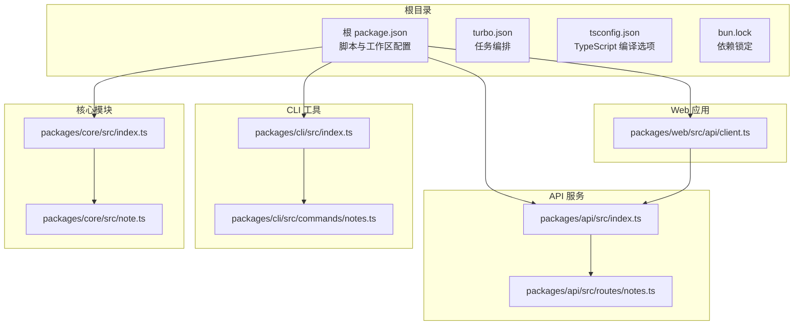
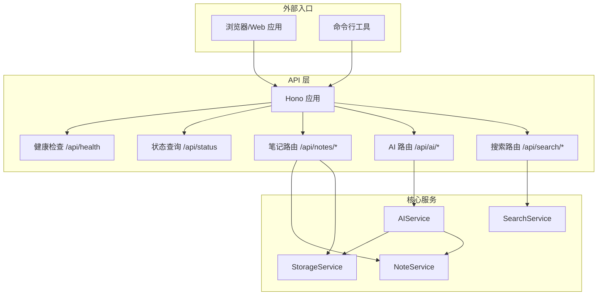
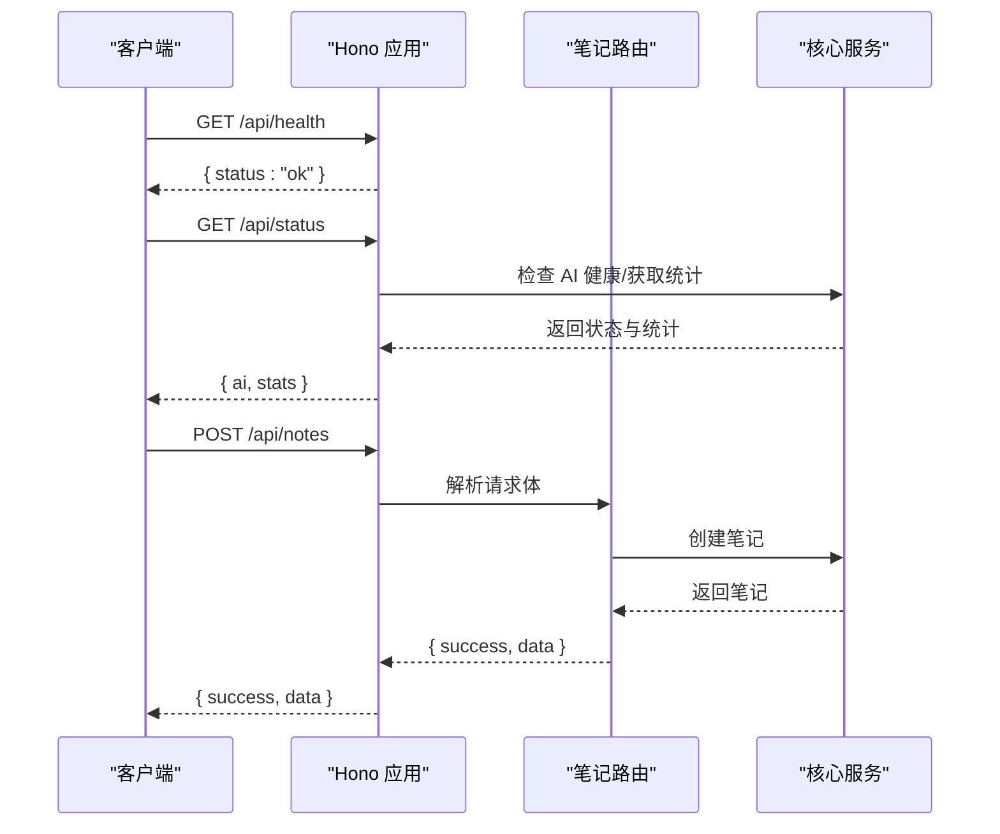
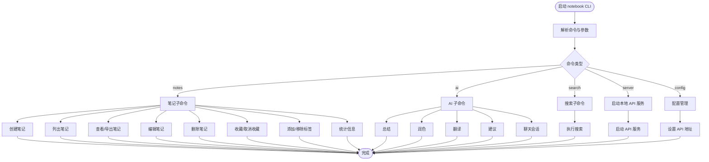
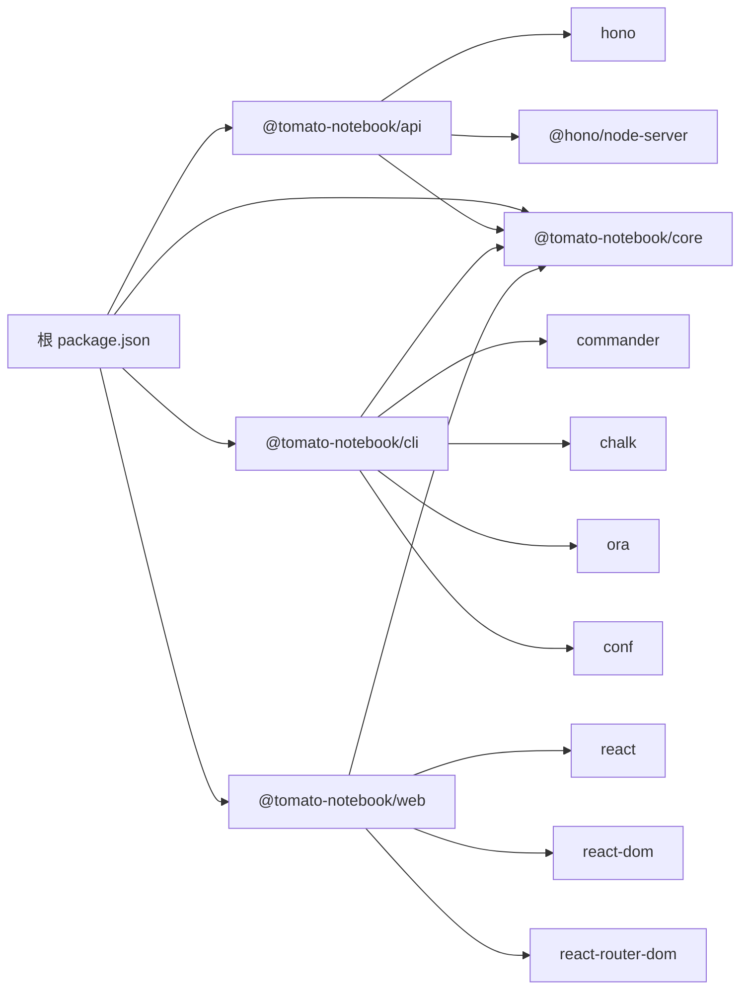

# 快速开始

<cite>
**本文引用的文件**
- [package.json](file://package.json)
- [turbo.json](file://turbo.json)
- [tsconfig.json](file://tsconfig.json)
- [bun.lock](file://bun.lock)
- [packages/api/package.json](file://packages/api/package.json)
- [packages/api/src/index.ts](file://packages/api/src/index.ts)
- [packages/api/src/routes/notes.ts](file://packages/api/src/routes/notes.ts)
- [packages/cli/package.json](file://packages/cli/package.json)
- [packages/cli/src/index.ts](file://packages/cli/src/index.ts)
- [packages/cli/src/commands/notes.ts](file://packages/cli/src/commands/notes.ts)
- [packages/core/package.json](file://packages/core/package.json)
- [packages/core/src/index.ts](file://packages/core/src/index.ts)
- [packages/core/src/note.ts](file://packages/core/src/note.ts)
- [packages/web/package.json](file://packages/web/package.json)
- [packages/web/src/api/client.ts](file://packages/web/src/api/client.ts)
</cite>

## 目录
1. [简介](#简介)
2. [项目结构](#项目结构)
3. [核心组件](#核心组件)
4. [架构总览](#架构总览)
5. [详细组件分析](#详细组件分析)
6. [依赖分析](#依赖分析)
7. [性能考虑](#性能考虑)
8. [故障排除指南](#故障排除指南)
9. [结论](#结论)
10. [附录](#附录)

## 简介
本指南面向初学者，帮助你在本地快速搭建并运行“番茄笔记”项目。你将完成环境准备、依赖安装、环境变量配置与初始设置，并掌握三种使用方式：
- Web 应用：通过浏览器访问图形界面
- CLI 工具：通过命令行进行笔记管理与 AI 功能调用
- RESTful API：直接对接后端接口进行开发或集成

此外，文档还提供创建第一个笔记、使用 AI 功能（如总结、润色、翻译、建议、聊天）的基本操作步骤，并给出常见问题的排查建议。

## 项目结构
项目采用多包工作区（monorepo）组织，根目录通过包管理器统一管理，各子包职责明确：
- packages/api：基于 Hono 的 Node 服务器，提供 RESTful API
- packages/cli：命令行工具，支持笔记管理、搜索、配置与启动本地 API 服务
- packages/core：核心业务逻辑与数据模型，提供存储、笔记、AI、搜索服务
- packages/web：基于 Vite + React 的前端应用，封装 API 客户端



图表来源
- [package.json:1-25](file://package.json#L1-L25)
- [turbo.json:1-23](file://turbo.json#L1-L23)
- [packages/api/src/index.ts:1-64](file://packages/api/src/index.ts#L1-L64)
- [packages/api/src/routes/notes.ts:1-161](file://packages/api/src/routes/notes.ts#L1-L161)
- [packages/cli/src/index.ts:1-91](file://packages/cli/src/index.ts#L1-L91)
- [packages/cli/src/commands/notes.ts:1-307](file://packages/cli/src/commands/notes.ts#L1-L307)
- [packages/core/src/index.ts:1-50](file://packages/core/src/index.ts#L1-L50)
- [packages/core/src/note.ts:1-159](file://packages/core/src/note.ts#L1-L159)
- [packages/web/src/api/client.ts:1-138](file://packages/web/src/api/client.ts#L1-L138)

章节来源
- [package.json:1-25](file://package.json#L1-L25)
- [turbo.json:1-23](file://turbo.json#L1-L23)
- [tsconfig.json:1-22](file://tsconfig.json#L1-L22)
- [bun.lock:1-565](file://bun.lock#L1-L565)

## 核心组件
- 核心服务工厂：在核心模块中集中创建存储、笔记、AI、搜索服务，支持可选的本地内存配置与默认数据目录
- API 服务：基于 Hono 构建，注册健康检查、状态查询与笔记、AI、搜索路由；支持跨域与环境变量配置
- CLI 工具：提供笔记 CRUD、收藏、标签、导出、统计、搜索、启动本地服务与配置管理等命令
- Web 客户端：封装统一的 API 客户端，提供笔记、搜索、AI 能力的前端调用

章节来源
- [packages/core/src/index.ts:1-50](file://packages/core/src/index.ts#L1-L50)
- [packages/api/src/index.ts:1-64](file://packages/api/src/index.ts#L1-L64)
- [packages/cli/src/index.ts:1-91](file://packages/cli/src/index.ts#L1-L91)
- [packages/web/src/api/client.ts:1-138](file://packages/web/src/api/client.ts#L1-L138)

## 架构总览
下图展示了从 Web、CLI 到 API 的调用链路，以及核心服务的依赖关系：



图表来源
- [packages/api/src/index.ts:1-64](file://packages/api/src/index.ts#L1-L64)
- [packages/api/src/routes/notes.ts:1-161](file://packages/api/src/routes/notes.ts#L1-L161)
- [packages/core/src/index.ts:1-50](file://packages/core/src/index.ts#L1-L50)

## 详细组件分析

### 组件一：API 服务（Hono）
- 启动流程：创建服务实例、注册 CORS、健康检查、状态查询与路由，最后启动 Node 服务器
- 环境变量：支持主机、端口、AI 服务的主机、端口与模型配置
- 路由：提供健康检查、状态查询、笔记增删改查、收藏、标签、导出、统计等接口



图表来源
- [packages/api/src/index.ts:1-64](file://packages/api/src/index.ts#L1-L64)
- [packages/api/src/routes/notes.ts:1-161](file://packages/api/src/routes/notes.ts#L1-L161)
- [packages/core/src/note.ts:1-159](file://packages/core/src/note.ts#L1-L159)

章节来源
- [packages/api/src/index.ts:1-64](file://packages/api/src/index.ts#L1-L64)
- [packages/api/src/routes/notes.ts:1-161](file://packages/api/src/routes/notes.ts#L1-L161)

### 组件二：CLI 工具
- 配置：使用 conf 存储 API 地址，默认 http://localhost:3000
- 命令：笔记管理（创建、列出、查看、编辑、删除、收藏、标签、导出、统计）、搜索、启动本地服务、配置管理
- 交互：使用 ora 显示加载动画，chalk 提供彩色输出



图表来源
- [packages/cli/src/index.ts:1-91](file://packages/cli/src/index.ts#L1-L91)
- [packages/cli/src/commands/notes.ts:1-307](file://packages/cli/src/commands/notes.ts#L1-L307)

章节来源
- [packages/cli/src/index.ts:1-91](file://packages/cli/src/index.ts#L1-L91)
- [packages/cli/src/commands/notes.ts:1-307](file://packages/cli/src/commands/notes.ts#L1-L307)

### 组件三：Web 客户端（API 客户端）
- 封装统一的 API 客户端，提供笔记、搜索、AI 能力的前端调用
- 统一响应结构：success、data、error、meta
- 支持分页、过滤、标签筛选、AI 能力调用

```mermaid
classDiagram
class APIClient {
+getNotes(filter, limit) APIResponse~Note[]~
+getNote(id) APIResponse~Note~
+createNote(data) APIResponse~Note~
+updateNote(id, data) APIResponse~Note~
+deleteNote(id) APIResponse~void~
+toggleFavorite(id) APIResponse~Note~
+addTags(id, tags) APIResponse~Note~
+searchNotes(query, options) APIResponse~Note[]~
+summarizeNote(id, length) APIResponse~{summary}~
+polishNote(id, style) APIResponse~{polished}~
+translateNote(id, language) APIResponse~{translation}~
+getSuggestions(noteId, context) APIResponse~{suggestions}~
+createChatSession(noteId) APIResponse~{id}~
+sendChatMessage(sessionId, message) APIResponse~{reply}~
+getStatus() APIResponse~{ai, stats}~
+getStats() APIResponse~{totalNotes,...}~
}
```

图表来源
- [packages/web/src/api/client.ts:1-138](file://packages/web/src/api/client.ts#L1-L138)

章节来源
- [packages/web/src/api/client.ts:1-138](file://packages/web/src/api/client.ts#L1-L138)

## 依赖分析
- 包管理器与版本：根 package.json 指定使用 Bun 作为包管理器与脚本运行时
- 工作区：packages/* 下的四个子包通过 workspaces 管理
- TypeScript：统一的编译选项，启用严格模式与声明文件生成
- 依赖锁定：bun.lock 记录了完整依赖树，确保构建一致性



图表来源
- [package.json:1-25](file://package.json#L1-L25)
- [bun.lock:1-565](file://bun.lock#L1-L565)
- [packages/api/package.json:1-22](file://packages/api/package.json#L1-L22)
- [packages/cli/package.json:1-26](file://packages/cli/package.json#L1-L26)
- [packages/core/package.json:1-26](file://packages/core/package.json#L1-L26)
- [packages/web/package.json:1-29](file://packages/web/package.json#L1-L29)

章节来源
- [package.json:1-25](file://package.json#L1-L25)
- [bun.lock:1-565](file://bun.lock#L1-L565)

## 性能考虑
- 开发模式缓存：turbo.json 中 dev 任务未启用缓存，适合迭代开发
- 构建产物：各包的 build 输出目录约定为 dist/**，web 为 .next/**
- 并行任务：turbo 可并行执行多个包的构建、测试、清理等任务
- 前端打包：Vite 提供快速冷启动与热更新，生产构建优化资源体积

章节来源
- [turbo.json:1-23](file://turbo.json#L1-L23)
- [packages/web/package.json:1-29](file://packages/web/package.json#L1-L29)

## 故障排除指南
- 无法启动 API 服务
  - 检查端口占用与 HOST/PORT 环境变量是否正确
  - 确认 OLLAMA_HOST/OLLAMA_PORT/OLLAMA_MODEL 是否可达
  - 查看健康检查与状态接口返回
- CLI 无法连接 API
  - 使用 notebook config 命令检查或设置 API 地址
  - 确保 API 服务已启动且允许来自 CLI 的跨域请求
- 笔记导出失败
  - 确认笔记 ID 存在，导出格式支持 json 与 markdown
- Web 应用无法加载数据
  - 检查代理或同源策略，确认 /api 前缀路由映射正确

章节来源
- [packages/api/src/index.ts:1-64](file://packages/api/src/index.ts#L1-L64)
- [packages/cli/src/index.ts:1-91](file://packages/cli/src/index.ts#L1-L91)
- [packages/web/src/api/client.ts:1-138](file://packages/web/src/api/client.ts#L1-L138)

## 结论
通过本快速开始指南，你已经完成了环境准备、依赖安装、环境变量配置与初始设置，并掌握了三种使用方式（Web、CLI、API）。你可以立即创建第一个笔记并通过 AI 能力进行总结、润色、翻译与建议。遇到问题时，可参考故障排除部分进行定位与修复。

## 附录

### 环境准备与安装
- 安装 Bun（包管理器与运行时）
  - 使用系统包管理器或官方安装脚本安装 Bun
  - 确认版本满足根 package.json 中的版本要求
- 安装 Node.js（兼容性）
  - 项目使用 @types/node 与 TypeScript，确保 Node 版本与类型定义匹配
- 初始化工作区
  - 在项目根目录执行安装命令，自动安装所有子包依赖

章节来源
- [package.json:1-25](file://package.json#L1-L25)
- [bun.lock:1-565](file://bun.lock#L1-L565)

### 依赖安装与初始设置
- 安装依赖
  - 使用 Bun 管理工作区依赖，确保所有子包安装完成
- TypeScript 配置
  - 项目采用严格模式与 ESNext 模块解析，确保 IDE 与构建一致
- 数据目录
  - 默认数据目录为 ./data，可在核心服务工厂中自定义

章节来源
- [tsconfig.json:1-22](file://tsconfig.json#L1-L22)
- [packages/core/src/index.ts:1-50](file://packages/core/src/index.ts#L1-L50)

### 启动流程
- 启动 API 服务
  - 进入 packages/api，执行开发或构建命令
  - 环境变量：HOST、PORT、OLLAMA_HOST、OLLAMA_PORT、OLLAMA_MODEL
- 启动 Web 应用
  - 进入 packages/web，执行开发或构建命令
  - 默认访问 http://localhost:5173
- 启动 CLI 工具
  - 进入项目根目录，执行 notebook 命令
  - 默认 API 地址为 http://localhost:3000，可通过配置命令修改

章节来源
- [packages/api/src/index.ts:1-64](file://packages/api/src/index.ts#L1-L64)
- [packages/web/package.json:1-29](file://packages/web/package.json#L1-L29)
- [packages/cli/src/index.ts:1-91](file://packages/cli/src/index.ts#L1-L91)

### 基本使用示例

- 创建第一个笔记（Web）
  - 打开 Web 应用，进入新建页面，填写标题与内容，保存
  - 或通过 API 客户端调用创建接口

- 创建第一个笔记（CLI）
  - 使用 notebook notes create <title> [--content] [--tags]
  - 查看笔记列表：notebook notes list
  - 查看笔记详情：notebook notes show <id> [-f json|markdown]

- 使用 AI 功能（Web）
  - 在笔记详情页调用“总结/润色/翻译/建议/聊天”
  - 通过 API 客户端的 AI 方法进行调用

- 使用 AI 功能（CLI）
  - 使用 notebook ai 子命令（如总结、润色、翻译、建议、聊天）
  - 注意：需确保 API 服务已启动且 AI 服务可用

章节来源
- [packages/web/src/api/client.ts:1-138](file://packages/web/src/api/client.ts#L1-L138)
- [packages/cli/src/commands/notes.ts:1-307](file://packages/cli/src/commands/notes.ts#L1-L307)

### 不同运行方式说明
- Web 界面：适合日常使用与可视化管理，提供笔记列表、详情、搜索与 AI 能力
- CLI 工具：适合自动化与批量处理，支持笔记 CRUD、收藏、标签、导出、统计、搜索与启动本地服务
- RESTful API：适合二次开发与集成，提供统一的接口规范与响应结构

章节来源
- [packages/web/src/api/client.ts:1-138](file://packages/web/src/api/client.ts#L1-L138)
- [packages/cli/src/index.ts:1-91](file://packages/cli/src/index.ts#L1-L91)
- [packages/api/src/index.ts:1-64](file://packages/api/src/index.ts#L1-L64)