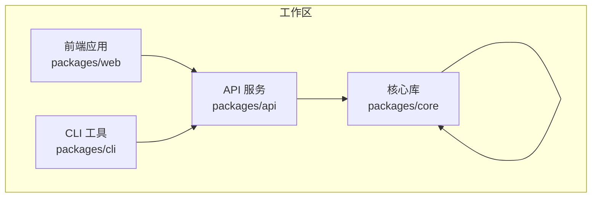
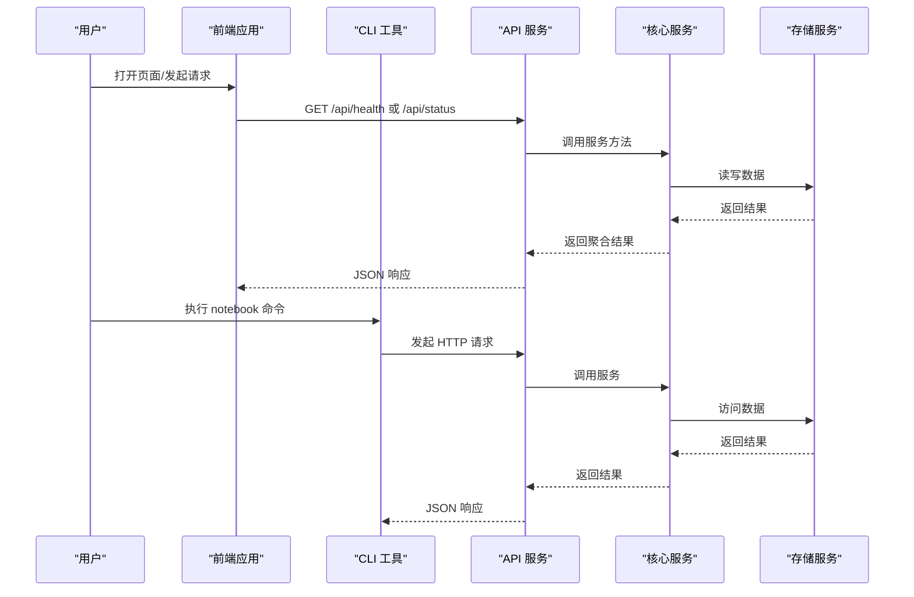
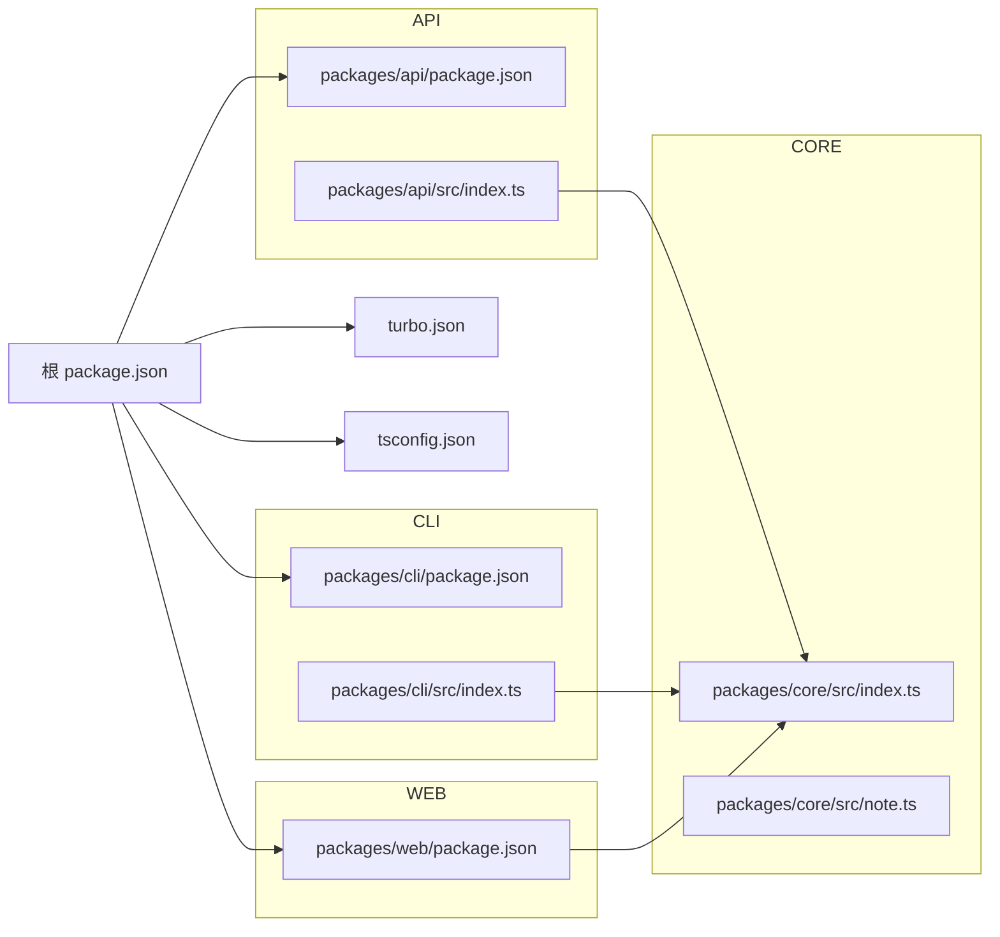
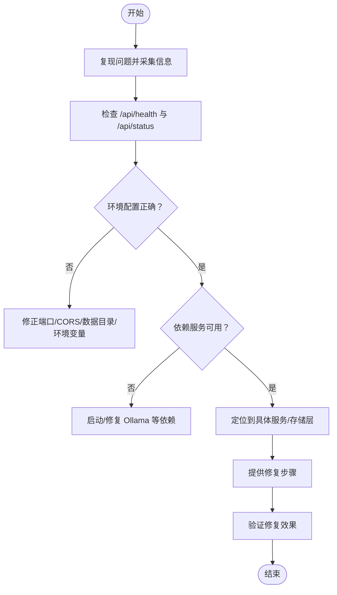

# 故障排除与FAQ

<cite>
**本文引用的文件**
- [package.json](file://package.json)
- [turbo.json](file://turbo.json)
- [tsconfig.json](file://tsconfig.json)
- [packages/api/src/index.ts](file://packages/api/src/index.ts)
- [packages/api/package.json](file://packages/api/package.json)
- [packages/cli/src/index.ts](file://packages/cli/src/index.ts)
- [packages/cli/package.json](file://packages/cli/package.json)
- [packages/core/src/index.ts](file://packages/core/src/index.ts)
- [packages/core/src/note.ts](file://packages/core/src/note.ts)
- [packages/core/src/storage.ts](file://packages/core/src/storage.ts)
- [packages/core/src/ai.ts](file://packages/core/src/ai.ts)
- [packages/core/src/search.ts](file://packages/core/src/search.ts)
- [packages/web/package.json](file://packages/web/package.json)
</cite>

## 目录
1. [简介](#简介)
2. [项目结构](#项目结构)
3. [核心组件](#核心组件)
4. [架构总览](#架构总览)
5. [详细组件分析](#详细组件分析)
6. [依赖分析](#依赖分析)
7. [性能考虑](#性能考虑)
8. [故障排除指南](#故障排除指南)
9. [结论](#结论)
10. [附录](#附录)

## 简介
本指南面向番茄笔记（Tomato Notebook）的使用者与技术支持人员，覆盖从基础安装、环境配置、API 调用到性能诊断与常见问题的完整排查路径。内容基于仓库中的实际实现，聚焦以下方面：
- 环境变量与配置项缺失导致的启动失败
- AI 服务（Ollama）连接异常与健康检查
- 存储目录权限与数据迁移问题
- Web 与 API 的跨域与端口占用
- CLI 客户端请求失败与配置读取
- 日志与错误追踪建议
- 已知限制与兼容性提示
- 社区支持与获取帮助渠道

## 项目结构
项目采用多包工作区（monorepo），通过构建系统统一管理前端、后端、CLI 与核心库。关键模块职责如下：
- packages/api：基于 Hono 的后端 API 服务，提供健康检查、状态查询与路由注册
- packages/cli：命令行工具，封装 API 客户端，提供笔记、AI、搜索、服务与配置相关命令
- packages/core：核心业务逻辑与服务工厂，包括存储、笔记、AI、搜索服务
- packages/web：前端应用（React + Vite），作为用户界面与交互入口

图表来源
- [packages/api/src/index.ts:1-64](file://packages/api/src/index.ts#L1-L64)
- [packages/cli/src/index.ts:1-91](file://packages/cli/src/index.ts#L1-L91)
- [packages/core/src/index.ts:1-50](file://packages/core/src/index.ts#L1-L50)
- [packages/web/package.json:1-29](file://packages/web/package.json#L1-L29)

章节来源
- [package.json:1-25](file://package.json#L1-L25)
- [turbo.json:1-23](file://turbo.json#L1-L23)
- [tsconfig.json:1-22](file://tsconfig.json#L1-L22)

## 核心组件
- 服务工厂 createServices：负责初始化存储、笔记、AI、搜索服务，并注入配置（如数据目录、Ollama 主机/端口/模型）
- NoteService：提供笔记的增删改查、收藏、标签、分类、导出等功能
- 存储层：抽象存储接口，具体实现由存储服务提供（例如本地文件或内存）
- API 层：健康检查 /api/health 与状态 /api/status；注册笔记、AI、搜索路由
- CLI 层：封装 fetch 请求，读取 conf 配置，提供命令分组与版本信息

章节来源
- [packages/core/src/index.ts:1-50](file://packages/core/src/index.ts#L1-L50)
- [packages/core/src/note.ts:1-159](file://packages/core/src/note.ts#L1-L159)
- [packages/api/src/index.ts:1-64](file://packages/api/src/index.ts#L1-L64)
- [packages/cli/src/index.ts:1-91](file://packages/cli/src/index.ts#L1-L91)

## 架构总览
下图展示从浏览器/CLI 到 API，再到核心服务与存储的整体调用链。

图表来源
- [packages/api/src/index.ts:1-64](file://packages/api/src/index.ts#L1-L64)
- [packages/core/src/index.ts:1-50](file://packages/core/src/index.ts#L1-L50)
- [packages/cli/src/index.ts:1-91](file://packages/cli/src/index.ts#L1-L91)

## 详细组件分析

### API 服务（Hono）
- 启动与监听：根据环境变量 HOST/PORT 绑定地址，默认 0.0.0.0:3000
- CORS：允许来自 http://localhost:5173 的跨域请求，支持常用方法与头
- 健康检查：/api/health 返回服务状态与时间戳
- 状态查询：/api/status 检查 AI 服务连通性与存储统计
- 路由注册：/api/notes、/api/ai、/api/search

章节来源
- [packages/api/src/index.ts:1-64](file://packages/api/src/index.ts#L1-L64)
- [packages/api/package.json:1-22](file://packages/api/package.json#L1-L22)

### 核心服务工厂与笔记服务
- createServices：创建并初始化存储、笔记、AI、搜索服务，支持传入数据目录与 Ollama 配置
- NoteService：提供创建、查询、更新、删除、收藏切换、标签管理、分类设置、搜索、导出等能力

章节来源
- [packages/core/src/index.ts:1-50](file://packages/core/src/index.ts#L1-L50)
- [packages/core/src/note.ts:1-159](file://packages/core/src/note.ts#L1-L159)

### CLI 客户端
- 配置读取：使用 conf 读取 apiUrl，默认 http://localhost:3000
- 请求封装：统一的 request 方法，自动设置 Content-Type 并解析 JSON
- 命令分组：导入 notes、ai、search、server、config 命令并注册

章节来源
- [packages/cli/src/index.ts:1-91](file://packages/cli/src/index.ts#L1-L91)
- [packages/cli/package.json:1-26](file://packages/cli/package.json#L1-L26)

## 依赖分析
- 构建与任务：Turbo 管理 dev/build/lint/test/clean，dev 任务持久化且不缓存
- TypeScript：严格模式、ESNext 模块解析、声明与 sourcemap 生成
- 包依赖：API 依赖 Hono 与 Node 服务器；CLI 依赖 commander、chalk、ora、conf；核心依赖 uuid；Web 依赖 React、Vite、TailwindCSS

图表来源
- [package.json:1-25](file://package.json#L1-L25)
- [turbo.json:1-23](file://turbo.json#L1-L23)
- [tsconfig.json:1-22](file://tsconfig.json#L1-L22)
- [packages/api/package.json:1-22](file://packages/api/package.json#L1-L22)
- [packages/api/src/index.ts:1-64](file://packages/api/src/index.ts#L1-L64)
- [packages/cli/package.json:1-26](file://packages/cli/package.json#L1-L26)
- [packages/cli/src/index.ts:1-91](file://packages/cli/src/index.ts#L1-L91)
- [packages/core/src/index.ts:1-50](file://packages/core/src/index.ts#L1-L50)
- [packages/web/package.json:1-29](file://packages/web/package.json#L1-L29)

章节来源
- [package.json:1-25](file://package.json#L1-L25)
- [turbo.json:1-23](file://turbo.json#L1-L23)
- [tsconfig.json:1-22](file://tsconfig.json#L1-L22)

## 性能考虑
- 开发模式：Turbo dev 任务不缓存，适合迭代开发；生产构建开启输出缓存
- 存储访问：批量操作建议合并请求，避免频繁小请求；大文本搜索可考虑分页与索引策略
- AI 服务：Ollama 远程调用存在网络延迟，建议在本地部署或优化模型选择
- 前端：Vite 构建与 React 18 生态，注意避免不必要的重渲染与大数据量列表虚拟化

## 故障排除指南

### 一、环境配置与启动问题
- 症状：API 无法启动或绑定失败
  - 排查要点：
    - 端口被占用：确认 PORT/HOST 环境变量是否正确，尝试更换端口
    - 权限不足：以非 root 用户运行时注意目录权限
  - 参考实现位置：
    - [packages/api/src/index.ts:54-63](file://packages/api/src/index.ts#L54-L63)
- 症状：CORS 失败或跨域报错
  - 排查要点：
    - 前端开发端口需在允许列表中（默认 localhost:5173）
    - 若自定义前端端口，请同步调整 CORS 允许列表
  - 参考实现位置：
    - [packages/api/src/index.ts:21-25](file://packages/api/src/index.ts#L21-L25)

章节来源
- [packages/api/src/index.ts:21-25](file://packages/api/src/index.ts#L21-L25)
- [packages/api/src/index.ts:54-63](file://packages/api/src/index.ts#L54-L63)

### 二、API 健康与状态检查
- 症状：/api/health 返回异常或 /api/status 显示 AI disconnected
  - 排查要点：
    - 使用 /api/health 快速判断服务可用性
    - 使用 /api/status 检查 AI 服务连通性与存储统计
  - 参考实现位置：
    - [packages/api/src/index.ts:28-41](file://packages/api/src/index.ts#L28-L41)

章节来源
- [packages/api/src/index.ts:28-41](file://packages/api/src/index.ts#L28-L41)

### 三、AI 服务（Ollama）连接问题
- 症状：AI 功能不可用或状态显示 disconnected
  - 排查要点：
    - 确认 Ollama 服务运行与可达
    - 检查环境变量 OLLAMA_HOST/OLLAMA_PORT/OLLAMA_MODEL 是否正确
    - 本地默认主机与端口为 localhost:11434，模型默认 llama3
  - 参考实现位置：
    - [packages/api/src/index.ts:7-14](file://packages/api/src/index.ts#L7-L14)
    - [packages/core/src/index.ts:34-44](file://packages/core/src/index.ts#L34-L44)

章节来源
- [packages/api/src/index.ts:7-14](file://packages/api/src/index.ts#L7-L14)
- [packages/core/src/index.ts:34-44](file://packages/core/src/index.ts#L34-L44)

### 四、存储与数据目录问题
- 症状：笔记无法保存、读取或出现权限错误
  - 排查要点：
    - 数据目录默认 ./data，可通过配置项指定
    - 确保运行用户对数据目录有读写权限
    - 如需迁移数据，备份后清理旧目录再重启
  - 参考实现位置：
    - [packages/core/src/index.ts:26-29](file://packages/core/src/index.ts#L26-L29)

章节来源
- [packages/core/src/index.ts:26-29](file://packages/core/src/index.ts#L26-L29)

### 五、CLI 客户端请求失败
- 症状：执行 notebook 命令返回 404/500 或超时
  - 排查要点：
    - 确认 conf 中的 apiUrl 指向正确的 API 地址
    - 检查 API 服务是否已启动且可访问
    - 观察 CLI 的 fetch 请求是否携带正确的 Content-Type
  - 参考实现位置：
    - [packages/cli/src/index.ts:8-13](file://packages/cli/src/index.ts#L8-L13)
    - [packages/cli/src/index.ts:23-34](file://packages/cli/src/index.ts#L23-L34)

章节来源
- [packages/cli/src/index.ts:8-13](file://packages/cli/src/index.ts#L8-L13)
- [packages/cli/src/index.ts:23-34](file://packages/cli/src/index.ts#L23-L34)

### 六、笔记功能异常
- 症状：创建/更新/删除笔记失败或收藏/标签操作无效
  - 排查要点：
    - 确认笔记 ID 有效
    - 检查存储层是否正常（如文件系统权限）
    - 使用搜索功能验证索引状态
  - 参考实现位置：
    - [packages/core/src/note.ts:14-45](file://packages/core/src/note.ts#L14-L45)
    - [packages/core/src/note.ts:78-89](file://packages/core/src/note.ts#L78-L89)
    - [packages/core/src/note.ts:91-107](file://packages/core/src/note.ts#L91-L107)

章节来源
- [packages/core/src/note.ts:14-45](file://packages/core/src/note.ts#L14-L45)
- [packages/core/src/note.ts:78-89](file://packages/core/src/note.ts#L78-L89)
- [packages/core/src/note.ts:91-107](file://packages/core/src/note.ts#L91-L107)

### 七、日志与错误追踪
- 建议做法：
  - API 服务：在启动处打印监听地址，便于定位
  - CLI：使用 ora 提示加载状态，结合 chalk 输出彩色信息
  - 错误处理：在 fetch 请求中捕获异常并记录响应状态码与消息
- 参考实现位置：
  - [packages/api/src/index.ts:57-63](file://packages/api/src/index.ts#L57-L63)
  - [packages/cli/src/index.ts:62-65](file://packages/cli/src/index.ts#L62-L65)
  - [packages/cli/src/index.ts:23-34](file://packages/cli/src/index.ts#L23-L34)

章节来源
- [packages/api/src/index.ts:57-63](file://packages/api/src/index.ts#L57-L63)
- [packages/cli/src/index.ts:62-65](file://packages/cli/src/index.ts#L62-L65)
- [packages/cli/src/index.ts:23-34](file://packages/cli/src/index.ts#L23-L34)

### 八、系统兼容性与已知限制
- Node/Bun 版本：项目使用 Bun 作为包管理器与运行时，建议使用推荐版本以获得最佳兼容性
- 浏览器：前端基于 Vite，建议使用现代浏览器进行开发与测试
- 模型与硬件：AI 功能依赖本地或远程 Ollama，模型大小与显存/内存需求请参考 Ollama 文档
- 参考实现位置：
  - [package.json:23-23](file://package.json#L23-L23)
  - [packages/web/package.json:1-29](file://packages/web/package.json#L1-L29)

章节来源
- [package.json:23-23](file://package.json#L23-L23)
- [packages/web/package.json:1-29](file://packages/web/package.json#L1-L29)

### 九、问题分类与处理流程（给技术支持）
- 分类建议：
  - 环境配置类：端口/CORS/数据目录/环境变量
  - 服务连通类：API 健康检查/AI 连接
  - 数据访问类：笔记 CRUD/搜索/导出
  - 客户端类：CLI 请求失败/配置错误
- 处理流程（示意）：
  1) 复现问题并采集信息（URL、状态码、错误日志）
  2) 检查对应模块的健康检查与状态接口
  3) 核对配置项与依赖服务（如 Ollama）
  4) 逐步缩小范围至具体服务或存储层
  5) 提供修复步骤与回滚方案

## 结论
本指南提供了从环境配置、API 健康检查、AI 连接、存储访问到 CLI 请求与前端交互的全链路故障排除路径。建议在日常运维中：
- 将健康检查与状态接口纳入监控
- 在开发阶段启用严格的类型检查与源码映射
- 对外暴露的 API 明确 CORS 白名单与鉴权策略
- 对大流量场景提前评估存储与 AI 服务的性能瓶颈

## 附录

### 常用命令与脚本
- 开发：根目录执行 dev 脚本，分别启动 API、CLI、Web 与核心库的开发进程
- 构建：执行 build 脚本，按依赖顺序构建各包
- 清理：执行 clean 脚本，清理构建产物与缓存
- 参考实现位置：
  - [package.json:8-14](file://package.json#L8-L14)

章节来源
- [package.json:8-14](file://package.json#L8-L14)

### 社区资源与获取帮助
- 仓库与文档：请关注项目 README 与变更日志
- 问题反馈：在仓库 Issues 提交前，请附带：
  - 环境信息（操作系统、Node/Bun 版本、浏览器）
  - 复现步骤与期望/实际行为
  - 关键日志与状态接口返回值
- 参考实现位置：
  - [packages/cli/src/index.ts:75-80](file://packages/cli/src/index.ts#L75-L80)

章节来源
- [packages/cli/src/index.ts:75-80](file://packages/cli/src/index.ts#L75-L80)