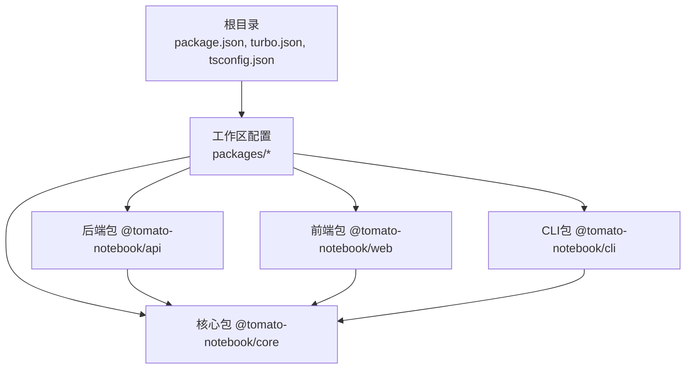
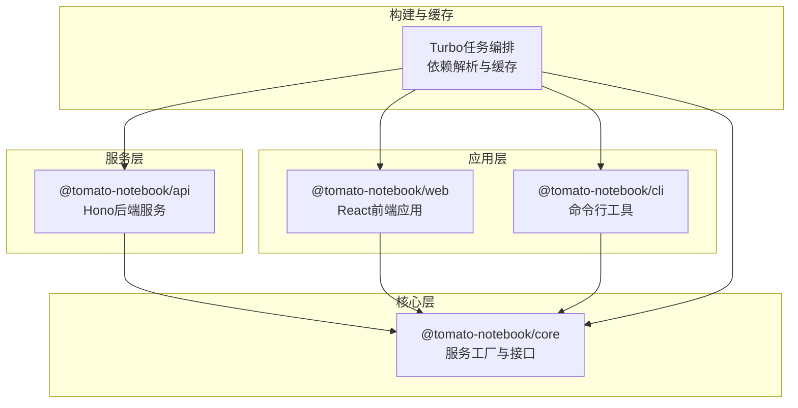
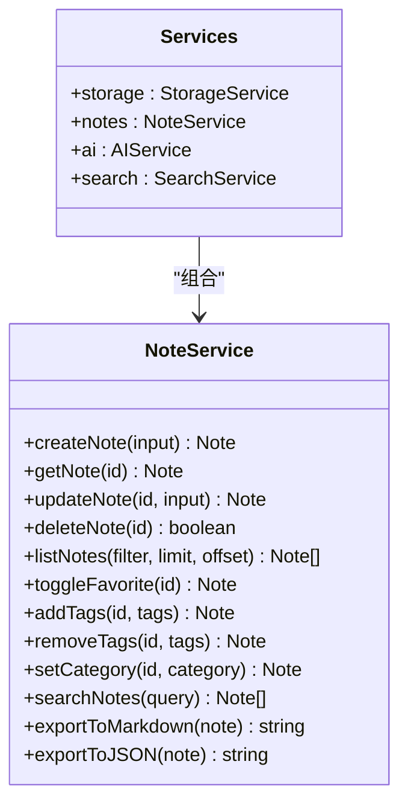
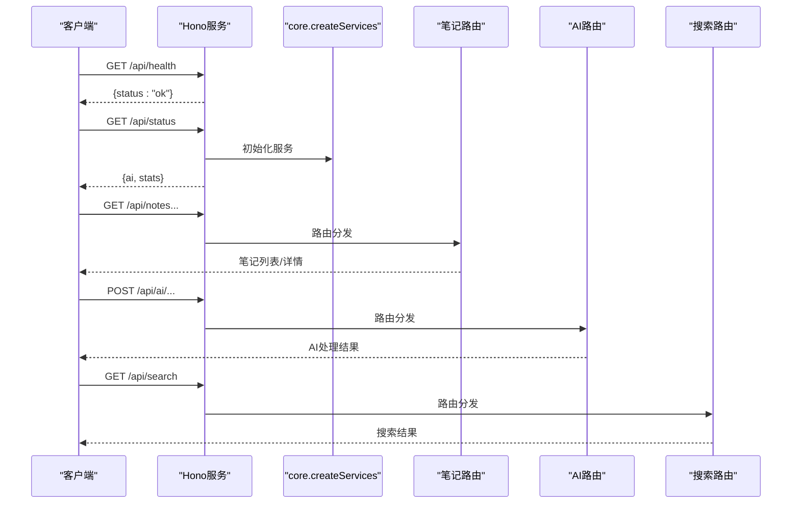
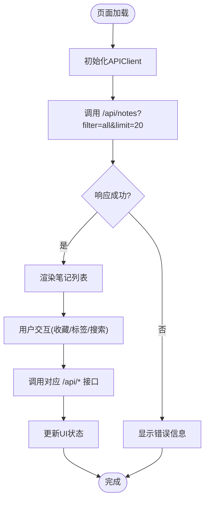
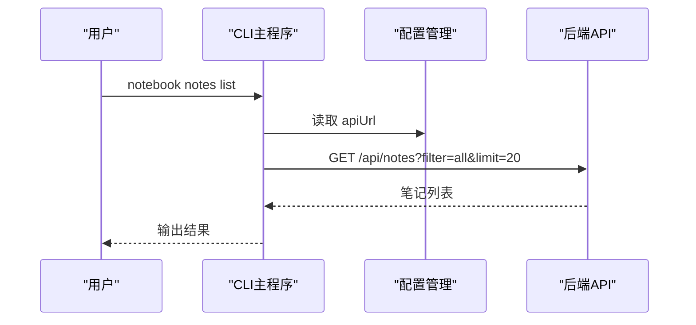
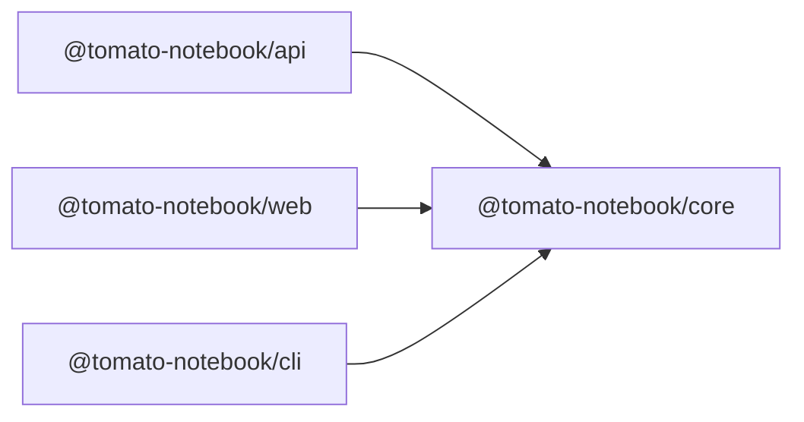

# Monorepo架构设计

<cite>
**本文档引用的文件**
- [package.json](file://package.json)
- [turbo.json](file://turbo.json)
- [tsconfig.json](file://tsconfig.json)
- [packages/core/package.json](file://packages/core/package.json)
- [packages/api/package.json](file://packages/api/package.json)
- [packages/web/package.json](file://packages/web/package.json)
- [packages/cli/package.json](file://packages/cli/package.json)
- [packages/core/src/index.ts](file://packages/core/src/index.ts)
- [packages/core/src/note.ts](file://packages/core/src/note.ts)
- [packages/api/src/index.ts](file://packages/api/src/index.ts)
- [packages/web/src/api/client.ts](file://packages/web/src/api/client.ts)
- [packages/cli/src/index.ts](file://packages/cli/src/index.ts)
</cite>

## 目录
1. [简介](#简介)
2. [项目结构](#项目结构)
3. [核心组件](#核心组件)
4. [架构总览](#架构总览)
5. [详细组件分析](#详细组件分析)
6. [依赖关系分析](#依赖关系分析)
7. [性能考虑](#性能考虑)
8. [故障排除指南](#故障排除指南)
9. [结论](#结论)
10. [附录](#附录)

## 简介
本项目采用Monorepo架构，使用Bun作为包管理器与运行时，Turbo作为构建系统与任务编排工具。项目通过工作区(workspaces)统一管理四个包：core（核心服务库）、api（后端服务）、web（前端应用）、cli（命令行工具）。Turbo负责跨包的任务执行、依赖关系解析与缓存，确保增量构建与高效开发体验。

## 项目结构
项目根目录包含工作区配置、全局脚本与Turbo配置；四个包分别位于packages目录下，每个包拥有独立的package.json与构建脚本。TypeScript配置在根目录统一管理，确保各包共享一致的编译选项。

图表来源
- [package.json:5-7](file://package.json#L5-L7)
- [packages/core/package.json:1-26](file://packages/core/package.json#L1-L26)
- [packages/api/package.json:13-17](file://packages/api/package.json#L13-L17)
- [packages/web/package.json:11-17](file://packages/web/package.json#L11-L17)
- [packages/cli/package.json:15-21](file://packages/cli/package.json#L15-L21)

章节来源
- [package.json:1-25](file://package.json#L1-L25)
- [turbo.json:1-23](file://turbo.json#L1-L23)
- [tsconfig.json:1-22](file://tsconfig.json#L1-L22)

## 核心组件
- 核心服务库(core)：提供统一的服务工厂与接口，封装存储、笔记、AI与搜索能力，作为其他包的共享依赖。
- 后端服务(api)：基于Hono框架的REST服务，依赖core创建服务实例，并暴露HTTP接口。
- 前端应用(web)：基于Vite与React的Web应用，通过API客户端调用后端接口。
- 命令行工具(cli)：基于Commander的CLI工具，通过HTTP客户端与后端交互，支持配置管理。

章节来源
- [packages/core/src/index.ts:1-50](file://packages/core/src/index.ts#L1-L50)
- [packages/api/src/index.ts:1-64](file://packages/api/src/index.ts#L1-L64)
- [packages/web/src/api/client.ts:1-138](file://packages/web/src/api/client.ts#L1-L138)
- [packages/cli/src/index.ts:1-91](file://packages/cli/src/index.ts#L1-L91)

## 架构总览
整体架构围绕core展开，api、web、cli均以workspace依赖方式使用core。Turbo根据任务定义与依赖关系，自动决定构建顺序与缓存命中策略，实现跨包增量构建与持久化开发任务。

图表来源
- [packages/api/package.json:13-17](file://packages/api/package.json#L13-L17)
- [packages/web/package.json:11-17](file://packages/web/package.json#L11-L17)
- [packages/cli/package.json:15-21](file://packages/cli/package.json#L15-L21)
- [turbo.json:3-21](file://turbo.json#L3-L21)

## 详细组件分析

### 核心服务库(core)
- 职责：统一创建与导出服务实例，包括存储、笔记、AI与搜索服务；提供便捷的createServices工厂方法。
- 关键点：通过工厂模式集中初始化依赖，便于在api、web、cli中复用；默认数据目录与AI服务配置可被上层覆盖。
- 复杂度：O(1)初始化，依赖注入清晰，易于扩展新服务。

图表来源
- [packages/core/src/index.ts:18-49](file://packages/core/src/index.ts#L18-L49)
- [packages/core/src/note.ts:7-159](file://packages/core/src/note.ts#L7-L159)

章节来源
- [packages/core/src/index.ts:1-50](file://packages/core/src/index.ts#L1-L50)
- [packages/core/src/note.ts:1-159](file://packages/core/src/note.ts#L1-L159)
- [packages/core/package.json:1-26](file://packages/core/package.json#L1-L26)

### 后端服务(api)
- 职责：启动Hono服务，注册路由，暴露健康检查、状态查询与业务接口；通过环境变量配置AI服务参数。
- 关键点：使用core提供的createServices创建统一服务实例；CORS配置允许本地前端访问；路由模块化组织。
- 集成点：与core深度耦合，直接依赖其服务工厂与类型。

图表来源
- [packages/api/src/index.ts:1-64](file://packages/api/src/index.ts#L1-L64)

章节来源
- [packages/api/src/index.ts:1-64](file://packages/api/src/index.ts#L1-L64)
- [packages/api/package.json:1-22](file://packages/api/package.json#L1-L22)

### 前端应用(web)
- 职责：提供React用户界面，通过API客户端调用后端接口，展示笔记、AI功能与搜索能力。
- 关键点：API客户端封装统一请求逻辑，支持分页、过滤与错误处理；与后端路由保持一致的路径约定。
- 集成点：依赖core的类型定义与服务接口，确保前后端契约一致。

图表来源
- [packages/web/src/api/client.ts:28-138](file://packages/web/src/api/client.ts#L28-L138)

章节来源
- [packages/web/src/api/client.ts:1-138](file://packages/web/src/api/client.ts#L1-L138)
- [packages/web/package.json:1-29](file://packages/web/package.json#L1-L29)

### 命令行工具(cli)
- 职责：提供本地化的命令行操作，包括笔记管理、AI功能、搜索与服务控制；支持配置持久化。
- 关键点：通过HTTP客户端与后端通信；使用配置文件保存API地址等设置；结合进度提示与颜色输出提升用户体验。
- 集成点：与后端API保持一致的接口契约，便于离线或快速验证。

图表来源
- [packages/cli/src/index.ts:1-91](file://packages/cli/src/index.ts#L1-L91)

章节来源
- [packages/cli/src/index.ts:1-91](file://packages/cli/src/index.ts#L1-L91)
- [packages/cli/package.json:1-26](file://packages/cli/package.json#L1-L26)

## 依赖关系分析
- 工作区与包管理：根package.json声明工作区为packages/*，Bun作为包管理器与运行时，确保包间依赖解析与脚本执行的一致性。
- 包间依赖：api、web、cli均以workspace:*依赖core，形成单向依赖树，避免循环依赖。
- 共享依赖：core作为共享库，集中管理服务与类型，减少重复实现。
- 版本控制：各包version统一为0.1.0，便于发布与回滚；可通过Bun的版本管理策略进行升级。

图表来源
- [packages/api/package.json:14](file://packages/api/package.json#L14)
- [packages/web/package.json:12](file://packages/web/package.json#L12)
- [packages/cli/package.json:16](file://packages/cli/package.json#L16)

章节来源
- [package.json:1-25](file://package.json#L1-L25)
- [packages/core/package.json:1-26](file://packages/core/package.json#L1-L26)
- [packages/api/package.json:1-22](file://packages/api/package.json#L1-L22)
- [packages/web/package.json:1-29](file://packages/web/package.json#L1-L29)
- [packages/cli/package.json:1-26](file://packages/cli/package.json#L1-L26)

## 性能考虑
- 构建缓存：Turbo通过任务定义中的outputs与缓存策略，对build、lint、test等任务进行缓存，加速增量构建。
- 开发体验：dev任务标记为持久化(persistent)，适合长期运行的开发服务器；禁用缓存(cache: false)确保实时变更生效。
- 依赖拓扑：利用^build依赖链，确保上游包先于下游包完成构建，减少重复编译。
- 编译配置：根tsconfig启用严格模式与声明文件生成，提升类型安全与IDE体验。

章节来源
- [turbo.json:4-20](file://turbo.json#L4-L20)
- [tsconfig.json:2-19](file://tsconfig.json#L2-L19)

## 故障排除指南
- 构建失败：检查各包的build脚本是否正确；确认core已先于api/web/cli构建。
- 端口冲突：修改后端服务监听端口或主机地址；确保前端代理与后端端口一致。
- 环境变量：核对AI服务相关环境变量(如OLLAMA_HOST/PORT/MODEL)是否正确设置。
- 缓存问题：执行清理脚本清除缓存与dist目录，重新构建。
- 依赖不匹配：使用Bun锁定文件(bun.lock)保证依赖版本一致性。

章节来源
- [package.json:8-14](file://package.json#L8-L14)
- [packages/api/src/index.ts:7-14](file://packages/api/src/index.ts#L7-L14)

## 结论
本Monorepo通过Turbo与Bun实现了高效的多包协作与构建管理。core作为共享库承载核心业务逻辑，api、web、cli围绕core提供不同的接入面。合理的依赖关系与缓存策略确保了开发效率与构建性能。建议持续完善测试与发布流程，逐步引入自动化校验与版本管理策略。

## 附录
- 开发工作流建议
  - 使用dev脚本同时启动多个包的开发服务
  - 在变更核心逻辑时优先更新core，再验证api/web/cli
  - 利用lint与test任务保证代码质量
  - 通过clean脚本清理缓存与构建产物
- 最佳实践
  - 保持core的无副作用与纯函数特性
  - 统一API客户端的错误处理与重试策略
  - 在CLI中提供配置子命令，便于环境切换
  - 使用语义化版本与变更日志管理发布节奏