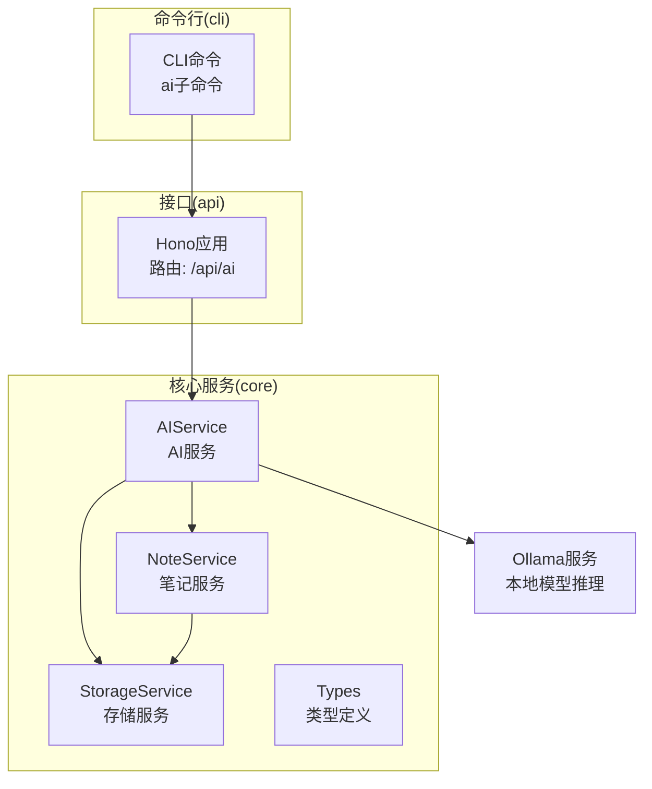
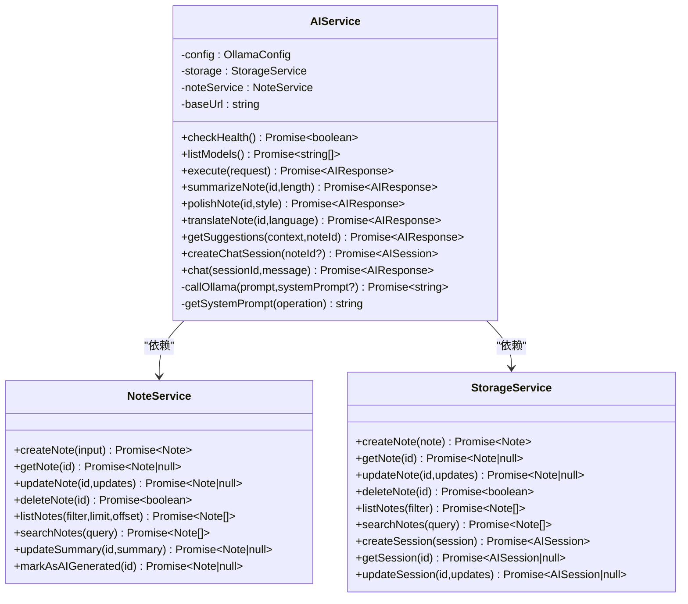
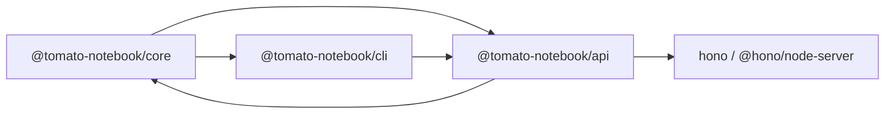

# AI服务

<cite>
**本文引用的文件**
- [packages/core/src/ai.ts](file://packages/core/src/ai.ts)
- [packages/core/src/types.ts](file://packages/core/src/types.ts)
- [packages/core/src/storage.ts](file://packages/core/src/storage.ts)
- [packages/core/src/note.ts](file://packages/core/src/note.ts)
- [packages/api/src/routes/ai.ts](file://packages/api/src/routes/ai.ts)
- [packages/api/src/index.ts](file://packages/api/src/index.ts)
- [packages/cli/src/commands/ai.ts](file://packages/cli/src/commands/ai.ts)
- [packages/core/src/index.ts](file://packages/core/src/index.ts)
- [package.json](file://package.json)
- [packages/api/package.json](file://packages/api/package.json)
- [packages/core/package.json](file://packages/core/package.json)
</cite>

## 目录
1. [简介](#简介)
2. [项目结构](#项目结构)
3. [核心组件](#核心组件)
4. [架构总览](#架构总览)
5. [详细组件分析](#详细组件分析)
6. [依赖关系分析](#依赖关系分析)
7. [性能考虑](#性能考虑)
8. [故障排查指南](#故障排查指南)
9. [结论](#结论)
10. [附录](#附录)

## 简介
本项目提供一个基于本地Ollama推理引擎的AI服务，围绕“笔记”场景提供多种AI能力：文本润色、自动总结、翻译、学习建议以及聊天对话。AI服务通过统一的Prompt模板体系与Ollama模型交互，并与笔记服务、会话存储协同工作，形成“上下文提取—会话管理—模型调用—结果回写”的闭环。

## 项目结构
项目采用多包（monorepo）组织，核心模块包括：
- core：AI服务、笔记服务、存储服务、类型定义
- api：基于Hono的HTTP服务，暴露REST接口
- cli：命令行工具，提供AI能力的终端入口
- web：前端资源（本仓库未包含具体实现）



图表来源
- [packages/api/src/index.ts:1-64](file://packages/api/src/index.ts#L1-L64)
- [packages/api/src/routes/ai.ts:1-149](file://packages/api/src/routes/ai.ts#L1-L149)
- [packages/core/src/ai.ts:1-298](file://packages/core/src/ai.ts#L1-L298)
- [packages/core/src/note.ts:1-159](file://packages/core/src/note.ts#L1-L159)
- [packages/core/src/storage.ts:1-326](file://packages/core/src/storage.ts#L1-L326)

章节来源
- [packages/api/src/index.ts:1-64](file://packages/api/src/index.ts#L1-L64)
- [packages/api/src/routes/ai.ts:1-149](file://packages/api/src/routes/ai.ts#L1-L149)
- [packages/core/src/ai.ts:1-298](file://packages/core/src/ai.ts#L1-L298)
- [packages/core/src/note.ts:1-159](file://packages/core/src/note.ts#L1-L159)
- [packages/core/src/storage.ts:1-326](file://packages/core/src/storage.ts#L1-L326)

## 核心组件
- AIService：封装AI操作执行、Prompt模板拼装、系统提示词注入、与Ollama交互、会话管理与笔记更新。
- NoteService：笔记的增删改查、收藏、标签、分类、搜索、导出等。
- StorageService：本地文件持久化与可选的MiniMemory远程KV同步；提供AI会话的内存存取。
- 类型系统：统一定义Note、Message、AISession、AIOperation、AIRequest/Response、OllamaConfig等。

章节来源
- [packages/core/src/ai.ts:1-298](file://packages/core/src/ai.ts#L1-L298)
- [packages/core/src/note.ts:1-159](file://packages/core/src/note.ts#L1-L159)
- [packages/core/src/storage.ts:1-326](file://packages/core/src/storage.ts#L1-L326)
- [packages/core/src/types.ts:1-163](file://packages/core/src/types.ts#L1-L163)

## 架构总览
AI服务通过HTTP路由对外提供能力，内部组合NoteService与StorageService，最终调用Ollama API完成推理。CLI通过HTTP调用API，实现命令行交互。

```mermaid
sequenceDiagram
participant CLI as "CLI命令"
participant API as "API路由(/api/ai)"
participant AI as "AIService"
participant Note as "NoteService"
participant Store as "StorageService"
participant Ollama as "Ollama"
CLI->>API : "POST /api/ai/execute"
API->>AI : "execute(AIRequest)"
AI->>AI : "根据operation选择Prompt模板"
AI->>Ollama : "POST /api/chat"
Ollama-->>AI : "返回模型回复"
AI->>Note : "必要时更新笔记摘要"
AI->>Store : "管理会话(聊天时)"
AI-->>API : "AIResponse"
API-->>CLI : "JSON响应"
```

图表来源
- [packages/api/src/routes/ai.ts:82-119](file://packages/api/src/routes/ai.ts#L82-L119)
- [packages/core/src/ai.ts:102-152](file://packages/core/src/ai.ts#L102-L152)
- [packages/core/src/note.ts:119-130](file://packages/core/src/note.ts#L119-L130)
- [packages/core/src/storage.ts:259-281](file://packages/core/src/storage.ts#L259-L281)

## 详细组件分析

### AIService：AI服务核心
- 功能职责
  - 健康检查与模型列表查询
  - 统一的AI操作执行器：根据operation拼装Prompt模板与系统提示词，调用Ollama
  - 具体能力：总结、润色、翻译、学习建议、聊天
  - 会话管理：创建会话、追加消息、构建上下文、更新会话
  - 与笔记协作：在总结后回写摘要字段
- Prompt模板与系统提示词
  - 模板集中于常量表，按operation选择不同模板，支持参数化占位符
  - 系统提示词针对不同任务给出角色设定，确保输出风格一致
- 错误处理
  - 对Ollama调用进行状态码校验，异常时返回结构化错误
  - 执行流程内捕获异常并转换为统一的AIResponse



图表来源
- [packages/core/src/ai.ts:42-292](file://packages/core/src/ai.ts#L42-L292)
- [packages/core/src/note.ts:7-153](file://packages/core/src/note.ts#L7-L153)
- [packages/core/src/storage.ts:109-317](file://packages/core/src/storage.ts#L109-L317)

章节来源
- [packages/core/src/ai.ts:1-298](file://packages/core/src/ai.ts#L1-L298)
- [packages/core/src/types.ts:42-87](file://packages/core/src/types.ts#L42-L87)

### API路由：对外接口
- 健康检查：返回AI服务与Ollama连通性及可用模型列表
- 文本处理：总结、润色、翻译、学习建议
- 通用执行：execute接口支持多种operation
- 聊天：会话创建与消息发送，内部复用AIService的chat逻辑

```mermaid
sequenceDiagram
participant Client as "客户端"
participant Route as "路由 : /api/ai/summarize/ : id"
participant AI as "AIService"
participant Note as "NoteService"
Client->>Route : "POST /api/ai/summarize/ : id?length=..."
Route->>AI : "summarizeNote(id, length)"
AI->>Note : "getNote(id)"
AI->>AI : "拼装Prompt并调用Ollama"
AI-->>Route : "AIResponse"
Route-->>Client : "JSON {success,data}"
```

图表来源
- [packages/api/src/routes/ai.ts:21-33](file://packages/api/src/routes/ai.ts#L21-L33)
- [packages/core/src/ai.ts:168-180](file://packages/core/src/ai.ts#L168-L180)

章节来源
- [packages/api/src/routes/ai.ts:1-149](file://packages/api/src/routes/ai.ts#L1-L149)

### CLI命令：终端入口
- 提供ai子命令：status、summarize、polish、translate、suggest、chat
- 通过HTTP调用API，展示友好输出与错误提示
- 聊天命令支持交互式输入与退出

章节来源
- [packages/cli/src/commands/ai.ts:1-217](file://packages/cli/src/commands/ai.ts#L1-L217)

### 存储与会话：上下文与历史
- StorageService负责笔记持久化与会话内存管理
- AIService在聊天时将用户消息与AI回复追加至会话，支持关联特定笔记的上下文注入
- 支持MiniMemory客户端同步（可选），用于分布式或外部KV场景

章节来源
- [packages/core/src/storage.ts:259-281](file://packages/core/src/storage.ts#L259-L281)
- [packages/core/src/ai.ts:235-291](file://packages/core/src/ai.ts#L235-L291)

### 类型系统：契约与约束
- 明确定义Note、Message、AISession、AIOperation、AIRequest/Response、OllamaConfig等
- 统一API响应包装，便于前后端一致性处理

章节来源
- [packages/core/src/types.ts:1-163](file://packages/core/src/types.ts#L1-L163)

## 依赖关系分析
- 包依赖
  - @tomato-notebook/core 被 @tomato-notebook/api 与 @tomato-notebook/cli 使用
  - API层依赖Hono与@hono/node-server
- 运行时依赖
  - Ollama服务需在本地运行，可通过环境变量配置主机、端口、模型
  - 可选MiniMemory用于会话与笔记元数据的远程KV同步



图表来源
- [packages/api/package.json:13-16](file://packages/api/package.json#L13-L16)
- [packages/core/package.json:18-19](file://packages/core/package.json#L18-L19)
- [package.json:5-6](file://package.json#L5-L6)

章节来源
- [packages/api/package.json:1-22](file://packages/api/package.json#L1-L22)
- [packages/core/package.json:1-26](file://packages/core/package.json#L1-L26)
- [package.json:1-25](file://package.json#L1-L25)

## 性能考虑
- 模型选择策略
  - 通过OllamaConfig的model字段指定模型名称；可在运行时通过环境变量覆盖
  - 建议在开发阶段使用轻量模型，生产环境根据吞吐与延迟需求选择更大模型
- 调用路径优化
  - 优先复用现有会话，避免重复构造上下文
  - 对频繁调用的总结/润色/翻译，可结合缓存策略（如基于内容哈希）
- I/O与并发
  - StorageService默认使用文件持久化；若高并发场景建议启用MiniMemory并评估网络延迟
  - API层CORS与跨域配置需与前端域名一致，减少预检请求开销
- 超时与重试
  - 当前实现未内置超时与重试；建议在API网关或反向代理层增加超时控制，或在调用方实现指数退避重试

章节来源
- [packages/api/src/index.ts:7-14](file://packages/api/src/index.ts#L7-L14)
- [packages/core/src/ai.ts:77-99](file://packages/core/src/ai.ts#L77-L99)
- [packages/core/src/storage.ts:124-140](file://packages/core/src/storage.ts#L124-L140)

## 故障排查指南
- 健康检查失败
  - 确认Ollama服务已启动且监听地址与端口正确
  - 通过API健康接口查看status与models列表
- 模型不可用
  - 使用listModels确认已拉取目标模型
  - 若无模型，先在Ollama侧拉取对应模型镜像
- 请求报错
  - 检查operation是否在映射范围内
  - 翻译接口需提供language参数
  - 聊天接口需提供message
- 会话问题
  - 确认sessionId有效
  - 若noteId关联了笔记，聊天时会自动注入上下文，注意内容长度与隐私

章节来源
- [packages/api/src/routes/ai.ts:7-19](file://packages/api/src/routes/ai.ts#L7-L19)
- [packages/api/src/routes/ai.ts:49-65](file://packages/api/src/routes/ai.ts#L49-L65)
- [packages/api/src/routes/ai.ts:130-146](file://packages/api/src/routes/ai.ts#L130-L146)
- [packages/core/src/ai.ts:235-291](file://packages/core/src/ai.ts#L235-L291)

## 结论
本AI服务以清晰的分层架构实现了与Ollama的本地集成，围绕笔记场景提供了实用的AI能力。通过统一的Prompt模板与系统提示词，保证输出质量与风格一致性；通过会话管理与上下文注入，提升交互体验。建议在生产环境中完善超时与重试、引入缓存与模型选择策略，并结合MiniMemory提升可扩展性。

## 附录

### AI配置参数与环境变量
- Ollama配置
  - OLLAMA_HOST：Ollama主机，默认localhost
  - OLLAMA_PORT：Ollama端口，默认11434
  - OLLAMA_MODEL：模型名称，默认llama3
- 服务端口
  - PORT/HOST：API服务监听端口与主机，默认3000/0.0.0.0

章节来源
- [packages/api/src/index.ts:7-14](file://packages/api/src/index.ts#L7-L14)

### Prompt模板与系统提示词
- 模板位置：AIService内部常量表，按operation选择
- 系统提示词：针对不同任务的角色设定，确保输出风格一致
- 自定义建议：新增operation时，需补充模板与系统提示词，并在API层映射operation字符串

章节来源
- [packages/core/src/ai.ts:14-28](file://packages/core/src/ai.ts#L14-L28)
- [packages/core/src/ai.ts:154-165](file://packages/core/src/ai.ts#L154-L165)

### 第三方AI服务集成指导
- 接口适配：保持AIRequest/AIResponse不变，替换AIService中的callOllama实现为第三方HTTP调用
- 模板迁移：将Prompt模板抽象为可配置项，支持多源模板加载
- 会话与笔记：保持与NoteService/StorageService的契约不变，确保会话与上下文兼容

章节来源
- [packages/core/src/ai.ts:77-99](file://packages/core/src/ai.ts#L77-L99)
- [packages/core/src/types.ts:67-87](file://packages/core/src/types.ts#L67-L87)