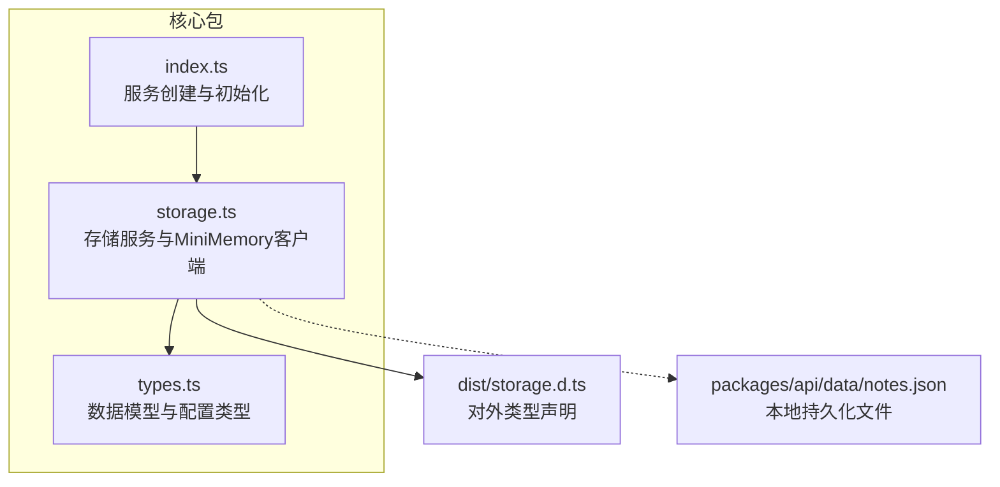
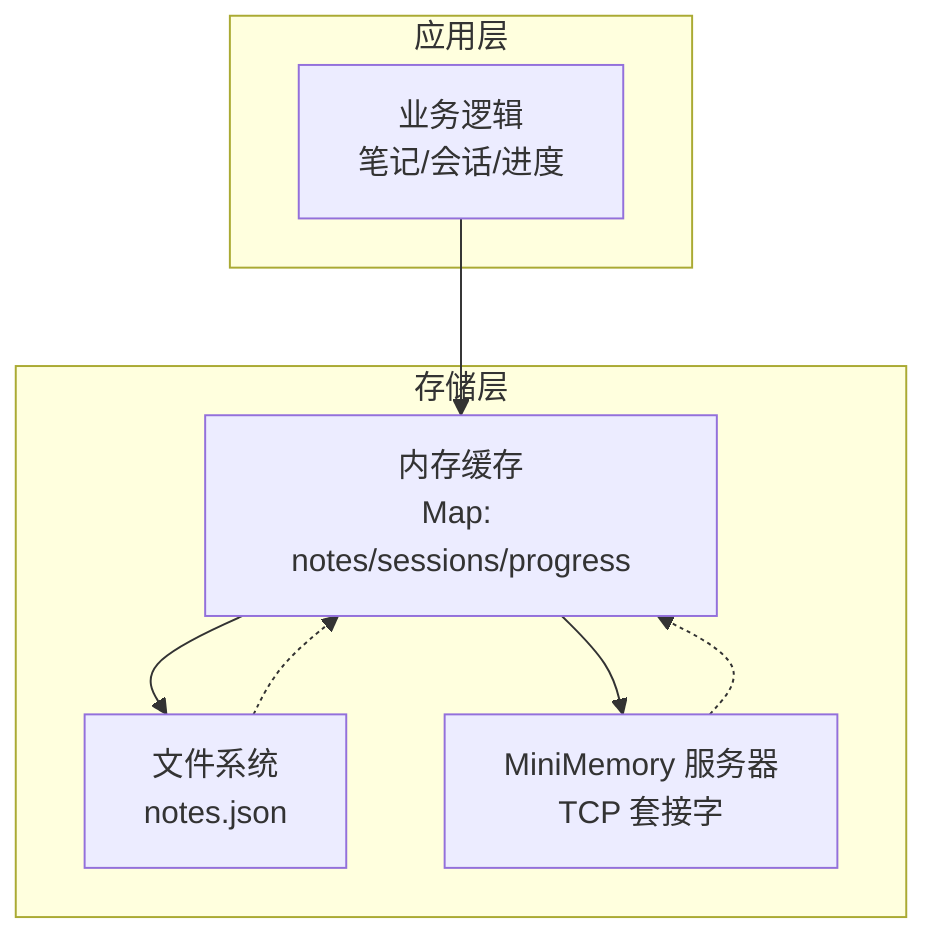
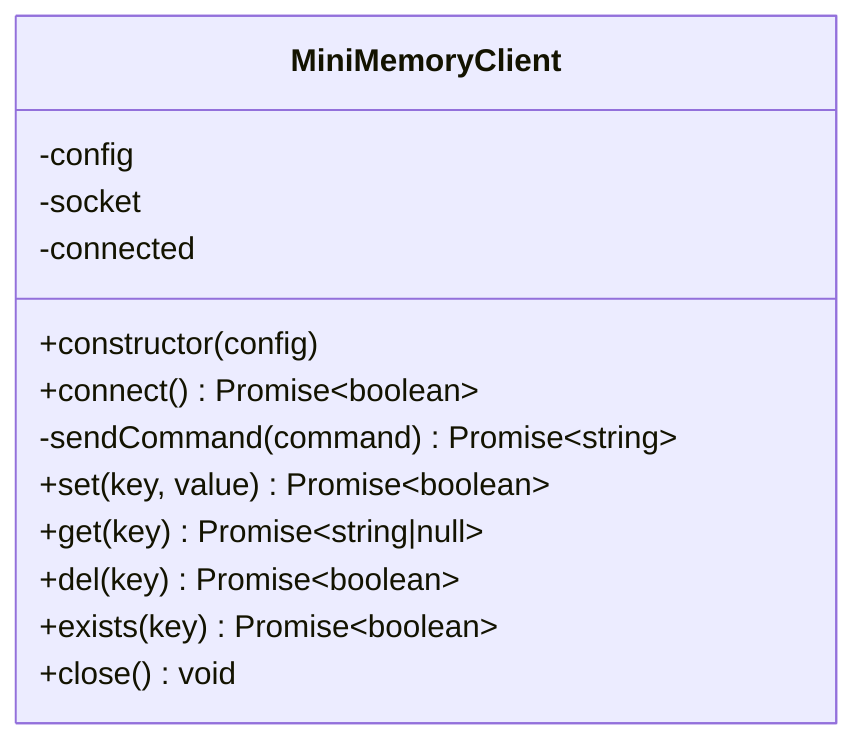
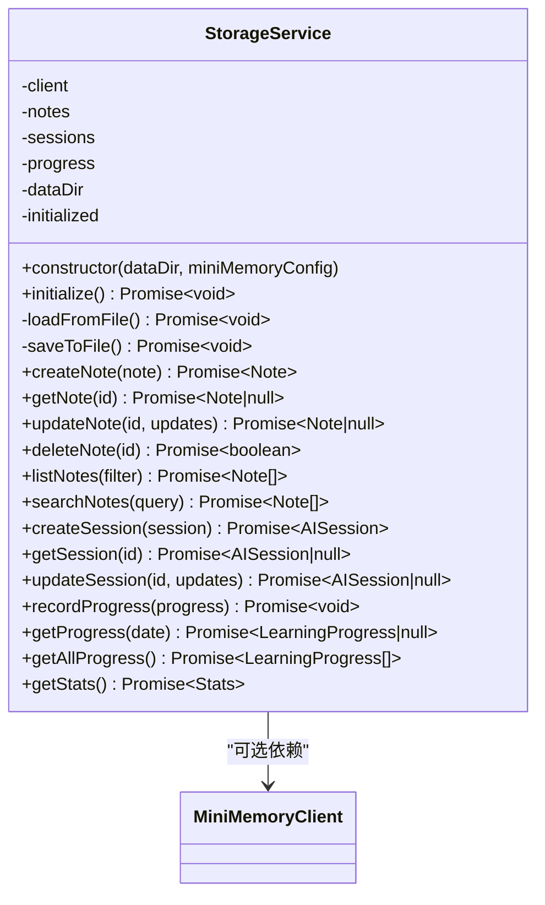
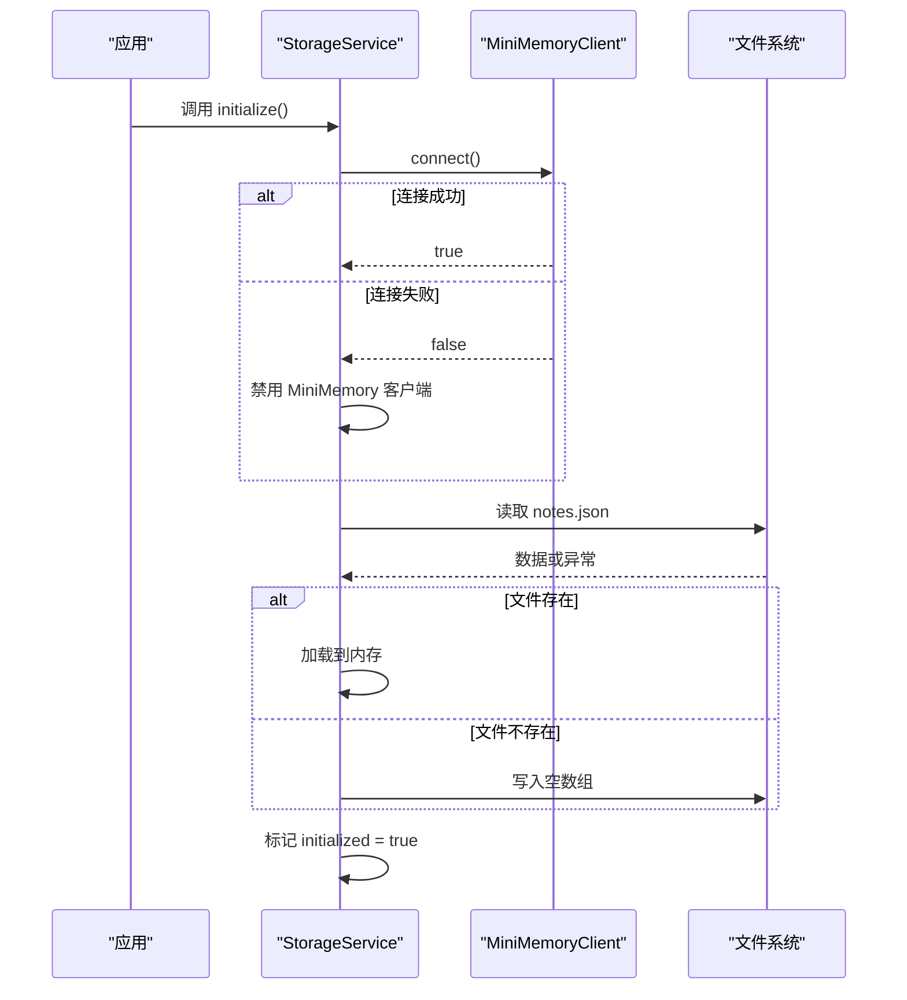
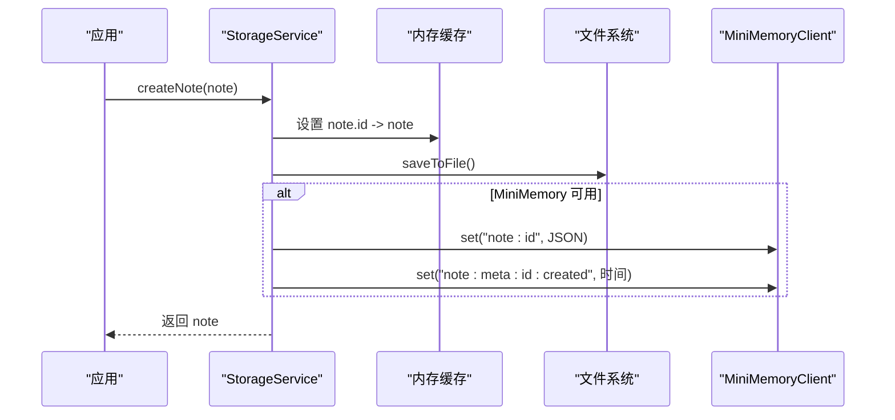
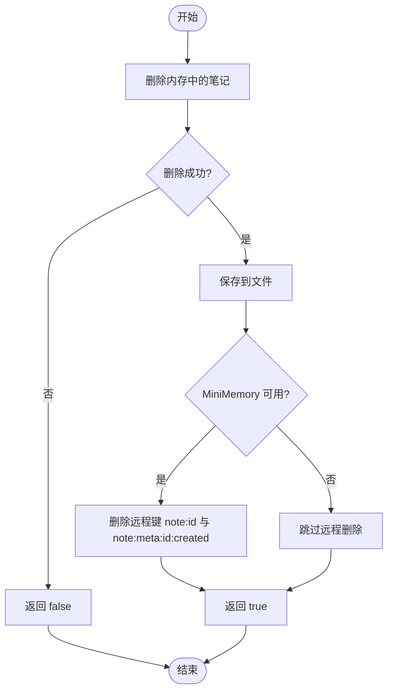
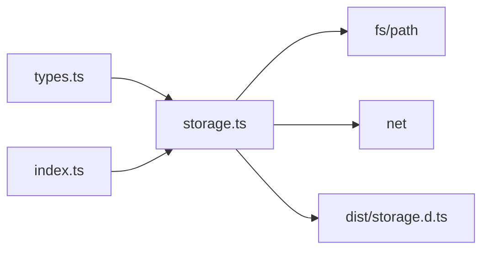

# 存储服务

<cite>
**本文引用的文件**
- [packages/core/src/storage.ts](file://packages/core/src/storage.ts)
- [packages/core/dist/storage.d.ts](file://packages/core/dist/storage.d.ts)
- [packages/core/src/types.ts](file://packages/core/src/types.ts)
- [packages/core/src/index.ts](file://packages/core/src/index.ts)
- [packages/core/dist/index.js](file://packages/core/dist/index.js)
- [packages/api/data/notes.json](file://packages/api/data/notes.json)
</cite>

## 目录
1. [简介](#简介)
2. [项目结构](#项目结构)
3. [核心组件](#核心组件)
4. [架构总览](#架构总览)
5. [详细组件分析](#详细组件分析)
6. [依赖关系分析](#依赖关系分析)
7. [性能考虑](#性能考虑)
8. [故障排查指南](#故障排查指南)
9. [结论](#结论)
10. [附录](#附录)

## 简介
本技术文档围绕存储服务展开，重点阐述 StorageService 的设计理念与实现细节，包括文件存储与 MiniMemory 缓存的双重存储机制、存储抽象层的架构设计、数据持久化策略与缓存失效机制。文档还覆盖存储配置选项、数据模型定义、文件系统操作与内存缓存的协同工作原理，并提供初始化流程、错误处理策略与性能优化技巧。最后给出存储适配器的扩展指南与自定义存储后端的实现方法。

## 项目结构
存储服务位于核心包 packages/core 中，主要由以下文件构成：
- 存储实现：packages/core/src/storage.ts（TypeScript 源码）
- 类型声明：packages/core/src/types.ts（数据模型与配置）
- 服务导出入口：packages/core/src/index.ts（统一创建与初始化）
- 对外类型导出：packages/core/dist/storage.d.ts（编译产物类型声明）

图表来源
- [packages/core/src/storage.ts:1-326](file://packages/core/src/storage.ts#L1-L326)
- [packages/core/src/types.ts:1-163](file://packages/core/src/types.ts#L1-L163)
- [packages/core/src/index.ts:1-49](file://packages/core/src/index.ts#L1-L49)
- [packages/core/dist/storage.d.ts:1-52](file://packages/core/dist/storage.d.ts#L1-L52)
- [packages/api/data/notes.json](file://packages/api/data/notes.json)

章节来源
- [packages/core/src/storage.ts:1-326](file://packages/core/src/storage.ts#L1-L326)
- [packages/core/src/types.ts:1-163](file://packages/core/src/types.ts#L1-L163)
- [packages/core/src/index.ts:1-49](file://packages/core/src/index.ts#L1-L49)
- [packages/core/dist/storage.d.ts:1-52](file://packages/core/dist/storage.d.ts#L1-L52)

## 核心组件
- MiniMemoryClient：通过 TCP 套接字与 MiniMemory 服务器交互，支持 SET/GET/DEL/EXISTS 等命令，用于远程缓存同步。
- StorageService：存储抽象层，负责：
  - 初始化：优先尝试连接 MiniMemory；失败则回退到文件存储。
  - 内存缓存：以 Map 结构缓存笔记、会话与进度数据。
  - 文件持久化：读写 notes.json，确保数据在进程重启后可恢复。
  - 同步策略：对笔记的增删改操作同时写入内存与文件，并在可用时同步至 MiniMemory。

章节来源
- [packages/core/src/storage.ts:7-106](file://packages/core/src/storage.ts#L7-L106)
- [packages/core/src/storage.ts:109-317](file://packages/core/src/storage.ts#L109-L317)

## 架构总览
存储服务采用“内存缓存 + 双重持久化”的架构设计：
- 内存层：Map 结构缓存当前活跃数据，提供快速读取与更新。
- 文件层：notes.json 作为本地持久化介质，启动时加载，变更时落盘。
- 远程层：MiniMemory（可选）作为分布式缓存，写入时同步，读取时可回退。

图表来源
- [packages/core/src/storage.ts:109-140](file://packages/core/src/storage.ts#L109-L140)
- [packages/core/src/storage.ts:143-167](file://packages/core/src/storage.ts#L143-L167)
- [packages/core/src/storage.ts:170-218](file://packages/core/src/storage.ts#L170-L218)
- [packages/core/src/storage.ts:5-106](file://packages/core/src/storage.ts#L5-L106)

## 详细组件分析

### MiniMemoryClient 组件
职责与行为：
- 连接管理：建立 TCP 连接，处理连接错误。
- 命令执行：封装 sendCommand，基于换行符识别响应结束。
- 数据操作：提供 set/get/del/exists 方法，返回布尔或字符串/空值。
- 资源清理：close 销毁套接字，重置连接状态。

图表来源
- [packages/core/src/storage.ts:7-106](file://packages/core/src/storage.ts#L7-L106)
- [packages/core/dist/storage.d.ts:2-14](file://packages/core/dist/storage.d.ts#L2-L14)

章节来源
- [packages/core/src/storage.ts:7-106](file://packages/core/src/storage.ts#L7-L106)
- [packages/core/dist/storage.d.ts:2-14](file://packages/core/dist/storage.d.ts#L2-L14)

### StorageService 组件
职责与行为：
- 初始化：initialize() 仅执行一次；优先尝试 MiniMemory 连接，失败则禁用远程同步，仅使用本地文件。
- 内存缓存：维护 notes/sessions/progress 三类 Map。
- 文件持久化：loadFromFile() 从 notes.json 加载；saveToFile() 写回；若文件缺失则自动创建空文件。
- 笔记操作：createNote/updateNote/deleteNote/listNotes/searchNotes；每次变更均写入文件；当启用 MiniMemory 时同步键空间 note:* 与 note:meta:*。
- 会话与进度：提供会话 CRUD 与进度记录/查询；进度以日期为键缓存在内存中。
- 统计：getStats() 计算总数、收藏数、AI生成数与标签去重数。

图表来源
- [packages/core/src/storage.ts:109-317](file://packages/core/src/storage.ts#L109-L317)
- [packages/core/dist/storage.d.ts:15-51](file://packages/core/dist/storage.d.ts#L15-L51)

章节来源
- [packages/core/src/storage.ts:109-317](file://packages/core/src/storage.ts#L109-L317)
- [packages/core/dist/storage.d.ts:15-51](file://packages/core/dist/storage.d.ts#L15-L51)

### 初始化流程（序列图）

图表来源
- [packages/core/src/storage.ts:125-140](file://packages/core/src/storage.ts#L125-L140)
- [packages/core/src/storage.ts:143-159](file://packages/core/src/storage.ts#L143-L159)

### 笔记写入流程（序列图）

图表来源
- [packages/core/src/storage.ts:170-181](file://packages/core/src/storage.ts#L170-L181)
- [packages/core/src/storage.ts:162-167](file://packages/core/src/storage.ts#L162-L167)
- [packages/core/src/storage.ts:174-178](file://packages/core/src/storage.ts#L174-L178)

### 删除笔记流程（流程图）

图表来源
- [packages/core/src/storage.ts:207-218](file://packages/core/src/storage.ts#L207-L218)
- [packages/core/src/storage.ts:210-216](file://packages/core/src/storage.ts#L210-L216)

## 依赖关系分析
- 类型依赖：storage.ts 引入 types.ts 中的 Note、AISession、LearningProgress、MiniMemoryConfig 等类型。
- 导出依赖：index.ts 统一导出 StorageService、MiniMemoryClient、createStorageService，并在 createServices 中完成初始化。
- 外部模块：fs/path 用于文件读写；net 用于 TCP 连接。

图表来源
- [packages/core/src/storage.ts:1-4](file://packages/core/src/storage.ts#L1-L4)
- [packages/core/src/index.ts:1-10](file://packages/core/src/index.ts#L1-L10)
- [packages/core/dist/storage.d.ts:1](file://packages/core/dist/storage.d.ts#L1)

章节来源
- [packages/core/src/storage.ts:1-4](file://packages/core/src/storage.ts#L1-L4)
- [packages/core/src/index.ts:1-10](file://packages/core/src/index.ts#L1-L10)
- [packages/core/dist/storage.d.ts:1](file://packages/core/dist/storage.d.ts#L1)

## 性能考虑
- 内存优先：所有活跃数据驻留内存，减少频繁 IO。
- 批量写入：笔记变更后立即落盘，避免丢失；如需进一步优化可在高频场景下引入节流/合并写入策略。
- 远程同步：MiniMemory 同步为异步写入，不影响主流程；若网络不稳定，可增加重试与退避策略。
- 查询与过滤：listNotes 在内存中进行排序与过滤，复杂度取决于数据规模；建议对大数据集分页与索引优化。
- 文件格式：JSON 文本读写简单可靠；对于超大体量可考虑二进制或列式存储格式。

## 故障排查指南
常见问题与处理：
- MiniMemory 不可用
  - 现象：初始化时打印警告并禁用远程同步。
  - 处理：确认 MiniMemory 服务器可达与配置正确；检查防火墙与端口。
- 文件读写异常
  - 现象：loadFromFile 抛错或创建空文件。
  - 处理：检查 dataDir 权限与磁盘空间；确认 notes.json 格式合法。
- 远程同步失败
  - 现象：set/get/del 返回失败。
  - 处理：检查 MiniMemoryClient 连接状态与命令格式；确认服务器端支持相应命令。
- 并发一致性
  - 建议：在多进程或多实例部署时，避免直接共享同一 dataDir；可使用 MiniMemory 作为统一缓存层。

章节来源
- [packages/core/src/storage.ts:128-135](file://packages/core/src/storage.ts#L128-L135)
- [packages/core/src/storage.ts:155-158](file://packages/core/src/storage.ts#L155-L158)
- [packages/core/src/storage.ts:56-96](file://packages/core/src/storage.ts#L56-L96)

## 结论
StorageService 通过“内存缓存 + 文件持久化 + MiniMemory 可选远程缓存”的三层架构，在保证数据可靠性的同时兼顾性能与可扩展性。其初始化流程与错误回退策略确保了在不同运行环境下的稳定性；笔记、会话与进度的数据模型清晰，便于上层业务调用。未来可在高并发与大规模数据场景下引入更精细的缓存策略与持久化格式优化。

## 附录

### 存储配置选项
- dataDir：本地数据目录，默认 "./data"。
- miniMemoryConfig：MiniMemory 服务器配置，包含 host、port、password（可选）。
- ollamaConfig：AI 服务配置（与存储服务同属核心包），用于 AI 相关能力。

章节来源
- [packages/core/src/types.ts:144-152](file://packages/core/src/types.ts#L144-L152)
- [packages/core/src/types.ts:137-141](file://packages/core/src/types.ts#L137-L141)
- [packages/core/src/index.ts:25-48](file://packages/core/src/index.ts#L25-L48)

### 数据模型定义
- Note：笔记实体，包含 id、title、content、tags、category、isFavorite、isAIGenerated、createdAt、updatedAt。
- AISession：AI 会话，包含 id、noteId、messages、createdAt、updatedAt。
- LearningProgress：学习进度，包含 date、notesCreated、aiInteractions、studyTime。
- MiniMemoryConfig：MiniMemory 服务器配置。
- AppConfig：应用配置，包含 dataDir、miniMemory、ollama、server。

章节来源
- [packages/core/src/types.ts:10-22](file://packages/core/src/types.ts#L10-L22)
- [packages/core/src/types.ts:49-56](file://packages/core/src/types.ts#L49-L56)
- [packages/core/src/types.ts:89-95](file://packages/core/src/types.ts#L89-L95)
- [packages/core/src/types.ts:129-134](file://packages/core/src/types.ts#L129-L134)
- [packages/core/src/types.ts:144-152](file://packages/core/src/types.ts#L144-L152)

### 文件系统操作
- notes.json：存放笔记数组，UTF-8 文本；首次运行若不存在则自动创建。
- 目录：dataDir 默认为 "./data"，可通过配置修改。

章节来源
- [packages/core/src/storage.ts:143-167](file://packages/core/src/storage.ts#L143-L167)
- [packages/api/data/notes.json](file://packages/api/data/notes.json)

### 存储适配器扩展指南
目标：实现自定义存储后端（例如数据库、对象存储等），保持与 StorageService 的接口兼容。
步骤：
- 定义适配器接口：提供 initialize、createNote、getNote、updateNote、deleteNote、listNotes、searchNotes、recordProgress、getProgress、getAllProgress、getStats 等方法签名。
- 实现适配器：在适配器内部实现具体的数据访问逻辑（SQL/ORM、SDK 等）。
- 替换注入：在 createServices 中注入自定义适配器实例，或通过工厂模式替换默认实现。
- 兼容性验证：确保返回值与现有类型一致，注意日期字段的序列化/反序列化。

提示：
- 若需要保留 MiniMemory 同步能力，可在适配器层增加远程缓存写入逻辑。
- 对于大数据量场景，建议在适配器层实现分页、索引与事务控制。