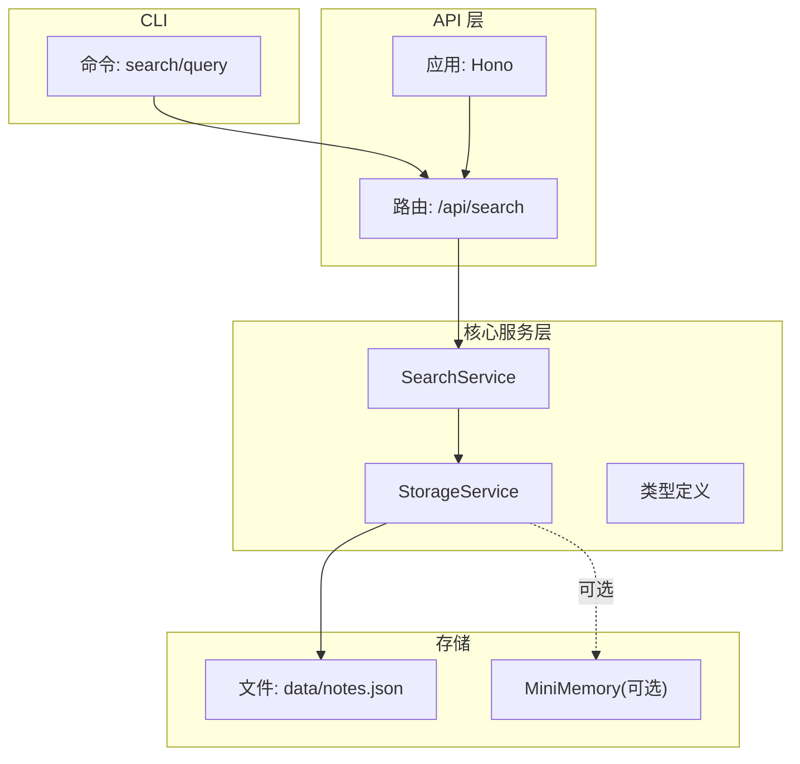
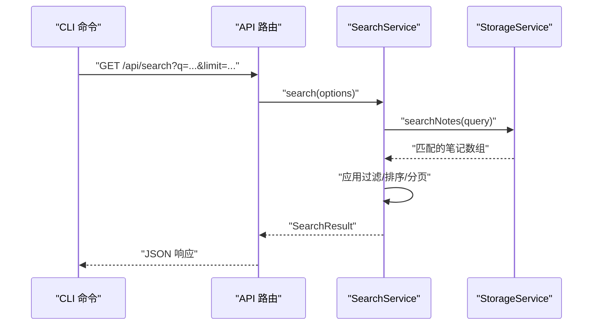
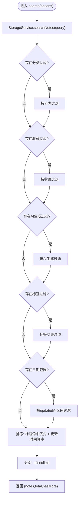
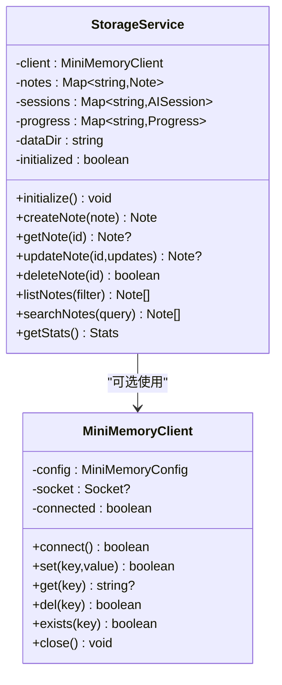
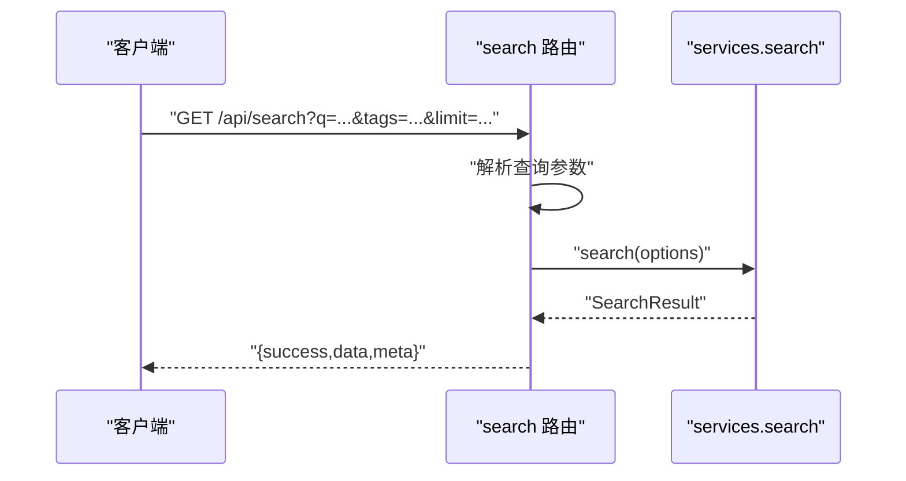
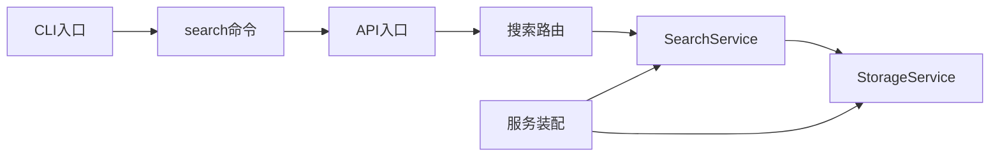

# 搜索服务

<cite>
**本文引用的文件**
- [packages/core/src/search.ts](file://packages/core/src/search.ts)
- [packages/core/src/storage.ts](file://packages/core/src/storage.ts)
- [packages/core/src/types.ts](file://packages/core/src/types.ts)
- [packages/core/src/index.ts](file://packages/core/src/index.ts)
- [packages/api/src/routes/search.ts](file://packages/api/src/routes/search.ts)
- [packages/api/src/index.ts](file://packages/api/src/index.ts)
- [packages/cli/src/commands/search.ts](file://packages/cli/src/commands/search.ts)
- [packages/cli/src/index.ts](file://packages/cli/src/index.ts)
- [packages/api/data/notes.json](file://packages/api/data/notes.json)
</cite>

## 目录
1. [简介](#简介)
2. [项目结构](#项目结构)
3. [核心组件](#核心组件)
4. [架构总览](#架构总览)
5. [详细组件分析](#详细组件分析)
6. [依赖关系分析](#依赖关系分析)
7. [性能考量](#性能考量)
8. [故障排查指南](#故障排查指南)
9. [结论](#结论)
10. [附录](#附录)

## 简介
本文件面向“搜索服务”的技术文档，聚焦于 SearchService 的搜索算法实现与周边机制。当前实现采用内存级全文检索与多维过滤组合的方式，覆盖全文搜索、标签过滤、分类筛选、时间范围过滤、快速搜索与搜索建议等能力；同时提供分页、总数统计与结果排序。由于未发现专用倒排索引或权重计算模块，本文在“架构总览”和“详细组件分析”中明确指出现有实现的边界，并给出可扩展的优化建议与集成方案。

## 项目结构
- 核心逻辑位于 packages/core，包含搜索服务、存储服务、类型定义与服务装配器。
- API 层位于 packages/api，提供 HTTP 接口与路由，负责参数解析与响应封装。
- CLI 层位于 packages/cli，提供命令行交互，调用 API 实现搜索体验。
- 数据持久化采用本地 JSON 文件（默认 data/notes.json），并支持通过 MiniMemory 作为分布式缓存/键值存储。

图表来源
- [packages/api/src/routes/search.ts:1-92](file://packages/api/src/routes/search.ts#L1-L92)
- [packages/api/src/index.ts:1-64](file://packages/api/src/index.ts#L1-L64)
- [packages/core/src/search.ts:1-93](file://packages/core/src/search.ts#L1-L93)
- [packages/core/src/storage.ts:1-326](file://packages/core/src/storage.ts#L1-L326)
- [packages/api/data/notes.json:1-1](file://packages/api/data/notes.json#L1-L1)

章节来源
- [packages/api/src/index.ts:1-64](file://packages/api/src/index.ts#L1-L64)
- [packages/core/src/index.ts:1-50](file://packages/core/src/index.ts#L1-L50)

## 核心组件
- SearchService：负责搜索入口、过滤、排序、分页与辅助能力（快速搜索、搜索建议）。
- StorageService：提供笔记数据的增删改查、列表、全文检索与 MiniMemory 同步。
- 类型系统：统一定义 Note、SearchOptions、SearchResult、NoteCategory 等。
- 服务装配：createServices 统一初始化并注入依赖。

章节来源
- [packages/core/src/search.ts:1-93](file://packages/core/src/search.ts#L1-L93)
- [packages/core/src/storage.ts:108-326](file://packages/core/src/storage.ts#L108-L326)
- [packages/core/src/types.ts:1-163](file://packages/core/src/types.ts#L1-L163)
- [packages/core/src/index.ts:18-49](file://packages/core/src/index.ts#L18-L49)

## 架构总览
下图展示从 CLI 到 API、再到核心服务与存储的整体调用链路与职责划分。

图表来源
- [packages/cli/src/commands/search.ts:36-71](file://packages/cli/src/commands/search.ts#L36-L71)
- [packages/api/src/routes/search.ts:9-57](file://packages/api/src/routes/search.ts#L9-L57)
- [packages/core/src/search.ts:13-64](file://packages/core/src/search.ts#L13-L64)
- [packages/core/src/storage.ts:249-257](file://packages/core/src/storage.ts#L249-L257)

## 详细组件分析

### SearchService 搜索算法与流程
- 全文搜索：委托 StorageService.searchNotes，基于标题、正文、标签进行包含式匹配。
- 过滤条件：
  - 分类过滤：按 NoteCategory 精确匹配。
  - 收藏与AI生成过滤：布尔值过滤。
  - 标签过滤：任一交集满足即命中。
  - 时间范围过滤：基于 updatedAt 的区间过滤。
- 排序策略：
  - 优先级：标题包含查询词 > 更新时间降序。
  - 该策略提升“标题命中”的可见性，兼顾新鲜度。
- 分页与统计：
  - 使用 offset/limit 实现分页。
  - 返回 total 与 hasMore 辅助前端分页控件。
- 快速搜索：仅标题包含匹配，返回前若干条。
- 搜索建议：基于当前查询命中的笔记集合，提取去重后的标签前缀集合作为建议。

图表来源
- [packages/core/src/search.ts:13-64](file://packages/core/src/search.ts#L13-L64)

章节来源
- [packages/core/src/search.ts:13-87](file://packages/core/src/search.ts#L13-L87)

### StorageService 全文检索与数据同步
- 全文检索：对 title、content、tags 进行包含式匹配，返回候选笔记集合。
- 数据同步：
  - 写入/更新/删除时，先写本地 JSON 文件，再可选地同步到 MiniMemory 键值存储。
  - 支持 SET/GET/DEL/EXISTS 等基础命令，异常时回退至本地模式。
- MiniMemory 客户端：TCP 套接字通信，命令-响应模型，超时/断开容错。

图表来源
- [packages/core/src/storage.ts:108-326](file://packages/core/src/storage.ts#L108-L326)

章节来源
- [packages/core/src/storage.ts:108-326](file://packages/core/src/storage.ts#L108-L326)

### API 路由与参数解析
- GET /api/search：解析 q、tags、limit、offset、category、favorite、ai-generated、startDate、endDate，组装为 SearchOptions 并调用服务。
- GET /api/search/quick：快速搜索（标题匹配）。
- GET /api/search/suggestions：基于当前候选笔记集合提取标签建议。
- 响应封装：统一 success/data/meta 结构，便于前端消费。

图表来源
- [packages/api/src/routes/search.ts:9-57](file://packages/api/src/routes/search.ts#L9-L57)

章节来源
- [packages/api/src/routes/search.ts:1-92](file://packages/api/src/routes/search.ts#L1-L92)

### CLI 交互与调用
- search query：支持 tags/favorite/ai-generated/limit 等参数，调用 /api/search 并渲染结果。
- search quick：调用 /api/search/quick。
- search suggest：调用 /api/search/suggestions。
- 通过 APIClient 统一发起 HTTP 请求，支持配置远端 API 地址。

章节来源
- [packages/cli/src/commands/search.ts:15-119](file://packages/cli/src/commands/search.ts#L15-L119)
- [packages/cli/src/index.ts:15-65](file://packages/cli/src/index.ts#L15-L65)

### 数据模型与类型
- Note：包含 id、title、content、tags、category、isFavorite、isAIGenerated、createdAt、updatedAt。
- SearchOptions/SearchResult：定义搜索输入与输出结构。
- NoteCategory：枚举分类，含 work/study/creative/personal/ai-generated。

章节来源
- [packages/core/src/types.ts:11-127](file://packages/core/src/types.ts#L11-L127)

## 依赖关系分析
- SearchService 依赖 StorageService 提供数据源与全文检索。
- API 层路由依赖 services.search 暴露的能力。
- 服务装配器 createServices 负责初始化 StorageService/NoteService/AIService/SearchService 并注入依赖。
- CLI 通过 APIClient 调用 API，形成端到端闭环。

图表来源
- [packages/api/src/index.ts:44-51](file://packages/api/src/index.ts#L44-L51)
- [packages/core/src/index.ts:25-49](file://packages/core/src/index.ts#L25-L49)
- [packages/cli/src/index.ts:68-87](file://packages/cli/src/index.ts#L68-L87)

章节来源
- [packages/api/src/index.ts:1-64](file://packages/api/src/index.ts#L1-L64)
- [packages/core/src/index.ts:1-50](file://packages/core/src/index.ts#L1-L50)
- [packages/cli/src/index.ts:1-91](file://packages/cli/src/index.ts#L1-L91)

## 性能考量
- 当前实现特点
  - 全文检索为线性扫描，时间复杂度 O(N·M)，N 为笔记数，M 为字段匹配成本。
  - 过滤与排序均为内存操作，适合中小规模数据。
- 可行的优化方向（概念性建议）
  - 倒排索引与分词：建立基于关键词的倒排表，结合 TF-IDF 或 BM25 权重，提升召回与排序质量。
  - 缓存策略：对热门查询结果与标签建议进行短期缓存，降低重复计算。
  - 并行搜索：对不同过滤维度并行评估，减少整体延迟。
  - 增量更新：监听 StorageService 的变更事件，增量维护索引，避免全量重建。
  - 分布式缓存：利用 MiniMemory 或 Redis 缓存热点数据，提升跨节点一致性下的读性能。
- 注意事项
  - 以上为扩展建议，当前仓库未实现上述机制，不建议在现有代码上直接添加复杂索引逻辑，应通过插拔式适配器接入。

[本节为通用性能讨论，不直接分析具体文件，故无章节来源]

## 故障排查指南
- 查询参数缺失
  - 现象：API 返回错误提示“Query is required”。
  - 处理：确保传入 q 参数。
- MiniMemory 不可用
  - 现象：控制台警告“MiniMemory not available, using file-based storage”，随后继续运行。
  - 处理：确认 MiniMemory 服务可达或忽略警告继续使用本地存储。
- 无匹配结果
  - 现象：返回空数组或 total=0。
  - 处理：检查查询词是否过短、过滤条件是否过于严格；尝试放宽过滤或使用快速搜索。
- 分页问题
  - 现象：hasMore 与实际数据不符。
  - 处理：确认 offset/limit 设置与 total 计算一致；注意过滤阶段已改变候选集大小。
- CLI 调用失败
  - 现象：请求失败或未知错误。
  - 处理：检查本地服务是否启动、API 地址配置是否正确；查看网络连通性。

章节来源
- [packages/api/src/routes/search.ts:12-14](file://packages/api/src/routes/search.ts#L12-L14)
- [packages/core/src/storage.ts:128-135](file://packages/core/src/storage.ts#L128-L135)
- [packages/cli/src/commands/search.ts:67-70](file://packages/cli/src/commands/search.ts#L67-L70)

## 结论
当前搜索服务以轻量实现覆盖了基本的全文检索、多维过滤、排序与分页需求，具备良好的易用性与可扩展性。对于大规模数据与更高性能场景，建议引入倒排索引、权重计算、缓存与并行搜索等机制，并通过适配器与现有服务解耦对接。同时，可考虑将搜索结果高亮、相关性评分与模糊匹配纳入后续迭代，以进一步提升用户体验。

[本节为总结性内容，不直接分析具体文件，故无章节来源]

## 附录

### API 定义概览
- GET /api/search
  - 查询参数：q、tags、limit、offset、category、favorite、ai-generated、startDate、endDate
  - 响应：success、data（笔记数组）、meta（total、hasMore）
- GET /api/search/quick
  - 查询参数：q
  - 响应：success、data（笔记数组）
- GET /api/search/suggestions
  - 查询参数：q
  - 响应：success、data（标签字符串数组）

章节来源
- [packages/api/src/routes/search.ts:9-89](file://packages/api/src/routes/search.ts#L9-L89)

### 数据文件位置
- 默认笔记数据文件：packages/api/data/notes.json
- 说明：首次运行若文件不存在会自动创建空数组；后续写入会更新该文件。

章节来源
- [packages/api/data/notes.json:1-1](file://packages/api/data/notes.json#L1-L1)
- [packages/core/src/storage.ts:143-159](file://packages/core/src/storage.ts#L143-L159)