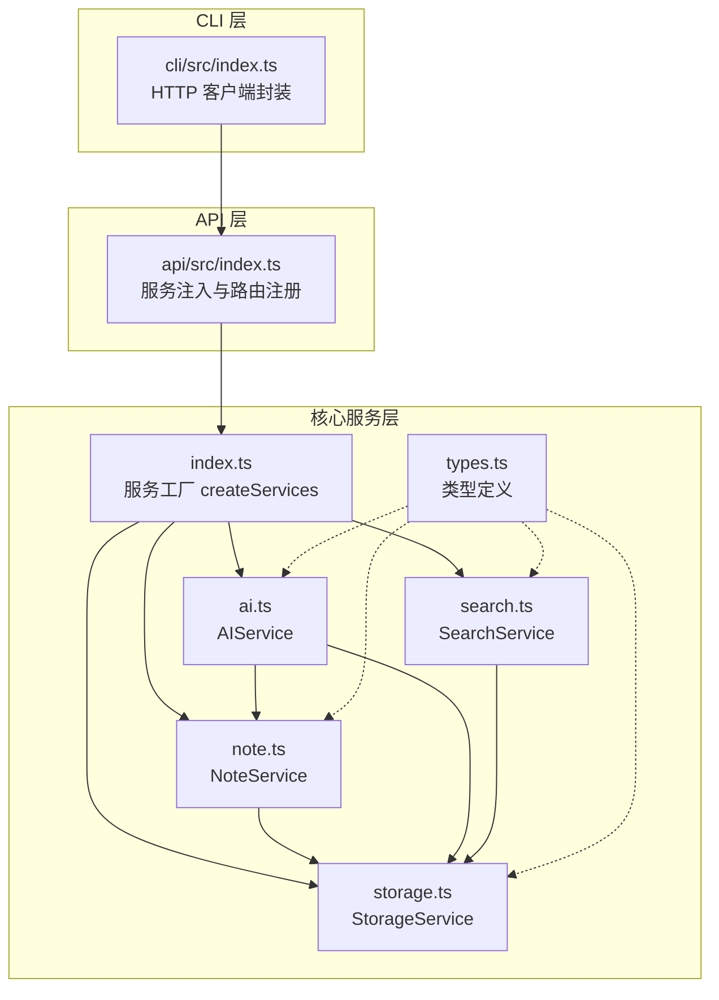
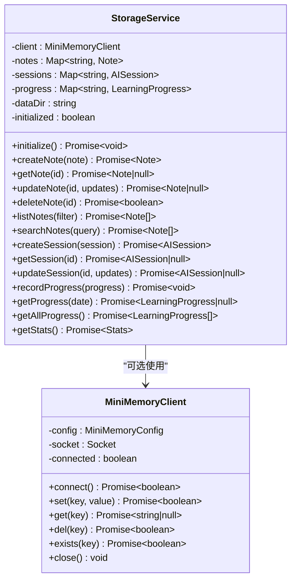
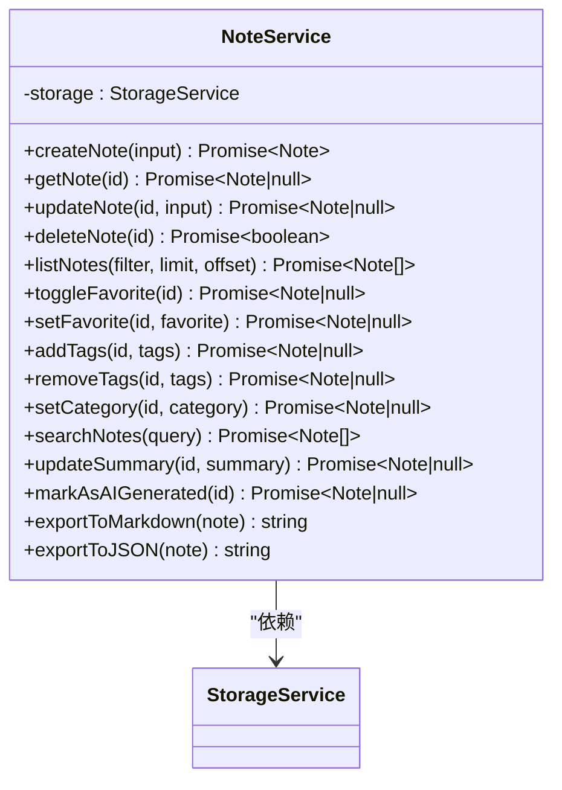
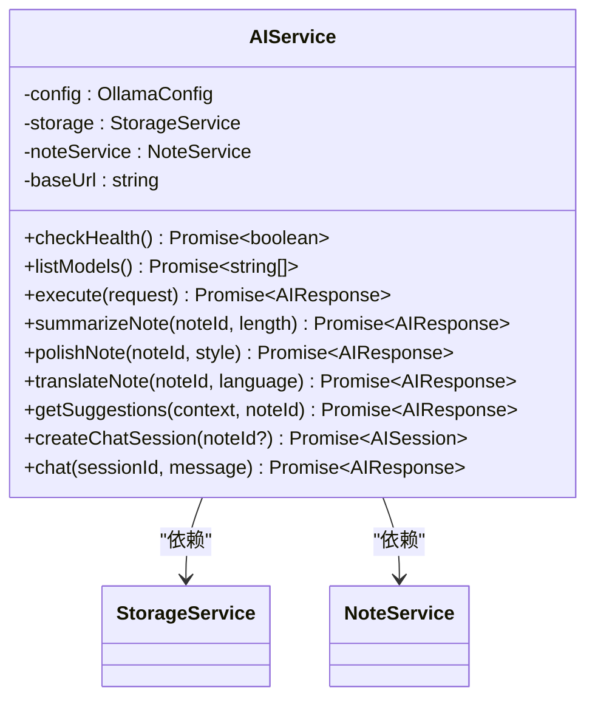
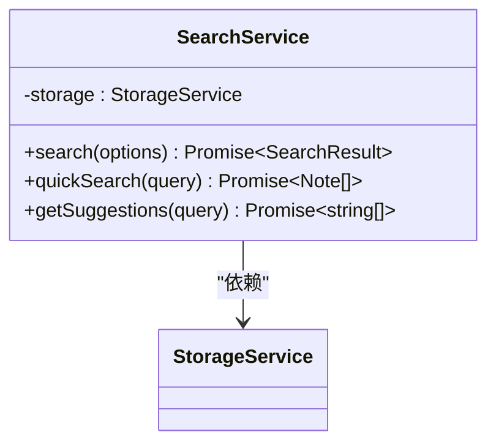
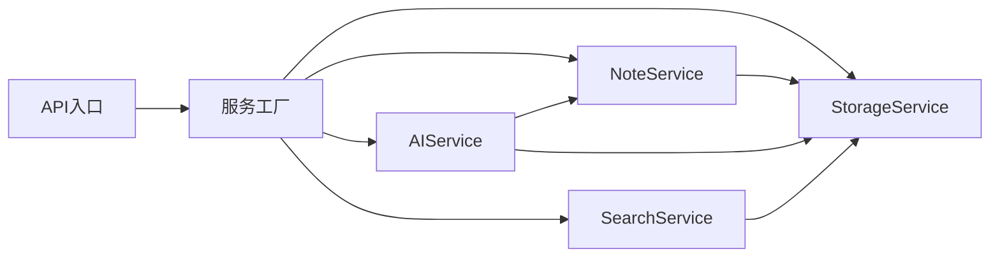

# 服务层架构

<cite>
**本文引用的文件**
- [packages/core/src/index.ts](file://packages/core/src/index.ts)
- [packages/core/src/storage.ts](file://packages/core/src/storage.ts)
- [packages/core/src/note.ts](file://packages/core/src/note.ts)
- [packages/core/src/ai.ts](file://packages/core/src/ai.ts)
- [packages/core/src/search.ts](file://packages/core/src/search.ts)
- [packages/core/src/types.ts](file://packages/core/src/types.ts)
- [packages/api/src/index.ts](file://packages/api/src/index.ts)
- [packages/cli/src/index.ts](file://packages/cli/src/index.ts)
</cite>

## 目录
1. [引言](#引言)
2. [项目结构](#项目结构)
3. [核心组件](#核心组件)
4. [架构总览](#架构总览)
5. [详细组件分析](#详细组件分析)
6. [依赖分析](#依赖分析)
7. [性能考虑](#性能考虑)
8. [故障排查指南](#故障排查指南)
9. [结论](#结论)
10. [附录](#附录)

## 引言
本文件面向番茄笔记项目的核心服务层，系统性阐述服务工厂模式与依赖注入机制，详解四个核心服务（StorageService、NoteService、AIService、SearchService）的职责边界、接口设计、依赖关系与数据流向，并给出生命周期管理、错误处理策略与性能优化建议，以及服务扩展与自定义的指导原则。

## 项目结构
- 核心服务位于 packages/core/src 下，包含服务工厂函数与各服务实现。
- API 层通过 Hono 提供 HTTP 接口，使用核心服务工厂创建服务实例。
- CLI 层通过 HTTP 客户端调用 API，间接使用核心服务能力。
- 类型定义集中于 types.ts，统一约束服务间的数据契约。



图表来源
- [packages/core/src/index.ts:25-49](file://packages/core/src/index.ts#L25-L49)
- [packages/core/src/storage.ts:109-317](file://packages/core/src/storage.ts#L109-L317)
- [packages/core/src/note.ts:7-158](file://packages/core/src/note.ts#L7-L158)
- [packages/core/src/ai.ts:42-292](file://packages/core/src/ai.ts#L42-L292)
- [packages/core/src/search.ts:5-92](file://packages/core/src/search.ts#L5-L92)
- [packages/api/src/index.ts:4-63](file://packages/api/src/index.ts#L4-L63)
- [packages/cli/src/index.ts:16-65](file://packages/cli/src/index.ts#L16-L65)

章节来源
- [packages/core/src/index.ts:18-49](file://packages/core/src/index.ts#L18-L49)
- [packages/api/src/index.ts:4-63](file://packages/api/src/index.ts#L4-L63)

## 核心组件
- 服务工厂与依赖注入
  - 工厂函数 createServices 负责创建并初始化服务实例，按顺序完成 StorageService 初始化、NoteService 绑定、AIService 配置（含 Ollama）、SearchService 绑定，最终返回聚合的 Services 对象。
  - 依赖注入采用构造函数注入：NoteService 依赖 StorageService；AIService 依赖 StorageService 与 NoteService；SearchService 依赖 StorageService。
- 四个核心服务职责边界
  - StorageService：统一的数据持久化与缓存抽象，支持文件存储与可选的 MiniMemory 分布式缓存；提供笔记、会话、学习进度等数据的 CRUD 与统计。
  - NoteService：围绕笔记的业务操作封装，负责创建、查询、更新、删除、收藏、标签、分类、搜索、导出等。
  - AIService：对接 Ollama 的 AI 能力，提供总结、润色、翻译、建议、聊天等功能；内部维护会话并在需要时更新笔记摘要。
  - SearchService：在存储层之上提供带过滤、分页、排序的全文检索能力，并提供快速搜索与搜索建议。

章节来源
- [packages/core/src/index.ts:25-49](file://packages/core/src/index.ts#L25-L49)
- [packages/core/src/storage.ts:109-317](file://packages/core/src/storage.ts#L109-L317)
- [packages/core/src/note.ts:7-158](file://packages/core/src/note.ts#L7-L158)
- [packages/core/src/ai.ts:42-292](file://packages/core/src/ai.ts#L42-L292)
- [packages/core/src/search.ts:5-92](file://packages/core/src/search.ts#L5-L92)

## 架构总览
服务层采用“工厂 + 依赖注入”的组合模式：上层（API/CLI）仅通过工厂函数获取服务集合，避免直接管理复杂依赖关系；核心服务之间通过共享的 StorageService 实现解耦与复用。

```mermaid
sequenceDiagram
participant API as "API入口<br/>api/src/index.ts"
participant Factory as "服务工厂<br/>core/src/index.ts"
participant Storage as "StorageService"
participant Note as "NoteService"
participant AI as "AIService"
participant Search as "SearchService"
API->>Factory : 调用 createServices(config)
Factory->>Storage : createStorageService(dataDir, miniMemory)
Factory->>Storage : initialize()
Factory->>Note : createNoteService(storage)
Factory->>AI : createAIService({ollama, storage, noteService})
Factory->>Search : createSearchService(storage)
Factory-->>API : 返回 {storage, notes, ai, search}
```

图表来源
- [packages/api/src/index.ts:7-14](file://packages/api/src/index.ts#L7-L14)
- [packages/core/src/index.ts:25-49](file://packages/core/src/index.ts#L25-L49)

## 详细组件分析

### 服务工厂与依赖注入（createServices）
- 设计要点
  - 统一配置入口：接收部分 AppConfig，缺省值由工厂内部设定（如 Ollama 默认主机、端口、模型）。
  - 顺序化初始化：先初始化存储，再创建业务服务，确保后续服务可用。
  - 聚合返回：返回标准化的 Services 接口，便于上层统一访问。
- 依赖注入链路
  - StorageService → NoteService → AIService → SearchService
  - AIService 同时依赖 NoteService 用于摘要更新与上下文构建。
- 生命周期
  - StorageService.initialize 在工厂阶段执行，保证后续服务可用。
  - AIService 在运行期通过健康检查与模型列表查询保障外部依赖可用性。

章节来源
- [packages/core/src/index.ts:25-49](file://packages/core/src/index.ts#L25-L49)
- [packages/api/src/index.ts:7-14](file://packages/api/src/index.ts#L7-L14)

### StorageService（存储服务）
- 职责边界
  - 数据持久化：笔记、会话、学习进度的增删改查。
  - 缓存桥接：可选 MiniMemory 客户端，用于分布式键值缓存同步。
  - 本地回退：当 MiniMemory 不可用时自动切换为文件存储。
  - 统计与检索：提供统计信息与基础检索能力。
- 关键流程
  - 初始化：尝试连接 MiniMemory，失败则回退文件存储；随后从文件加载数据。
  - 写入：内存 Map 更新 + 文件落盘；同时可选同步到 MiniMemory。
  - 查询：内存 Map 查询为主，必要时进行过滤与分页。
- 错误处理
  - MiniMemory 连接失败时记录警告并继续使用文件存储。
  - 文件读写异常时捕获并创建默认数据，保证服务可用性。
- 复杂度分析
  - 内存 Map 查询/插入/删除：平均 O(1)。
  - 列表过滤与排序：O(n log n)，其中 n 为笔记数量。
  - 检索：O(n) 遍历匹配。



图表来源
- [packages/core/src/storage.ts:7-106](file://packages/core/src/storage.ts#L7-L106)
- [packages/core/src/storage.ts:109-317](file://packages/core/src/storage.ts#L109-L317)

章节来源
- [packages/core/src/storage.ts:109-317](file://packages/core/src/storage.ts#L109-L317)

### NoteService（笔记服务）
- 职责边界
  - 笔记全生命周期管理：创建、查询、更新、删除、收藏、标签、分类、摘要更新。
  - 搜索与导出：委托存储层进行检索，并提供 Markdown/JSON 导出。
- 依赖关系
  - 仅依赖 StorageService，保持纯业务封装，无外部依赖。
- 复杂度分析
  - 大多数操作基于内存 Map，平均 O(1)。
  - 列表过滤与分页：O(n)。
  - 导出为字符串：O(m)，m 为内容长度。



图表来源
- [packages/core/src/note.ts:7-158](file://packages/core/src/note.ts#L7-L158)

章节来源
- [packages/core/src/note.ts:7-158](file://packages/core/src/note.ts#L7-L158)

### AIService（AI 服务）
- 职责边界
  - AI 操作编排：总结、润色、翻译、建议、聊天。
  - 外部依赖：对接 Ollama API，支持健康检查与模型列表查询。
  - 会话管理：创建与维护聊天会话，必要时更新笔记摘要。
- 依赖关系
  - 依赖 StorageService（会话持久化）与 NoteService（笔记内容与摘要更新）。
- 关键流程
  - 执行流程：根据操作类型拼装 Prompt 与系统提示词，调用 Ollama，成功后按需更新笔记摘要。
  - 聊天流程：构建上下文（可选绑定笔记），调用 AI，保存消息历史。
- 错误处理
  - Ollama 请求失败时返回结构化错误对象，不抛出未捕获异常。
  - 会话/笔记不存在时返回明确错误信息。
- 复杂度分析
  - 调用 Ollama 为网络 IO，受外部服务性能影响。
  - 消息数组追加与更新：O(1)。



图表来源
- [packages/core/src/ai.ts:42-292](file://packages/core/src/ai.ts#L42-L292)

章节来源
- [packages/core/src/ai.ts:42-292](file://packages/core/src/ai.ts#L42-L292)

### SearchService（搜索服务）
- 职责边界
  - 全文检索：基于存储层的搜索结果，应用多维过滤（分类、收藏、AI生成、标签、时间范围）。
  - 排序与分页：标题命中优先、其次按更新时间排序，并支持 limit/offset。
  - 快速搜索与建议：提供标题匹配的快速结果与基于标签的搜索建议。
- 依赖关系
  - 仅依赖 StorageService 的搜索能力，保持轻量与稳定。
- 复杂度分析
  - 过滤与排序：O(n log n)，n 为匹配笔记数。
  - 分页切片：O(k)，k 为返回条目数。



图表来源
- [packages/core/src/search.ts:5-92](file://packages/core/src/search.ts#L5-L92)

章节来源
- [packages/core/src/search.ts:5-92](file://packages/core/src/search.ts#L5-L92)

### API 层集成与生命周期
- API 层通过 createServices 创建服务集合，并将其注入到路由模块中使用。
- 服务生命周期贯穿应用启动至进程退出，工厂负责初始化，路由负责调用。
- 健康检查与状态接口用于监控 AI 服务连通性与存储统计。

章节来源
- [packages/api/src/index.ts:4-63](file://packages/api/src/index.ts#L4-L63)

### CLI 层与 API 的协作
- CLI 通过 HTTP 客户端封装调用 API，间接使用核心服务能力。
- CLI 与 API 的耦合点在于 HTTP 协议与响应结构，核心服务对 CLI 透明。

章节来源
- [packages/cli/src/index.ts:16-65](file://packages/cli/src/index.ts#L16-L65)

## 依赖分析
- 内聚性
  - 各服务职责单一且内聚：StorageService 负责数据，NoteService 负责业务，AIService 负责 AI，SearchService 负责检索。
- 耦合性
  - 低耦合：服务间通过共享的 StorageService 解耦；AIService 与 NoteService 的耦合为业务层面的必要耦合。
- 外部依赖
  - StorageService 可选依赖 MiniMemory；AIService 依赖 Ollama；API 层依赖 Hono；CLI 层依赖 Node fetch。



图表来源
- [packages/core/src/index.ts:25-49](file://packages/core/src/index.ts#L25-L49)
- [packages/api/src/index.ts:4-63](file://packages/api/src/index.ts#L4-L63)

## 性能考虑
- 存储层
  - 内存 Map 读写高效，适合高频读写场景；注意在高并发下避免竞态（当前实现为单实例，无需锁）。
  - 文件存储落盘为同步 IO，建议在批量写入时合并操作或引入队列。
  - MiniMemory 同步为网络 IO，建议在失败时快速回退并记录日志。
- 检索层
  - 搜索与过滤为 O(n) 线性扫描，建议在数据量较大时引入索引或搜索引擎（如 SQLite/Loki）。
  - 排序与分页在内存完成，注意 limit/offset 的边界控制。
- AI 层
  - Ollama 调用为网络阻塞调用，建议在高并发场景引入连接池与超时控制。
  - 聊天会话消息数组增长可能导致内存压力，建议限制消息数量或定期清理。
- API/CLI
  - 使用 Hono 的中间件与路由组织，减少重复逻辑；合理设置 CORS 与超时。

[本节为通用性能建议，不直接分析具体文件，故无章节来源]

## 故障排查指南
- AI 服务不可用
  - 检查 Ollama 地址、端口与模型是否正确；通过健康检查接口确认连通性。
  - 若外部服务不可达，AIService 返回结构化错误，可在上层统一处理。
- 存储异常
  - MiniMemory 连接失败会自动回退文件存储；若文件损坏，StorageService 会捕获异常并创建默认数据。
  - 检查 dataDir 权限与磁盘空间。
- 搜索结果异常
  - 确认查询语句与过滤条件；检查标签、分类等字段是否为空。
- 会话与笔记状态不一致
  - 确认 AIService 的摘要更新逻辑与 NoteService 的更新路径；检查会话 ID 是否存在。

章节来源
- [packages/core/src/ai.ts:56-74](file://packages/core/src/ai.ts#L56-L74)
- [packages/core/src/storage.ts:125-140](file://packages/core/src/storage.ts#L125-L140)
- [packages/core/src/search.ts:13-64](file://packages/core/src/search.ts#L13-L64)

## 结论
本服务层通过工厂模式与依赖注入实现了清晰的职责划分与低耦合设计：StorageService 提供统一数据抽象，Note/AI/Search 服务分别承担业务与检索职责，API/CLI 通过工厂获取服务集合。整体架构易于扩展与维护，具备良好的可测试性与可观测性。

## 附录

### 服务扩展与自定义指导
- 新增服务
  - 在 core/src 下新增服务文件，提供类实现与工厂函数。
  - 在 core/src/index.ts 中注册到 createServices，并在 Services 接口中声明。
  - 如需外部依赖，通过构造函数注入并在工厂中装配。
- 自定义存储后端
  - 在 StorageService 中扩展适配器（如数据库/搜索引擎），保持对外接口一致。
  - 通过配置项切换不同实现，不影响上层服务。
- 自定义 AI 模型
  - 在 AIServiceConfig 中扩展配置项，支持多模型与多供应商。
  - 通过工厂注入不同实现，保持调用方不变。
- API/CLI 扩展
  - 在 API 层新增路由并注入现有服务；在 CLI 层新增命令并通过 HTTP 客户端调用。

章节来源
- [packages/core/src/index.ts:18-49](file://packages/core/src/index.ts#L18-L49)
- [packages/core/src/types.ts:144-152](file://packages/core/src/types.ts#L144-L152)