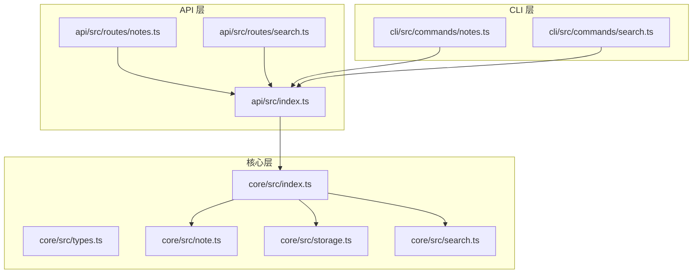
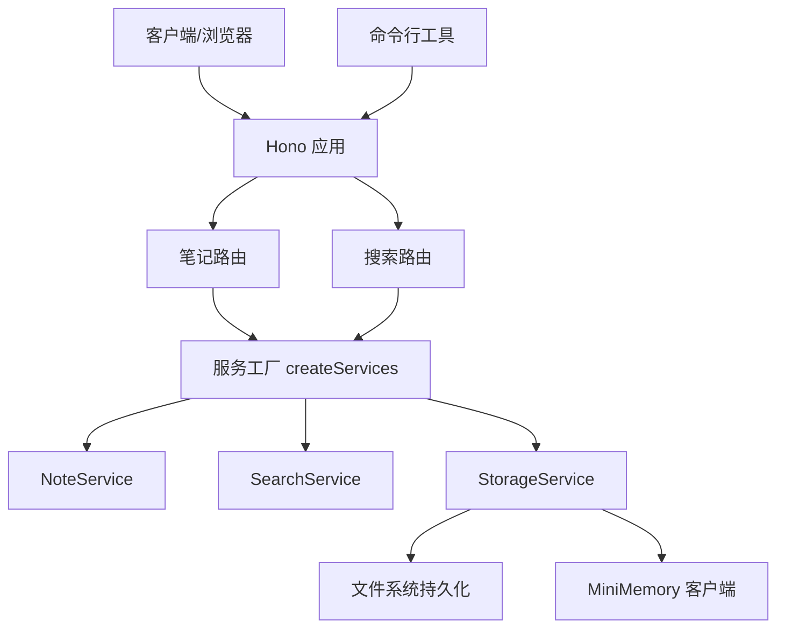
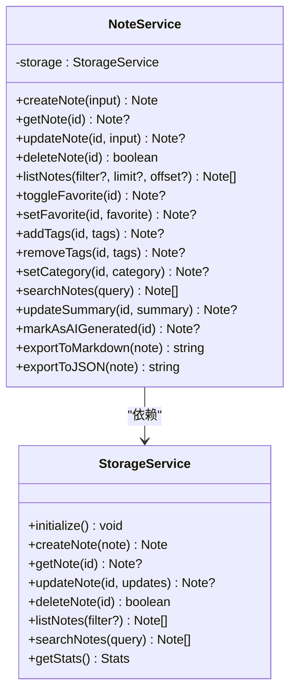
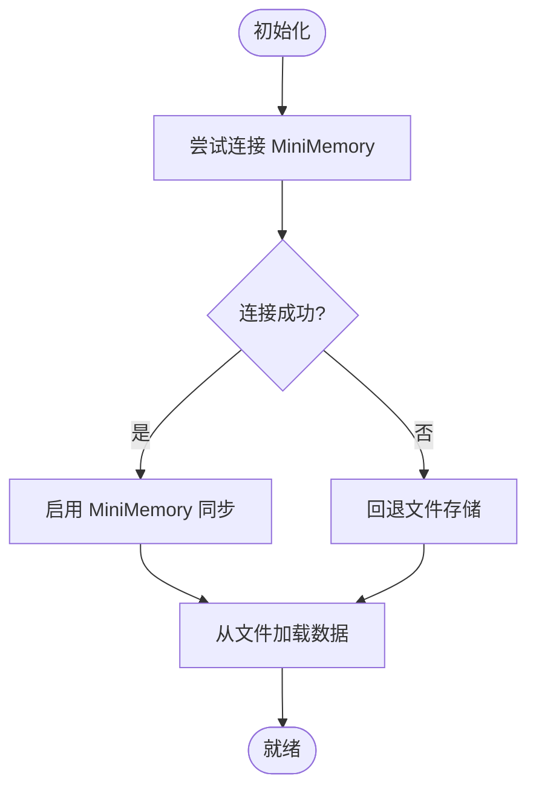
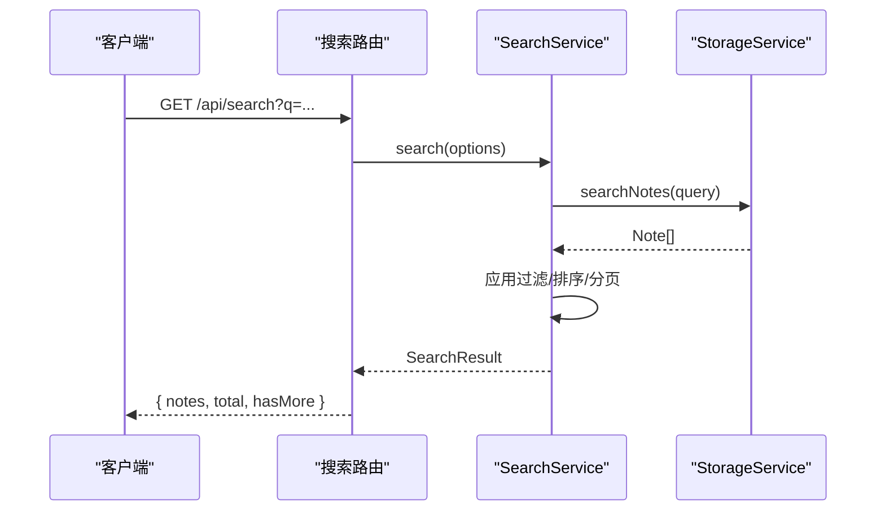
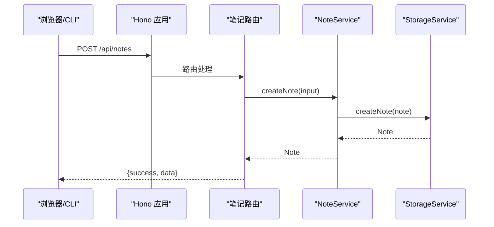
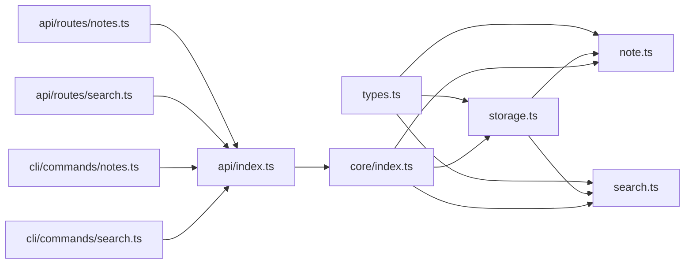

# 笔记服务

<cite>
**本文引用的文件**
- [package.json](file://package.json)
- [turbo.json](file://turbo.json)
- [packages/core/src/index.ts](file://packages/core/src/index.ts)
- [packages/core/src/types.ts](file://packages/core/src/types.ts)
- [packages/core/src/note.ts](file://packages/core/src/note.ts)
- [packages/core/src/storage.ts](file://packages/core/src/storage.ts)
- [packages/core/src/search.ts](file://packages/core/src/search.ts)
- [packages/api/src/index.ts](file://packages/api/src/index.ts)
- [packages/api/src/routes/notes.ts](file://packages/api/src/routes/notes.ts)
- [packages/api/src/routes/search.ts](file://packages/api/src/routes/search.ts)
- [packages/cli/src/commands/notes.ts](file://packages/cli/src/commands/notes.ts)
- [packages/cli/src/commands/search.ts](file://packages/cli/src/commands/search.ts)
</cite>

## 目录
1. [简介](#简介)
2. [项目结构](#项目结构)
3. [核心组件](#核心组件)
4. [架构总览](#架构总览)
5. [详细组件分析](#详细组件分析)
6. [依赖关系分析](#依赖关系分析)
7. [性能考虑](#性能考虑)
8. [故障排查指南](#故障排查指南)
9. [结论](#结论)
10. [附录](#附录)

## 简介
本技术文档围绕“笔记服务”展开，系统性阐述 NoteService 的核心能力与实现细节，覆盖笔记的完整 CRUD 操作、标签与分类管理、搜索与全文检索、收藏与导出机制、与存储服务的交互模式、事务与并发控制策略、权限与数据校验、错误处理以及扩展与自定义开发指南。项目采用多包工作区组织，核心逻辑集中在 core 包，API 层与 CLI 工具通过统一的服务接口进行调用。

## 项目结构
项目采用 monorepo 结构，通过工作区管理多个子包，核心模块如下：
- packages/core：核心服务与数据模型（NoteService、StorageService、SearchService、类型定义）
- packages/api：基于 Hono 的 Web API 服务，提供 REST 接口
- packages/cli：命令行工具，提供笔记与搜索的命令行操作
- packages/web：前端工程（当前仓库未包含具体实现）

**图表来源**
- [packages/core/src/index.ts:1-50](file://packages/core/src/index.ts#L1-L50)
- [packages/core/src/types.ts:1-163](file://packages/core/src/types.ts#L1-L163)
- [packages/core/src/note.ts:1-159](file://packages/core/src/note.ts#L1-L159)
- [packages/core/src/storage.ts:1-326](file://packages/core/src/storage.ts#L1-L326)
- [packages/core/src/search.ts:1-93](file://packages/core/src/search.ts#L1-L93)
- [packages/api/src/index.ts:1-64](file://packages/api/src/index.ts#L1-L64)
- [packages/api/src/routes/notes.ts:1-161](file://packages/api/src/routes/notes.ts#L1-L161)
- [packages/api/src/routes/search.ts:1-92](file://packages/api/src/routes/search.ts#L1-L92)
- [packages/cli/src/commands/notes.ts:1-307](file://packages/cli/src/commands/notes.ts#L1-L307)
- [packages/cli/src/commands/search.ts:1-119](file://packages/cli/src/commands/search.ts#L1-L119)

**章节来源**
- [package.json:1-25](file://package.json#L1-L25)
- [turbo.json:1-23](file://turbo.json#L1-L23)

## 核心组件
- 服务工厂与聚合：通过 createServices 聚合 StorageService、NoteService、AIService、SearchService，并注入配置（数据目录、MiniMemory、Ollama）。
- 数据模型：Note、CreateNoteInput、UpdateNoteInput、NoteFilter、SearchOptions、SearchResult 等，统一了笔记、分类、标签、时间戳、收藏与 AI 标记等字段。
- NoteService：封装笔记 CRUD、收藏切换、标签增删、分类设置、搜索、摘要更新、AI 标记、导出（Markdown/JSON）。
- StorageService：提供内存 Map 作为主存储，支持文件持久化；可选 MiniMemory 客户端同步键值；提供笔记搜索、AI 会话与学习进度管理。
- SearchService：在 StorageService 的搜索基础上，增加过滤、排序、分页与建议生成。

**章节来源**
- [packages/core/src/index.ts:18-50](file://packages/core/src/index.ts#L18-L50)
- [packages/core/src/types.ts:1-163](file://packages/core/src/types.ts#L1-L163)
- [packages/core/src/note.ts:1-159](file://packages/core/src/note.ts#L1-L159)
- [packages/core/src/storage.ts:108-326](file://packages/core/src/storage.ts#L108-L326)
- [packages/core/src/search.ts:1-93](file://packages/core/src/search.ts#L1-L93)

## 架构总览
整体架构由“服务层 → 存储层 → 可选外部缓存”组成，API 与 CLI 通过统一服务接口访问能力。

**图表来源**
- [packages/api/src/index.ts:1-64](file://packages/api/src/index.ts#L1-L64)
- [packages/api/src/routes/notes.ts:1-161](file://packages/api/src/routes/notes.ts#L1-L161)
- [packages/api/src/routes/search.ts:1-92](file://packages/api/src/routes/search.ts#L1-L92)
- [packages/core/src/index.ts:25-49](file://packages/core/src/index.ts#L25-L49)
- [packages/core/src/storage.ts:108-140](file://packages/core/src/storage.ts#L108-L140)

## 详细组件分析

### NoteService 组件分析
职责与能力：
- 笔记 CRUD：创建、查询、更新、删除
- 列表与过滤：支持 favorites、ai-generated、recent、all 等过滤，结合 limit/offset
- 收藏管理：toggleFavorite/setFavorite
- 标签管理：addTags/removeTags（去重、差集）
- 分类管理：setCategory
- 搜索：searchNotes（委托 StorageService）
- AI 相关：updateSummary/markAsAIGenerated
- 导出：exportToMarkdown/exportToJSON

**图表来源**
- [packages/core/src/note.ts:1-159](file://packages/core/src/note.ts#L1-L159)
- [packages/core/src/storage.ts:108-326](file://packages/core/src/storage.ts#L108-L326)

**章节来源**
- [packages/core/src/note.ts:1-159](file://packages/core/src/note.ts#L1-L159)

### StorageService 组件分析
职责与能力：
- 初始化：尝试连接 MiniMemory，失败则回退至文件存储
- 笔记操作：create/get/update/delete/list/search
- 文件持久化：notes.json，自动创建目录
- MiniMemory 同步：SET/GET/DEL/EXISTS 命令，键命名规范 note:<id>、note:meta:<id>:created
- 统计：总笔记数、收藏数、AI 生成数、标签种类数

并发与事务：
- 内存 Map 读写为同步操作，无显式锁
- 文件写入为一次原子写（saveToFile），避免部分写入
- MiniMemory 操作为异步命令，未见事务封装

**图表来源**
- [packages/core/src/storage.ts:124-140](file://packages/core/src/storage.ts#L124-L140)

**章节来源**
- [packages/core/src/storage.ts:108-326](file://packages/core/src/storage.ts#L108-L326)

### SearchService 组件分析
职责与能力：
- 在 StorageService 的搜索基础上，应用分类、收藏、AI 标记、标签集合、日期范围过滤
- 排序：标题命中优先，其次按 updatedAt 降序
- 分页：offset/limit
- 快速搜索：仅标题匹配，返回前 N 条
- 建议：基于匹配笔记的标签集合去重取前 K 个

**图表来源**
- [packages/api/src/routes/search.ts:1-92](file://packages/api/src/routes/search.ts#L1-L92)
- [packages/core/src/search.ts:12-64](file://packages/core/src/search.ts#L12-L64)
- [packages/core/src/storage.ts:249-257](file://packages/core/src/storage.ts#L249-L257)

**章节来源**
- [packages/core/src/search.ts:1-93](file://packages/core/src/search.ts#L1-L93)

### API 层（Hono）与路由
- 健康检查与状态：/api/health、/api/status
- 笔记路由：列表、创建、查询、更新、删除、收藏、标签、导出、统计
- 搜索路由：全文搜索、快速搜索、建议

**图表来源**
- [packages/api/src/routes/notes.ts:27-44](file://packages/api/src/routes/notes.ts#L27-L44)
- [packages/core/src/note.ts:14-30](file://packages/core/src/note.ts#L14-L30)
- [packages/core/src/storage.ts:169-181](file://packages/core/src/storage.ts#L169-L181)

**章节来源**
- [packages/api/src/index.ts:1-64](file://packages/api/src/index.ts#L1-L64)
- [packages/api/src/routes/notes.ts:1-161](file://packages/api/src/routes/notes.ts#L1-L161)
- [packages/api/src/routes/search.ts:1-92](file://packages/api/src/routes/search.ts#L1-L92)

### CLI 工具
- notes 子命令：create/list/show/edit/delete/favorite/tag/export/stats
- search 子命令：query/quick/suggest
- 与 API 交互：统一通过 baseUrl 发起 HTTP 请求，支持 spinner/chalk 输出美化

**章节来源**
- [packages/cli/src/commands/notes.ts:1-307](file://packages/cli/src/commands/notes.ts#L1-L307)
- [packages/cli/src/commands/search.ts:1-119](file://packages/cli/src/commands/search.ts#L1-L119)

## 依赖关系分析
- 服务聚合：createServices 串联 StorageService、NoteService、AIService、SearchService
- 路由依赖：API 路由依赖 services 对象；CLI 依赖 API 提供的 HTTP 接口
- 存储依赖：NoteService 依赖 StorageService；SearchService 依赖 StorageService 的搜索能力

**图表来源**
- [packages/core/src/types.ts:1-163](file://packages/core/src/types.ts#L1-L163)
- [packages/core/src/note.ts:1-159](file://packages/core/src/note.ts#L1-L159)
- [packages/core/src/storage.ts:1-326](file://packages/core/src/storage.ts#L1-L326)
- [packages/core/src/search.ts:1-93](file://packages/core/src/search.ts#L1-L93)
- [packages/core/src/index.ts:1-50](file://packages/core/src/index.ts#L1-L50)
- [packages/api/src/index.ts:1-64](file://packages/api/src/index.ts#L1-L64)
- [packages/api/src/routes/notes.ts:1-161](file://packages/api/src/routes/notes.ts#L1-L161)
- [packages/api/src/routes/search.ts:1-92](file://packages/api/src/routes/search.ts#L1-L92)
- [packages/cli/src/commands/notes.ts:1-307](file://packages/cli/src/commands/notes.ts#L1-L307)
- [packages/cli/src/commands/search.ts:1-119](file://packages/cli/src/commands/search.ts#L1-L119)

**章节来源**
- [packages/core/src/index.ts:1-50](file://packages/core/src/index.ts#L1-L50)

## 性能考虑
- 存储层
  - 内存 Map 读写为 O(1)/O(n) 过滤，listNotes 先全量再过滤，适合中小规模数据
  - 文件持久化为一次性写入，避免频繁 IO
  - MiniMemory 同步为网络调用，存在延迟与失败风险
- 搜索层
  - StorageService 的 searchNotes 为线性扫描，复杂度 O(n*m)，其中 n 为笔记数，m 为字段匹配次数
  - SearchService 在内存中进一步过滤/排序/分页，注意 limit/offset 的组合
- 并发与事务
  - 当前实现未见显式锁或事务封装，建议在高并发场景下引入队列或分布式锁，或在上层做幂等与重试
- 建议优化
  - 引入索引（如标题/标签倒排索引）或搜索引擎（Elasticsearch/Lunr）
  - 使用批量写入与增量同步减少 MiniMemory 压力
  - 对高频查询结果做缓存（Redis/MemoryCache）

[本节为通用性能讨论，无需特定文件来源]

## 故障排查指南
- 常见错误与处理
  - 笔记不存在：API 返回 404，错误信息为“Note not found”
  - 查询参数缺失：搜索路由要求 q 参数，否则返回 400
  - MiniMemory 不可用：StorageService 初始化时回退文件存储，日志会提示
  - 导出失败：导出接口根据 id 查询，不存在则 404
- 日志与健康检查
  - /api/health：返回服务状态与时戳
  - /api/status：返回 AI 连接状态与统计信息
- CLI 错误
  - 请求失败：spinner.fail 并打印错误消息
  - 强制删除需传入 --force

**章节来源**
- [packages/api/src/routes/notes.ts:51-53](file://packages/api/src/routes/notes.ts#L51-L53)
- [packages/api/src/routes/notes.ts:77-79](file://packages/api/src/routes/notes.ts#L77-L79)
- [packages/api/src/routes/search.ts:12-14](file://packages/api/src/routes/search.ts#L12-L14)
- [packages/api/src/index.ts:28-41](file://packages/api/src/index.ts#L28-L41)
- [packages/cli/src/commands/notes.ts:178-198](file://packages/cli/src/commands/notes.ts#L178-L198)
- [packages/cli/src/commands/search.ts:67-70](file://packages/cli/src/commands/search.ts#L67-L70)

## 结论
本笔记服务以简洁清晰的分层设计实现了核心功能：统一的数据模型、完备的 CRUD 与标签/分类管理、基础的全文检索与排序分页、收藏与导出能力，并通过 API 与 CLI 提供了良好的可操作性。存储层在内存与文件之间提供了平滑回退，同时支持 MiniMemory 同步。未来可在搜索索引、并发控制与事务一致性方面进一步增强，以支撑更大规模与更高并发的场景。

[本节为总结性内容，无需特定文件来源]

## 附录

### 数据模型与字段说明
- Note 字段：id、title、content、summary、tags、category、isFavorite、isAIGenerated、createdAt、updatedAt
- 输入模型：CreateNoteInput、UpdateNoteInput
- 过滤与搜索：NoteFilter、SearchOptions、SearchResult
- 分类枚举：NoteCategory（work/study/creative/personal/ai-generated）

**章节来源**
- [packages/core/src/types.ts:1-163](file://packages/core/src/types.ts#L1-L163)

### API 接口概览
- 健康检查：GET /api/health
- 状态：GET /api/status
- 笔记
  - GET /api/notes?filter=&limit=&offset=
  - POST /api/notes
  - GET /api/notes/:id
  - PUT /api/notes/:id
  - DELETE /api/notes/:id
  - POST /api/notes/:id/favorite
  - POST /api/notes/:id/tags
  - DELETE /api/notes/:id/tags
  - GET /api/notes/:id/export?format=markdown|json
  - GET /api/notes/stats/summary
- 搜索
  - GET /api/search?q=&tags=&limit=&offset=&category=&favorite=&ai-generated=&startDate=&endDate=
  - GET /api/search/quick?q=
  - GET /api/search/suggestions?q=

**章节来源**
- [packages/api/src/index.ts:27-41](file://packages/api/src/index.ts#L27-L41)
- [packages/api/src/routes/notes.ts:1-161](file://packages/api/src/routes/notes.ts#L1-L161)
- [packages/api/src/routes/search.ts:1-92](file://packages/api/src/routes/search.ts#L1-L92)

### 开发与扩展指南
- 新增字段
  - 在 types.ts 中扩展 Note/输入模型
  - 在 note.ts 与 storage.ts 中同步更新创建/更新逻辑
- 新增过滤器
  - 在 NoteFilter 或 SearchOptions 中新增枚举值
  - 在 NoteService.listNotes 与 SearchService.search 中实现过滤
- 新增导出格式
  - 在 NoteService.exportToXxx 中新增导出方法
  - 在 API 路由中暴露对应格式参数
- 集成外部搜索
  - 替换 StorageService.searchNotes 为外部搜索引擎调用
  - 在 SearchService 中保留过滤/排序/分页逻辑
- 并发与事务
  - 引入队列（如 BullMQ）保证幂等更新
  - 在高并发场景下考虑数据库或分布式锁

[本节为通用开发指导，无需特定文件来源]