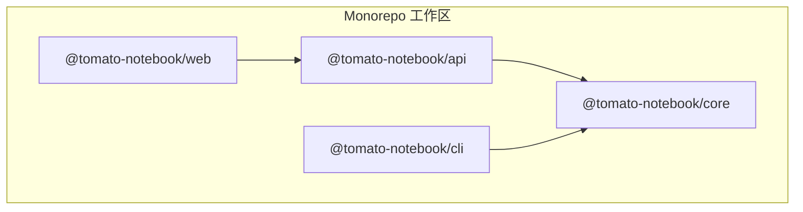
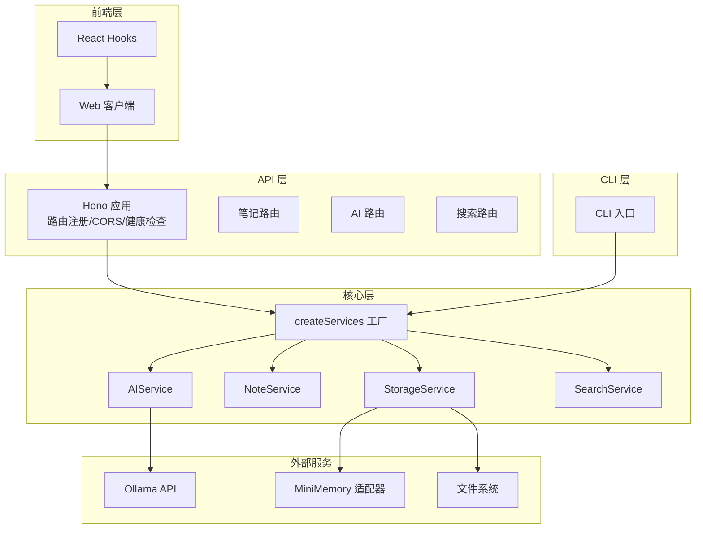
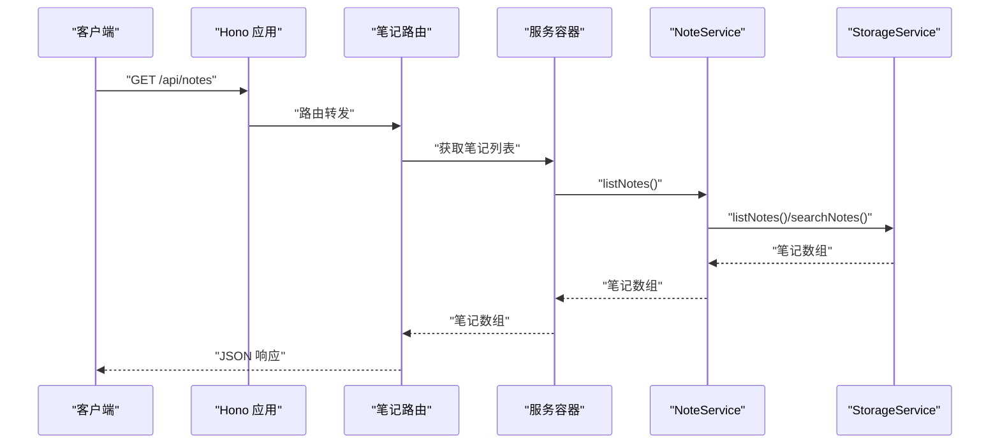
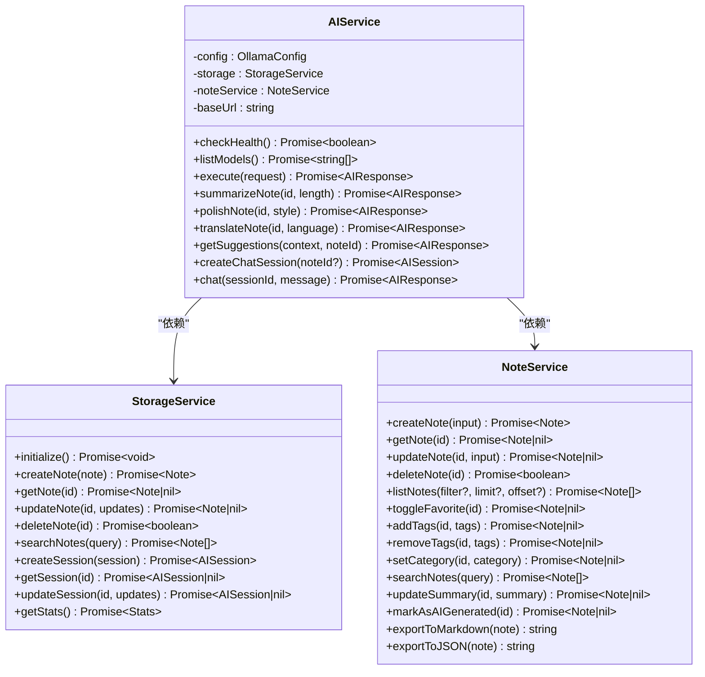
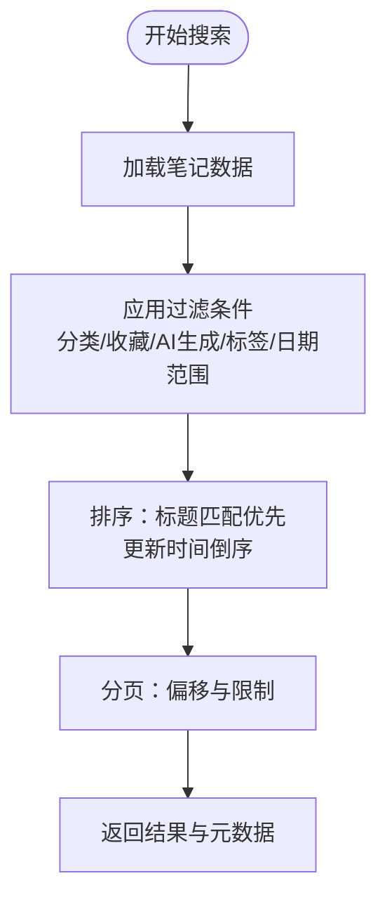
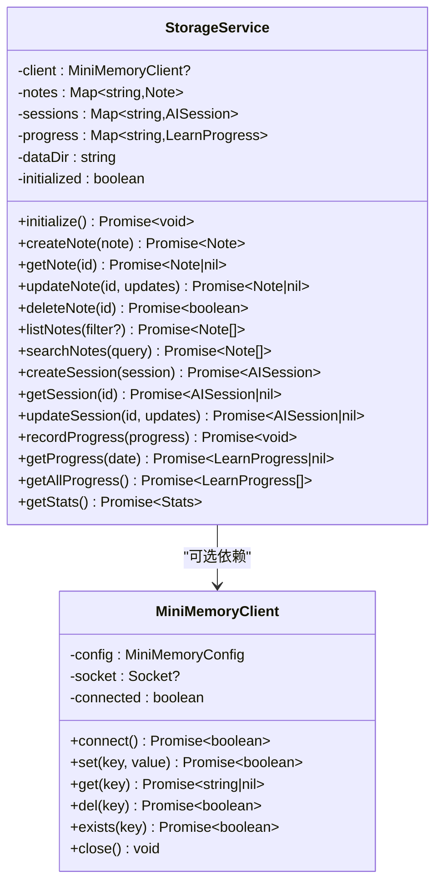
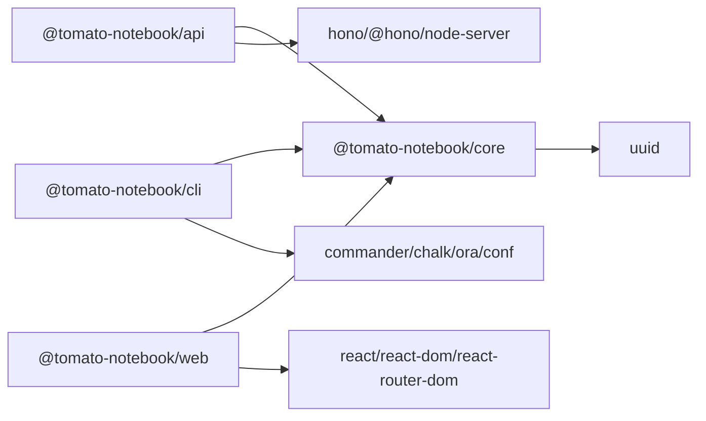

# 架构设计

<cite>
**本文引用的文件**
- [package.json](file://package.json)
- [turbo.json](file://turbo.json)
- [tsconfig.json](file://tsconfig.json)
- [packages/api/package.json](file://packages/api/package.json)
- [packages/api/src/index.ts](file://packages/api/src/index.ts)
- [packages/api/src/routes/notes.ts](file://packages/api/src/routes/notes.ts)
- [packages/api/src/routes/ai.ts](file://packages/api/src/routes/ai.ts)
- [packages/api/src/routes/search.ts](file://packages/api/src/routes/search.ts)
- [packages/cli/package.json](file://packages/cli/package.json)
- [packages/cli/src/index.ts](file://packages/cli/src/index.ts)
- [packages/core/package.json](file://packages/core/package.json)
- [packages/core/src/index.ts](file://packages/core/src/index.ts)
- [packages/core/src/note.ts](file://packages/core/src/note.ts)
- [packages/core/src/ai.ts](file://packages/core/src/ai.ts)
- [packages/core/src/search.ts](file://packages/core/src/search.ts)
- [packages/core/src/storage.ts](file://packages/core/src/storage.ts)
- [packages/web/package.json](file://packages/web/package.json)
- [packages/web/src/api/client.ts](file://packages/web/src/api/client.ts)
- [packages/web/src/hooks/useNotes.ts](file://packages/web/src/hooks/useNotes.ts)
</cite>

## 目录
1. [引言](#引言)
2. [项目结构](#项目结构)
3. [核心组件](#核心组件)
4. [架构总览](#架构总览)
5. [详细组件分析](#详细组件分析)
6. [依赖分析](#依赖分析)
7. [性能考量](#性能考量)
8. [故障排查指南](#故障排查指南)
9. [结论](#结论)
10. [附录](#附录)

## 引言
本项目采用 Monorepo 架构组织，通过工作区统一管理多个包：API 服务、CLI 工具、核心业务逻辑与 Web 前端。核心思想是将“领域服务”下沉至核心包，由 API 层与 CLI 层分别消费；Web 前端通过 API 提供的统一接口进行交互。该架构强调模块化、可测试性与可扩展性，并在核心包中内置依赖注入、适配器与工厂等设计模式，以实现清晰的职责分离与良好的技术债务控制。

## 项目结构
项目根目录采用工作区管理，构建工具使用 Turbo，TypeScript 编译选项统一配置。四个包的职责如下：
- @tomato-notebook/api：基于 Hono 的 HTTP API 服务，负责路由注册、CORS 配置与服务实例暴露。
- @tomato-notebook/cli：命令行工具，提供笔记管理、AI 操作与服务启动等命令。
- @tomato-notebook/core：核心业务逻辑与服务层，包含存储、笔记、AI、搜索服务及类型定义。
- @tomato-notebook/web：基于 Vite + React 的前端应用，通过 API 客户端与后端交互。

图表来源
- [packages/api/package.json:13-17](file://packages/api/package.json#L13-L17)
- [packages/cli/package.json:15-21](file://packages/cli/package.json#L15-L21)
- [packages/web/package.json:11-17](file://packages/web/package.json#L11-L17)
- [packages/core/package.json:1-26](file://packages/core/package.json#L1-L26)

章节来源
- [package.json:5-7](file://package.json#L5-L7)
- [turbo.json:3-21](file://turbo.json#L3-L21)
- [tsconfig.json:2-19](file://tsconfig.json#L2-L19)

## 核心组件
核心服务层位于 @tomato-notebook/core，包含四大服务：
- 存储服务（StorageService）：负责笔记、会话与学习进度的持久化与内存缓存，支持 MiniMemory 适配器与文件回退。
- 笔记服务（NoteService）：封装笔记的增删改查、标签管理、收藏切换、分类设置与导出功能。
- AI 服务（AIService）：封装 Ollama 对接，提供总结、润色、翻译、建议与聊天会话能力。
- 搜索服务（SearchService）：提供全文检索、快速搜索与标签建议。

服务创建入口统一由工厂函数 createServices 组合并初始化，形成依赖注入容器，便于替换实现与测试。

章节来源
- [packages/core/src/index.ts:18-49](file://packages/core/src/index.ts#L18-L49)
- [packages/core/src/storage.ts:108-317](file://packages/core/src/storage.ts#L108-L317)
- [packages/core/src/note.ts:6-159](file://packages/core/src/note.ts#L6-L159)
- [packages/core/src/ai.ts:42-292](file://packages/core/src/ai.ts#L42-L292)
- [packages/core/src/search.ts:4-93](file://packages/core/src/search.ts#L4-L93)

## 架构总览
系统边界与组件交互如下：
- API 层：接收 HTTP 请求，调用核心服务，返回标准化响应。
- CLI 层：通过核心服务执行命令式操作。
- 核心层：提供统一的服务接口与工厂，屏蔽存储与外部服务差异。
- 前端层：通过 API 客户端发起请求，展示数据与触发操作。

图表来源
- [packages/api/src/index.ts:4-18](file://packages/api/src/index.ts#L4-L18)
- [packages/api/src/routes/notes.ts:1-161](file://packages/api/src/routes/notes.ts#L1-L161)
- [packages/api/src/routes/ai.ts:1-149](file://packages/api/src/routes/ai.ts#L1-L149)
- [packages/api/src/routes/search.ts:1-92](file://packages/api/src/routes/search.ts#L1-L92)
- [packages/core/src/index.ts:25-49](file://packages/core/src/index.ts#L25-L49)
- [packages/core/src/ai.ts:55-74](file://packages/core/src/ai.ts#L55-L74)
- [packages/core/src/storage.ts:124-140](file://packages/core/src/storage.ts#L124-L140)

## 详细组件分析

### API 服务层
- 依赖注入：API 启动时通过 createServices 创建统一服务容器，避免在路由中直接构造依赖。
- CORS 与健康检查：提供跨域支持与基础健康状态查询。
- 路由分发：将笔记、AI、搜索路由挂载到统一前缀下，便于扩展与维护。
- 错误处理：对常见错误进行标准化响应，便于前端统一处理。

图表来源
- [packages/api/src/index.ts:4-18](file://packages/api/src/index.ts#L4-L18)
- [packages/api/src/routes/notes.ts:7-25](file://packages/api/src/routes/notes.ts#L7-L25)
- [packages/core/src/note.ts:47-76](file://packages/core/src/note.ts#L47-L76)
- [packages/core/src/storage.ts:220-247](file://packages/core/src/storage.ts#L220-L247)

章节来源
- [packages/api/src/index.ts:1-64](file://packages/api/src/index.ts#L1-L64)
- [packages/api/src/routes/notes.ts:1-161](file://packages/api/src/routes/notes.ts#L1-L161)

### AI 服务层
- 适配器模式：通过 AIService 适配 Ollama API，隐藏底层通信细节。
- 工厂模式：AIServiceConfig 与 createAIService 统一创建与配置。
- 系统提示词：针对不同操作提供专用提示词模板，保证输出质量。
- 会话管理：支持创建与维护聊天会话，结合笔记上下文增强对话效果。

图表来源
- [packages/core/src/ai.ts:42-292](file://packages/core/src/ai.ts#L42-L292)
- [packages/core/src/storage.ts:108-317](file://packages/core/src/storage.ts#L108-L317)
- [packages/core/src/note.ts:6-159](file://packages/core/src/note.ts#L6-L159)

章节来源
- [packages/api/src/routes/ai.ts:1-149](file://packages/api/src/routes/ai.ts#L1-L149)
- [packages/core/src/ai.ts:1-298](file://packages/core/src/ai.ts#L1-L298)

### 搜索服务层
- 多维过滤：支持分类、收藏、AI 生成标记、标签集合与日期范围过滤。
- 排序策略：优先标题匹配，其次按更新时间倒序。
- 分页与总数：返回分页元数据，便于前端无限滚动与分页控件。
- 快速搜索与建议：提供标题匹配与标签建议能力，提升用户体验。

图表来源
- [packages/core/src/search.ts:12-64](file://packages/core/src/search.ts#L12-L64)

章节来源
- [packages/api/src/routes/search.ts:1-92](file://packages/api/src/routes/search.ts#L1-L92)
- [packages/core/src/search.ts:1-93](file://packages/core/src/search.ts#L1-L93)

### 存储服务层
- 双重持久化：优先 MiniMemory 适配器，失败则回退到本地文件系统。
- 内存缓存：在进程内维护 Map，减少 IO 并提升读写性能。
- 统一键空间：为笔记与元数据建立一致的键命名规范，便于同步与清理。
- 统计聚合：提供统计信息计算，支撑仪表盘与概览视图。

图表来源
- [packages/core/src/storage.ts:108-317](file://packages/core/src/storage.ts#L108-L317)

章节来源
- [packages/core/src/storage.ts:1-326](file://packages/core/src/storage.ts#L1-L326)

### CLI 与 Web 前端
- CLI：通过核心服务执行命令式操作，适合自动化与批处理场景。
- Web：通过 API 客户端与 Hooks 与后端交互，实现笔记 CRUD、AI 操作与搜索功能。

章节来源
- [packages/cli/src/index.ts:1-26](file://packages/cli/src/index.ts#L1-L26)
- [packages/web/src/api/client.ts:1-200](file://packages/web/src/api/client.ts#L1-L200)
- [packages/web/src/hooks/useNotes.ts:1-200](file://packages/web/src/hooks/useNotes.ts#L1-L200)

## 依赖分析
- 包间依赖
  - @tomato-notebook/api 依赖 @tomato-notebook/core 与 Hono 生态。
  - @tomato-notebook/cli 依赖 @tomato-notebook/core 与命令行生态。
  - @tomato-notebook/web 依赖 @tomato-notebook/core 与前端生态。
- 外部依赖
  - API 层依赖 Hono 与 @hono/node-server。
  - AI 层依赖 Ollama API。
  - 存储层可选依赖 MiniMemory 适配器与文件系统。

图表来源
- [packages/api/package.json:13-17](file://packages/api/package.json#L13-L17)
- [packages/cli/package.json:15-21](file://packages/cli/package.json#L15-L21)
- [packages/web/package.json:11-17](file://packages/web/package.json#L11-L17)
- [packages/core/package.json:18-20](file://packages/core/package.json#L18-L20)

章节来源
- [packages/api/package.json:1-22](file://packages/api/package.json#L1-L22)
- [packages/cli/package.json:1-26](file://packages/cli/package.json#L1-L26)
- [packages/core/package.json:1-26](file://packages/core/package.json#L1-L26)
- [packages/web/package.json:1-29](file://packages/web/package.json#L1-L29)

## 性能考量
- I/O 优化
  - 存储层采用内存 Map 缓存，批量写入时合并更新，降低磁盘写入频率。
  - MiniMemory 适配器在可用时提供高性能键值访问，失败回退文件系统。
- 网络优化
  - AI 服务统一复用 Ollama 连接参数，避免重复握手。
  - 路由层启用 CORS 与健康检查，减少跨域与连通性问题带来的额外开销。
- 查询优化
  - 搜索服务先做全文匹配，再应用多维过滤与排序，最后分页，避免不必要的全量扫描。
- 并发与缓存
  - 建议在 API 层引入轻量缓存（如 LRU）以缓解高频查询压力。
  - 对于大文件导出（Markdown/JSON），建议流式输出以降低内存占用。

## 故障排查指南
- API 健康检查
  - 使用健康端点确认服务运行状态与外部依赖连通性。
- AI 服务诊断
  - 检查 Ollama 地址与端口配置，确保模型可用。
  - 对无效操作或缺失参数返回进行日志记录与错误码区分。
- 存储层问题
  - MiniMemory 不可用时自动回退文件系统，确认数据目录权限与磁盘空间。
  - 若出现数据不一致，可通过重新初始化存储并重建索引解决。
- 前端交互
  - 使用 API 客户端与 Hooks 进行断点调试，关注网络请求与响应结构。

章节来源
- [packages/api/src/index.ts:27-41](file://packages/api/src/index.ts#L27-L41)
- [packages/api/src/routes/ai.ts:7-19](file://packages/api/src/routes/ai.ts#L7-L19)
- [packages/core/src/ai.ts:55-74](file://packages/core/src/ai.ts#L55-L74)
- [packages/core/src/storage.ts:124-140](file://packages/core/src/storage.ts#L124-L140)

## 结论
本项目通过 Monorepo 与核心服务层实现了清晰的职责划分与高内聚低耦合的架构设计。API、CLI 与 Web 前端分别承担接口、命令与界面职责，核心服务通过工厂与依赖注入实现可替换与可测试。适配器与工厂模式有效隔离了外部依赖与存储实现差异，提升了系统的可维护性与演进弹性。建议在后续迭代中完善缓存策略、监控告警与可观测性，以进一步提升生产环境稳定性与性能表现。

## 附录
- 设计模式应用
  - 依赖注入：createServices 统一创建与组装服务实例。
  - 适配器模式：AIService 适配 Ollama，StorageService 适配 MiniMemory 与文件系统。
  - 工厂模式：createNoteService、createAIService、createSearchService、createStorageService 提供统一创建入口。
- 微服务架构原则
  - 单一职责：每个服务专注于特定领域（存储、笔记、AI、搜索）。
  - 松耦合：通过统一接口与工厂解耦，支持独立演进与替换。
  - 可观测性：提供健康检查与统计接口，便于运维与监控。
  - 可扩展性：新增服务与路由只需遵循现有约定，无需修改既有模块。