# 组件交互与数据流

<cite>
**本文档引用的文件**
- [package.json](file://package.json)
- [turbo.json](file://turbo.json)
- [packages/api/src/index.ts](file://packages/api/src/index.ts)
- [packages/core/src/index.ts](file://packages/core/src/index.ts)
- [packages/core/src/storage.ts](file://packages/core/src/storage.ts)
- [packages/core/src/note.ts](file://packages/core/src/note.ts)
- [packages/core/src/ai.ts](file://packages/core/src/ai.ts)
- [packages/core/src/search.ts](file://packages/core/src/search.ts)
- [packages/web/src/main.tsx](file://packages/web/src/main.tsx)
- [packages/cli/src/index.ts](file://packages/cli/src/index.ts)
</cite>

## 目录
1. [简介](#简介)
2. [项目结构](#项目结构)
3. [核心组件](#核心组件)
4. [架构概览](#架构概览)
5. [详细组件分析](#详细组件分析)
6. [依赖关系分析](#依赖关系分析)
7. [性能考虑](#性能考虑)
8. [故障排除指南](#故障排除指南)
9. [结论](#结论)

## 简介

番茄笔记是一个基于现代JavaScript技术栈构建的AI学习笔记本应用。该项目采用Monorepo架构，通过模块化设计实现了Web前端、API服务、CLI工具和核心服务之间的清晰分离。系统的核心价值在于提供一个集笔记管理、AI辅助学习、智能搜索于一体的综合平台。

该应用的主要特性包括：
- 实时笔记创建、编辑和管理
- AI驱动的内容总结、润色和翻译
- 智能搜索和标签管理
- 多种数据存储方案（内存缓存+文件持久化）
- 跨平台支持（Web浏览器、命令行界面）

## 项目结构

项目采用Turbo Monorepo架构，将不同功能模块分离到独立的包中：

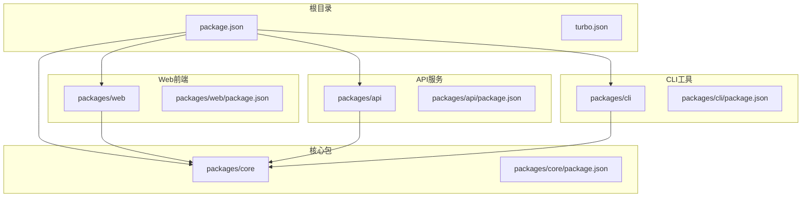

**图表来源**
- [package.json:1-25](file://package.json#L1-L25)
- [turbo.json:1-23](file://turbo.json#L1-L23)

每个包都有明确的职责分工：

- **@tomato-notebook/core**: 核心业务逻辑和服务层
- **@tomato-notebook/web**: React前端应用
- **@tomato-notebook/api**: Hono框架的REST API服务
- **@tomato-notebook/cli**: 命令行界面工具

**章节来源**
- [package.json:1-25](file://package.json#L1-L25)
- [turbo.json:1-23](file://turbo.json#L1-L23)

## 核心组件

### 服务架构

系统采用工厂模式创建统一的服务接口，确保各组件间的松耦合：

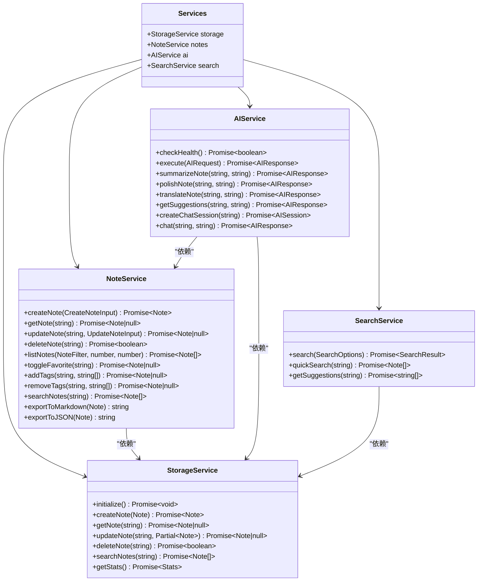

**图表来源**
- [packages/core/src/index.ts:18-49](file://packages/core/src/index.ts#L18-L49)
- [packages/core/src/storage.ts:109-317](file://packages/core/src/storage.ts#L109-L317)
- [packages/core/src/note.ts:7-159](file://packages/core/src/note.ts#L7-L159)
- [packages/core/src/ai.ts:42-292](file://packages/core/src/ai.ts#L42-L292)
- [packages/core/src/search.ts:5-93](file://packages/core/src/search.ts#L5-L93)

### 数据存储架构

系统实现了双重存储策略，确保数据的可靠性和性能：

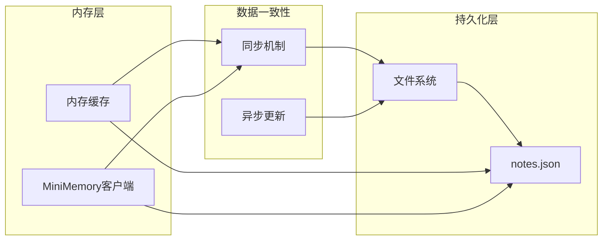

**图表来源**
- [packages/core/src/storage.ts:109-140](file://packages/core/src/storage.ts#L109-L140)
- [packages/core/src/storage.ts:162-181](file://packages/core/src/storage.ts#L162-L181)
- [packages/core/src/storage.ts:207-218](file://packages/core/src/storage.ts#L207-L218)

**章节来源**
- [packages/core/src/index.ts:25-49](file://packages/core/src/index.ts#L25-L49)
- [packages/core/src/storage.ts:109-317](file://packages/core/src/storage.ts#L109-L317)

## 架构概览

### 系统边界图

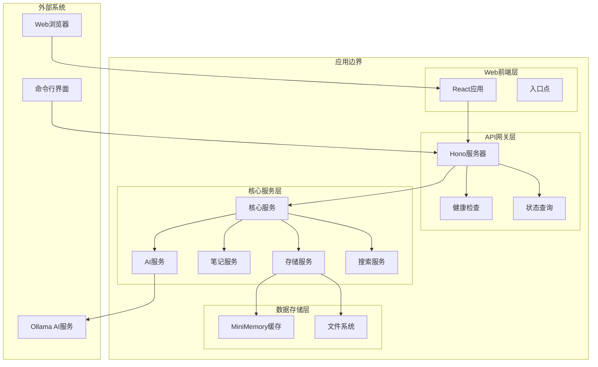

**图表来源**
- [packages/web/src/main.tsx:1-14](file://packages/web/src/main.tsx#L1-L14)
- [packages/api/src/index.ts:17-64](file://packages/api/src/index.ts#L17-L64)
- [packages/core/src/index.ts:25-49](file://packages/core/src/index.ts#L25-L49)

### 组件交互流程

系统支持多种交互模式，包括同步和异步操作：

```mermaid
sequenceDiagram
participant User as 用户
participant Web as Web前端
participant API as API服务
participant Core as 核心服务
participant Storage as 存储层
participant FS as 文件系统
User->>Web : 输入笔记内容
Web->>API : POST /api/notes
API->>Core : createNote()
Core->>Storage : createNote()
Storage->>FS : 写入文件
FS-->>Storage : 确认写入
Storage-->>Core : 返回笔记
Core-->>API : 返回结果
API-->>Web : JSON响应
Web-->>User : 显示成功
Note : 异步AI处理示例
User->>Web : 请求AI总结
Web->>API : POST /api/ai/summarize
API->>Core : summarizeNote()
Core->>Core : 调用AI服务
Core->>Storage : 更新摘要
Storage->>FS : 持久化更新
Core-->>API : 返回结果
API-->>Web : 异步通知
```

**图表来源**
- [packages/api/src/index.ts:44-51](file://packages/api/src/index.ts#L44-L51)
- [packages/core/src/note.ts:15-30](file://packages/core/src/note.ts#L15-L30)
- [packages/core/src/storage.ts:170-181](file://packages/core/src/storage.ts#L170-L181)

## 详细组件分析

### Web前端组件

Web前端基于React构建，提供直观的用户界面：

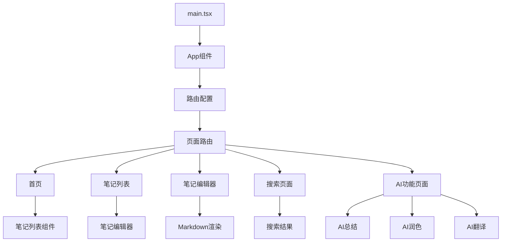

**图表来源**
- [packages/web/src/main.tsx:1-14](file://packages/web/src/main.tsx#L1-L14)

Web前端通过HTTP请求与API服务通信，实现完整的CRUD操作：

**章节来源**
- [packages/web/src/main.tsx:1-14](file://packages/web/src/main.tsx#L1-L14)

### API服务组件

API服务基于Hono框架，提供RESTful接口：

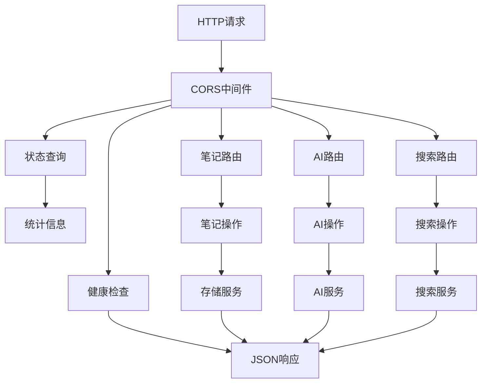

**图表来源**
- [packages/api/src/index.ts:21-64](file://packages/api/src/index.ts#L21-L64)

API服务的关键特性：
- 支持CORS跨域访问
- 提供健康检查端点
- 集成多个功能路由
- 统一的错误处理机制

**章节来源**
- [packages/api/src/index.ts:1-64](file://packages/api/src/index.ts#L1-L64)

### CLI工具组件

CLI工具提供命令行界面，支持离线操作：

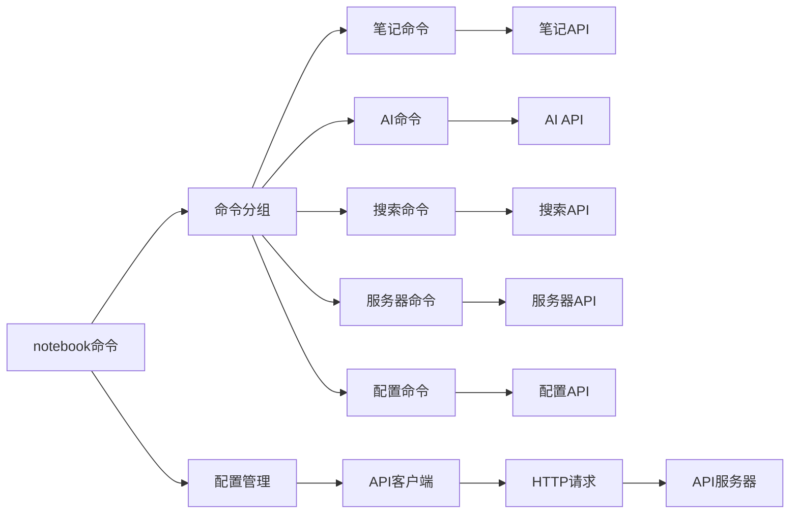

**图表来源**
- [packages/cli/src/index.ts:68-91](file://packages/cli/src/index.ts#L68-L91)

CLI工具的核心功能：
- 配置管理（Conf库）
- 命令解析（Commander）
- 进度显示（Ora）
- 颜色输出（Chalk）

**章节来源**
- [packages/cli/src/index.ts:1-91](file://packages/cli/src/index.ts#L1-L91)

### 核心服务组件

#### 存储服务

存储服务是整个系统的核心，负责数据的持久化和缓存：

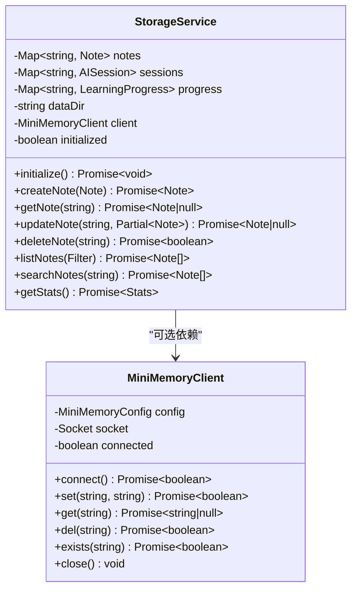

**图表来源**
- [packages/core/src/storage.ts:109-317](file://packages/core/src/storage.ts#L109-L317)
- [packages/core/src/storage.ts:7-106](file://packages/core/src/storage.ts#L7-L106)

存储服务的双层架构优势：
- **内存缓存**: 提供快速的数据访问
- **文件持久化**: 确保数据安全存储
- **MiniMemory集成**: 可选的高性能缓存层

#### AI服务

AI服务集成了Ollama AI模型，提供多种智能功能：

```mermaid
sequenceDiagram
participant Client as 客户端
participant AIService as AI服务
participant Ollama as Ollama API
participant NoteService as 笔记服务
participant Storage as 存储服务
Client->>AIService : execute(request)
AIService->>AIService : 构建提示词
AIService->>Ollama : POST /api/chat
Ollama-->>AIService : AI响应
AIService->>NoteService : 更新笔记(可选)
NoteService->>Storage : 持久化更新
AIService-->>Client : AIResponse
Note : 错误处理流程
AIService->>AIService : try-catch
AIService-->>Client : {success : false, error}
```

**图表来源**
- [packages/core/src/ai.ts:102-152](file://packages/core/src/ai.ts#L102-L152)
- [packages/core/src/ai.ts:77-99](file://packages/core/src/ai.ts#L77-L99)

AI服务的关键特性：
- 支持多种AI操作（总结、润色、翻译、建议、聊天）
- 智能提示词模板管理
- 与笔记系统的深度集成
- 完善的错误处理机制

**章节来源**
- [packages/core/src/storage.ts:109-317](file://packages/core/src/storage.ts#L109-L317)
- [packages/core/src/ai.ts:42-292](file://packages/core/src/ai.ts#L42-L292)

## 依赖关系分析

### 包依赖图

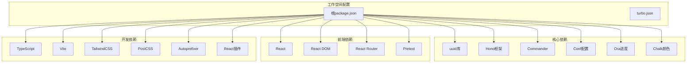

**图表来源**
- [packages/core/package.json:18-25](file://packages/core/package.json#L18-L25)
- [packages/api/package.json:13-21](file://packages/api/package.json#L13-L21)
- [packages/web/package.json:11-27](file://packages/web/package.json#L11-L27)
- [packages/cli/package.json:15-25](file://packages/cli/package.json#L15-L25)

### 运行时依赖链

系统运行时的依赖关系呈现清晰的层次结构：

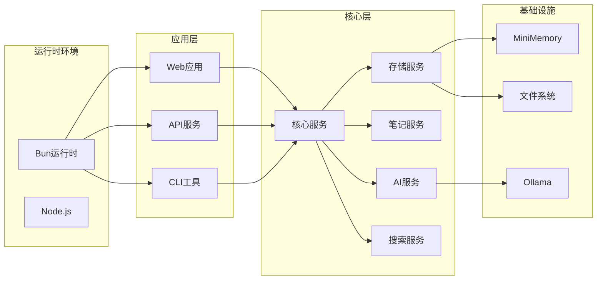

**图表来源**
- [packages/core/src/index.ts:25-49](file://packages/core/src/index.ts#L25-L49)
- [packages/api/src/index.ts:4-14](file://packages/api/src/index.ts#L4-L14)

**章节来源**
- [package.json:1-25](file://package.json#L1-L25)
- [packages/core/src/index.ts:25-49](file://packages/core/src/index.ts#L25-L49)

## 性能考虑

### 存储性能优化

系统采用了多层次的性能优化策略：

1. **内存缓存层**: 使用Map数据结构提供O(1)的查找性能
2. **增量更新**: 仅在必要时进行文件写入操作
3. **批量操作**: 支持分页和限制数量的查询
4. **异步处理**: 文件I/O操作采用异步非阻塞模式

### 网络性能优化

API服务通过以下方式优化网络性能：
- **CORS预配置**: 减少浏览器预检请求开销
- **连接复用**: Hono框架内置的连接池管理
- **响应压缩**: 可配置的Gzip压缩支持
- **缓存策略**: 合理的HTTP缓存头设置

### AI处理性能

AI服务的性能优化包括：
- **模型选择**: 支持多种Ollama模型配置
- **请求合并**: 避免重复的AI调用
- **超时控制**: 合理的网络请求超时设置
- **错误重试**: 智能的失败重试机制

## 故障排除指南

### 常见问题诊断

#### 存储层问题

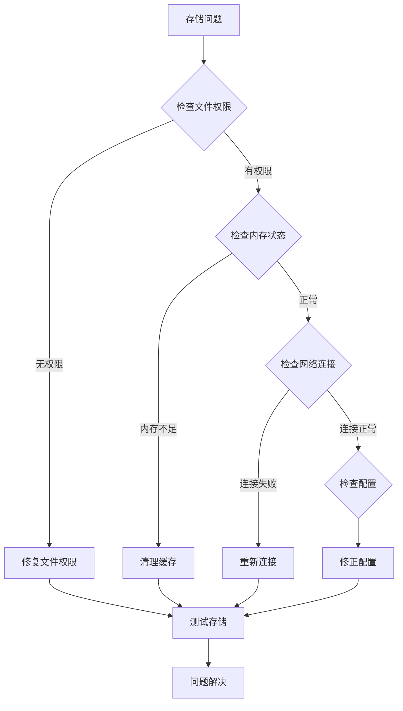

#### AI服务问题

AI服务的故障排除流程：

1. **健康检查**
   - 验证Ollama服务是否运行
   - 检查模型是否已下载
   - 确认网络连接正常

2. **API调用问题**
   - 检查请求格式是否正确
   - 验证AI操作类型
   - 确认笔记ID有效性

3. **性能问题**
   - 监控内存使用情况
   - 检查磁盘空间
   - 分析网络延迟

#### Web前端问题

前端问题的诊断步骤：
- 检查浏览器控制台错误
- 验证API端点可达性
- 确认CORS配置正确
- 检查React组件状态

#### CLI工具问题

CLI工具的故障排除：
- 验证配置文件存在且可读
- 检查API服务器地址配置
- 确认网络连接状态
- 验证命令语法正确性

### 错误传播机制

系统实现了多层错误处理机制：

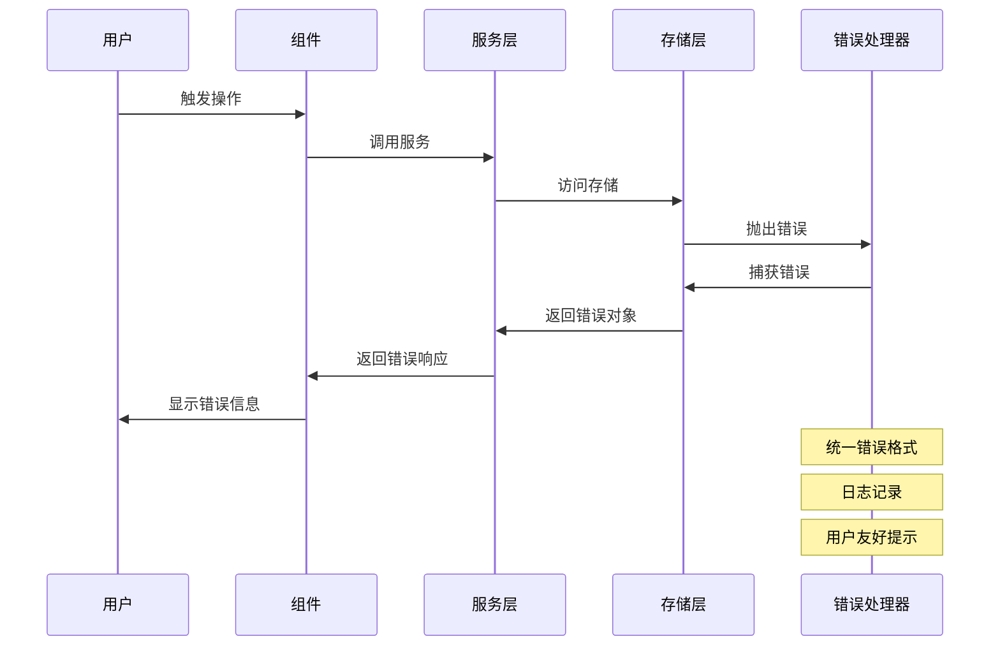

**图表来源**
- [packages/core/src/ai.ts:146-151](file://packages/core/src/ai.ts#L146-L151)
- [packages/core/src/storage.ts:155-158](file://packages/core/src/storage.ts#L155-L158)

### 调试指导

#### 开发调试

1. **启用详细日志**
   - 设置NODE_ENV=development
   - 启用调试输出
   - 监控API请求响应

2. **性能分析**
   - 使用Bun内置性能分析器
   - 监控内存使用峰值
   - 分析I/O操作耗时

3. **网络调试**
   - 使用curl验证API端点
   - 检查响应头信息
   - 分析请求延迟

#### 生产环境监控

1. **健康检查**
   - 定期检查API服务状态
   - 监控存储服务可用性
   - 跟踪AI服务连接状态

2. **性能指标**
   - 监控请求响应时间
   - 跟踪存储操作频率
   - 分析AI调用成功率

3. **错误监控**
   - 记录异常堆栈信息
   - 跟踪错误发生频率
   - 分析错误类型分布

**章节来源**
- [packages/core/src/ai.ts:146-151](file://packages/core/src/ai.ts#L146-L151)
- [packages/core/src/storage.ts:155-158](file://packages/core/src/storage.ts#L155-L158)

## 结论

番茄笔记项目展现了现代JavaScript应用的最佳实践，通过清晰的架构设计和模块化组织，实现了功能丰富且性能优异的学习笔记系统。

### 主要成就

1. **架构完整性**: 采用Monorepo架构，合理分离关注点
2. **技术先进性**: 集成最新的前端和后端技术栈
3. **功能丰富性**: 提供完整的笔记管理和AI辅助功能
4. **用户体验**: 通过Web、CLI等多种界面满足不同需求

### 技术亮点

- **双存储架构**: 内存缓存与文件持久化的平衡
- **AI集成**: 与Ollama的无缝集成
- **跨平台支持**: Web和CLI的统一数据模型
- **错误处理**: 完善的异常捕获和恢复机制

### 未来发展方向

1. **性能优化**: 进一步优化存储和AI处理性能
2. **功能扩展**: 增加更多AI辅助功能
3. **用户体验**: 改进界面交互和响应速度
4. **部署优化**: 提供更简便的部署和配置方案

该系统为学习笔记应用提供了一个坚实的技术基础，具有良好的扩展性和维护性，能够适应未来的发展需求。