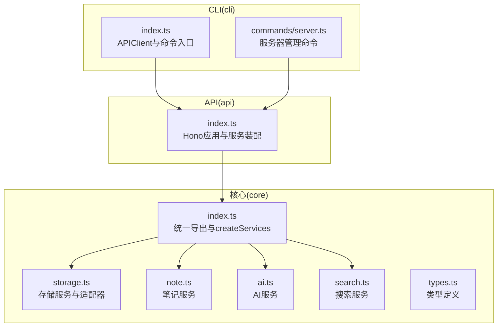
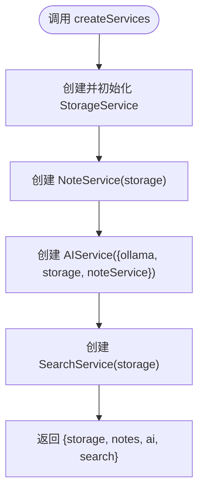
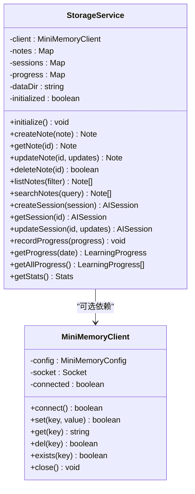
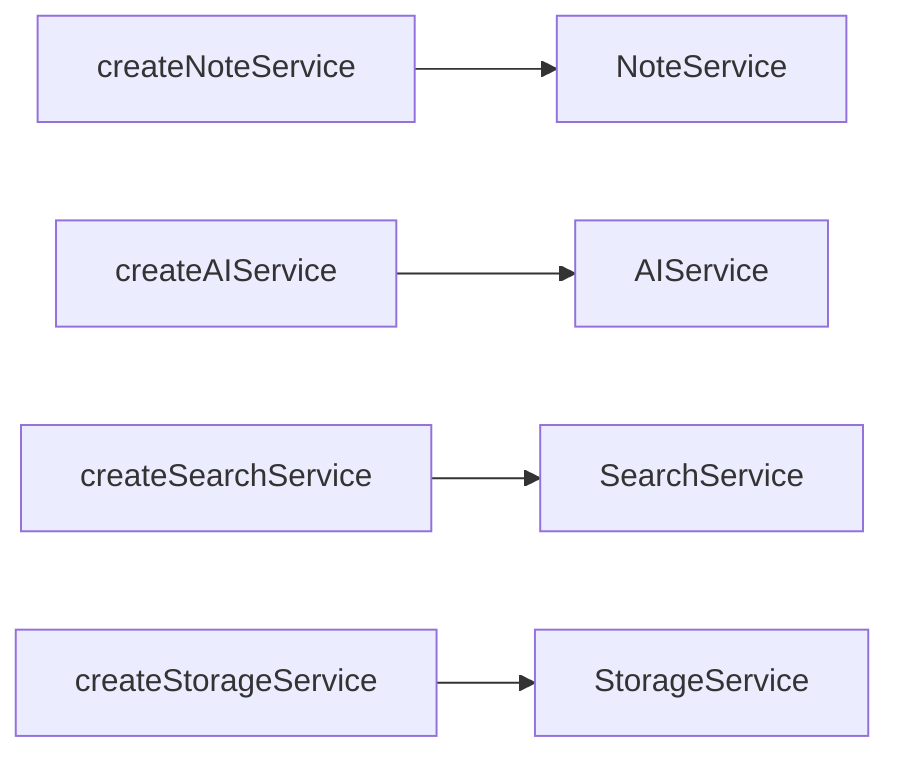
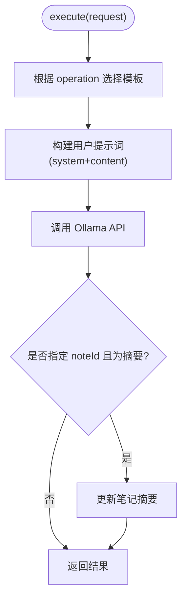
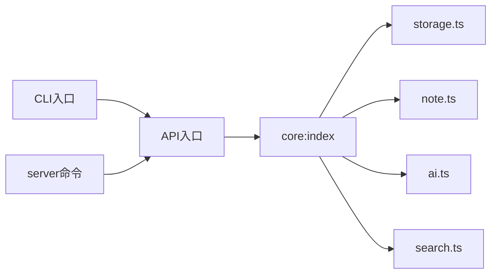

# 设计模式应用

<cite>
**本文引用的文件**
- [packages/core/src/index.ts](file://packages/core/src/index.ts)
- [packages/core/src/storage.ts](file://packages/core/src/storage.ts)
- [packages/core/src/note.ts](file://packages/core/src/note.ts)
- [packages/core/src/ai.ts](file://packages/core/src/ai.ts)
- [packages/core/src/search.ts](file://packages/core/src/search.ts)
- [packages/core/src/types.ts](file://packages/core/src/types.ts)
- [packages/api/src/index.ts](file://packages/api/src/index.ts)
- [packages/cli/src/index.ts](file://packages/cli/src/index.ts)
- [packages/cli/src/commands/server.ts](file://packages/cli/src/commands/server.ts)
</cite>

## 目录
1. [引言](#引言)
2. [项目结构](#项目结构)
3. [核心组件](#核心组件)
4. [架构总览](#架构总览)
5. [详细组件分析](#详细组件分析)
6. [依赖关系分析](#依赖关系分析)
7. [性能考量](#性能考量)
8. [故障排查指南](#故障排查指南)
9. [结论](#结论)
10. [附录](#附录)

## 引言
本文件聚焦于“番茄笔记”项目中设计模式的应用与落地，围绕以下主题展开：
- 依赖注入模式在 createServices 中的实现与优势
- 适配器模式在 StorageService 中对多种存储后端的支持
- 工厂模式在服务创建中的使用
- 策略模式、观察者模式等其他设计模式的应用实例
- 设计模式选择的技术背景与实际应用场景
- 面向开发者的最佳实践指导

## 项目结构
项目采用多包工作区结构，核心逻辑集中在 core 包，API 层与 CLI 层通过统一的服务接口进行装配与调用。核心模块职责清晰、边界明确，便于扩展与维护。



图表来源
- [packages/core/src/index.ts:18-49](file://packages/core/src/index.ts#L18-L49)
- [packages/core/src/storage.ts:109-317](file://packages/core/src/storage.ts#L109-L317)
- [packages/core/src/note.ts:7-158](file://packages/core/src/note.ts#L7-L158)
- [packages/core/src/ai.ts:42-292](file://packages/core/src/ai.ts#L42-L292)
- [packages/core/src/search.ts:5-92](file://packages/core/src/search.ts#L5-L92)
- [packages/api/src/index.ts:4-63](file://packages/api/src/index.ts#L4-L63)
- [packages/cli/src/index.ts:16-65](file://packages/cli/src/index.ts#L16-L65)
- [packages/cli/src/commands/server.ts:7-98](file://packages/cli/src/commands/server.ts#L7-L98)

章节来源
- [packages/core/src/index.ts:18-49](file://packages/core/src/index.ts#L18-L49)
- [packages/api/src/index.ts:4-63](file://packages/api/src/index.ts#L4-L63)
- [packages/cli/src/index.ts:16-65](file://packages/cli/src/index.ts#L16-L65)

## 核心组件
- 服务装配器 createServices：集中创建并初始化各服务实例，负责依赖注入与生命周期管理
- StorageService：适配器模式实现，既可直接使用内存/文件存储，也可通过 MiniMemoryClient 适配外部缓存/存储后端
- NoteService/AIService/SearchService：各自封装业务能力，依赖 StorageService 提供的数据访问层
- 类型系统 types.ts：统一定义数据结构与配置项，支撑强类型约束与工厂函数参数

章节来源
- [packages/core/src/index.ts:25-49](file://packages/core/src/index.ts#L25-L49)
- [packages/core/src/storage.ts:109-317](file://packages/core/src/storage.ts#L109-L317)
- [packages/core/src/note.ts:7-158](file://packages/core/src/note.ts#L7-L158)
- [packages/core/src/ai.ts:42-292](file://packages/core/src/ai.ts#L42-L292)
- [packages/core/src/search.ts:5-92](file://packages/core/src/search.ts#L5-L92)
- [packages/core/src/types.ts:144-152](file://packages/core/src/types.ts#L144-L152)

## 架构总览
下图展示了应用启动时的依赖注入流程与服务协作关系：

```mermaid
sequenceDiagram
participant App as "应用入口(API/CLI)"
participant Factory as "createServices"
participant Storage as "StorageService"
participant Note as "NoteService"
participant AI as "AIService"
participant Search as "SearchService"
App->>Factory : "传入AppConfig(可选)"
Factory->>Storage : "createStorageService(dataDir, miniMemory)"
Factory->>Storage : "initialize()"
Factory->>Note : "createNoteService(storage)"
Factory->>AI : "createAIService({ollama, storage, noteService})"
Factory->>Search : "createSearchService(storage)"
Factory-->>App : "{storage, notes, ai, search}"
```

图表来源
- [packages/core/src/index.ts:25-49](file://packages/core/src/index.ts#L25-L49)
- [packages/core/src/storage.ts:320-325](file://packages/core/src/storage.ts#L320-L325)
- [packages/core/src/note.ts:156-158](file://packages/core/src/note.ts#L156-L158)
- [packages/core/src/ai.ts:295-297](file://packages/core/src/ai.ts#L295-L297)
- [packages/core/src/search.ts:90-92](file://packages/core/src/search.ts#L90-L92)

## 详细组件分析

### 依赖注入模式：createServices 的实现与优势
- 实现要点
  - 统一装配：createServices 负责创建并初始化 storage、notes、ai、search 四个服务，并返回聚合对象
  - 配置注入：通过 AppConfig 注入数据目录、MiniMemory 与 Ollama 配置，确保服务可按环境定制
  - 生命周期管理：先初始化 StorageService，再创建其他服务，保证依赖可用
- 优势
  - 松耦合：上层仅依赖抽象（服务接口），不关心具体实现
  - 可测试性：可通过替换配置或 Mock 存储实现进行单元测试
  - 可扩展性：新增服务只需在 createServices 中注册，遵循开闭原则
  - 可维护性：集中式装配便于排查问题与版本升级



图表来源
- [packages/core/src/index.ts:25-49](file://packages/core/src/index.ts#L25-L49)

章节来源
- [packages/core/src/index.ts:25-49](file://packages/core/src/index.ts#L25-L49)

### 适配器模式：StorageService 对多种存储后端的支持
- 技术背景
  - 项目需要在本地文件存储与外部 MiniMemory 缓存之间灵活切换
  - 通过适配器模式屏蔽底层差异，对外暴露一致的 API
- 实现要点
  - StorageService 内部维护内存 Map 作为主存储，同时可选地持有 MiniMemoryClient
  - initialize 时尝试连接 MiniMemory；若失败则回退到本地文件存储
  - 写入操作同时更新内存与 MiniMemory（如可用），读取优先内存，必要时回写
- 优势
  - 透明迁移：无需修改上层调用代码即可切换后端
  - 容错性强：后端不可用时自动降级
  - 可观测性：可通过 MiniMemory 的存在与否判断当前运行模式



图表来源
- [packages/core/src/storage.ts:109-317](file://packages/core/src/storage.ts#L109-L317)
- [packages/core/src/storage.ts:7-106](file://packages/core/src/storage.ts#L7-L106)

章节来源
- [packages/core/src/storage.ts:109-317](file://packages/core/src/storage.ts#L109-L317)

### 工厂模式：服务创建中的使用
- NoteService 工厂：createNoteService(storage)
- AIService 工厂：createAIService(config)
- SearchService 工厂：createSearchService(storage)
- StorageService 工厂：createStorageService(dataDir, miniMemoryConfig)
- 优势
  - 参数化创建：通过工厂函数集中处理构造参数与默认值
  - 解耦初始化：调用方无需关心具体类的构造细节
  - 易于替换：可在工厂层注入 Mock 或替身实现



图表来源
- [packages/core/src/note.ts:156-158](file://packages/core/src/note.ts#L156-L158)
- [packages/core/src/ai.ts:295-297](file://packages/core/src/ai.ts#L295-L297)
- [packages/core/src/search.ts:90-92](file://packages/core/src/search.ts#L90-L92)
- [packages/core/src/storage.ts:320-325](file://packages/core/src/storage.ts#L320-L325)

章节来源
- [packages/core/src/note.ts:156-158](file://packages/core/src/note.ts#L156-L158)
- [packages/core/src/ai.ts:295-297](file://packages/core/src/ai.ts#L295-L297)
- [packages/core/src/search.ts:90-92](file://packages/core/src/search.ts#L90-L92)
- [packages/core/src/storage.ts:320-325](file://packages/core/src/storage.ts#L320-L325)

### 策略模式：AIService 中的操作分派
- 背景
  - 不同 AI 操作（摘要、润色、翻译、建议、对话）需要不同的提示词与处理流程
- 实现
  - PROMPTS 字典按操作类型组织提示词模板
  - execute 根据请求的操作类型选择对应模板与系统提示，再调用底层 Ollama API
- 优势
  - 易扩展：新增操作只需添加模板与分支处理
  - 易维护：提示词与执行逻辑分离，职责单一



图表来源
- [packages/core/src/ai.ts:102-152](file://packages/core/src/ai.ts#L102-L152)
- [packages/core/src/ai.ts:15-28](file://packages/core/src/ai.ts#L15-L28)

章节来源
- [packages/core/src/ai.ts:102-152](file://packages/core/src/ai.ts#L102-L152)
- [packages/core/src/ai.ts:15-28](file://packages/core/src/ai.ts#L15-L28)

### 观察者模式：事件与状态变更通知
- 现状
  - 当前代码未显式实现发布/订阅机制
- 建议
  - 在 StorageService 中引入事件总线，在 createNote/updateNote/deleteNote 等关键点触发事件
  - NoteService/SearchService/AIService 可订阅相关事件，实现跨模块联动（如索引重建、缓存失效、统计更新）

[本节为概念性建议，不直接分析具体文件，故无章节来源]

### 其他模式应用实例
- 单例模式：MiniMemoryClient 在 StorageService 中按需创建，可考虑在应用生命周期内复用同一实例
- 代理模式：在 AIService 外层增加缓存代理，对重复请求进行缓存命中
- 中介者模式：API 层路由与服务交互可抽象为中介者，统一处理鉴权、限流与日志

[本节为概念性说明，不直接分析具体文件，故无章节来源]

## 依赖关系分析
- 上层依赖下层：API/CLI 依赖 core；core 内部模块自上而下依赖（API -> Note -> Storage；API -> AI -> Storage/Note；API -> Search -> Storage）
- 依赖方向：单向依赖，避免循环依赖
- 可能的耦合点：AIService 与 NoteService 的耦合用于摘要更新；可通过事件或回调接口进一步解耦



图表来源
- [packages/api/src/index.ts:4-63](file://packages/api/src/index.ts#L4-L63)
- [packages/core/src/index.ts:18-49](file://packages/core/src/index.ts#L18-L49)
- [packages/cli/src/index.ts:16-65](file://packages/cli/src/index.ts#L16-L65)
- [packages/cli/src/commands/server.ts:7-98](file://packages/cli/src/commands/server.ts#L7-L98)

章节来源
- [packages/api/src/index.ts:4-63](file://packages/api/src/index.ts#L4-L63)
- [packages/core/src/index.ts:18-49](file://packages/core/src/index.ts#L18-L49)
- [packages/cli/src/index.ts:16-65](file://packages/cli/src/index.ts#L16-L65)

## 性能考量
- 存储层
  - 内存 Map 读写快，但进程重启丢失；MiniMemory 可提升并发与共享能力
  - 文件存储具备持久性，但随机访问较慢；建议对热点数据走 MiniMemory
- AI 服务
  - Ollama 远程调用存在网络延迟；建议引入重试、超时与缓存策略
- 搜索服务
  - 全量扫描与多次过滤可能成为瓶颈；可考虑建立倒排索引或外部搜索引擎

[本节提供通用指导，不直接分析具体文件，故无章节来源]

## 故障排查指南
- 无法连接 MiniMemory
  - 现象：初始化后自动降级为文件存储
  - 排查：确认 MiniMemory 地址、端口与认证配置；检查网络连通性
- Ollama 服务不可达
  - 现象：AI 健康检查失败或调用报错
  - 排查：确认 Ollama 主机、端口与模型名称；检查防火墙与容器网络
- 笔记更新未生效
  - 现象：内存更新成功但 MiniMemory 或文件未同步
  - 排查：检查 MiniMemoryClient 的 set/del 返回值；确认文件写权限

章节来源
- [packages/core/src/storage.ts:124-140](file://packages/core/src/storage.ts#L124-L140)
- [packages/core/src/ai.ts:56-63](file://packages/core/src/ai.ts#L56-L63)

## 结论
- 项目在核心层较好地运用了依赖注入、工厂与适配器等设计模式，实现了清晰的职责划分与良好的可扩展性
- 建议在后续迭代中引入事件驱动（观察者）、缓存代理与索引机制，进一步提升性能与可观测性
- 通过统一的工厂与装配器，开发者可以快速替换或扩展服务实现，降低维护成本

[本节为总结性内容，不直接分析具体文件，故无章节来源]

## 附录
- 最佳实践清单
  - 使用工厂函数集中处理构造参数与默认值
  - 通过依赖注入集中装配服务，避免全局状态
  - 对外部依赖（MiniMemory/Ollama）提供可配置与可降级策略
  - 在关键路径引入可观察能力，实现模块间松耦合联动
  - 对远程调用增加超时、重试与熔断保护

[本节为通用建议，不直接分析具体文件，故无章节来源]