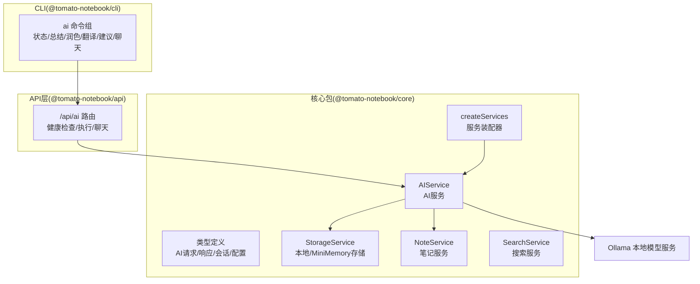
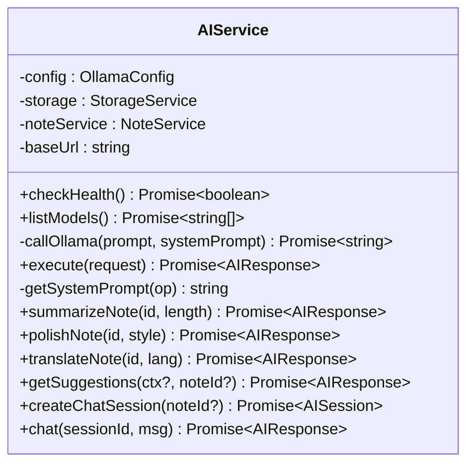
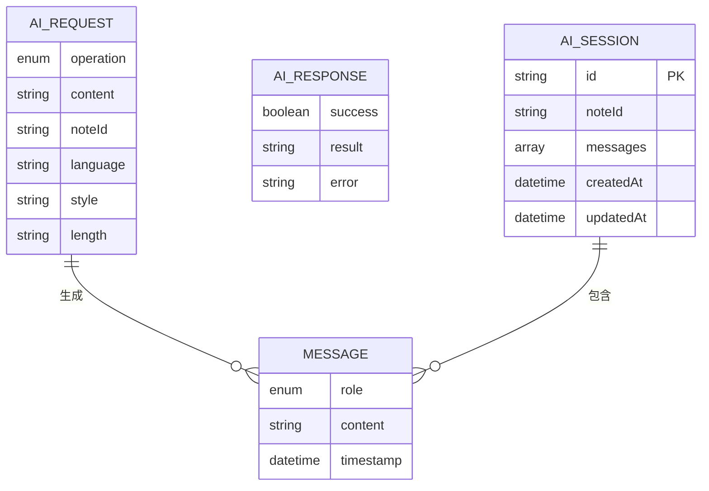
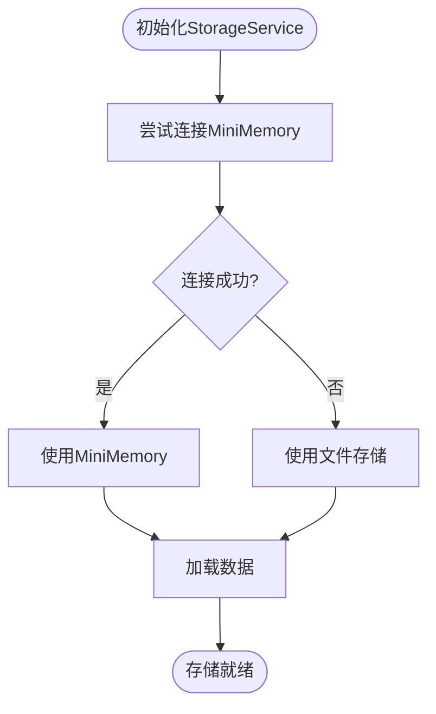
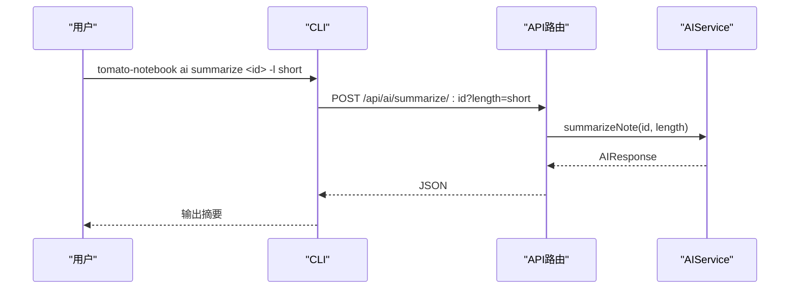

# AI服务

<cite>
**本文引用的文件**
- [packages/core/src/ai.ts](file://packages/core/src/ai.ts)
- [packages/core/src/types.ts](file://packages/core/src/types.ts)
- [packages/core/src/storage.ts](file://packages/core/src/storage.ts)
- [packages/core/src/note.ts](file://packages/core/src/note.ts)
- [packages/core/src/index.ts](file://packages/core/src/index.ts)
- [packages/api/src/routes/ai.ts](file://packages/api/src/routes/ai.ts)
- [packages/cli/src/commands/ai.ts](file://packages/cli/src/commands/ai.ts)
- [packages/core/src/search.ts](file://packages/core/src/search.ts)
- [package.json](file://package.json)
- [packages/core/package.json](file://packages/core/package.json)
- [packages/api/package.json](file://packages/api/package.json)
</cite>

## 目录
1. [简介](#简介)
2. [项目结构](#项目结构)
3. [核心组件](#核心组件)
4. [架构总览](#架构总览)
5. [组件详解](#组件详解)
6. [依赖关系分析](#依赖关系分析)
7. [性能考量](#性能考量)
8. [故障排除指南](#故障排除指南)
9. [结论](#结论)
10. [附录](#附录)

## 简介
本文件面向“AI服务”的技术文档，聚焦于AIService与本地Ollama模型的集成实现，覆盖模型调用机制、Prompt模板设计、会话管理策略以及文本润色、自动总结、翻译、学习建议等AI功能的实现原理。文档同时给出配置参数、模型选择策略、错误处理机制、性能优化方案、使用示例、最佳实践与故障排除指南，并讨论模型兼容性与扩展性。

## 项目结构
本项目采用多包工作区组织，AI能力集中在核心包中，API层提供REST接口，CLI提供命令行工具，数据持久化通过存储服务抽象实现。



**图表来源**
- [packages/core/src/ai.ts:42-292](file://packages/core/src/ai.ts#L42-L292)
- [packages/core/src/index.ts:25-49](file://packages/core/src/index.ts#L25-L49)
- [packages/api/src/routes/ai.ts:1-149](file://packages/api/src/routes/ai.ts#L1-L149)
- [packages/cli/src/commands/ai.ts:11-217](file://packages/cli/src/commands/ai.ts#L11-L217)

**章节来源**
- [package.json:1-25](file://package.json#L1-L25)
- [packages/core/package.json:1-26](file://packages/core/package.json#L1-L26)
- [packages/api/package.json:1-22](file://packages/api/package.json#L1-L22)

## 核心组件
- AIService：封装AI操作执行、Prompt模板应用、系统提示词、与Ollama交互、会话管理与笔记集成。
- StorageService：统一数据持久化抽象，支持文件存储与可选MiniMemory远程KV。
- NoteService：笔记业务逻辑，提供CRUD、分类、标签、收藏、导出等。
- SearchService：全文检索与过滤、快速搜索、标签建议。
- 服务装配器：集中创建与初始化各服务，注入Ollama配置。

**章节来源**
- [packages/core/src/ai.ts:42-292](file://packages/core/src/ai.ts#L42-L292)
- [packages/core/src/storage.ts:109-317](file://packages/core/src/storage.ts#L109-L317)
- [packages/core/src/note.ts:7-153](file://packages/core/src/note.ts#L7-L153)
- [packages/core/src/search.ts:5-92](file://packages/core/src/search.ts#L5-L92)
- [packages/core/src/index.ts:25-49](file://packages/core/src/index.ts#L25-L49)

## 架构总览
AI服务通过HTTP客户端调用Ollama的chat接口，结合系统提示词与用户/笔记上下文生成结果；会话消息在内存/持久化中维护，支持与笔记内容关联。

```mermaid
sequenceDiagram
participant CLI as "CLI命令"
participant API as "API路由"
participant AI as "AIService"
participant STORE as "StorageService"
participant NOTE as "NoteService"
participant OLL as "Ollama"
CLI->>API : "/api/ai/execute" 或 "/api/ai/summarize/ : id"
API->>AI : execute()/summarizeNote()
AI->>NOTE : 读取笔记内容(可选)
AI->>AI : 组装Prompt+系统提示词
AI->>OLL : POST /api/chat
OLL-->>AI : 返回AI回复
AI->>STORE : 更新会话/摘要(可选)
AI-->>API : 返回结果
API-->>CLI : JSON响应
```

**图表来源**
- [packages/api/src/routes/ai.ts:82-119](file://packages/api/src/routes/ai.ts#L82-L119)
- [packages/core/src/ai.ts:102-152](file://packages/core/src/ai.ts#L102-L152)
- [packages/core/src/ai.ts:168-180](file://packages/core/src/ai.ts#L168-L180)
- [packages/core/src/ai.ts:77-99](file://packages/core/src/ai.ts#L77-L99)

## 组件详解

### AIService：AI操作与会话管理
- 模型调用机制
  - 通过HTTP POST调用Ollama的chat接口，传入model、messages（含可选system）、stream=false。
  - 错误处理：非2xx响应抛出异常，上层统一包装为AIResponse。
- Prompt模板设计
  - 使用常量表维护不同操作的模板，支持长度/风格/语言占位符替换。
  - 系统提示词针对不同任务角色化，确保输出质量与一致性。
- 会话管理策略
  - 支持创建会话、追加消息、构建上下文（可选绑定笔记）。
  - 会话消息持久化，支持后续查询与继续对话。
- 功能实现
  - 文本润色：根据风格生成润色后的文本。
  - 自动总结：根据长度生成摘要，并可回写笔记摘要。
  - 翻译：指定目标语言进行翻译。
  - 学习建议：基于上下文或最近笔记生成建议。
  - 聊天：带上下文的多轮对话，支持关联笔记。



**图表来源**
- [packages/core/src/ai.ts:42-292](file://packages/core/src/ai.ts#L42-L292)

**章节来源**
- [packages/core/src/ai.ts:15-28](file://packages/core/src/ai.ts#L15-L28)
- [packages/core/src/ai.ts:155-165](file://packages/core/src/ai.ts#L155-L165)
- [packages/core/src/ai.ts:102-152](file://packages/core/src/ai.ts#L102-L152)
- [packages/core/src/ai.ts:235-291](file://packages/core/src/ai.ts#L235-L291)

### 类型与数据模型
- AI请求/响应：统一的结构化输入输出，便于API与CLI消费。
- 会话与消息：支持多轮对话与时间戳记录。
- 配置：Ollama主机、端口、模型名。



**图表来源**
- [packages/core/src/types.ts:68-87](file://packages/core/src/types.ts#L68-L87)
- [packages/core/src/types.ts:42-56](file://packages/core/src/types.ts#L42-L56)

**章节来源**
- [packages/core/src/types.ts:58-87](file://packages/core/src/types.ts#L58-L87)

### 存储与笔记服务
- StorageService：统一抽象，优先MiniMemory远程KV，失败则回退文件存储；提供笔记、会话、进度等CRUD。
- NoteService：围绕笔记的业务操作，支持标记AI生成、导出Markdown/JSON等。



**图表来源**
- [packages/core/src/storage.ts:125-140](file://packages/core/src/storage.ts#L125-L140)

**章节来源**
- [packages/core/src/storage.ts:109-317](file://packages/core/src/storage.ts#L109-L317)
- [packages/core/src/note.ts:7-153](file://packages/core/src/note.ts#L7-L153)

### API路由与CLI命令
- API路由：提供健康检查、通用执行、总结/润色/翻译、学习建议、聊天会话与消息发送。
- CLI命令：封装状态检查、总结/润色/翻译、建议生成、聊天会话，提供友好交互体验。



**图表来源**
- [packages/cli/src/commands/ai.ts:45-69](file://packages/cli/src/commands/ai.ts#L45-L69)
- [packages/api/src/routes/ai.ts:22-33](file://packages/api/src/routes/ai.ts#L22-L33)

**章节来源**
- [packages/api/src/routes/ai.ts:1-149](file://packages/api/src/routes/ai.ts#L1-L149)
- [packages/cli/src/commands/ai.ts:11-217](file://packages/cli/src/commands/ai.ts#L11-L217)

## 依赖关系分析
- 包依赖：API依赖core；CLI依赖API；core内部依赖uuid。
- 运行时依赖：Ollama服务需运行在本地或指定主机与端口；MiniMemory可选启用。
- 服务装配：createServices集中创建并注入配置，确保模块解耦。


**图表来源**
- [packages/api/package.json:14-16](file://packages/api/package.json#L14-L16)
- [packages/core/package.json:18-20](file://packages/core/package.json#L18-L20)

**章节来源**
- [packages/core/src/index.ts:25-49](file://packages/core/src/index.ts#L25-L49)

## 性能考量
- 流式与非流式：当前调用设置为非流式，适合稳定响应；若需实时反馈可切换为流式并实现增量渲染。
- 上下文控制：聊天时可选绑定笔记上下文，避免过长上下文导致延迟与成本上升；必要时截断或摘要化。
- 缓存与复用：对常用提示词与系统提示词进行缓存；对重复请求可做去重与短期缓存。
- 并发与队列：高并发场景建议引入队列与限流，避免Ollama瞬时压力过大。
- 模型选择：根据任务复杂度选择合适模型；对简单任务可选用轻量模型以降低延迟。
- 存储优化：MiniMemory优先可提升读写性能；文件存储需注意I/O与锁竞争。

## 故障排除指南
- Ollama不可达
  - 现象：健康检查失败、模型列表为空。
  - 处理：确认Ollama服务运行、网络连通、host/port/model配置正确。
- 请求失败
  - 现象：API返回错误或CLI报错。
  - 处理：检查operation参数、noteId存在性、language必填项；查看AI服务日志定位异常。
- 会话丢失
  - 现象：聊天消息未持久化或找不到会话。
  - 处理：确认StorageService初始化与MiniMemory连接；检查会话ID有效性。
- 性能问题
  - 现象：响应慢、超时。
  - 处理：缩短上下文、切换更小模型、启用流式、增加并发限制。

**章节来源**
- [packages/api/src/routes/ai.ts:7-19](file://packages/api/src/routes/ai.ts#L7-L19)
- [packages/core/src/ai.ts:56-63](file://packages/core/src/ai.ts#L56-L63)
- [packages/core/src/ai.ts:249-253](file://packages/core/src/ai.ts#L249-L253)

## 结论
本AI服务以清晰的职责划分与模块化设计，实现了与Ollama的稳定集成，覆盖了文本润色、自动总结、翻译与学习建议等核心功能，并提供了会话管理与上下文增强。通过类型约束、统一的请求/响应结构与可插拔的存储后端，系统具备良好的可维护性与扩展性。建议在生产环境中结合流式响应、上下文裁剪与模型选择策略进一步优化性能与成本。

## 附录

### 使用示例与最佳实践
- 健康检查
  - CLI：tomato-notebook ai status
  - API：GET /api/ai/health
- 文本润色
  - CLI：tomato-notebook ai polish <noteId> -s formal
  - API：POST /api/ai/polish/:id?style=formal
- 自动生成摘要
  - CLI：tomato-notebook ai summarize <noteId> -l medium
  - API：POST /api/ai/summarize/:id?length=short|medium|long
- 翻译
  - CLI：tomato-notebook ai translate <noteId> 中文
  - API：POST /api/ai/translate/:id?language=中文
- 学习建议
  - CLI：tomato-notebook ai suggest -n <noteId> 或 -c "<上下文>"
  - API：GET /api/ai/suggest?noteId=<id>&context=<...>
- 聊天会话
  - CLI：tomato-notebook ai chat -n <noteId>
  - API：POST /api/ai/chat/session 与 POST /api/ai/chat/:sessionId

最佳实践
- 明确任务角色：为不同操作配置合适的系统提示词，确保输出质量。
- 控制上下文长度：避免过长上下文影响性能与准确性。
- 模型选择：根据任务复杂度与性能要求选择合适模型。
- 错误处理：统一包装AIResponse，前端友好展示错误信息。
- 可观测性：记录关键指标（响应时间、错误率、token用量估算）以便优化。

**章节来源**
- [packages/cli/src/commands/ai.ts:14-217](file://packages/cli/src/commands/ai.ts#L14-L217)
- [packages/api/src/routes/ai.ts:82-146](file://packages/api/src/routes/ai.ts#L82-L146)

### 配置参数与模型选择
- Ollama配置
  - host：Ollama运行主机
  - port：Ollama端口
  - model：默认模型名称
- 服务装配
  - createServices会注入默认Ollama配置，也可通过AppConfig覆盖。

**章节来源**
- [packages/core/src/types.ts:137-141](file://packages/core/src/types.ts#L137-L141)
- [packages/core/src/index.ts:34-44](file://packages/core/src/index.ts#L34-L44)

### 模型兼容性与扩展性
- 兼容性
  - AIService直接对接Ollama chat接口，理论上兼容其支持的模型；需确保模型已拉取。
- 扩展性
  - 新增操作：在AIOperation与PROMPTS中添加新条目，扩展execute分支与对应方法。
  - 更换推理后端：通过替换callOllama实现适配其他后端（如OpenAI、本地其他推理框架）。
  - 提示词工程：通过系统提示词与模板参数精细化控制输出。

**章节来源**
- [packages/core/src/ai.ts:59-65](file://packages/core/src/ai.ts#L59-L65)
- [packages/core/src/ai.ts:15-28](file://packages/core/src/ai.ts#L15-L28)
- [packages/core/src/ai.ts:102-133](file://packages/core/src/ai.ts#L102-L133)