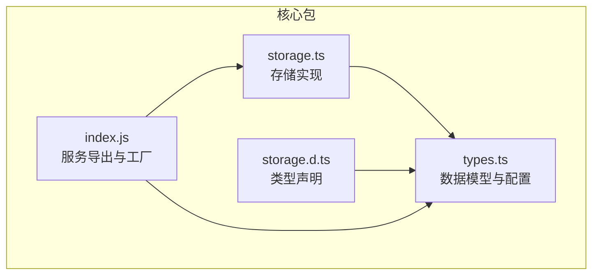
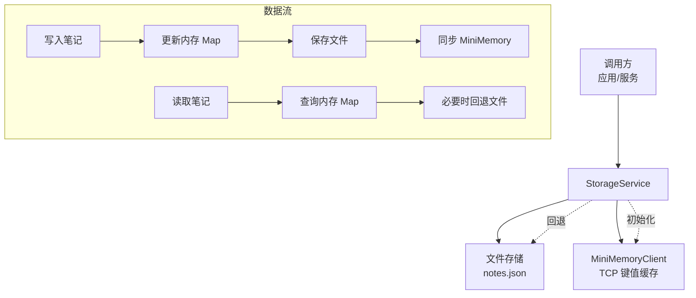
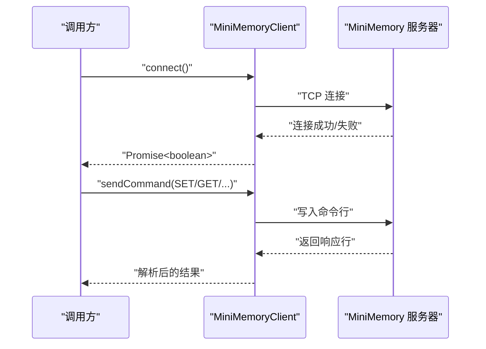
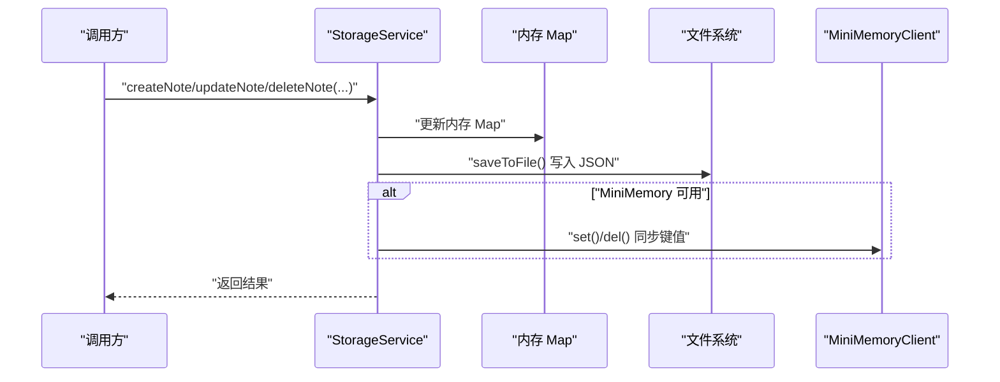
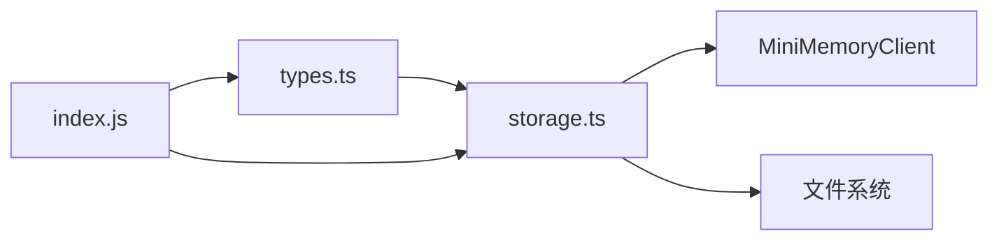

# 存储服务

<cite>
**本文引用的文件**
- [packages/core/src/storage.ts](file://packages/core/src/storage.ts)
- [packages/core/dist/storage.d.ts](file://packages/core/dist/storage.d.ts)
- [packages/core/src/types.ts](file://packages/core/src/types.ts)
- [packages/core/dist/index.js](file://packages/core/dist/index.js)
</cite>

## 目录
1. [简介](#简介)
2. [项目结构](#项目结构)
3. [核心组件](#核心组件)
4. [架构总览](#架构总览)
5. [详细组件分析](#详细组件分析)
6. [依赖关系分析](#依赖关系分析)
7. [性能考量](#性能考量)
8. [故障排查指南](#故障排查指南)
9. [结论](#结论)
10. [附录](#附录)

## 简介
本文件为存储服务的技术文档，聚焦于 StorageService 的设计与实现，覆盖两类存储后端：文件存储（本地持久化）与 MiniMemory 缓存（内存键值缓存）。文档将系统阐述存储抽象层的设计思路、数据持久化策略、事务处理机制与错误恢复策略，并提供配置选项、数据模型映射、使用示例与最佳实践，帮助开发者正确使用与扩展该存储服务。

## 项目结构
存储服务位于核心包中，主要由以下文件构成：
- 存储实现：packages/core/src/storage.ts
- 类型定义：packages/core/src/types.ts
- 声明文件：packages/core/dist/storage.d.ts
- 服务导出与便捷工厂：packages/core/dist/index.js

图表来源
- [packages/core/src/storage.ts:1-326](file://packages/core/src/storage.ts#L1-L326)
- [packages/core/src/types.ts:1-163](file://packages/core/src/types.ts#L1-L163)
- [packages/core/dist/storage.d.ts:1-52](file://packages/core/dist/storage.d.ts#L1-L52)
- [packages/core/dist/index.js:1-32](file://packages/core/dist/index.js#L1-L32)

章节来源
- [packages/core/src/storage.ts:1-326](file://packages/core/src/storage.ts#L1-L326)
- [packages/core/src/types.ts:1-163](file://packages/core/src/types.ts#L1-L163)
- [packages/core/dist/storage.d.ts:1-52](file://packages/core/dist/storage.d.ts#L1-L52)
- [packages/core/dist/index.js:1-32](file://packages/core/dist/index.js#L1-L32)

## 核心组件
- MiniMemoryClient：通过 TCP 与 MiniMemory 服务器交互，支持 SET/GET/DEL/EXISTS 等命令，用于键值缓存同步。
- StorageService：统一的存储抽象层，负责：
  - 初始化：优先尝试连接 MiniMemory；失败则回退至文件存储。
  - 数据持久化：以 JSON 文件形式保存笔记数据。
  - 读写操作：对笔记进行增删改查、分页与搜索。
  - 辅助功能：AI 会话与学习进度的内存缓存，统计信息计算。
- 工厂函数 createStorageService：创建并初始化 StorageService 实例。
- 类型体系：Note、AISession、LearningProgress、MiniMemoryConfig 等。

章节来源
- [packages/core/src/storage.ts:7-106](file://packages/core/src/storage.ts#L7-L106)
- [packages/core/src/storage.ts:109-317](file://packages/core/src/storage.ts#L109-L317)
- [packages/core/src/types.ts:10-134](file://packages/core/src/types.ts#L10-L134)
- [packages/core/dist/storage.d.ts:2-51](file://packages/core/dist/storage.d.ts#L2-L51)
- [packages/core/dist/index.js:9-31](file://packages/core/dist/index.js#L9-L31)

## 架构总览
存储服务采用“主从双后端”架构：
- 主后端：文件存储（本地 JSON 文件），保证强持久性与可移植性。
- 备后端：MiniMemory 键值缓存，提供高性能读写与元数据同步。
- 抽象层：StorageService 在初始化阶段根据可用性选择后端，并在写入时同步到备后端。

图表来源
- [packages/core/src/storage.ts:109-140](file://packages/core/src/storage.ts#L109-L140)
- [packages/core/src/storage.ts:143-167](file://packages/core/src/storage.ts#L143-L167)
- [packages/core/src/storage.ts:170-218](file://packages/core/src/storage.ts#L170-L218)
- [packages/core/src/storage.ts:7-106](file://packages/core/src/storage.ts#L7-L106)

## 详细组件分析

### MiniMemoryClient 组件
职责与行为
- 连接管理：建立 TCP 连接，处理连接错误。
- 命令执行：发送命令并等待完整响应行。
- 键值操作：封装 SET/GET/DEL/EXISTS，返回布尔或字符串结果。
- 资源释放：关闭套接字，重置连接状态。

关键流程（连接与命令）

图表来源
- [packages/core/src/storage.ts:17-31](file://packages/core/src/storage.ts#L17-L31)
- [packages/core/src/storage.ts:34-53](file://packages/core/src/storage.ts#L34-L53)

章节来源
- [packages/core/src/storage.ts:7-106](file://packages/core/src/storage.ts#L7-L106)
- [packages/core/dist/storage.d.ts:2-14](file://packages/core/dist/storage.d.ts#L2-L14)

### StorageService 组件
职责与行为
- 初始化：尝试连接 MiniMemory；失败则记录告警并回退文件存储。
- 文件持久化：首次运行自动创建数据目录与 notes.json；每次写入后落盘。
- 笔记 CRUD：创建、读取、更新、删除；更新时自动刷新时间戳。
- 列表与搜索：支持按类别、收藏、AI生成标记过滤，支持分页与全文检索。
- 统计与进度：统计笔记总数、收藏数、AI生成数与标签去重数；进度记录为内存缓存。
- 会话管理：内存缓存 AI 会话，便于聊天等场景。

写入流程（含 MiniMemory 同步）

图表来源
- [packages/core/src/storage.ts:125-140](file://packages/core/src/storage.ts#L125-L140)
- [packages/core/src/storage.ts:162-167](file://packages/core/src/storage.ts#L162-L167)
- [packages/core/src/storage.ts:170-218](file://packages/core/src/storage.ts#L170-L218)
- [packages/core/src/storage.ts:7-106](file://packages/core/src/storage.ts#L7-L106)

章节来源
- [packages/core/src/storage.ts:109-317](file://packages/core/src/storage.ts#L109-L317)
- [packages/core/dist/storage.d.ts:15-51](file://packages/core/dist/storage.d.ts#L15-L51)

### 数据模型与映射
- Note：笔记实体，包含标题、内容、摘要、标签、分类、收藏与生成标记及时间戳。
- AISession：AI 会话，包含消息数组与时间戳。
- LearningProgress：学习进度，按日期聚合。
- MiniMemoryConfig：MiniMemory 连接配置（主机、端口、密码）。
- 映射策略：
  - 笔记对象在内存中以 Map 结构存储，键为 id。
  - 文件存储采用 JSON 数组持久化，字段与 Note 一致。
  - MiniMemory 同步键名采用命名空间前缀（如 note:、note:meta:）。

章节来源
- [packages/core/src/types.ts:10-95](file://packages/core/src/types.ts#L10-L95)
- [packages/core/src/storage.ts:143-167](file://packages/core/src/storage.ts#L143-L167)
- [packages/core/src/storage.ts:170-218](file://packages/core/src/storage.ts#L170-L218)

### 事务与一致性
- 单条写操作原子性：内存 Map 更新、文件写入与 MiniMemory 同步在单次调用内顺序执行，若任一步骤失败，当前调用返回失败。
- 一致性策略：
  - 读取优先内存 Map；文件仅作为最终落盘与回退保障。
  - MiniMemory 作为强一致性的可选后端，写入时同步，读取时可回退文件。
- 事务边界：当前实现未提供跨多操作的 ACID 事务，建议上层业务在需要时自行编排。

章节来源
- [packages/core/src/storage.ts:125-140](file://packages/core/src/storage.ts#L125-L140)
- [packages/core/src/storage.ts:170-218](file://packages/core/src/storage.ts#L170-L218)

### 错误恢复策略
- MiniMemory 不可用：初始化阶段记录警告并回退文件存储；后续写入不再尝试 MiniMemory。
- 文件读写异常：首次启动时若 notes.json 不存在则自动创建空文件；读取失败不中断初始化。
- 网络错误：MiniMemory 命令执行捕获异常并返回失败，避免抛出异常影响调用方。
- 资源清理：MiniMemoryClient 提供 close 方法销毁套接字，释放连接资源。

章节来源
- [packages/core/src/storage.ts:128-135](file://packages/core/src/storage.ts#L128-L135)
- [packages/core/src/storage.ts:155-158](file://packages/core/src/storage.ts#L155-L158)
- [packages/core/src/storage.ts:26-30](file://packages/core/src/storage.ts#L26-L30)
- [packages/core/src/storage.ts:99-105](file://packages/core/src/storage.ts#L99-L105)

### 使用示例与最佳实践
- 创建与初始化
  - 使用工厂函数创建 StorageService 并调用 initialize 完成初始化。
  - 若传入 MiniMemoryConfig，将在可用时启用键值缓存同步。
- 写入与读取
  - 写入后立即落盘，确保崩溃后可恢复。
  - 读取优先内存 Map，性能更优；必要时可依赖文件回退。
- 配置建议
  - dataDir：确保路径存在且具备读写权限。
  - MiniMemoryConfig：host/port 必须可达；可选 password 由 MiniMemory 服务端配置决定。
- 最佳实践
  - 批量写入时尽量合并操作，减少文件写入次数。
  - 对外暴露的 API 层应捕获存储异常并返回统一错误格式。
  - 在高并发场景下，建议在上层增加锁或队列，避免竞态条件。

章节来源
- [packages/core/dist/index.js:13-31](file://packages/core/dist/index.js#L13-L31)
- [packages/core/src/storage.ts:125-140](file://packages/core/src/storage.ts#L125-L140)
- [packages/core/src/types.ts:129-134](file://packages/core/src/types.ts#L129-L134)

## 依赖关系分析
- StorageService 依赖：
  - MiniMemoryClient（可选）：用于键值缓存同步。
  - 文件系统：读写 notes.json。
  - 类型模块：Note/AISession/LearningProgress/MiniMemoryConfig。
- 导出与集成：
  - index.js 导出 createServices 工厂，创建并初始化 StorageService，随后注入到其他服务。

图表来源
- [packages/core/src/storage.ts:1-4](file://packages/core/src/storage.ts#L1-L4)
- [packages/core/src/types.ts:1-2](file://packages/core/src/types.ts#L1-L2)
- [packages/core/dist/index.js:1-7](file://packages/core/dist/index.js#L1-L7)

章节来源
- [packages/core/src/storage.ts:1-4](file://packages/core/src/storage.ts#L1-L4)
- [packages/core/src/types.ts:1-2](file://packages/core/src/types.ts#L1-L2)
- [packages/core/dist/index.js:1-7](file://packages/core/dist/index.js#L1-L7)

## 性能考量
- 内存优先：读取与更新均先操作内存 Map，避免频繁磁盘 IO。
- 文件写入策略：每次写入后落盘，兼顾可靠性与性能；建议在批量写入时合并操作。
- MiniMemory 同步：写入时同步键值，降低读取延迟；网络开销需考虑带宽与延迟。
- 搜索与过滤：内存中进行排序与过滤，复杂度与数据规模线性相关；建议在上层限制分页大小与查询范围。
- 并发访问：当前实现未内置锁，建议在上层加锁或使用队列串行化写入。

## 故障排查指南
- MiniMemory 连接失败
  - 现象：初始化阶段输出告警并回退文件存储。
  - 排查：确认 MiniMemory 服务运行、网络连通、host/port 正确。
- 文件读写异常
  - 现象：首次启动创建空文件；读取失败不影响初始化。
  - 排查：检查 dataDir 权限、磁盘空间、文件完整性。
- 命令执行失败
  - 现象：SET/GET/DEL 返回失败。
  - 排查：确认 MiniMemory 服务端状态、命令格式、连接是否断开。
- 资源泄漏
  - 现象：长时间运行后连接数增多。
  - 处理：在合适时机调用 MiniMemoryClient.close() 释放连接。

章节来源
- [packages/core/src/storage.ts:128-135](file://packages/core/src/storage.ts#L128-L135)
- [packages/core/src/storage.ts:155-158](file://packages/core/src/storage.ts#L155-L158)
- [packages/core/src/storage.ts:26-30](file://packages/core/src/storage.ts#L26-L30)
- [packages/core/src/storage.ts:99-105](file://packages/core/src/storage.ts#L99-L105)

## 结论
StorageService 通过“内存 Map + 文件持久化 + MiniMemory 可选缓存”的组合，实现了高可用、易扩展的存储抽象层。其设计在可靠性与性能之间取得平衡：文件存储确保持久性，MiniMemory 提升读写效率，内存 Map 降低延迟。结合清晰的错误恢复与回退策略，适合在多种部署环境中稳定运行。建议在生产环境配合上层锁与队列控制写入并发，并合理设置分页与查询范围以优化性能。

## 附录
- 配置项
  - dataDir：数据目录路径，默认 ./data。
  - MiniMemoryConfig：host、port、password（可选）。
- 常用方法
  - initialize：初始化存储。
  - createNote/getNote/updateNote/deleteNote/listNotes/searchNotes：笔记操作。
  - createSession/getSession/updateSession：AI 会话管理。
  - recordProgress/getProgress/getAllProgress：学习进度记录与查询。
  - getStats：统计信息。

章节来源
- [packages/core/src/types.ts:129-134](file://packages/core/src/types.ts#L129-L134)
- [packages/core/src/storage.ts:125-317](file://packages/core/src/storage.ts#L125-L317)
- [packages/core/dist/storage.d.ts:15-51](file://packages/core/dist/storage.d.ts#L15-L51)
- [packages/core/dist/index.js:13-31](file://packages/core/dist/index.js#L13-L31)