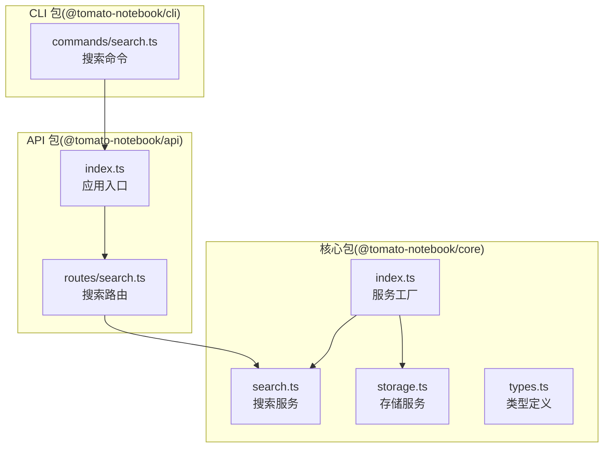
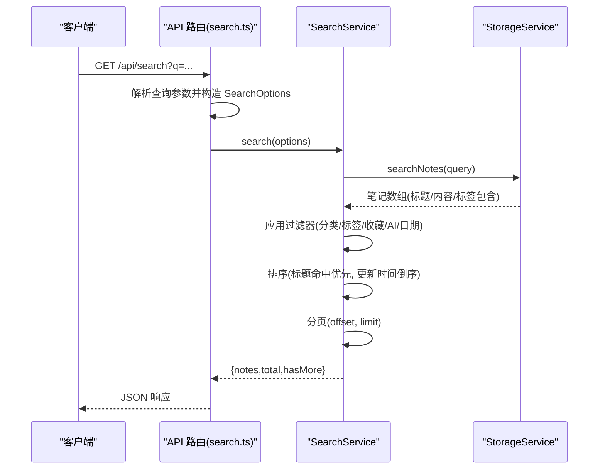
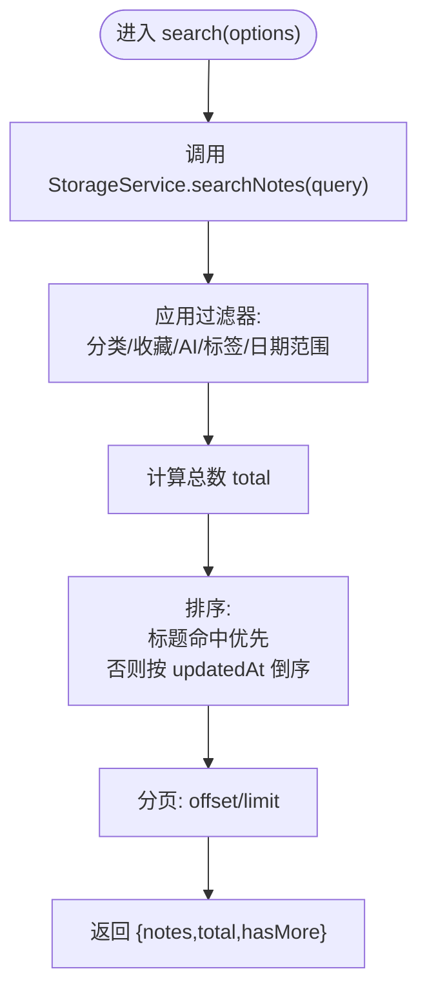
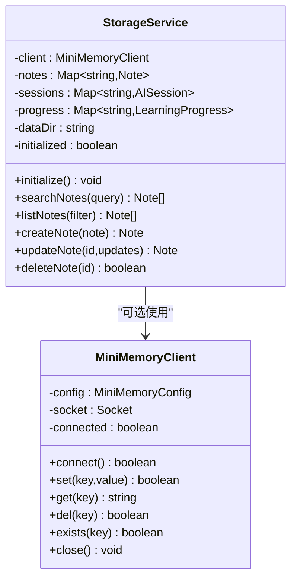
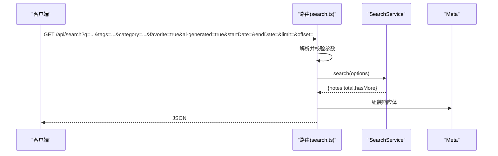
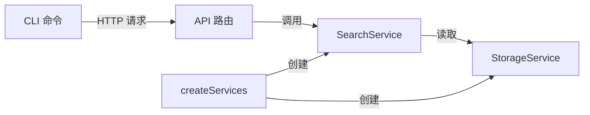

# 搜索服务

<cite>
**本文引用的文件**
- [packages/core/src/search.ts](file://packages/core/src/search.ts)
- [packages/core/src/storage.ts](file://packages/core/src/storage.ts)
- [packages/core/src/types.ts](file://packages/core/src/types.ts)
- [packages/core/src/index.ts](file://packages/core/src/index.ts)
- [packages/api/src/routes/search.ts](file://packages/api/src/routes/search.ts)
- [packages/api/src/index.ts](file://packages/api/src/index.ts)
- [packages/cli/src/commands/search.ts](file://packages/cli/src/commands/search.ts)
</cite>

## 目录
1. [简介](#简介)
2. [项目结构](#项目结构)
3. [核心组件](#核心组件)
4. [架构总览](#架构总览)
5. [详细组件分析](#详细组件分析)
6. [依赖关系分析](#依赖关系分析)
7. [性能考量](#性能考量)
8. [故障排查指南](#故障排查指南)
9. [结论](#结论)
10. [附录](#附录)

## 简介
本文件面向搜索服务的技术文档，聚焦于 SearchService 的搜索算法实现与扩展。内容覆盖：
- 全文搜索、标签过滤与分类筛选的处理流程
- 搜索索引的构建与维护机制（当前为内存与文件存储）
- 搜索结果的排序与评分策略
- 性能优化策略、缓存机制与查询优化技术
- 搜索 API 使用示例、参数说明与返回值格式
- 扩展性设计与未来优化方向

## 项目结构
该项目采用多包结构，搜索服务位于核心包中，API 层负责路由与参数解析，CLI 提供命令行工具，便于测试与集成。

图表来源
- [packages/core/src/search.ts:1-93](file://packages/core/src/search.ts#L1-L93)
- [packages/core/src/storage.ts:1-326](file://packages/core/src/storage.ts#L1-L326)
- [packages/core/src/types.ts:1-163](file://packages/core/src/types.ts#L1-L163)
- [packages/core/src/index.ts:1-50](file://packages/core/src/index.ts#L1-L50)
- [packages/api/src/routes/search.ts:1-92](file://packages/api/src/routes/search.ts#L1-L92)
- [packages/api/src/index.ts:1-64](file://packages/api/src/index.ts#L1-L64)
- [packages/cli/src/commands/search.ts:1-119](file://packages/cli/src/commands/search.ts#L1-L119)

章节来源
- [packages/core/src/search.ts:1-93](file://packages/core/src/search.ts#L1-L93)
- [packages/api/src/routes/search.ts:1-92](file://packages/api/src/routes/search.ts#L1-L92)
- [packages/cli/src/commands/search.ts:1-119](file://packages/cli/src/commands/search.ts#L1-L119)

## 核心组件
- 搜索服务(SearchService)
  - 负责接收搜索选项，调用存储层进行全文检索，并应用分类、标签、收藏、AI生成、日期范围等过滤条件，随后进行排序与分页，最终返回统一的结果结构。
- 存储服务(StorageService)
  - 提供 searchNotes 方法，执行标题、内容、标签的模糊匹配；同时提供持久化能力（文件系统），以及可选的 MiniMemory 客户端同步。
- 类型定义(types.ts)
  - 定义了搜索选项、结果结构、笔记实体、分类枚举等，确保 API 与服务层的契约清晰。
- 服务工厂(createServices)
  - 统一创建并初始化存储、笔记、AI、搜索等服务实例，供 API 与 CLI 使用。

章节来源
- [packages/core/src/search.ts:12-92](file://packages/core/src/search.ts#L12-L92)
- [packages/core/src/storage.ts:249-257](file://packages/core/src/storage.ts#L249-L257)
- [packages/core/src/types.ts:107-127](file://packages/core/src/types.ts#L107-L127)
- [packages/core/src/index.ts:25-49](file://packages/core/src/index.ts#L25-L49)

## 架构总览
搜索服务的调用链路如下：
- API 路由解析查询参数，组装 SearchOptions
- 调用 SearchService.search
- SearchService.search 调用 StorageService.searchNotes 进行全文检索
- 应用过滤器（分类、标签、收藏、AI生成、日期范围）
- 排序（标题命中优先，其次按更新时间倒序）
- 分页与结果封装

图表来源
- [packages/api/src/routes/search.ts:9-57](file://packages/api/src/routes/search.ts#L9-L57)
- [packages/core/src/search.ts:13-64](file://packages/core/src/search.ts#L13-L64)
- [packages/core/src/storage.ts:249-257](file://packages/core/src/storage.ts#L249-L257)

## 详细组件分析

### 搜索服务(SearchService)
- 全文搜索
  - 通过 StorageService.searchNotes 实现标题、内容、标签的包含式匹配。
- 过滤器
  - 分类(category)、收藏(isFavorite)、AI生成(isAIGenerated)、标签(tags)、日期范围(dateRange)。
- 排序
  - 标题命中优先级高于未命中；若标题命中相同，则按 updatedAt 倒序。
- 分页
  - 支持 offset 与 limit，默认 limit=20。
- 快速搜索
  - 仅匹配标题，返回最多 10 条。
- 搜索建议
  - 基于当前查询命中的笔记标签集合去重，返回前 5 个标签作为建议。

图表来源
- [packages/core/src/search.ts:13-64](file://packages/core/src/search.ts#L13-L64)

章节来源
- [packages/core/src/search.ts:12-92](file://packages/core/src/search.ts#L12-L92)

### 存储服务(StorageService)
- 全文检索(searchNotes)
  - 对标题、内容、标签进行小写包含匹配，返回满足任一条件的笔记。
- 持久化
  - 初始时从 dataDir/notes.json 加载；每次变更后写回文件。
  - 可选 MiniMemory 客户端同步（SET/GET/DEL/EXISTS）。
- 列表与过滤(listNotes)
  - 支持按分类、收藏、AI生成过滤，按 updatedAt 倒序，支持分页。

图表来源
- [packages/core/src/storage.ts:109-326](file://packages/core/src/storage.ts#L109-L326)

章节来源
- [packages/core/src/storage.ts:249-257](file://packages/core/src/storage.ts#L249-L257)
- [packages/core/src/storage.ts:220-247](file://packages/core/src/storage.ts#L220-L247)
- [packages/core/src/storage.ts:125-140](file://packages/core/src/storage.ts#L125-L140)

### API 路由与参数解析
- 路由
  - GET /api/search：标准搜索
  - GET /api/search/quick：快速搜索（标题匹配）
  - GET /api/search/suggestions：搜索建议（标签）
- 参数
  - q：查询关键字（必填）
  - tags：逗号分隔的标签过滤
  - category：分类枚举值校验后设置
  - favorite：布尔过滤
  - ai-generated：布尔过滤
  - startDate/endDate：日期范围
  - limit/offset：分页
- 返回
  - 成功时返回 { success: true, data: notes[], meta: { total, hasMore } }

图表来源
- [packages/api/src/routes/search.ts:9-57](file://packages/api/src/routes/search.ts#L9-L57)
- [packages/api/src/routes/search.ts:60-89](file://packages/api/src/routes/search.ts#L60-L89)

章节来源
- [packages/api/src/routes/search.ts:9-89](file://packages/api/src/routes/search.ts#L9-L89)

### CLI 命令行工具
- 支持子命令：
  - search query：标准搜索
  - search quick：快速搜索
  - search suggest：搜索建议
- 参数映射与输出格式与 API 一致，便于本地调试与自动化集成。

章节来源
- [packages/cli/src/commands/search.ts:15-119](file://packages/cli/src/commands/search.ts#L15-L119)

## 依赖关系分析
- SearchService 依赖 StorageService 提供的 searchNotes 能力
- API 路由依赖 SearchService 并负责参数解析与响应封装
- 服务工厂 createServices 统一创建并注入依赖
- CLI 通过 API 间接使用搜索服务

图表来源
- [packages/api/src/routes/search.ts:1-92](file://packages/api/src/routes/search.ts#L1-L92)
- [packages/core/src/search.ts:1-10](file://packages/core/src/search.ts#L1-L10)
- [packages/core/src/index.ts:25-49](file://packages/core/src/index.ts#L25-L49)
- [packages/cli/src/commands/search.ts:15-119](file://packages/cli/src/commands/search.ts#L15-L119)

章节来源
- [packages/core/src/index.ts:25-49](file://packages/core/src/index.ts#L25-L49)

## 性能考量
- 当前实现特点
  - 全文检索在内存 Map 中进行线性扫描，时间复杂度 O(N·(T+C+L))，其中 N 为笔记数，T/C/L 为标题/内容/标签匹配成本。
  - 过滤与排序均为内存操作，适合中小规模数据。
- 已具备的优化点
  - 快速搜索仅匹配标题，减少内容与标签扫描。
  - 搜索建议基于命中笔记的标签集合去重，避免重复计算。
- 可行的优化方向
  - 建立倒排索引：为标题、内容、标签分别建立词项到笔记 ID 的映射，降低查询复杂度至 O(k log N)，k 为匹配词项数。
  - 分词与归一化：对查询词与字段进行分词、大小写归一化、同义词映射，提升召回与相关度。
  - 缓存策略：对热门查询结果与标签建议进行短期缓存，结合 TTL 与失效策略。
  - 并行化：对不同过滤维度的处理可并行化，缩短整体延迟。
  - 分页游标：使用基于游标而非 offset 的分页，避免大偏移场景下的性能退化。
  - 外部搜索引擎：集成 Elasticsearch 或 Tantivy，获得更强大的全文检索与聚合能力。
  - MiniMemory 同步：在高并发场景下，将热点数据同步至 MiniMemory，减轻主存储压力。

[本节为通用性能讨论，不直接分析具体文件，故无“章节来源”]

## 故障排查指南
- 查询参数缺失
  - API 路由对 q 进行必填校验，缺失时返回错误状态码与错误信息。
- 存储初始化失败
  - 若 MiniMemory 不可用，存储服务会回退到文件系统；可通过健康检查接口确认 AI 与存储状态。
- 结果为空
  - 可尝试放宽过滤条件或调整查询词；使用快速搜索验证是否命中标题。
- 性能问题
  - 在笔记量较大时，考虑引入倒排索引与缓存；检查是否有不必要的过滤条件导致全量扫描。

章节来源
- [packages/api/src/routes/search.ts:12-14](file://packages/api/src/routes/search.ts#L12-L14)
- [packages/api/src/index.ts:28-41](file://packages/api/src/index.ts#L28-L41)
- [packages/core/src/storage.ts:128-135](file://packages/core/src/storage.ts#L128-L135)

## 结论
当前搜索服务以简单高效为目标，实现了基本的全文检索、标签与分类过滤、时间排序与分页。其核心优势在于实现简洁、易于扩展。随着数据规模增长，建议引入倒排索引、分词归一化、缓存与外部搜索引擎等技术，以进一步提升性能与体验。

[本节为总结性内容，不直接分析具体文件，故无“章节来源”]

## 附录

### 搜索 API 使用示例与参数说明
- 标准搜索
  - 路径：GET /api/search
  - 参数
    - q：查询关键字（必填）
    - tags：逗号分隔的标签过滤
    - category：分类枚举值（需在允许范围内）
    - favorite：布尔，仅返回收藏笔记
    - ai-generated：布尔，仅返回 AI 生成笔记
    - startDate/endDate：日期范围
    - limit/offset：分页
  - 返回
    - data：匹配的笔记数组
    - meta：total（总数）、hasMore（是否存在更多）

- 快速搜索
  - 路径：GET /api/search/quick
  - 参数：q（必填）
  - 返回：最多 10 条标题匹配的笔记

- 搜索建议
  - 路径：GET /api/search/suggestions
  - 参数：q
  - 返回：基于当前查询命中的笔记标签集合去重后的前 5 个标签

章节来源
- [packages/api/src/routes/search.ts:9-89](file://packages/api/src/routes/search.ts#L9-L89)

### 数据模型与类型定义
- 搜索选项(SearchOptions)
  - 包含 query、tags、category、isFavorite、isAIGenerated、dateRange、limit、offset
- 搜索结果(SearchResult)
  - 包含 notes、total、hasMore
- 笔记实体(Note)
  - 包含 id、title、content、summary、tags、category、isFavorite、isAIGenerated、createdAt、updatedAt

章节来源
- [packages/core/src/types.ts:107-127](file://packages/core/src/types.ts#L107-L127)
- [packages/core/src/types.ts:10-22](file://packages/core/src/types.ts#L10-L22)