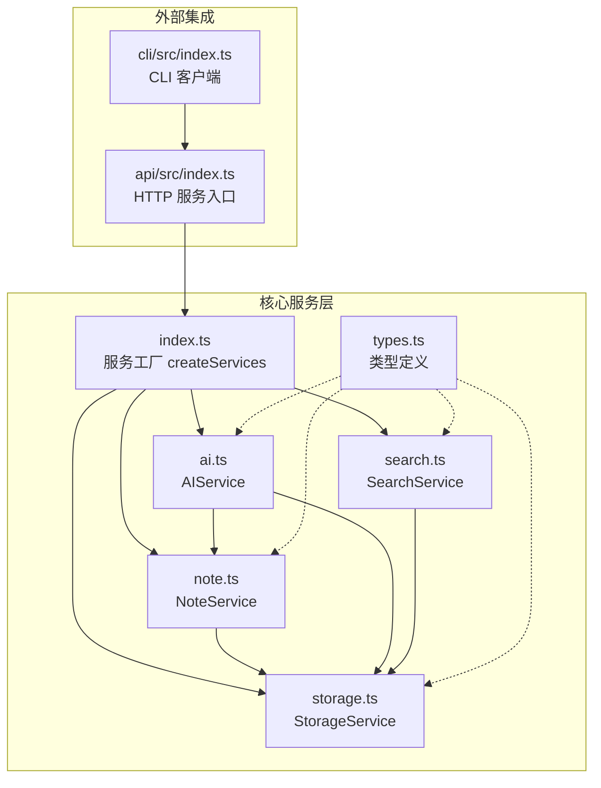
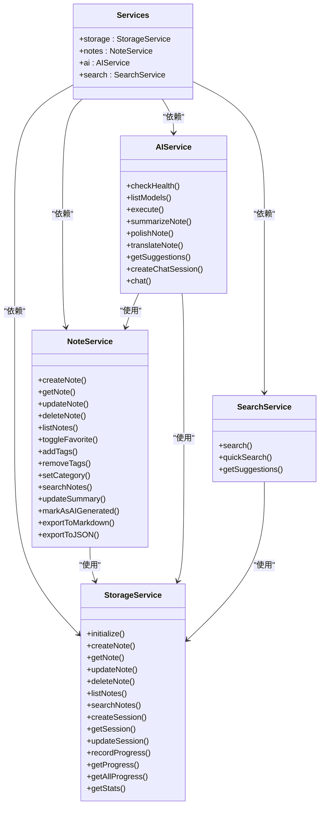
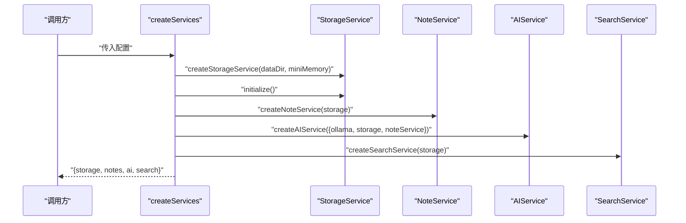
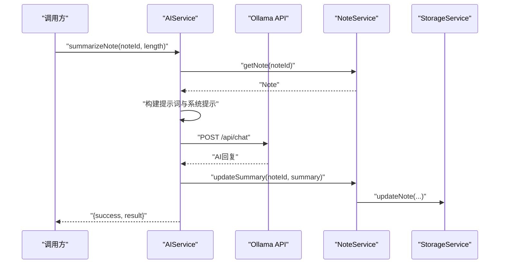
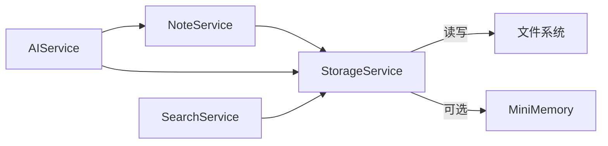

# 核心服务

<cite>
**本文引用的文件**
- [packages/core/src/index.ts](file://packages/core/src/index.ts)
- [packages/core/src/storage.ts](file://packages/core/src/storage.ts)
- [packages/core/src/note.ts](file://packages/core/src/note.ts)
- [packages/core/src/ai.ts](file://packages/core/src/ai.ts)
- [packages/core/src/search.ts](file://packages/core/src/search.ts)
- [packages/core/src/types.ts](file://packages/core/src/types.ts)
- [packages/api/src/index.ts](file://packages/api/src/index.ts)
- [packages/cli/src/index.ts](file://packages/cli/src/index.ts)
</cite>

## 目录
1. [简介](#简介)
2. [项目结构](#项目结构)
3. [核心组件](#核心组件)
4. [架构总览](#架构总览)
5. [详细组件分析](#详细组件分析)
6. [依赖分析](#依赖分析)
7. [性能考虑](#性能考虑)
8. [故障排查指南](#故障排查指南)
9. [结论](#结论)
10. [附录](#附录)

## 简介
本文件围绕番茄笔记的核心服务进行系统化梳理，重点解析服务工厂函数 createServices 的设计与实现，详解存储服务、笔记服务、AI 服务与搜索服务的功能边界、内部实现与交互关系，并给出数据模型、接口规范、使用示例、生命周期管理与错误处理机制。同时提供扩展与自定义指导、性能优化建议与最佳实践，帮助开发者快速理解并高效使用该核心服务层。

## 项目结构
核心服务位于 packages/core，采用模块化分层设计：
- 服务工厂与聚合导出：在入口文件中统一导出类型与服务构造器，并提供 createServices 工厂函数用于集中初始化与装配。
- 服务实现：分别在 storage.ts、note.ts、ai.ts、search.ts 中实现存储、笔记、AI、搜索四大服务。
- 类型定义：types.ts 提供统一的数据模型、配置项与接口规范。
- 外部集成：API 层通过 createServices 获取服务集合；CLI 层通过 HTTP 客户端调用 API。

图表来源
- [packages/core/src/index.ts:25-49](file://packages/core/src/index.ts#L25-L49)
- [packages/core/src/storage.ts:109-317](file://packages/core/src/storage.ts#L109-L317)
- [packages/core/src/note.ts:7-153](file://packages/core/src/note.ts#L7-L153)
- [packages/core/src/ai.ts:42-292](file://packages/core/src/ai.ts#L42-L292)
- [packages/core/src/search.ts:5-87](file://packages/core/src/search.ts#L5-L87)
- [packages/api/src/index.ts:4](file://packages/api/src/index.ts#L4)
- [packages/cli/src/index.ts:16](file://packages/cli/src/index.ts#L16)

章节来源
- [packages/core/src/index.ts:18-49](file://packages/core/src/index.ts#L18-L49)
- [packages/core/src/types.ts:107-163](file://packages/core/src/types.ts#L107-L163)

## 核心组件
本节聚焦 createServices 工厂函数的设计与实现，以及四大服务的职责与协作方式。

- 服务工厂 createServices
  - 输入：应用配置（数据目录、MiniMemory 配置、Ollama 配置等）。
  - 输出：包含 storage、notes、ai、search 四个服务的聚合对象。
  - 流程：初始化存储服务 -> 创建笔记服务（依赖存储）-> 创建 AI 服务（依赖存储与笔记服务）-> 创建搜索服务（依赖存储）-> 返回聚合对象。
  - 生命周期：存储服务在工厂中显式 initialize，确保后续服务可用。

- 存储服务 StorageService
  - 职责：统一管理笔记、AI 会话、学习进度等数据；支持本地文件持久化与可选的 MiniMemory 内存数据库同步。
  - 特性：笔记 CRUD、列表与搜索、AI 会话管理、进度记录、统计查询等。
  - 可靠性：初始化阶段尝试连接 MiniMemory，失败则回退到本地文件；对文件读写进行容错处理。

- 笔记服务 NoteService
  - 职责：面向业务的笔记操作封装，负责生成 ID、设置默认值、调用存储层完成持久化。
  - 能力：创建、查询、更新、删除、收藏切换、标签增删、分类设置、搜索、导出 Markdown/JSON 等。

- AI 服务 AIService
  - 职责：对接 Ollama API，执行多种 AI 操作（总结、润色、翻译、建议、聊天）。
  - 能力：健康检查、模型列表、执行请求、会话管理、根据操作自动更新笔记摘要。
  - 错误处理：捕获网络与 API 异常，返回结构化错误信息。

- 搜索服务 SearchService
  - 职责：基于存储层的全文检索与多维过滤、排序与分页。
  - 能力：标准搜索、快速搜索（标题优先）、搜索建议（标签）。

章节来源
- [packages/core/src/index.ts:25-49](file://packages/core/src/index.ts#L25-L49)
- [packages/core/src/storage.ts:109-317](file://packages/core/src/storage.ts#L109-L317)
- [packages/core/src/note.ts:7-153](file://packages/core/src/note.ts#L7-L153)
- [packages/core/src/ai.ts:42-292](file://packages/core/src/ai.ts#L42-L292)
- [packages/core/src/search.ts:5-87](file://packages/core/src/search.ts#L5-L87)

## 架构总览
下图展示服务工厂与四大服务之间的装配关系与依赖方向：

图表来源
- [packages/core/src/index.ts:18-49](file://packages/core/src/index.ts#L18-L49)
- [packages/core/src/storage.ts:109-317](file://packages/core/src/storage.ts#L109-L317)
- [packages/core/src/note.ts:7-153](file://packages/core/src/note.ts#L7-L153)
- [packages/core/src/ai.ts:42-292](file://packages/core/src/ai.ts#L42-L292)
- [packages/core/src/search.ts:5-87](file://packages/core/src/search.ts#L5-L87)

## 详细组件分析

### 服务工厂 createServices 设计与实现
- 设计要点
  - 配置驱动：通过部分应用配置决定数据目录、MiniMemory 与 Ollama 参数。
  - 顺序装配：先初始化存储，再创建其他服务，保证依赖可用。
  - 可扩展性：返回聚合对象，便于上层统一注入与管理。
- 实现流程
  - 读取 dataDir 与 miniMemory 配置，创建存储服务并 initialize。
  - 基于存储服务创建笔记服务。
  - 基于 Ollama 配置、存储与笔记服务创建 AI 服务。
  - 基于存储服务创建搜索服务。
  - 返回 { storage, notes, ai, search }。

图表来源
- [packages/core/src/index.ts:25-49](file://packages/core/src/index.ts#L25-L49)

章节来源
- [packages/core/src/index.ts:25-49](file://packages/core/src/index.ts#L25-L49)

### 存储服务 StorageService
- 功能概览
  - 数据持久化：笔记、AI 会话、学习进度。
  - 本地文件与 MiniMemory 双栈：优先 MiniMemory，失败回退本地文件。
  - 查询与统计：笔记列表、搜索、统计信息。
- 关键方法路径
  - 初始化与回退：[packages/core/src/storage.ts:124-140](file://packages/core/src/storage.ts#L124-L140)
  - 笔记 CRUD：[packages/core/src/storage.ts:169-218](file://packages/core/src/storage.ts#L169-L218)
  - 列表与搜索：[packages/core/src/storage.ts:220-257](file://packages/core/src/storage.ts#L220-L257)
  - 会话与进度：[packages/core/src/storage.ts:259-294](file://packages/core/src/storage.ts#L259-L294)
  - 统计查询：[packages/core/src/storage.ts:296-316](file://packages/core/src/storage.ts#L296-L316)
- MiniMemory 客户端
  - 命令式通信：SET/GET/DEL/EXISTS，超时与断线处理。
  - 路径参考：[packages/core/src/storage.ts:7-106](file://packages/core/src/storage.ts#L7-L106)

章节来源
- [packages/core/src/storage.ts:109-317](file://packages/core/src/storage.ts#L109-L317)

### 笔记服务 NoteService
- 功能概览
  - 业务层封装：生成 UUID、设置默认字段、调用存储层。
  - 多维操作：创建、查询、更新、删除、收藏、标签、分类、搜索、导出。
- 关键方法路径
  - 创建与查询：[packages/core/src/note.ts:15-35](file://packages/core/src/note.ts#L15-L35)
  - 列表与过滤：[packages/core/src/note.ts:48-76](file://packages/core/src/note.ts#L48-L76)
  - 收藏与标签：[packages/core/src/note.ts:79-107](file://packages/core/src/note.ts#L79-L107)
  - 分类与搜索：[packages/core/src/note.ts:110-117](file://packages/core/src/note.ts#L110-L117)
  - 导出：[packages/core/src/note.ts:133-152](file://packages/core/src/note.ts#L133-L152)

章节来源
- [packages/core/src/note.ts:7-153](file://packages/core/src/note.ts#L7-L153)

### AI 服务 AIService
- 功能概览
  - 对接 Ollama：健康检查、模型列表、聊天请求。
  - 多种操作：总结、润色、翻译、建议、聊天。
  - 会话管理：创建与维护聊天会话，必要时更新笔记摘要。
- 关键方法路径
  - 健康检查与模型列表：[packages/core/src/ai.ts:56-74](file://packages/core/src/ai.ts#L56-L74)
  - 请求执行与提示词模板：[packages/core/src/ai.ts:102-152](file://packages/core/src/ai.ts#L102-L152)
  - 具体操作封装：[packages/core/src/ai.ts:168-233](file://packages/core/src/ai.ts#L168-L233)
  - 聊天会话：[packages/core/src/ai.ts:236-291](file://packages/core/src/ai.ts#L236-L291)

图表来源
- [packages/core/src/ai.ts:168-180](file://packages/core/src/ai.ts#L168-L180)
- [packages/core/src/ai.ts:77-99](file://packages/core/src/ai.ts#L77-L99)
- [packages/core/src/note.ts:120-122](file://packages/core/src/note.ts#L120-L122)
- [packages/core/src/storage.ts:187-204](file://packages/core/src/storage.ts#L187-L204)

章节来源
- [packages/core/src/ai.ts:42-292](file://packages/core/src/ai.ts#L42-L292)

### 搜索服务 SearchService
- 功能概览
  - 基于存储层的全文检索，支持多维过滤、相关度排序与分页。
  - 快速搜索与标签建议。
- 关键方法路径
  - 标准搜索与过滤：[packages/core/src/search.ts:13-64](file://packages/core/src/search.ts#L13-L64)
  - 快速搜索：[packages/core/src/search.ts:67-74](file://packages/core/src/search.ts#L67-L74)
  - 搜索建议：[packages/core/src/search.ts:77-86](file://packages/core/src/search.ts#L77-L86)

章节来源
- [packages/core/src/search.ts:5-87](file://packages/core/src/search.ts#L5-L87)

### 数据模型与接口规范
- 数据模型
  - 笔记：包含 id、标题、内容、摘要、标签、分类、收藏标记、AI 生成标记及时间戳。
  - AI 会话：包含 id、关联笔记 id、消息数组、时间戳。
  - 学习进度：按日期统计笔记创建数、AI 交互次数、学习时长。
- 关键接口
  - Note、CreateNoteInput、UpdateNoteInput、Message、AISession、LearningProgress、SearchOptions、SearchResult、AIServiceConfig、AppConfig 等。
- 路径参考
  - [packages/core/src/types.ts:10-163](file://packages/core/src/types.ts#L10-L163)

章节来源
- [packages/core/src/types.ts:10-163](file://packages/core/src/types.ts#L10-L163)

### 使用示例
- 在 API 层使用
  - 通过 createServices 获取服务集合，注册路由并启动服务。
  - 路径参考：[packages/api/src/index.ts:4](file://packages/api/src/index.ts#L4)
- 在 CLI 层使用
  - 通过 HTTP 客户端调用 API，间接使用核心服务。
  - 路径参考：[packages/cli/src/index.ts:16](file://packages/cli/src/index.ts#L16)

章节来源
- [packages/api/src/index.ts:4](file://packages/api/src/index.ts#L4)
- [packages/cli/src/index.ts:16](file://packages/cli/src/index.ts#L16)

## 依赖分析
- 组件耦合
  - NoteService 仅依赖 StorageService，耦合度低，便于测试与替换。
  - AIService 同时依赖 StorageService 与 NoteService，形成“会话+笔记”的协同。
  - SearchService 仅依赖 StorageService，无副作用。
- 外部依赖
  - Ollama API：用于 AI 操作。
  - MiniMemory：可选的高性能内存存储。
  - 文件系统：作为回退持久化方案。
- 循环依赖
  - 未发现循环依赖，依赖方向清晰。

图表来源
- [packages/core/src/storage.ts:124-140](file://packages/core/src/storage.ts#L124-L140)
- [packages/core/src/ai.ts:48-53](file://packages/core/src/ai.ts#L48-L53)
- [packages/core/src/note.ts:10](file://packages/core/src/note.ts#L10)
- [packages/core/src/search.ts:8](file://packages/core/src/search.ts#L8)

章节来源
- [packages/core/src/storage.ts:109-317](file://packages/core/src/storage.ts#L109-L317)
- [packages/core/src/note.ts:7-153](file://packages/core/src/note.ts#L7-L153)
- [packages/core/src/ai.ts:42-292](file://packages/core/src/ai.ts#L42-L292)
- [packages/core/src/search.ts:5-87](file://packages/core/src/search.ts#L5-L87)

## 性能考虑
- 存储层
  - MiniMemory 优先：在高并发场景下显著降低延迟；失败回退文件系统，保证可用性。
  - 文件 I/O 批量写入：创建/更新/删除后统一保存，避免频繁落盘。
- 搜索层
  - 先全文检索再应用过滤，减少无效计算；分页与相关度排序提升用户体验。
- AI 层
  - 合理控制请求体大小与上下文长度；对重复请求进行缓存（可扩展）。
  - 会话消息累积需定期清理，避免上下文过长影响性能。
- 并发与资源
  - 服务工厂中串行初始化存储，确保依赖就绪；如需并行可评估并发安全与一致性。

[本节为通用性能建议，不直接分析具体文件]

## 故障排查指南
- 存储初始化失败
  - 现象：MiniMemory 连接失败，回退到文件系统。
  - 排查：确认 MiniMemory 服务状态与网络连通；检查 dataDir 权限。
  - 参考：[packages/core/src/storage.ts:128-135](file://packages/core/src/storage.ts#L128-L135)
- Ollama 不可用
  - 现象：AI 服务健康检查失败或请求报错。
  - 排查：确认 Ollama 地址、端口、模型名称；检查网络与防火墙。
  - 参考：[packages/core/src/ai.ts:56-63](file://packages/core/src/ai.ts#L56-L63)，[packages/core/src/ai.ts:93-99](file://packages/core/src/ai.ts#L93-L99)
- 笔记不存在
  - 现象：更新/总结/润色/翻译等操作返回“笔记不存在”。
  - 排查：确认 noteId 是否正确；检查存储是否同步成功。
  - 参考：[packages/core/src/ai.ts:170-172](file://packages/core/src/ai.ts#L170-L172)，[packages/core/src/note.ts:80-83](file://packages/core/src/note.ts#L80-L83)
- 会话不存在
  - 现象：聊天接口返回“会话不存在”。
  - 排查：确认 sessionId 是否有效；检查存储层会话创建流程。
  - 参考：[packages/core/src/ai.ts:250-253](file://packages/core/src/ai.ts#L250-L253)

章节来源
- [packages/core/src/storage.ts:128-135](file://packages/core/src/storage.ts#L128-L135)
- [packages/core/src/ai.ts:56-63](file://packages/core/src/ai.ts#L56-L63)
- [packages/core/src/ai.ts:93-99](file://packages/core/src/ai.ts#L93-L99)
- [packages/core/src/ai.ts:170-172](file://packages/core/src/ai.ts#L170-L172)
- [packages/core/src/note.ts:80-83](file://packages/core/src/note.ts#L80-L83)
- [packages/core/src/ai.ts:250-253](file://packages/core/src/ai.ts#L250-L253)

## 结论
本核心服务层通过 createServices 工厂函数实现了清晰的装配与依赖管理，四大服务职责明确、边界清晰，既满足了单体应用的内聚需求，也为上层 API 与 CLI 提供了稳定的服务能力。结合类型系统与错误处理策略，整体具备良好的可维护性与扩展性。建议在生产环境中优先启用 MiniMemory 与 Ollama，配合合理的缓存与会话清理策略，持续优化性能与稳定性。

[本节为总结性内容，不直接分析具体文件]

## 附录
- 服务生命周期
  - 工厂初始化：createServices -> StorageService.initialize -> 其他服务创建。
  - 运行期：各服务在需要时访问存储，AI 服务在执行请求时调用 Ollama。
  - 关闭：可通过上层资源管理器统一关闭（例如 API 服务器优雅退出时释放资源）。
- 错误处理机制
  - 存储层：文件读写异常时返回空结果或默认值，避免中断。
  - AI 层：网络与 API 异常被捕获并返回结构化错误。
  - 搜索层：过滤与排序在内存中进行，异常情况返回空集或部分结果。
- 扩展与自定义指导
  - 新增服务：遵循现有模式，在 index.ts 中导出构造器并在 createServices 中装配。
  - 替换存储：实现与 StorageService 相同接口的适配器，替换 MiniMemory 或文件系统。
  - 自定义 AI 模型：通过 AIServiceConfig 调整 Ollama 配置，或扩展新的 AI 提供商。
- 最佳实践
  - 优先使用 MiniMemory 提升性能；保留文件系统作为备份。
  - 控制 AI 请求上下文长度，避免超时与高延迟。
  - 对高频查询结果进行缓存（可选），减少重复计算。
  - 严格区分业务层（NoteService）与基础设施层（StorageService），保持低耦合。

[本节为通用指导，不直接分析具体文件]