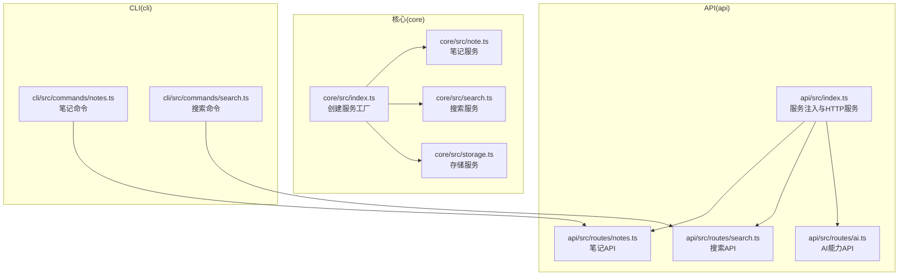
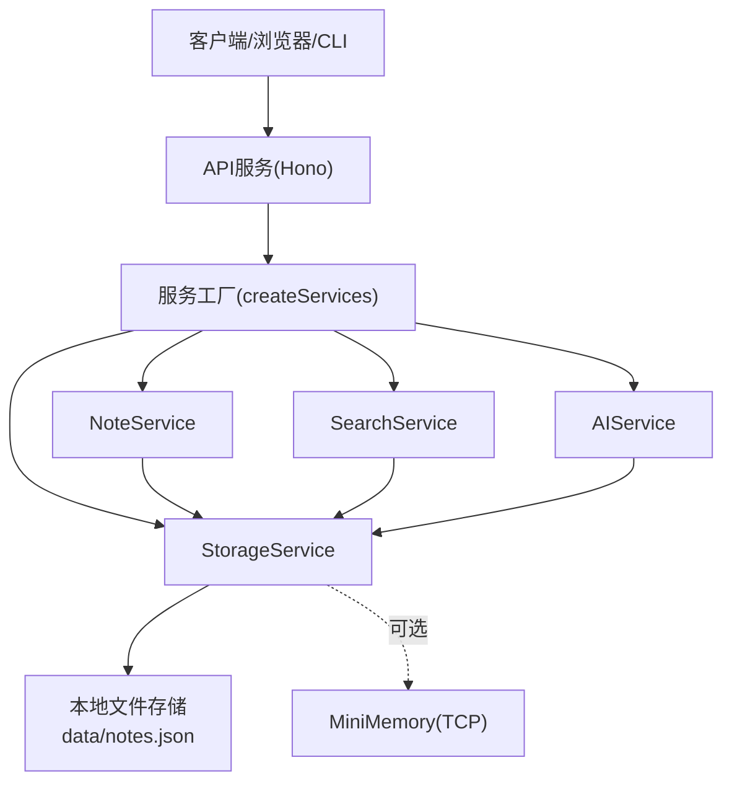
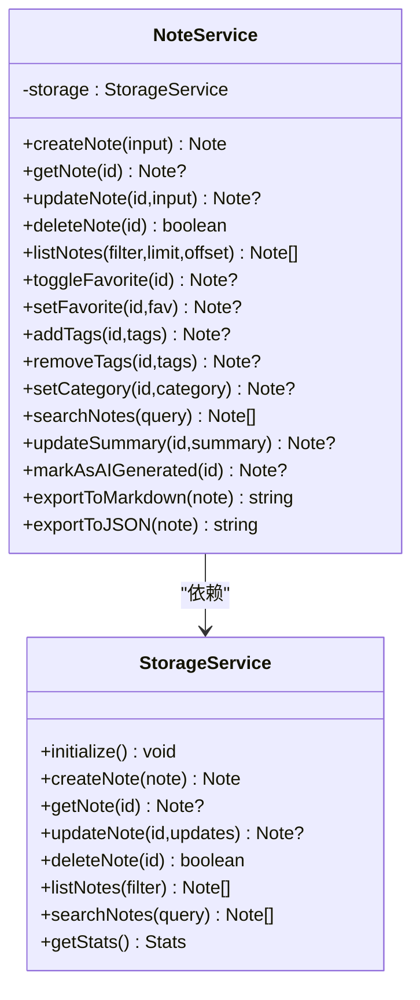
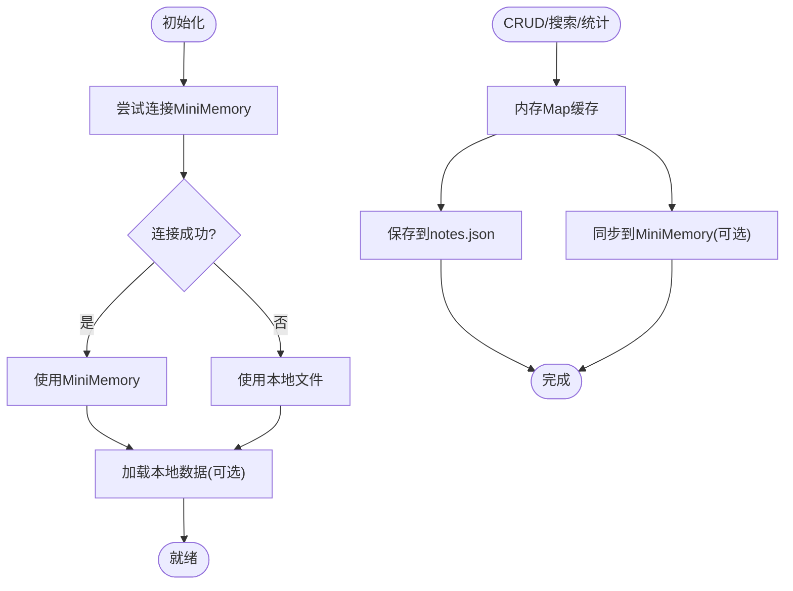
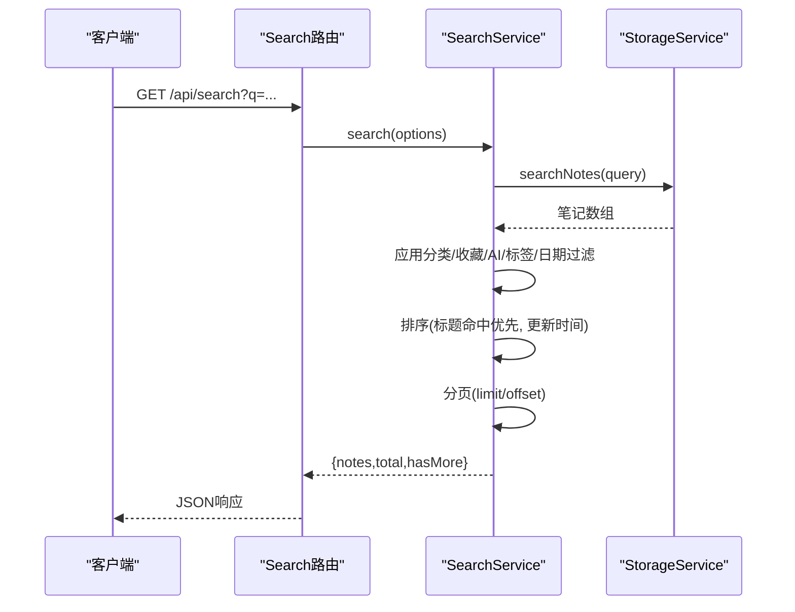
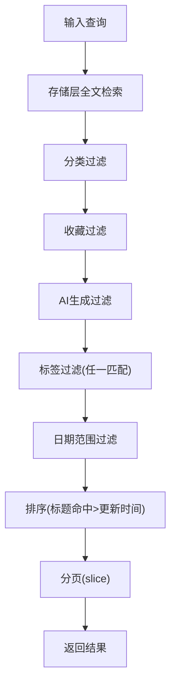
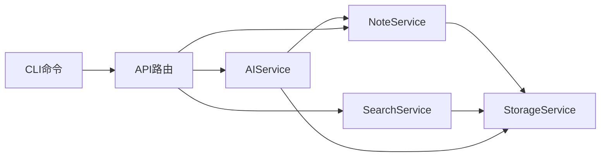

# 笔记服务

<cite>
**本文引用的文件**
- [package.json](file://package.json)
- [tsconfig.json](file://tsconfig.json)
- [packages/core/src/index.ts](file://packages/core/src/index.ts)
- [packages/core/src/note.ts](file://packages/core/src/note.ts)
- [packages/core/src/search.ts](file://packages/core/src/search.ts)
- [packages/core/src/storage.ts](file://packages/core/src/storage.ts)
- [packages/api/src/index.ts](file://packages/api/src/index.ts)
- [packages/api/src/routes/notes.ts](file://packages/api/src/routes/notes.ts)
- [packages/api/src/routes/search.ts](file://packages/api/src/routes/search.ts)
- [packages/api/src/routes/ai.ts](file://packages/api/src/routes/ai.ts)
- [packages/cli/src/commands/notes.ts](file://packages/cli/src/commands/notes.ts)
- [packages/cli/src/commands/search.ts](file://packages/cli/src/commands/search.ts)
</cite>

## 目录
1. [简介](#简介)
2. [项目结构](#项目结构)
3. [核心组件](#核心组件)
4. [架构总览](#架构总览)
5. [详细组件分析](#详细组件分析)
6. [依赖关系分析](#依赖关系分析)
7. [性能考虑](#性能考虑)
8. [故障排查指南](#故障排查指南)
9. [结论](#结论)
10. [附录](#附录)

## 简介
本项目是一个基于 TypeScript 的笔记服务，提供笔记的创建、读取、更新、删除（CRUD）、收藏、标签与分类管理、全文检索、AI 辅助（总结、润色、翻译、聊天）以及笔记导出（Markdown/JSON）能力。系统采用多包工作区组织，核心逻辑位于 core 包，API 层在 api 包，命令行工具在 cli 包，Web 层在 web 包。数据持久化支持本地文件与可选的 MiniMemory 内存数据库（通过 TCP 协议），并提供健康检查与统计信息。

## 项目结构
项目采用 Turborepo 工作区，核心模块与入口如下：
- 核心服务与类型定义：packages/core
- Web API 服务：packages/api
- 命令行工具：packages/cli
- Web 前端：packages/web
- 全局配置：package.json、tsconfig.json

**图表来源**
- [packages/core/src/index.ts:25-49](file://packages/core/src/index.ts#L25-L49)
- [packages/api/src/index.ts:6-18](file://packages/api/src/index.ts#L6-L18)
- [packages/api/src/routes/notes.ts:1-161](file://packages/api/src/routes/notes.ts#L1-L161)
- [packages/api/src/routes/search.ts:1-92](file://packages/api/src/routes/search.ts#L1-L92)
- [packages/api/src/routes/ai.ts:1-149](file://packages/api/src/routes/ai.ts#L1-L149)
- [packages/cli/src/commands/notes.ts:48-307](file://packages/cli/src/commands/notes.ts#L48-L307)
- [packages/cli/src/commands/search.ts:15-119](file://packages/cli/src/commands/search.ts#L15-L119)

**章节来源**
- [package.json:1-25](file://package.json#L1-L25)
- [tsconfig.json:1-22](file://tsconfig.json#L1-L22)
- [packages/core/src/index.ts:1-50](file://packages/core/src/index.ts#L1-L50)
- [packages/api/src/index.ts:1-64](file://packages/api/src/index.ts#L1-L64)

## 核心组件
- 服务工厂与聚合：通过 createServices 统一创建 StorageService、NoteService、AIService、SearchService，并注入依赖。
- 存储层：支持本地文件与 MiniMemory（TCP）双存储模式；提供笔记 CRUD、列表、搜索、统计等能力。
- 笔记服务：封装笔记的增删改查、收藏切换、标签管理、分类设置、摘要更新、AI 标记、导出 Markdown/JSON。
- 搜索服务：全文检索、过滤（分类、收藏、AI 生成、标签、日期范围）、排序（标题命中优先、更新时间）、分页。
- API 层：Hono 路由，提供健康检查、状态查询、笔记 CRUD、收藏、标签、导出、搜索、AI 能力、聊天会话。
- CLI 层：命令行工具，提供笔记管理、搜索、导出、统计等交互式操作。

**章节来源**
- [packages/core/src/index.ts:18-49](file://packages/core/src/index.ts#L18-L49)
- [packages/core/src/storage.ts:109-326](file://packages/core/src/storage.ts#L109-L326)
- [packages/core/src/note.ts:7-159](file://packages/core/src/note.ts#L7-L159)
- [packages/core/src/search.ts:5-93](file://packages/core/src/search.ts#L5-L93)
- [packages/api/src/index.ts:1-64](file://packages/api/src/index.ts#L1-L64)
- [packages/api/src/routes/notes.ts:1-161](file://packages/api/src/routes/notes.ts#L1-L161)
- [packages/api/src/routes/search.ts:1-92](file://packages/api/src/routes/search.ts#L1-L92)
- [packages/api/src/routes/ai.ts:1-149](file://packages/api/src/routes/ai.ts#L1-L149)
- [packages/cli/src/commands/notes.ts:48-307](file://packages/cli/src/commands/notes.ts#L48-L307)
- [packages/cli/src/commands/search.ts:15-119](file://packages/cli/src/commands/search.ts#L15-L119)

## 架构总览
系统采用“服务工厂 + 多包”架构，核心服务在 core 中实现，api 提供 HTTP 接口，cli 通过 HTTP 调用 api，web 作为前端应用与 api 交互。

**图表来源**
- [packages/api/src/index.ts:6-18](file://packages/api/src/index.ts#L6-L18)
- [packages/core/src/index.ts:25-49](file://packages/core/src/index.ts#L25-L49)
- [packages/core/src/storage.ts:109-140](file://packages/core/src/storage.ts#L109-L140)

## 详细组件分析

### 笔记服务（NoteService）
职责与能力：
- CRUD：创建、读取、更新、删除
- 列表与过滤：支持 favorites、ai-generated、recent、all 等过滤，配合 limit/offset
- 收藏：toggleFavorite/setFavorite
- 标签：addTags/removeTags（去重、差集）
- 分类：setCategory
- 搜索：searchNotes（委托存储层）
- 摘要：updateSummary
- AI 标记：markAsAIGenerated（标记+分类）
- 导出：exportToMarkdown/exportToJSON

**图表来源**
- [packages/core/src/note.ts:7-159](file://packages/core/src/note.ts#L7-L159)
- [packages/core/src/storage.ts:109-326](file://packages/core/src/storage.ts#L109-L326)

**章节来源**
- [packages/core/src/note.ts:14-159](file://packages/core/src/note.ts#L14-L159)

### 存储服务（StorageService）
职责与能力：
- 初始化：尝试连接 MiniMemory，失败则回退到本地文件
- 笔记 CRUD：内存 Map + 文件持久化，更新时同步 MiniMemory
- 列表与过滤：按更新时间倒序，支持分类、收藏、AI 生成过滤
- 搜索：标题/内容/标签模糊匹配（小写包含）
- 统计：总笔记、收藏数、AI 生成数、标签种类数
- MiniMemory 客户端：SET/GET/DEL/EXISTS 命令封装

**图表来源**
- [packages/core/src/storage.ts:124-140](file://packages/core/src/storage.ts#L124-L140)
- [packages/core/src/storage.ts:169-218](file://packages/core/src/storage.ts#L169-L218)
- [packages/core/src/storage.ts:249-257](file://packages/core/src/storage.ts#L249-L257)

**章节来源**
- [packages/core/src/storage.ts:109-326](file://packages/core/src/storage.ts#L109-L326)

### 搜索服务（SearchService）
职责与能力：
- 输入：SearchOptions（query、category、isFavorite、isAIGenerated、tags、dateRange、limit、offset）
- 流程：先调用存储层全文检索，再应用过滤器，按标题命中优先与更新时间排序，最后分页
- 快速搜索：仅标题匹配，返回前 N 条
- 建议：基于匹配笔记的标签集合去重取前 K 个

**图表来源**
- [packages/api/src/routes/search.ts:9-57](file://packages/api/src/routes/search.ts#L9-L57)
- [packages/core/src/search.ts:13-64](file://packages/core/src/search.ts#L13-L64)
- [packages/core/src/storage.ts:249-257](file://packages/core/src/storage.ts#L249-L257)

**章节来源**
- [packages/core/src/search.ts:5-93](file://packages/core/src/search.ts#L5-L93)
- [packages/api/src/routes/search.ts:1-92](file://packages/api/src/routes/search.ts#L1-L92)

### API 接口说明
- 健康检查
  - GET /api/health
  - 返回服务状态与时间戳
- 状态查询
  - GET /api/status
  - 返回 AI 连接状态与统计信息
- 笔记
  - GET /api/notes?filter=all|recent|favorites|ai-generated&limit&offset
  - POST /api/notes（校验必填字段）
  - GET /api/notes/:id
  - PUT /api/notes/:id
  - DELETE /api/notes/:id
  - POST /api/notes/:id/favorite
  - POST /api/notes/:id/tags
  - DELETE /api/notes/:id/tags
  - GET /api/notes/:id/export?format=json|md
  - GET /api/notes/stats/summary
- 搜索
  - GET /api/search?q=&tags=&limit=&offset=&category=&favorite=&ai-generated=&startDate=&endDate=
  - GET /api/search/quick?q=
  - GET /api/search/suggestions?q=
- AI
  - GET /api/ai/health
  - POST /api/ai/summarize/:id?length=short|medium|long
  - POST /api/ai/polish/:id?style=formal|casual
  - POST /api/ai/translate/:id?language=...
  - GET /api/ai/suggest?noteId=&context=
  - POST /api/ai/execute（通用操作）
  - POST /api/ai/chat/session（创建会话）
  - POST /api/ai/chat/:sessionId（发送消息）

请求/响应约定：
- 成功：{ success: true, data, meta? }
- 失败：{ success: false, error }

**章节来源**
- [packages/api/src/routes/notes.ts:7-161](file://packages/api/src/routes/notes.ts#L7-L161)
- [packages/api/src/routes/search.ts:8-92](file://packages/api/src/routes/search.ts#L8-L92)
- [packages/api/src/routes/ai.ts:7-149](file://packages/api/src/routes/ai.ts#L7-L149)
- [packages/api/src/index.ts:27-41](file://packages/api/src/index.ts#L27-L41)

### CLI 使用示例
- 创建笔记：notes:create "标题" [-c 内容] [-t 标签,标签,...]
- 列出笔记：notes:list [-f all|recent|favorites|ai-generated] [-l 限制]
- 查看笔记：notes:show <id> [-f json|markdown]
- 编辑笔记：notes:edit <id> [--title] [--content]
- 删除笔记：notes:delete <id> --force
- 收藏：notes:favorite <id>
- 打标签：notes:tag <id> 标签1 标签2 ...
- 导出：notes:export <id> [-f json|markdown] [-o 输出文件]
- 统计：notes:stats
- 搜索：search:query <关键词> [--tags] [--favorite] [--ai-generated] [--limit]
- 快速搜索：search:quick <关键词>
- 建议：search:suggest <关键词>

**章节来源**
- [packages/cli/src/commands/notes.ts:48-307](file://packages/cli/src/commands/notes.ts#L48-L307)
- [packages/cli/src/commands/search.ts:15-119](file://packages/cli/src/commands/search.ts#L15-L119)

### 数据模型与验证规则
- Note 数据模型（核心类型）
  - 字段：id、title（必填）、content、tags、category、isFavorite、isAIGenerated、createdAt、updatedAt、summary
  - 验证：API 层对创建请求校验 title 必填；其他字段按需传入
- NoteFilter
  - 取值：all、recent、favorites、ai-generated
- SearchOptions
  - 字段：query、category、isFavorite、isAIGenerated、tags[]、dateRange(start,end)、limit、offset
- AI 操作
  - 操作枚举：SUMMARIZE、POLISH、TRANSLATE、SUGGEST、CHAT
  - 参数：length（short|medium|long）、style（formal|casual）、language、noteId、content

**章节来源**
- [packages/core/src/note.ts:17-27](file://packages/core/src/note.ts#L17-L27)
- [packages/api/src/routes/notes.ts:28-44](file://packages/api/src/routes/notes.ts#L28-L44)
- [packages/api/src/routes/search.ts:16-45](file://packages/api/src/routes/search.ts#L16-L45)
- [packages/api/src/routes/ai.ts:92-112](file://packages/api/src/routes/ai.ts#L92-L112)

### 全文检索与搜索算法
- 检索范围：标题、内容、标签（均转小写后包含匹配）
- 过滤链路：分类、收藏、AI 生成、标签交集、日期范围
- 排序策略：标题命中优先于更新时间
- 分页：offset/limit 控制
- 快速搜索：仅标题匹配，取前 10 条
- 建议：基于匹配笔记的标签集合去重取前 5 个

**图表来源**
- [packages/core/src/storage.ts:249-257](file://packages/core/src/storage.ts#L249-L257)
- [packages/core/src/search.ts:16-57](file://packages/core/src/search.ts#L16-L57)

**章节来源**
- [packages/core/src/search.ts:12-87](file://packages/core/src/search.ts#L12-L87)

### 导出功能与数据格式
- 支持格式：Markdown（md）、JSON
- Markdown 规范：包含标题、创建/更新时间、标签、分类、摘要（可选）、正文
- JSON 规范：直接序列化 Note 对象
- 导出接口：GET /api/notes/:id/export?format=json|md

**章节来源**
- [packages/core/src/note.ts:133-152](file://packages/core/src/note.ts#L133-L152)
- [packages/api/src/routes/notes.ts:124-152](file://packages/api/src/routes/notes.ts#L124-L152)

## 依赖关系分析
- 服务依赖
  - NoteService 依赖 StorageService
  - SearchService 依赖 StorageService
  - AIService 依赖 StorageService 与 NoteService
  - API 路由依赖 services（由 createServices 注入）
- 外部依赖
  - Hono（HTTP 框架）
  - uuid（ID 生成）
  - commandeer（CLI 命令解析）
  - chalk/spinner（CLI 输出美化）
- 存储依赖
  - MiniMemory（TCP 客户端）
  - 文件系统（本地持久化）

**图表来源**
- [packages/core/src/index.ts:25-49](file://packages/core/src/index.ts#L25-L49)
- [packages/api/src/index.ts:4-18](file://packages/api/src/index.ts#L4-L18)

**章节来源**
- [packages/core/src/index.ts:18-49](file://packages/core/src/index.ts#L18-L49)
- [packages/api/src/index.ts:4-18](file://packages/api/src/index.ts#L4-L18)

## 性能考虑
- 存储层
  - 内存 Map 缓存：读写快，重启丢失；可通过 MiniMemory 增强持久性
  - 文件 I/O：每次变更写入完整 notes.json，建议在高并发场景下引入批量写或队列
- 搜索层
  - 全文检索为线性扫描，适合中小规模数据；大规模建议引入倒排索引或搜索引擎
  - 过滤与排序在内存中进行，注意 limit/offset 的合理使用
- MiniMemory
  - TCP 连接失败自动回退文件存储，保证可用性；生产环境建议部署稳定的服务端
- API 层
  - Hono 轻量高效；建议启用压缩、限流与缓存策略
- CLI 层
  - 通过 HTTP 调用 API，避免重复逻辑，便于扩展

[本节为通用性能建议，无需特定文件引用]

## 故障排查指南
- 健康检查
  - GET /api/health：确认服务启动正常
  - GET /api/status：确认 AI 连接状态与统计信息
- 常见错误
  - 400 错误：请求参数缺失或非法（如创建时缺少标题、搜索时缺少查询词）
  - 404 错误：资源不存在（笔记/会话）
  - 500 错误：服务内部异常
- MiniMemory 连接失败
  - 自动回退至文件存储；检查 MiniMemory 服务是否运行与网络连通
- 导出失败
  - 确认笔记存在；检查 format 参数（json/md）
- CLI 失败
  - 检查本地服务是否启动；确认端口与主机配置

**章节来源**
- [packages/api/src/index.ts:27-41](file://packages/api/src/index.ts#L27-L41)
- [packages/api/src/routes/notes.ts:28-44](file://packages/api/src/routes/notes.ts#L28-L44)
- [packages/api/src/routes/search.ts:12-14](file://packages/api/src/routes/search.ts#L12-L14)
- [packages/api/src/routes/ai.ts:8-19](file://packages/api/src/routes/ai.ts#L8-L19)

## 结论
本笔记服务以清晰的分层设计实现了完整的笔记生命周期管理与检索能力，结合可选的 AI 能力与导出功能，满足个人知识管理场景。建议在生产环境中：
- 引入更高效的全文检索方案（如倒排索引或搜索引擎）
- 优化存储写入策略（批量/异步）
- 增强 MiniMemory 的稳定性与监控
- 在 API 层增加鉴权、限流与审计日志

[本节为总结性内容，无需特定文件引用]

## 附录

### API 接口一览（按模块）
- 健康与状态
  - GET /api/health
  - GET /api/status
- 笔记
  - GET /api/notes
  - POST /api/notes
  - GET /api/notes/:id
  - PUT /api/notes/:id
  - DELETE /api/notes/:id
  - POST /api/notes/:id/favorite
  - POST /api/notes/:id/tags
  - DELETE /api/notes/:id/tags
  - GET /api/notes/:id/export?format=json|md
  - GET /api/notes/stats/summary
- 搜索
  - GET /api/search?q=&tags=&limit=&offset=&category=&favorite=&ai-generated=&startDate=&endDate=
  - GET /api/search/quick?q=
  - GET /api/search/suggestions?q=
- AI
  - GET /api/ai/health
  - POST /api/ai/summarize/:id?length=short|medium|long
  - POST /api/ai/polish/:id?style=formal|casual
  - POST /api/ai/translate/:id?language=...
  - GET /api/ai/suggest?noteId=&context=
  - POST /api/ai/execute
  - POST /api/ai/chat/session
  - POST /api/ai/chat/:sessionId

**章节来源**
- [packages/api/src/routes/notes.ts:7-161](file://packages/api/src/routes/notes.ts#L7-L161)
- [packages/api/src/routes/search.ts:8-92](file://packages/api/src/routes/search.ts#L8-L92)
- [packages/api/src/routes/ai.ts:7-149](file://packages/api/src/routes/ai.ts#L7-L149)