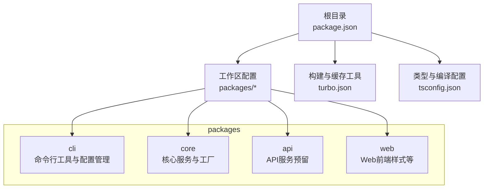
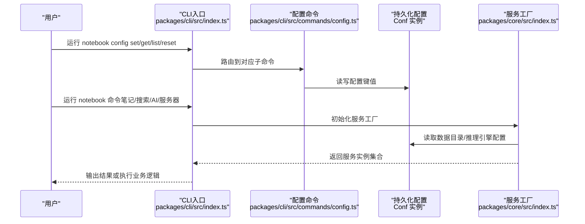
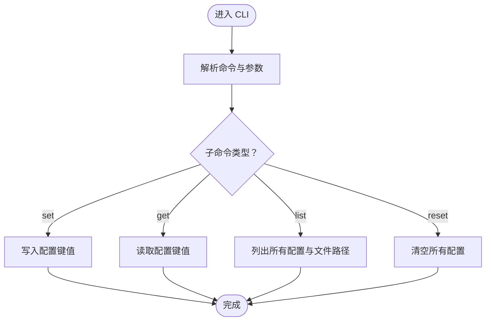
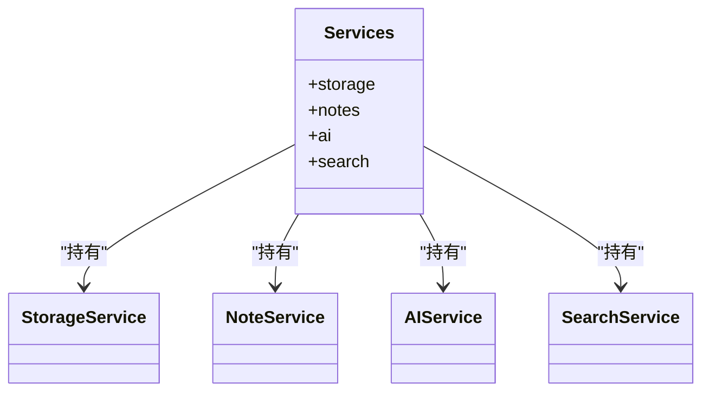
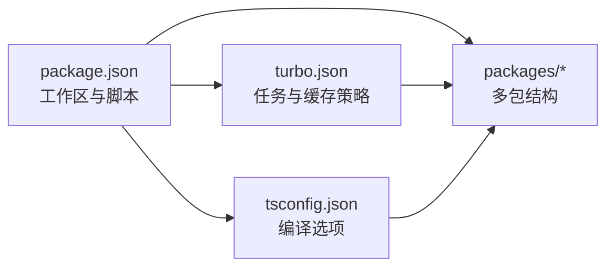

# 配置与定制

<cite>
**本文引用的文件**
- [package.json](file://package.json)
- [turbo.json](file://turbo.json)
- [tsconfig.json](file://tsconfig.json)
- [packages/cli/src/index.ts](file://packages/cli/src/index.ts)
- [packages/cli/src/commands/config.ts](file://packages/cli/src/commands/config.ts)
- [packages/core/src/index.ts](file://packages/core/src/index.ts)
</cite>

## 目录
1. [简介](#简介)
2. [项目结构](#项目结构)
3. [核心组件](#核心组件)
4. [架构总览](#架构总览)
5. [详细组件分析](#详细组件分析)
6. [依赖分析](#依赖分析)
7. [性能考虑](#性能考虑)
8. [故障排查指南](#故障排查指南)
9. [结论](#结论)
10. [附录](#附录)

## 简介
本指南面向开发者与高级用户，聚焦“番茄笔记”的配置与定制能力，涵盖以下方面：
- 应用配置文件结构与可用选项
- 环境变量的配置方法与优先级规则
- 性能调优参数与系统资源配置建议
- 扩展开发指导（新功能开发、插件系统设计、第三方集成）
- 存储适配器扩展方法与AI模型集成方式
- 主题定制、界面个性化与功能开关的配置思路
- 架构扩展的最佳实践与注意事项

## 项目结构
该仓库采用多包工作区布局，核心与CLI入口位于 packages 目录下；顶层通过包管理脚本与构建缓存工具进行统一管理。

图表来源
- [package.json:1-25](file://package.json#L1-L25)
- [turbo.json:1-23](file://turbo.json#L1-L23)
- [tsconfig.json:1-22](file://tsconfig.json#L1-L22)

章节来源
- [package.json:1-25](file://package.json#L1-L25)
- [turbo.json:1-23](file://turbo.json#L1-L23)
- [tsconfig.json:1-22](file://tsconfig.json#L1-L22)

## 核心组件
- CLI 配置与命令体系：提供配置读取、设置、列出与重置等命令，并以持久化配置对象管理应用参数。
- 核心服务工厂：集中创建存储、笔记、AI与搜索服务，支持通过配置注入外部依赖（如本地推理引擎）。

章节来源
- [packages/cli/src/index.ts:1-91](file://packages/cli/src/index.ts#L1-L91)
- [packages/cli/src/commands/config.ts:1-49](file://packages/cli/src/commands/config.ts#L1-L49)
- [packages/core/src/index.ts:1-50](file://packages/core/src/index.ts#L1-L50)

## 架构总览
从配置到服务的调用链路如下：

图表来源
- [packages/cli/src/index.ts:68-91](file://packages/cli/src/index.ts#L68-L91)
- [packages/cli/src/commands/config.ts:4-48](file://packages/cli/src/commands/config.ts#L4-L48)
- [packages/core/src/index.ts:25-49](file://packages/core/src/index.ts#L25-L49)

## 详细组件分析

### CLI 配置管理
- 功能概览
  - 设置配置项：接收键与值，写入持久化配置。
  - 获取配置项：按键读取并输出当前值。
  - 列出配置：展示当前全部配置与配置文件路径。
  - 重置配置：清空所有配置项。
- 数据源与默认值
  - 使用持久化配置对象管理键值对，默认键包含示例API地址。
- 交互与输出
  - 使用彩色终端输出与加载动画提升可读性与反馈体验。

图表来源
- [packages/cli/src/commands/config.ts:4-48](file://packages/cli/src/commands/config.ts#L4-L48)

章节来源
- [packages/cli/src/commands/config.ts:1-49](file://packages/cli/src/commands/config.ts#L1-L49)
- [packages/cli/src/index.ts:8-13](file://packages/cli/src/index.ts#L8-L13)

### 核心服务工厂
- 作用
  - 统一创建与初始化存储、笔记、AI与搜索服务。
  - 支持通过传入部分配置来定制行为（如数据目录、推理引擎参数）。
- 关键点
  - 数据目录默认值与MiniMemory配置可通过外部传参覆盖。
  - AI服务默认连接本地推理引擎（主机、端口、模型名），可由上层配置注入。
- 返回值
  - 返回包含各服务实例的对象，便于上层组合使用。

图表来源
- [packages/core/src/index.ts:18-23](file://packages/core/src/index.ts#L18-L23)

章节来源
- [packages/core/src/index.ts:25-49](file://packages/core/src/index.ts#L25-L49)

### 配置文件结构与可用选项
- 结构说明
  - CLI侧：基于持久化配置对象维护键值对，支持默认键与运行时更新。
  - 核心侧：服务工厂接受部分配置对象，用于控制数据目录与AI服务参数。
- 可用选项
  - 示例键：API地址（用于CLI请求目标）。
  - 数据目录：用于存储服务初始化与数据落盘位置。
  - 推理引擎配置：主机、端口、模型名等，用于AI服务初始化。
- 优先级规则
  - CLI命令行参数优先于持久化配置；持久化配置优先于默认值。
  - 服务工厂传入的配置对象优先于持久化配置中的同名键。

章节来源
- [packages/cli/src/index.ts:8-13](file://packages/cli/src/index.ts#L8-L13)
- [packages/cli/src/commands/config.ts:11-26](file://packages/cli/src/commands/config.ts#L11-L26)
- [packages/core/src/index.ts:25-44](file://packages/core/src/index.ts#L25-L44)

### 环境变量配置方法与优先级
- 配置方法
  - 在启动环境中设置键值对，CLI与核心服务在读取配置时应优先检查环境变量。
  - 对于CLI，可在进程启动前设置环境变量后执行命令。
  - 对于核心服务，可在调用服务工厂前注入环境变量映射为配置对象。
- 优先级规则
  - 环境变量 > CLI持久化配置 > 默认值。
  - 若存在同名键，环境变量应覆盖持久化配置；若无环境变量，则回退到持久化配置或默认值。

章节来源
- [packages/cli/src/index.ts:8-13](file://packages/cli/src/index.ts#L8-L13)
- [packages/core/src/index.ts:25-44](file://packages/core/src/index.ts#L25-L44)

### 性能调优参数与系统资源配置
- 数据目录与I/O
  - 将数据目录指向高性能磁盘路径，避免频繁跨盘符操作。
  - 合理规划笔记与索引文件大小，定期清理冗余内容。
- 推理引擎
  - 本地推理引擎的主机与端口应与实际部署一致，确保低延迟访问。
  - 模型选择需平衡精度与资源占用，必要时调整批处理与并发度。
- 并发与缓存
  - 在服务工厂中合理设置并发策略与缓存策略，减少重复计算与网络请求。
  - 对高频查询与热点数据建立缓存层，降低存储与推理压力。

章节来源
- [packages/core/src/index.ts:25-44](file://packages/core/src/index.ts#L25-L44)

### 扩展开发指导
- 新功能开发
  - 采用模块化设计，新增功能以独立模块形式接入服务工厂，保持低耦合高内聚。
  - 提供清晰的接口契约与类型定义，便于测试与演进。
- 插件系统设计
  - 定义插件接口规范，支持动态注册与卸载。
  - 通过配置中心集中管理插件开关与参数，避免硬编码。
- 第三方集成
  - 以适配器模式对接外部服务，隔离变更影响。
  - 提供统一的错误处理与降级策略，保证系统稳定性。

章节来源
- [packages/core/src/index.ts:18-23](file://packages/core/src/index.ts#L18-L23)

### 存储适配器扩展方法
- 设计要点
  - 抽象存储接口，定义统一的数据读写与元数据管理方法。
  - 支持多种后端（内存、文件、数据库、云存储），通过配置切换。
- 实现步骤
  - 在服务工厂中注入自定义存储实现，替换默认实现。
  - 为新存储提供初始化与迁移脚本，确保数据一致性。
- 注意事项
  - 严格遵循事务与并发控制，避免数据损坏。
  - 提供监控与日志，便于问题定位与性能优化。

章节来源
- [packages/core/src/index.ts:25-49](file://packages/core/src/index.ts#L25-L49)

### AI模型集成方式
- 集成路径
  - 在服务工厂中为AI服务注入推理引擎配置（主机、端口、模型名）。
  - 通过统一的服务接口对外提供问答、摘要、检索增强等能力。
- 参数与策略
  - 支持动态切换模型与参数，结合缓存与批处理提升吞吐。
  - 提供安全与合规策略（如内容过滤、上下文长度限制）。
- 与存储的协作
  - 将向量索引与文档切片写入存储，提高检索效率与准确性。

章节来源
- [packages/core/src/index.ts:34-44](file://packages/core/src/index.ts#L34-L44)

### 主题定制、界面个性化与功能开关
- 主题与界面
  - Web端可通过样式文件与主题变量实现主题切换与个性化。
  - CLI端通过终端颜色与输出格式提升可读性与一致性。
- 功能开关
  - 以配置中心集中管理功能开关，支持灰度发布与快速回滚。
  - 在服务工厂中根据开关决定是否启用特定能力，避免条件分支污染。

章节来源
- [packages/cli/src/index.ts:68-91](file://packages/cli/src/index.ts#L68-L91)
- [packages/web/src/index.css](file://packages/web/src/index.css)

## 依赖分析
- 工作区与脚本
  - 根配置声明工作区与统一脚本，便于并行构建与测试。
- 构建与缓存
  - 构建任务依赖上游包，开发任务持久化且不缓存，利于热更新。
- 编译与类型
  - TypeScript配置启用严格模式与声明生成，保障类型安全与可维护性。

图表来源
- [package.json:5-14](file://package.json#L5-L14)
- [turbo.json:3-21](file://turbo.json#L3-L21)
- [tsconfig.json:2-19](file://tsconfig.json#L2-L19)

章节来源
- [package.json:1-25](file://package.json#L1-L25)
- [turbo.json:1-23](file://turbo.json#L1-L23)
- [tsconfig.json:1-22](file://tsconfig.json#L1-L22)

## 性能考虑
- I/O与存储
  - 将数据目录置于SSD或高性能存储介质，减少随机读写开销。
  - 对大文件采用分块读写与流式处理，避免内存峰值过高。
- 网络与推理
  - 本地推理引擎尽量部署在同一主机或局域网内，降低网络延迟。
  - 控制并发与批处理大小，避免资源争用导致的抖动。
- 缓存与索引
  - 为热点数据与查询结果建立缓存层，缩短响应时间。
  - 对文本进行分词与向量化，配合高效索引算法提升检索性能。

## 故障排查指南
- 配置问题
  - 使用配置命令查看当前配置与配置文件路径，确认键是否存在且值正确。
  - 如出现异常，尝试重置配置后重新设置关键键值。
- 服务初始化失败
  - 检查数据目录权限与可用空间，确保服务工厂可正常初始化。
  - 校验推理引擎主机与端口连通性，必要时调整配置。
- CLI请求失败
  - 确认API地址配置正确，网络可达，必要时通过环境变量覆盖。
  - 查看终端输出的错误信息与状态码，定位具体环节。

章节来源
- [packages/cli/src/commands/config.ts:30-38](file://packages/cli/src/commands/config.ts#L30-L38)
- [packages/cli/src/index.ts:16-59](file://packages/cli/src/index.ts#L16-L59)
- [packages/core/src/index.ts:25-49](file://packages/core/src/index.ts#L25-L49)

## 结论
本指南提供了从配置文件结构、环境变量优先级到性能调优与扩展开发的完整路径。通过CLI配置管理与核心服务工厂的协同，系统具备良好的可定制性与可扩展性。建议在生产环境中结合监控与日志体系，持续优化存储与推理性能，并以插件化与适配器模式支撑未来功能演进。

## 附录
- 快速参考
  - 配置命令：设置、获取、列出、重置
  - 关键配置键：API地址、数据目录、推理引擎参数
  - 服务工厂：统一创建与初始化存储、笔记、AI与搜索服务
- 最佳实践
  - 明确优先级：环境变量 > CLI配置 > 默认值
  - 分离关注点：配置、服务、UI与存储解耦
  - 渐进式演进：以插件与适配器承载新能力，保持核心稳定