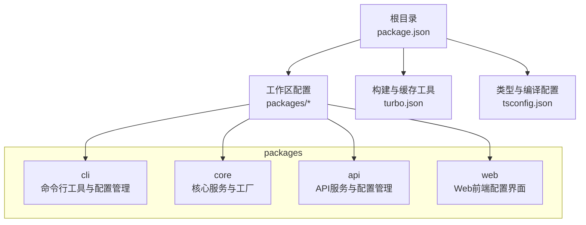
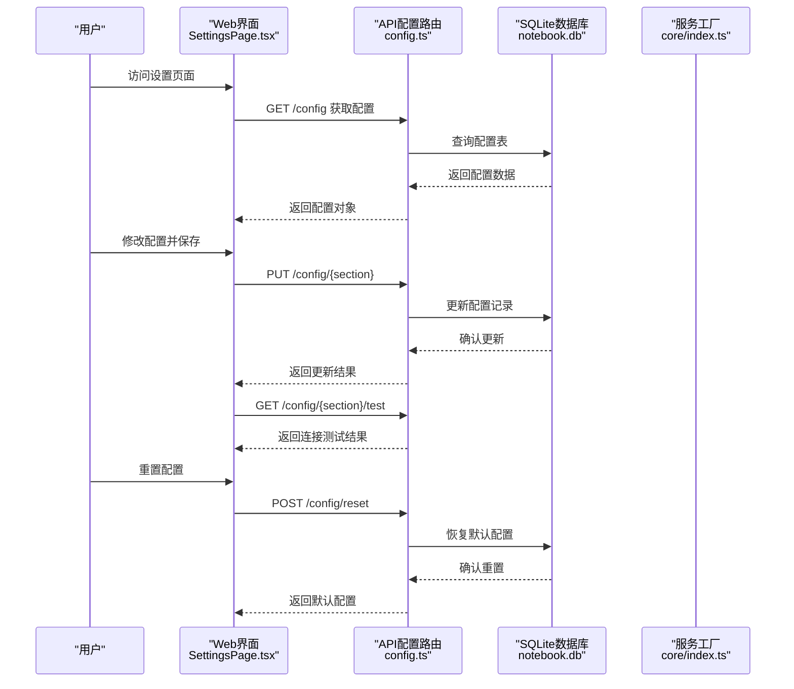

# 配置与定制

<cite>
**本文引用的文件**
- [packages/api/src/routes/config.ts](file://packages/api/src/routes/config.ts)
- [packages/web/src/pages/SettingsPage.tsx](file://packages/web/src/pages/SettingsPage.tsx)
- [packages/cli/src/commands/config.ts](file://packages/cli/src/commands/config.ts)
- [packages/core/src/index.ts](file://packages/core/src/index.ts)
- [packages/core/src/storage.ts](file://packages/core/src/storage.ts)
- [packages/core/src/types.ts](file://packages/core/src/types.ts)
- [packages/web/src/api/client.ts](file://packages/web/src/api/client.ts)
- [package.json](file://package.json)
- [turbo.json](file://turbo.json)
- [tsconfig.json](file://tsconfig.json)
</cite>

## 更新摘要
**所做更改**
- 新增集中式配置管理系统章节，详细介绍数据库驱动的配置存储
- 添加AI设置、服务器配置和MiniMemory集成的完整说明
- 新增实时连接测试功能的配置与使用指南
- 更新配置文件结构与可用选项，包含新的配置键和数据类型
- 新增Web界面配置管理的详细说明
- 更新核心服务工厂以支持新的配置结构

## 目录
1. [简介](#简介)
2. [项目结构](#项目结构)
3. [核心组件](#核心组件)
4. [架构总览](#架构总览)
5. [详细组件分析](#详细组件分析)
6. [依赖分析](#依赖分析)
7. [性能考虑](#性能考虑)
8. [故障排查指南](#故障排查指南)
9. [结论](#结论)
10. [附录](#附录)

## 简介
本指南面向开发者与高级用户，聚焦"番茄笔记"的配置与定制能力，涵盖以下方面：
- 集中式配置管理系统与数据库驱动的配置存储
- AI设置、服务器配置和MiniMemory集成的完整配置方案
- 实时连接测试功能的配置与使用
- 应用配置文件结构与可用选项
- 环境变量的配置方法与优先级规则
- 性能调优参数与系统资源配置建议
- 扩展开发指导（新功能开发、插件系统设计、第三方集成）
- 存储适配器扩展方法与AI模型集成方式
- 主题定制、界面个性化与功能开关的配置思路
- 架构扩展的最佳实践与注意事项

## 项目结构
该仓库采用多包工作区布局，核心与CLI入口位于 packages 目录下；顶层通过包管理脚本与构建缓存工具进行统一管理。新增了集中式配置管理系统，提供数据库驱动的配置存储和实时连接测试功能。

**图表来源**
- [package.json:1-25](file://package.json#L1-L25)
- [turbo.json:1-23](file://turbo.json#L1-L23)
- [tsconfig.json:1-22](file://tsconfig.json#L1-L22)

**章节来源**
- [package.json:1-25](file://package.json#L1-L25)
- [turbo.json:1-23](file://turbo.json#L1-L23)
- [tsconfig.json:1-22](file://tsconfig.json#L1-L22)

## 核心组件
- 集中式配置管理：提供数据库驱动的配置存储，支持AI设置、服务器配置和MiniMemory集成
- 实时连接测试：内置AI连接和MiniMemory连接测试功能，确保配置有效性
- Web配置界面：提供直观的图形化配置管理界面
- CLI配置命令：保留原有的命令行配置管理功能
- 核心服务工厂：集中创建存储、笔记、AI与搜索服务，支持完整的配置注入

**章节来源**
- [packages/api/src/routes/config.ts:1-325](file://packages/api/src/routes/config.ts#L1-L325)
- [packages/web/src/pages/SettingsPage.tsx:1-408](file://packages/web/src/pages/SettingsPage.tsx#L1-L408)
- [packages/cli/src/commands/config.ts:1-49](file://packages/cli/src/commands/config.ts#L1-L49)
- [packages/core/src/index.ts:1-50](file://packages/core/src/index.ts#L1-L50)

## 架构总览
从配置到服务的调用链路如下，新增了集中式配置管理系统的完整流程：

**图表来源**
- [packages/web/src/pages/SettingsPage.tsx:16-24](file://packages/web/src/pages/SettingsPage.tsx#L16-L24)
- [packages/api/src/routes/config.ts:101-124](file://packages/api/src/routes/config.ts#L101-L124)
- [packages/web/src/pages/SettingsPage.tsx:39-127](file://packages/web/src/pages/SettingsPage.tsx#L39-L127)
- [packages/api/src/routes/config.ts:217-243](file://packages/api/src/routes/config.ts#L217-L243)

## 详细组件分析

### 集中式配置管理系统
- **数据库驱动存储**
  - 使用SQLite数据库存储配置，提供持久化的配置管理
  - 自动创建配置表和索引，确保配置数据的完整性和查询性能
  - 支持配置的增删改查操作，提供完整的配置生命周期管理
- **配置分类管理**
  - AI配置：API基础地址、端口、模型名称、API密钥
  - MiniMemory配置：主机地址、端口、启用状态、密码
  - 服务器配置：监听地址、端口
- **默认配置机制**
  - 内置默认配置值，确保首次使用时的可用性
  - 初始化时自动填充缺失的配置项
  - 支持配置重置功能，恢复到默认状态

**章节来源**
- [packages/api/src/routes/config.ts:20-70](file://packages/api/src/routes/config.ts#L20-L70)
- [packages/api/src/routes/config.ts:49-61](file://packages/api/src/routes/config.ts#L49-L61)
- [packages/api/src/routes/config.ts:217-243](file://packages/api/src/routes/config.ts#L217-L243)

### 实时连接测试功能
- **AI连接测试**
  - 自动检测Ollama本地LLM服务的可用性
  - 获取可用模型列表，验证AI服务的完整性
  - 支持超时控制和错误处理，提供可靠的连接状态
- **MiniMemory连接测试**
  - 通过TCP连接测试验证KV存储服务的连通性
  - 支持超时检测和错误报告，确保存储服务的可用性
  - 提供详细的连接状态反馈，便于问题诊断

**章节来源**
- [packages/api/src/routes/config.ts:245-274](file://packages/api/src/routes/config.ts#L245-L274)
- [packages/api/src/routes/config.ts:276-320](file://packages/api/src/routes/config.ts#L276-L320)
- [packages/web/src/pages/SettingsPage.tsx:93-117](file://packages/web/src/pages/SettingsPage.tsx#L93-L117)

### Web配置界面
- **图形化配置管理**
  - 提供直观的配置界面，支持AI、MiniMemory和服务器配置
  - 实时连接状态显示，通过颜色指示器反映服务状态
  - 支持配置的即时测试和验证，确保配置的有效性
- **配置操作流程**
  - 加载配置：初始化时自动获取当前配置状态
  - 修改配置：通过表单控件实时更新配置值
  - 保存配置：支持单项保存和批量保存操作
  - 重置配置：一键恢复到默认配置状态

**章节来源**
- [packages/web/src/pages/SettingsPage.tsx:16-127](file://packages/web/src/pages/SettingsPage.tsx#L16-L127)
- [packages/web/src/pages/SettingsPage.tsx:145-405](file://packages/web/src/pages/SettingsPage.tsx#L145-L405)

### CLI配置管理
- **功能概览**
  - 设置配置项：接收键与值，写入持久化配置
  - 获取配置项：按键读取并输出当前值
  - 列出配置：展示当前全部配置与配置文件路径
  - 重置配置：清空所有配置项
- **数据源与默认值**
  - 使用持久化配置对象管理键值对，默认键包含示例API地址
- **交互与输出**
  - 使用彩色终端输出与加载动画提升可读性与反馈体验

**章节来源**
- [packages/cli/src/commands/config.ts:1-49](file://packages/cli/src/commands/config.ts#L1-L49)

### 核心服务工厂
- **作用**
  - 统一创建与初始化存储、笔记、AI与搜索服务
  - 支持通过传入完整的AppConfig来定制行为
  - 集成MiniMemory客户端，提供KV存储和Embedding搜索能力
- **关键点**
  - AppConfig接口定义了完整的配置结构，包括数据目录、MiniMemory配置和Ollama配置
  - MiniMemory客户端支持可选配置，当不可用时自动降级到文件存储
  - AI服务配置支持OpenAI兼容API，提供灵活的模型选择
- **返回值**
  - 返回包含各服务实例的对象，便于上层组合使用

**章节来源**
- [packages/core/src/index.ts:25-49](file://packages/core/src/index.ts#L25-L49)
- [packages/core/src/types.ts:143-152](file://packages/core/src/types.ts#L143-L152)
- [packages/core/src/storage.ts:109-140](file://packages/core/src/storage.ts#L109-L140)

### 配置文件结构与可用选项
- **结构说明**
  - 数据库驱动：使用SQLite数据库存储配置，提供持久化和查询能力
  - 分层配置：支持全局配置、AI配置、MiniMemory配置和服务器配置
  - 类型安全：通过TypeScript接口定义配置结构，确保类型安全
- **可用选项**
  - AI配置：apiBase（API基础地址）、port（端口）、model（模型名称）、apiKey（API密钥）
  - MiniMemory配置：host（主机地址）、port（端口）、enabled（启用状态）、password（密码）
  - 服务器配置：port（端口）、host（监听地址）
- **优先级规则**
  - Web界面配置优先于数据库配置；数据库配置优先于默认值
  - CLI命令行参数优先于持久化配置；持久化配置优先于默认值
  - 服务工厂传入的配置对象优先于数据库配置中的同名键

**章节来源**
- [packages/api/src/routes/config.ts:49-61](file://packages/api/src/routes/config.ts#L49-L61)
- [packages/web/src/api/client.ts:175-195](file://packages/web/src/api/client.ts#L175-L195)
- [packages/core/src/types.ts:143-152](file://packages/core/src/types.ts#L143-L152)

### 环境变量配置方法与优先级
- **配置方法**
  - 在启动环境中设置键值对，系统在读取配置时应优先检查环境变量
  - 对于CLI，可在进程启动前设置环境变量后执行命令
  - 对于核心服务，可在调用服务工厂前注入环境变量映射为配置对象
- **优先级规则**
  - 环境变量 > Web界面配置 > 数据库配置 > 默认值
  - 若存在同名键，环境变量应覆盖Web界面配置；若无环境变量，则回退到Web界面配置或默认值

**章节来源**
- [packages/core/src/index.ts:25-49](file://packages/core/src/index.ts#L25-L49)

### 性能调优参数与系统资源配置
- **数据库优化**
  - SQLite数据库自动创建索引，优化配置查询性能
  - 支持配置的批量更新，减少数据库操作次数
  - 配置缓存机制，减少频繁的数据库访问
- **存储性能**
  - MiniMemory客户端支持连接池和重连机制
  - 文件存储作为后备方案，确保服务的可用性
  - 异步操作处理，避免阻塞主线程
- **网络优化**
  - AI连接测试支持超时控制，防止长时间等待
  - MiniMemory连接使用TCP直连，减少中间层开销
  - 错误重试机制，提高连接成功率

**章节来源**
- [packages/api/src/routes/config.ts:20-27](file://packages/api/src/routes/config.ts#L20-L27)
- [packages/core/src/storage.ts:16-31](file://packages/core/src/storage.ts#L16-L31)

### 扩展开发指导
- **新功能开发**
  - 采用模块化设计，新增功能以独立模块形式接入配置系统
  - 提供清晰的接口契约与类型定义，便于测试与演进
  - 支持配置的动态扩展，无需修改核心代码
- **插件系统设计**
  - 定义插件接口规范，支持动态注册与卸载
  - 通过配置中心集中管理插件开关与参数，避免硬编码
  - 支持插件的配置验证和状态监控
- **第三方集成**
  - 以适配器模式对接外部服务，隔离变更影响
  - 提供统一的错误处理与降级策略，保证系统稳定性
  - 支持配置的版本管理和迁移机制

**章节来源**
- [packages/api/src/routes/config.ts:49-61](file://packages/api/src/routes/config.ts#L49-L61)
- [packages/core/src/types.ts:143-152](file://packages/core/src/types.ts#L143-L152)

### 存储适配器扩展方法
- **设计要点**
  - 抽象存储接口，定义统一的数据读写与元数据管理方法
  - 支持多种后端（内存、文件、数据库、云存储），通过配置切换
  - MiniMemory集成提供KV存储和Embedding搜索能力
- **实现步骤**
  - 在服务工厂中注入自定义存储实现，替换默认实现
  - 为新存储提供初始化与迁移脚本，确保数据一致性
  - 实现连接测试功能，确保存储服务的可用性
- **注意事项**
  - 严格遵循事务与并发控制，避免数据损坏
  - 提供监控与日志，便于问题定位与性能优化
  - 支持存储的热切换和故障转移

**章节来源**
- [packages/core/src/storage.ts:109-140](file://packages/core/src/storage.ts#L109-L140)
- [packages/core/src/types.ts:129-134](file://packages/core/src/types.ts#L129-L134)

### AI模型集成方式
- **集成路径**
  - 在服务工厂中为AI服务注入Ollama配置（主机、端口、模型）
  - 支持OpenAI兼容API，提供灵活的模型选择
  - 通过统一的服务接口对外提供问答、摘要、检索增强等能力
- **参数与策略**
  - 支持动态切换模型与参数，结合缓存与批处理提升吞吐
  - 提供安全与合规策略（如内容过滤、上下文长度限制）
  - 集成连接测试功能，确保AI服务的可用性
- **与存储的协作**
  - 将向量索引与文档切片写入存储，提高检索效率与准确性
  - 支持AI生成内容的持久化和版本管理

**章节来源**
- [packages/core/src/index.ts:34-44](file://packages/core/src/index.ts#L34-L44)
- [packages/core/src/types.ts:136-141](file://packages/core/src/types.ts#L136-L141)

### 主题定制、界面个性化与功能开关
- **主题与界面**
  - Web端可通过样式文件与主题变量实现主题切换与个性化
  - CLI端通过终端颜色与输出格式提升可读性与一致性
  - 配置界面支持实时预览，便于主题效果验证
- **功能开关**
  - 以配置中心集中管理功能开关，支持灰度发布与快速回滚
  - 在服务工厂中根据开关决定是否启用特定能力，避免条件分支污染
  - 支持配置的分组管理和批量操作

**章节来源**
- [packages/web/src/pages/SettingsPage.tsx:145-405](file://packages/web/src/pages/SettingsPage.tsx#L145-L405)

## 依赖分析
- **工作区与脚本**
  - 根配置声明工作区与统一脚本，便于并行构建与测试
- **构建与缓存**
  - 构建任务依赖上游包，开发任务持久化且不缓存，利于热更新
- **编译与类型**
  - TypeScript配置启用严格模式与声明生成，保障类型安全与可维护性
- **数据库依赖**
  - SQLite数据库提供轻量级的配置存储解决方案
  - 支持配置的自动初始化和迁移

**章节来源**
- [package.json:1-25](file://package.json#L1-L25)
- [turbo.json:1-23](file://turbo.json#L1-L23)
- [tsconfig.json:1-22](file://tsconfig.json#L1-L22)

## 性能考虑
- **数据库性能**
  - SQLite数据库自动优化查询性能，支持配置的快速检索
  - 配置表使用主键索引，确保配置查找的高效性
  - 支持配置的批量操作，减少数据库往返次数
- **存储性能**
  - MiniMemory客户端使用连接池，提高并发访问效率
  - 文件存储作为后备方案，确保服务的可用性
  - 异步操作处理，避免阻塞主线程
- **网络性能**
  - AI连接测试支持超时控制，防止长时间等待
  - MiniMemory连接使用TCP直连，减少中间层开销
  - 错误重试机制，提高连接成功率
- **缓存策略**
  - 配置缓存机制，减少频繁的数据库访问
  - 存储层缓存热点数据，提升响应速度

## 故障排查指南
- **配置问题**
  - 使用配置界面查看当前配置状态，确认各项配置是否正确
  - 通过连接测试功能验证AI和MiniMemory服务的可用性
  - 如出现异常，尝试重置配置后重新设置关键配置项
- **服务初始化失败**
  - 检查数据库文件的可写权限，确保配置系统正常运行
  - 校验AI服务主机与端口连通性，必要时调整配置
  - 验证MiniMemory服务的可用性，检查网络连接和防火墙设置
- **Web界面问题**
  - 确认API服务正常运行，检查服务器配置和端口占用
  - 查看浏览器控制台的错误信息，定位前端JavaScript问题
  - 检查网络请求的响应状态，确认API接口的可用性

**章节来源**
- [packages/web/src/pages/SettingsPage.tsx:93-117](file://packages/web/src/pages/SettingsPage.tsx#L93-L117)
- [packages/api/src/routes/config.ts:245-320](file://packages/api/src/routes/config.ts#L245-L320)
- [packages/core/src/storage.ts:16-31](file://packages/core/src/storage.ts#L16-L31)

## 结论
本指南提供了从集中式配置管理系统、实时连接测试到性能调优与扩展开发的完整路径。通过数据库驱动的配置存储、Web图形化界面和CLI命令行工具的协同，系统具备了强大的配置管理能力。新增的AI设置、服务器配置和MiniMemory集成功能，进一步提升了系统的灵活性和可扩展性。建议在生产环境中结合监控与日志体系，持续优化存储与推理性能，并以插件化与适配器模式支撑未来功能演进。

## 附录
- **快速参考**
  - 配置命令：设置、获取、列出、重置
  - 配置键：ai.apiBase、ai.port、ai.model、ai.apiKey、miniMemory.host、miniMemory.port、miniMemory.enabled、miniMemory.password、server.port、server.host
  - 服务工厂：统一创建与初始化存储、笔记、AI与搜索服务
  - 连接测试：AI连接测试、MiniMemory连接测试
- **最佳实践**
  - 明确优先级：环境变量 > Web界面配置 > 数据库配置 > 默认值
  - 分离关注点：配置、服务、UI与存储解耦
  - 渐进式演进：以插件与适配器承载新能力，保持核心稳定
  - 配置验证：使用连接测试功能确保配置的有效性
  - 数据备份：定期备份SQLite数据库，防止配置丢失