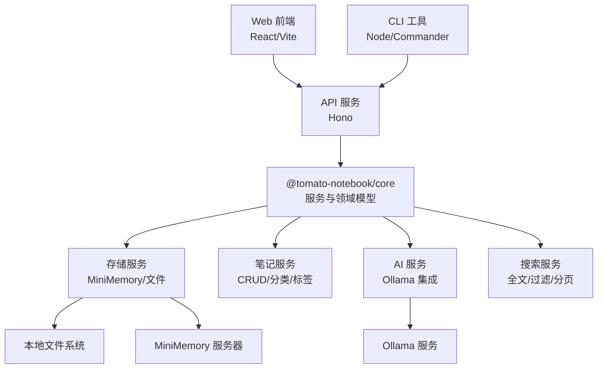
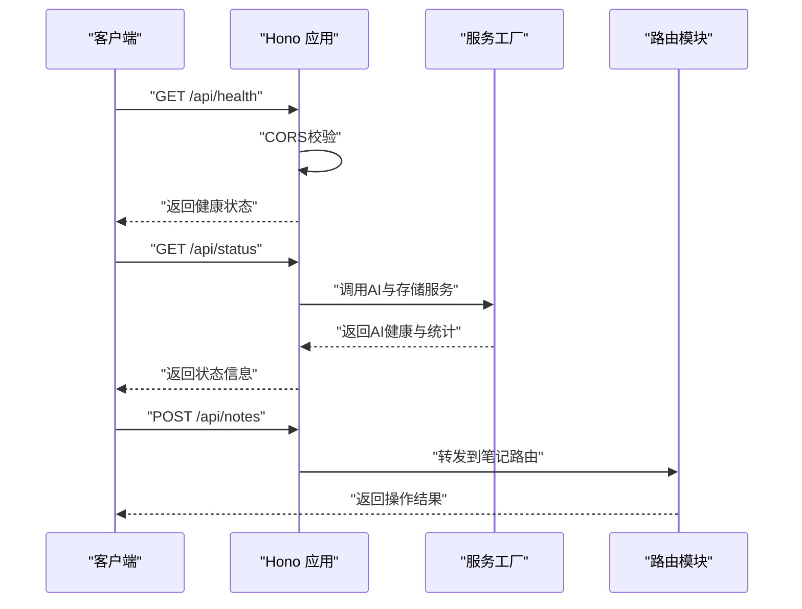
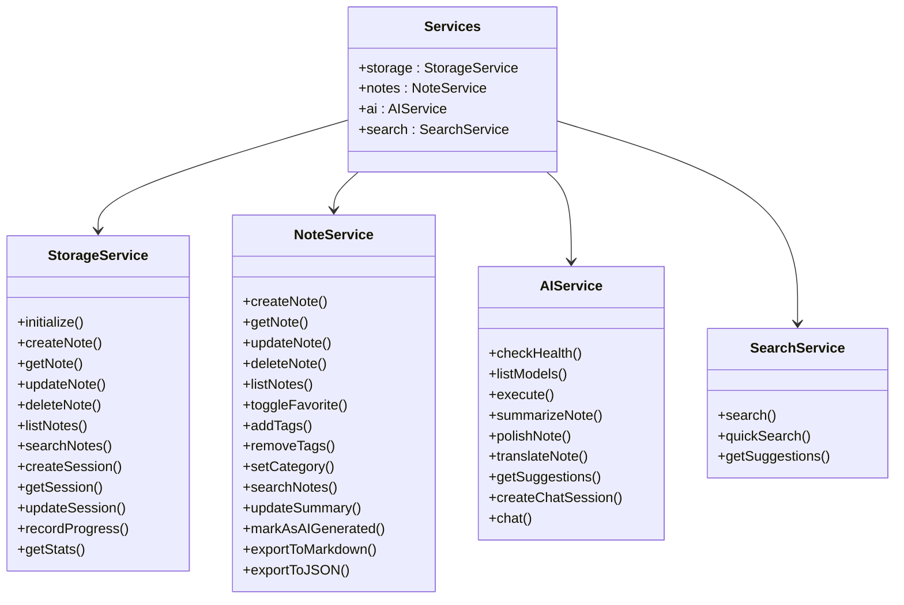
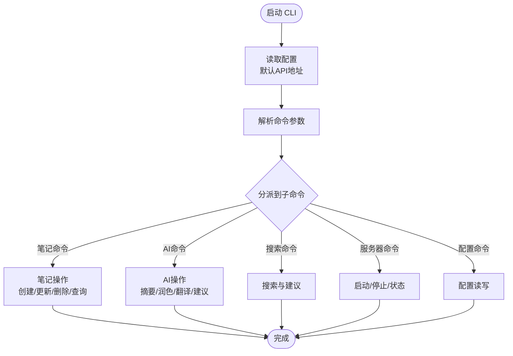
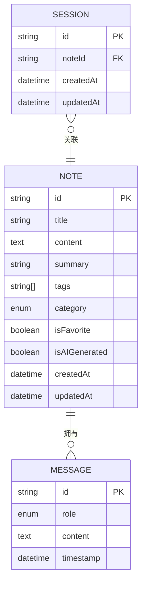
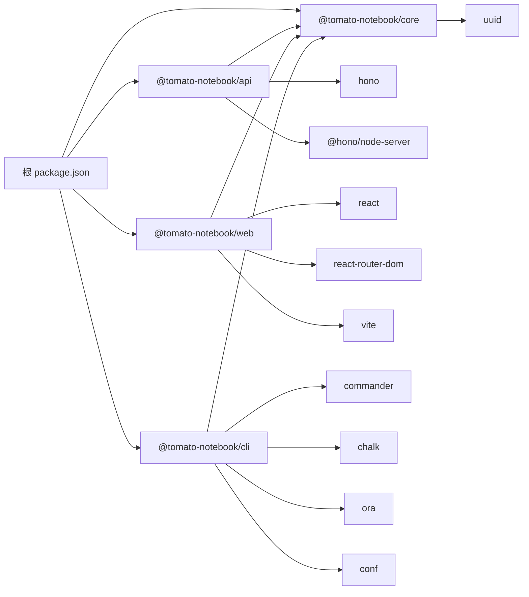

# 项目概述

<cite>
**本文档引用的文件**
- [package.json](file://package.json)
- [turbo.json](file://turbo.json)
- [tsconfig.json](file://tsconfig.json)
- [packages/api/package.json](file://packages/api/package.json)
- [packages/web/package.json](file://packages/web/package.json)
- [packages/core/package.json](file://packages/core/package.json)
- [packages/cli/package.json](file://packages/cli/package.json)
- [packages/api/src/index.ts](file://packages/api/src/index.ts)
- [packages/web/src/main.tsx](file://packages/web/src/main.tsx)
- [packages/core/src/index.ts](file://packages/core/src/index.ts)
- [packages/core/src/types.ts](file://packages/core/src/types.ts)
- [packages/core/src/storage.ts](file://packages/core/src/storage.ts)
- [packages/core/src/note.ts](file://packages/core/src/note.ts)
- [packages/core/src/ai.ts](file://packages/core/src/ai.ts)
- [packages/core/src/search.ts](file://packages/core/src/search.ts)
- [packages/cli/src/index.ts](file://packages/cli/src/index.ts)
</cite>

## 目录
1. [简介](#简介)
2. [项目结构](#项目结构)
3. [核心组件](#核心组件)
4. [架构总览](#架构总览)
5. [详细组件分析](#详细组件分析)
6. [依赖关系分析](#依赖关系分析)
7. [性能考虑](#性能考虑)
8. [故障排除指南](#故障排除指南)
9. [结论](#结论)
10. [附录](#附录)

## 简介
番茄笔记是一个现代化的全栈笔记应用，专注于智能笔记管理与AI辅助写作。它通过Monorepo架构组织前端、后端、核心库与CLI工具，结合Turbo构建系统实现高效开发与构建流程。项目支持多平台访问，提供智能摘要、润色、翻译、学习建议与聊天对话等AI能力，并内置笔记搜索、分类与标签管理功能。

本项目面向不同层次的开发者：初学者可快速上手，体验AI辅助写作与多端同步；有经验的开发者可深入理解Monorepo与Turbo的工作流、TypeScript类型体系、以及基于Hono的轻量API设计与基于Ollama的AI集成方案。

## 项目结构
项目采用Monorepo结构，根目录通过工作区管理多个包，每个包独立构建与发布，同时共享TypeScript配置与构建脚本。核心包包括：
- @tomato-notebook/api：基于Hono的后端API服务，提供健康检查、笔记与AI相关接口。
- @tomato-notebook/web：基于Vite与React的前端应用，负责用户界面与交互。
- @tomato-notebook/core：核心业务逻辑库，封装存储、笔记、AI与搜索服务。
- @tomato-notebook/cli：命令行工具，提供本地笔记管理与服务器控制命令。

```mermaid
graph TB
subgraph "根目录"
Pkg["package.json<br/>工作区与脚本"]
Turbo["turbo.json<br/>任务配置"]
TS["tsconfig.json<br/>TypeScript编译配置"]
end
subgraph "核心库"
Core["@tomato-notebook/core<br/>存储/笔记/AI/搜索服务"]
end
subgraph "后端"
API["@tomato-notebook/api<br/>Hono API服务"]
end
subgraph "前端"
Web["@tomato-notebook/web<br/>React/Vite 应用"]
end
subgraph "CLI"
CLI["@tomato-notebook/cli<br/>命令行工具"]
end
Pkg --> API
Pkg --> Web
Pkg --> Core
Pkg --> CLI
API --> Core
Web --> Core
CLI --> Core
```

图表来源
- [package.json:1-25](file://package.json#L1-L25)
- [turbo.json:1-23](file://turbo.json#L1-L23)
- [tsconfig.json:1-22](file://tsconfig.json#L1-L22)
- [packages/api/package.json:1-22](file://packages/api/package.json#L1-L22)
- [packages/web/package.json:1-29](file://packages/web/package.json#L1-L29)
- [packages/core/package.json:1-26](file://packages/core/package.json#L1-L26)
- [packages/cli/package.json:1-26](file://packages/cli/package.json#L1-L26)

章节来源
- [package.json:1-25](file://package.json#L1-L25)
- [turbo.json:1-23](file://turbo.json#L1-L23)
- [tsconfig.json:1-22](file://tsconfig.json#L1-L22)

## 核心组件
- 服务工厂与聚合：通过统一的服务工厂创建并注入存储、笔记、AI与搜索服务，便于在API与Web中复用。
- 存储层：支持MiniMemory内存数据库与本地文件两种持久化策略，自动降级与同步。
- 笔记服务：提供创建、查询、更新、删除、收藏、标签、分类、导出等能力。
- AI服务：基于Ollama的聊天与推理，支持摘要、润色、翻译、建议与会话管理。
- 搜索服务：全文检索与多维过滤，支持分页与相关度排序。
- CLI工具：提供配置、笔记与AI命令，简化本地开发与运维。

章节来源
- [packages/core/src/index.ts:11-50](file://packages/core/src/index.ts#L11-L50)
- [packages/core/src/storage.ts:108-326](file://packages/core/src/storage.ts#L108-L326)
- [packages/core/src/note.ts:6-159](file://packages/core/src/note.ts#L6-L159)
- [packages/core/src/ai.ts:41-298](file://packages/core/src/ai.ts#L41-L298)
- [packages/core/src/search.ts:4-93](file://packages/core/src/search.ts#L4-L93)
- [packages/cli/src/index.ts:1-91](file://packages/cli/src/index.ts#L1-L91)

## 架构总览
整体架构由前端、后端API与核心库三部分组成，核心库提供统一的领域模型与服务抽象，前后端通过HTTP接口交互。AI能力通过Ollama提供，存储层可选MiniMemory或文件系统。



图表来源
- [packages/api/src/index.ts:1-64](file://packages/api/src/index.ts#L1-L64)
- [packages/web/src/main.tsx:1-14](file://packages/web/src/main.tsx#L1-L14)
- [packages/core/src/index.ts:18-50](file://packages/core/src/index.ts#L18-L50)
- [packages/core/src/storage.ts:108-326](file://packages/core/src/storage.ts#L108-L326)
- [packages/core/src/ai.ts:41-298](file://packages/core/src/ai.ts#L41-L298)

## 详细组件分析

### API 服务（Hono）
- 职责：提供REST接口，注册路由，处理CORS与健康检查，启动Node服务器。
- 关键点：使用Hono创建应用实例，导入并挂载笔记、AI、搜索路由；通过环境变量配置Ollama主机与端口；提供健康检查与状态接口。
- 典型流程：启动时初始化服务工厂，注册路由，监听端口对外提供服务。



图表来源
- [packages/api/src/index.ts:20-64](file://packages/api/src/index.ts#L20-L64)

章节来源
- [packages/api/src/index.ts:1-64](file://packages/api/src/index.ts#L1-L64)

### 核心库（@tomato-notebook/core）
- 服务工厂：集中创建并返回存储、笔记、AI、搜索服务实例，支持配置数据目录与AI模型。
- 存储服务：支持MiniMemory与文件系统双栈，自动降级；提供笔记增删改查、会话管理与统计。
- 笔记服务：围绕Note实体提供完整生命周期管理，支持收藏、标签、分类与导出。
- AI服务：封装Ollama调用，提供摘要、润色、翻译、建议与聊天会话能力。
- 搜索服务：基于关键词与多维过滤的全文检索，支持分页与相关度排序。



图表来源
- [packages/core/src/storage.ts:108-326](file://packages/core/src/storage.ts#L108-L326)
- [packages/core/src/note.ts:6-159](file://packages/core/src/note.ts#L6-L159)
- [packages/core/src/ai.ts:41-298](file://packages/core/src/ai.ts#L41-L298)
- [packages/core/src/search.ts:4-93](file://packages/core/src/search.ts#L4-L93)
- [packages/core/src/index.ts:18-50](file://packages/core/src/index.ts#L18-L50)

章节来源
- [packages/core/src/index.ts:11-50](file://packages/core/src/index.ts#L11-L50)
- [packages/core/src/types.ts:1-163](file://packages/core/src/types.ts#L1-L163)
- [packages/core/src/storage.ts:108-326](file://packages/core/src/storage.ts#L108-L326)
- [packages/core/src/note.ts:6-159](file://packages/core/src/note.ts#L6-L159)
- [packages/core/src/ai.ts:41-298](file://packages/core/src/ai.ts#L41-L298)
- [packages/core/src/search.ts:4-93](file://packages/core/src/search.ts#L4-L93)

### 命令行工具（CLI）
- 功能：提供配置管理、笔记操作、AI命令与本地服务器控制，统一通过Commander进行命令解析。
- 设计：使用Conf持久化配置，APIClient封装HTTP请求，配合chalk与ora提升用户体验。
- 使用场景：本地开发调试、批量笔记管理、远程API测试与服务器状态查看。



图表来源
- [packages/cli/src/index.ts:67-91](file://packages/cli/src/index.ts#L67-L91)

章节来源
- [packages/cli/src/index.ts:1-91](file://packages/cli/src/index.ts#L1-L91)

### 数据模型与类型
- Note：笔记实体，包含标题、内容、摘要、标签、分类、收藏标记、AI生成标记与时间戳。
- NoteCategory：笔记分类枚举，覆盖工作、学习、创作、个人与AI生成。
- AI相关：Message、AISession、AIOperation、AIRequest、AIResponse。
- 搜索与统计：SearchOptions、SearchResult、Stats、LearningProgress。
- 配置：MiniMemoryConfig、OllamaConfig、AppConfig、NoteFilter、APIResponse。



图表来源
- [packages/core/src/types.ts:10-163](file://packages/core/src/types.ts#L10-L163)

章节来源
- [packages/core/src/types.ts:1-163](file://packages/core/src/types.ts#L1-L163)

## 依赖关系分析
- 工作区与脚本：根package.json声明工作区，Turbo定义构建、开发、测试、清理等任务依赖关系与缓存策略。
- 包间依赖：API与Web均依赖核心库；CLI同样依赖核心库；核心库不反向依赖其他包，保持纯业务逻辑。
- 外部依赖：API使用Hono与Node服务器；Web使用React、React Router与Vite；CLI使用Commander、Chalk、Ora与Conf；核心库依赖UUID与网络模块。



图表来源
- [package.json:5-14](file://package.json#L5-L14)
- [turbo.json:3-21](file://turbo.json#L3-L21)
- [packages/api/package.json:13-20](file://packages/api/package.json#L13-L20)
- [packages/web/package.json:11-27](file://packages/web/package.json#L11-L27)
- [packages/cli/package.json:15-25](file://packages/cli/package.json#L15-L25)
- [packages/core/package.json:18-24](file://packages/core/package.json#L18-L24)

章节来源
- [package.json:1-25](file://package.json#L1-L25)
- [turbo.json:1-23](file://turbo.json#L1-L23)
- [packages/api/package.json:1-22](file://packages/api/package.json#L1-L22)
- [packages/web/package.json:1-29](file://packages/web/package.json#L1-L29)
- [packages/core/package.json:1-26](file://packages/core/package.json#L1-L26)
- [packages/cli/package.json:1-26](file://packages/cli/package.json#L1-L26)

## 性能考虑
- Monorepo与Turbo：通过任务依赖与缓存机制减少重复构建，提升开发效率；dev任务持久化与禁用缓存以保证实时性。
- 存储策略：优先MiniMemory提升读写性能，不可用时自动回退至文件系统；对笔记列表与搜索进行内存内处理，降低磁盘IO。
- AI调用：Ollama本地推理，避免网络延迟；对会话与消息进行内存管理，限制上下文长度以控制成本。
- 前端优化：React与Vite提供快速热重载与打包优化；路由按需加载，减少首屏负担。

## 故障排除指南
- API无法启动：检查端口占用与环境变量（HOST/PORT），确认CORS允许的来源与方法。
- AI服务不可用：验证Ollama服务可达与模型存在，检查模型名称与端口配置。
- 存储异常：若MiniMemory不可用，确认文件权限与数据目录可写；必要时清理数据文件重新初始化。
- CLI连接失败：检查配置中的API地址，确保API服务已启动且网络连通。

章节来源
- [packages/api/src/index.ts:53-64](file://packages/api/src/index.ts#L53-L64)
- [packages/core/src/ai.ts:55-74](file://packages/core/src/ai.ts#L55-L74)
- [packages/core/src/storage.ts:124-140](file://packages/core/src/storage.ts#L124-L140)
- [packages/cli/src/index.ts:8-13](file://packages/cli/src/index.ts#L8-L13)

## 结论
番茄笔记通过清晰的Monorepo与Turbo构建体系，实现了前后端分离与核心库复用；借助Hono与Vite提供了高性能的开发与运行体验；通过Ollama集成AI能力，满足智能笔记管理与写作辅助需求。该架构既适合初学者快速上手，也为有经验的开发者提供了扩展与定制的空间。

## 附录
- 开发与构建命令：根目录提供统一脚本，支持开发、构建、测试、清理与格式化。
- TypeScript配置：严格模式与声明输出，确保类型安全与良好的IDE体验。
- 使用场景示例：
  - 新建笔记并生成摘要：在Web中创建笔记，调用AI摘要；或通过CLI执行AI命令。
  - 润色与翻译：选择正式/口语风格或目标语言，一键优化文本。
  - 搜索与筛选：按标签、分类、收藏与时间范围进行组合查询。
  - 本地与远程：CLI可直接连接本地或远程API，便于自动化与运维。

章节来源
- [package.json:8-14](file://package.json#L8-L14)
- [tsconfig.json:2-19](file://tsconfig.json#L2-L19)
- [packages/web/src/main.tsx:1-14](file://packages/web/src/main.tsx#L1-L14)
- [packages/api/src/index.ts:27-41](file://packages/api/src/index.ts#L27-L41)
- [packages/core/src/ai.ts:167-233](file://packages/core/src/ai.ts#L167-L233)
- [packages/core/src/search.ts:12-64](file://packages/core/src/search.ts#L12-L64)
- [packages/cli/src/index.ts:67-91](file://packages/cli/src/index.ts#L67-L91)